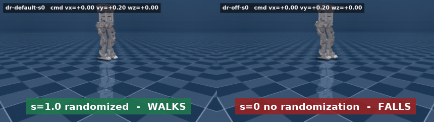
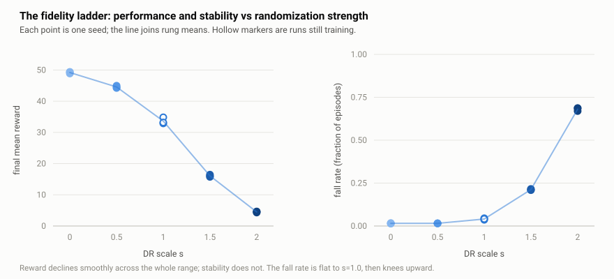
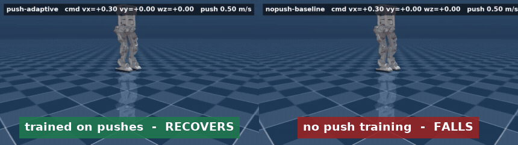
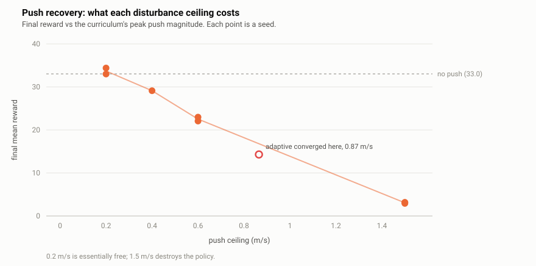
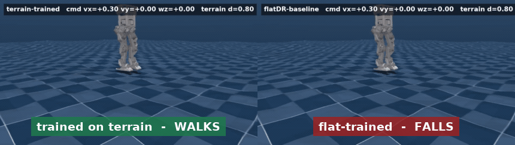
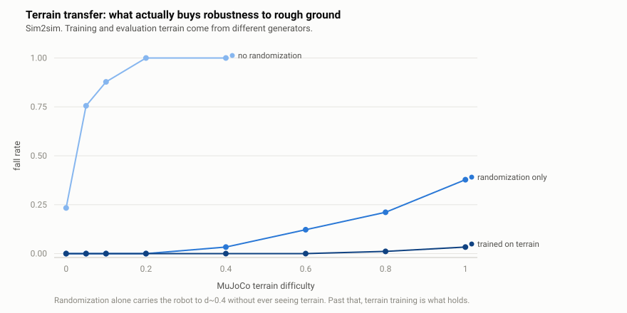
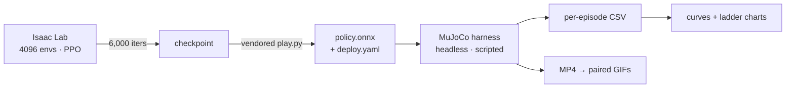

# bhl-robustness-ladder

Robustness experiments on the [Berkeley Humanoid Lite](https://github.com/HybridRobotics/Berkeley-Humanoid-Lite)
(BHL) — an open-source, 3D-printed, **11.3 kg** humanoid whose joints are limited
to **6 Nm**. Those two numbers drive every result here: this machine has very
little authority to arrest a disturbance, so "how much can it take before it
stops learning?" is a real question rather than a formality.

Upstream ships flat-ground locomotion with a fixed domain-randomization preset,
no curriculum, and no way to score a policy. This repo adds three experiments —
and, necessarily, the instrument to measure them.

**36 policies trained** (6,000 PPO iterations each, 4,096 envs, 3 seeds per
condition) · **~1,500 scored sim2sim episodes** · **288 rendered rollouts**

**[▶ Explore every run interactively](https://claude.ai/code/artifact/de955af8-2236-4912-84fb-577e0a43ccbe)**
— isolate a run, switch metrics, watch the axis rescale.

### Results at a glance

| | Finding |
|---|---|
| **1** | **Sim2sim transfer inverts the training-reward ranking.** The policy with the *highest* training reward falls 23% of the time in MuJoCo; the repo-default randomization falls **0%**. |
| **2** | **0.2 m/s of shove-rejection is free.** A disturbance curriculum at that ceiling costs nothing measurable. A competence-gated curriculum reaches **0.87 m/s**. |
| **3** | **Randomization alone buys most of terrain robustness.** A policy that has never seen rough ground handles it to d≈0.4; terrain training is what holds past that. |

---

## 1 · Domain randomization: the fidelity ladder

**Question.** Randomization is supposed to trade training performance for
transfer. How much, and where does it stop paying?

Every range in upstream's `EventsCfg` is rewritten as a single scale $s$, so the
ladder is a continuous axis rather than three named presets. Absolute physical
quantities (friction, actuator-gain multipliers) scale about their centre;
additive offsets (mass delta, joint offset, external wrench) scale from zero:

$$
[\text{lo},\text{hi}]_s=
\begin{cases}
\;c \pm s\,w, & \text{absolute (friction, gains)}\\[4pt]
\;[\,s\cdot \text{lo}_1,\; s\cdot \text{hi}_1\,], & \text{additive (mass, offsets, wrench)}
\end{cases}
$$

where $c$ and $w$ are the centre and half-width of upstream's shipped range, so
$s=1$ reproduces it exactly. **The two cases are not cosmetic:** scaling mass
about its centre would inject a constant $+0.5$ kg at $s=0$ and quietly break
agreement with the un-randomized rung.

<p align="center">
  <br>
  <sub>Identical strafe command in MuJoCo. Left <code>s=1.0</code>, right <code>s=0</code>. Neither policy ever saw MuJoCo during training.</sub>
</p>

<picture>
  <source media="(prefers-color-scheme: dark)" srcset="results/charts/dr_ladder_summary-dark.svg">
  
</picture>

| rung | training reward (3 seeds) | training fall rate | **sim2sim fall rate** | sim2sim distance |
|---|---|---|---|---|
| `s = 0.0` none | **49.4 / 49.3 / 48.9** | 0.015 | **0.233** | 1.31 m |
| `s = 0.5` | 44.2 / 45.0 / 44.5 | 0.015 | 0.011 | 1.85 m |
| `s = 1.0` repo default | 32.9 / 34.8 / 33.2 | 0.041 | **0.000** | **1.98 m** |
| `s = 1.5` | 16.0 / 15.7 / 16.5 | 0.211 | **0.000** | 1.75 m |
| `s = 2.0` | 4.6 / 4.3 / 4.5 | 0.686 | 0.167 | 0.13 m † |

<sub>90 episodes per rung (6 commands × 5 seeds × 3 policies). † `s=2.0` barely
locomotes at all — 0.13 m in 10 s — so its low fall rate means "stands still",
not "robust".</sub>

**Finding.** The training column and the transfer column disagree, and that
disagreement is the whole point. `s = 0` wins training by 49% and *loses*
transfer outright, falling in 23% of MuJoCo episodes. Randomization is buying
something that training reward actively hides.

The two training panels also disagree with each other: reward declines smoothly
and almost linearly across the whole range, while the **fall rate** is the
quantity with a knee — flat to $s=1.0$, then turning sharply. Upstream's shipped
default sits right at the last rung before that knee, and it is also the best
transferring policy tested. That is a genuinely good default.

> **Correction.** An earlier version of this README reported a "cliff between
> $s=1.0$ and $s=1.5$". That was read off partially-trained runs where $s=1.5$
> sat at reward 8.3; fully trained it reaches 16.0 and the decline is smooth.

---

## 2 · Push recovery: how hard a shove is learnable?

**Question.** A disturbance curriculum is standard practice. What does it cost,
and how large a push can a robot this weak actually learn to reject?

Upstream ships the `push_robot` event commented out. Enabled, it adds an
instantaneous velocity kick to the base every 5–9 s:

$$\mathbf{v} \leftarrow \mathbf{v} + \boldsymbol{\varepsilon}, \qquad
\varepsilon_x,\varepsilon_y \sim \mathcal{U}(-m,\, m)$$

Three ways of choosing $m$ were trained. A **fixed** magnitude; a **linear ramp**
on training progress $t$ (the step counter);

$$m(t) = m_0 + (m_1-m_0)\cdot\mathrm{clip}\!\left(\frac{t-t_0}{t_1-t_0},\,0,\,1\right)$$

and an **adaptive** rule that moves $m$ only in response to measured competence,
where $\hat f$ is the fall fraction among the environments resetting this step
and $f^\star = 0.20$ is the target:

$$m \leftarrow \mathrm{clip}\Big(m + \Delta\cdot\big[\mathbb{1}(\hat f < f^\star) - \mathbb{1}(\hat f > 2f^\star)\big],\; 0,\; m_{\max}\Big)$$

<p align="center">
  <br>
  <sub>Identical 0.5 m/s shoves. Left trained with a push curriculum, right without. <b>0/6 falls vs 3/6.</b></sub>
</p>

<picture>
  <source media="(prefers-color-scheme: dark)" srcset="results/charts/push_sweep-dark.svg">
  
</picture>

| ceiling $m_1$ | final reward | training fall rate | cost vs no push |
|---|---|---|---|
| none (baseline) | 33.0 | 0.041 | — |
| 0.2 m/s | 33.0 / 34.4 | 0.037 | **free** |
| 0.4 m/s | 29.1 / 32.2 | 0.047 | −12% |
| 0.6 m/s | 22.1 / 23.0 | 0.100 | −32% |
| 1.5 m/s | 2.9 / 3.1 / 3.2 | 0.928 | destroyed |
| **adaptive** | 14.2 / 14.4 | 0.253 | converged to **0.87 m/s** |

**Finding.** The first attempt asserted $m_1 = 1.5$ m/s and destroyed the policy —
reward rose to 24.7 by iteration 1,599 and then collapsed to 3.0 as the ramp
climbed past ≈0.7 m/s, ending with 93% of episodes terminating on bad
orientation. The fixed-magnitude control never learned at all (≈2.9 throughout).

That pair localises the failure precisely. The fixed arm failing shows the
curriculum was the right *idea* — full-strength shoves from step zero knock the
robot over before a gait exists, so it never collects the data that would teach
recovery. The ramp arm peaking *then* collapsing shows the **ceiling**, not the
schedule, was what was wrong.

The sweep then answered it properly: **0.2 m/s is free**, and the cost stays
modest to 0.6. The adaptive rule is the strongest version — it converged at
**0.85–0.88 m/s**, roughly twice the magnitude at which the time-based ramp
collapsed, and reports that number as an *outcome* rather than requiring it to
be guessed.

> **Caveat.** The adaptive arm hit its own $m_{\max}=1.0$ safety cap (peak
> 1.000), so 0.87 m/s is a **lower bound** on what this robot could tolerate,
> not a measured ceiling.

---

## 3 · Rough terrain: what actually buys terrain robustness?

**Question.** Isaac Lab's terrain curriculum promotes environments as they
succeed. Does it transfer on a robot with 6 Nm joints and **no height sensor**?

Training terrain is a generated height field of noise, slopes, and low discrete
obstacles — **no stairs**, since a step tall enough to be a stair is likely past
what this robot can lift a foot over and would poison every terrain level. An
environment is promoted when it walks more than half a terrain tile, demoted if
it fails to manage half the commanded distance:

$$\ell \leftarrow \ell + \mathbb{1}\big(d > \tfrac{1}{2}L\big) - \mathbb{1}\big(d < \tfrac{1}{2}\,\lVert\mathbf{v}_{\text{cmd}}\rVert\,T\big)$$

Evaluation terrain is generated by **completely different code**, parameterised
by one difficulty $d$ so terrain becomes a swept axis:

$$h(x,y) = \underbrace{0.15\,d\;u(x,y)}_{\text{undulation}} \;+\; \underbrace{0.05\,d\;\eta(x,y)}_{\text{noise}} \;+\; \underbrace{0.04\,d\;\mathbb{1}_{\text{obs}}(x,y)}_{\text{obstacles}}$$

At $d=1$ that is 0.33 m peak-to-trough with a p95 gradient of 12.2°, against a
15° training target — the same physical envelope, different surface. A policy
that only copes with the exact height field it trained on has memorised, not
learned.

<p align="center">
  <br>
  <sub>Identical rough ground at <code>d = 0.80</code>. Left trained on terrain, right flat-trained with the same randomization. <b>0/6 falls vs 3/6.</b></sub>
</p>

<picture>
  <source media="(prefers-color-scheme: dark)" srcset="results/charts/terrain_retention-dark.svg">
  
</picture>

| MuJoCo difficulty | no randomization | randomization only *(never saw terrain)* | trained on terrain | terrain, no obstacles |
|---|---|---|---|---|
| 0.00 (flat) | 0.233 | 0.000 | 0.000 | 0.000 |
| 0.05 | 0.756 | 0.000 | 0.000 | 0.000 |
| 0.10 | 0.878 | 0.000 | 0.000 | 0.000 |
| 0.20 | 1.000 | 0.000 | 0.000 | 0.000 |
| 0.40 | 1.000 | 0.033 | 0.000 | 0.000 |
| 0.60 | — | 0.122 | **0.000** | 0.017 |
| 0.80 | — | 0.211 | **0.011** | 0.033 |
| 1.00 | — | 0.378 | **0.033** | 0.067 |

<sub>Fall rate. n = 90 episodes per cell (6 commands × 5 seeds × 3 policies);
n = 60 for the no-obstacle ablation, which has 2 seeds. The `no randomization`
column was not run above d = 0.40 — it is already at 100%.</sub>

**Finding.** Plain domain randomization — with **zero terrain exposure** —
carries the robot to roughly $d = 0.4$ on its own. A policy that has only ever
walked on a flat plane, but trained with randomized friction, mass, and actuator
gains, handles moderately rough ground it has never seen.

Terrain training is what holds past that point, and the gap widens with
difficulty: at $d = 1.0$ the terrain policy falls in **3.3%** of episodes against
the randomized-only policy's **37.8%**, an 11× reduction. Notably the
no-obstacle ablation is consistently *worse* than the full terrain menu at high
difficulty (6.7% vs 3.3%), which is the same direction as the terrain-level
result below.

The training-side curriculum is consistent with that: it plateaus at about
**level 1.4 of 9**. The robot learns mildly rough ground and stops progressing —
believable for 6 Nm joints with no height sensing. The level it stalls at is
itself the measurement.

> **Correction.** An earlier version used the $s=0$ policy as the terrain
> baseline and reported flat-trained policies "collapsing between d = 0.05 and
> 0.10". True of *that* policy, but it was the most fragile one available, and
> comparing against it made terrain training look far more necessary than it is.

Two further caveats worth stating:

- The obstacles were **not** the limiter — the arm *with* obstacles reaches a
  slightly higher terrain level than the arm without, the opposite of what I
  expected when flagging them as the risky choice.
- **That ablation is confounded and should not be quoted as clean.** Removing
  the obstacles redistributed their 20% share into more rough ground and slope
  (rough 0.40 → 0.50, each slope 0.20 → 0.25), so "smooth" is also *rougher on
  average* rather than "bumpy minus obstacles". A correct ablation holds the
  other proportions fixed and replaces the obstacle share with flat ground.

---

## How any of this is measured

The obvious plan — "evaluate through the sim2sim path the repo already gives
you" — does not survive contact with the code. Upstream's
`scripts/sim2sim/play_mujoco.py` constructs a `Se2Gamepad()` and blocks on
joystick input, calls `mj_viewer.sync()` (requiring a GUI), `sleep()`s to hold
wall-clock realtime, and loops forever emitting **no metric of any kind**. It is
a thing to watch, not a thing to measure.

So `src/bhl_robust/eval/` keeps the parts that determine transfer fidelity — the
MJCF, the PD controller, the sensor-derived observation layout — and drops the
interactive scaffolding. **The single most important design decision:** the
harness drives the policy through upstream's *own* `RlController`, so
observation construction is bit-identical to the sim2real deployment path. An
evaluator that rebuilt the 45-dim observation vector independently would be
measuring my reimplementation, not the transfer.



Training and evaluation deliberately use **different simulators** — Isaac Lab
(PhysX) to train, MuJoCo to score. That gap *is* the measurement: a policy that
only works in the simulator it was trained in has not learned locomotion, it has
learned PhysX.

<details>
<summary><b>Metric definitions</b></summary>

A fall reuses training's own `bad_orientation` threshold, so it means the same
thing on both sides. Tilt is recovered from the base quaternion:

$$\theta = \arccos\!\big(1 - 2(q_x^2+q_y^2)\big), \qquad \text{fall if } \theta > 0.78\ \text{rad}$$

Velocity error is computed in the **yaw frame**, because that is the frame
upstream rewards (`track_lin_vel_xy_yaw_frame_exp`); any other frame is not
comparable to training:

$$e_v = \big\lVert R_z(-\psi)\,\mathbf{v}_{\text{world}}\big|_{xy} - \mathbf{v}_{\text{cmd}}\big\rVert, \qquad \psi = \operatorname{atan2}\!\big(2(q_wq_z+q_xq_y),\,1-2(q_y^2+q_z^2)\big)$$

On rough ground, sink is measured against the **local** surface height rather
than the spawn height — an absolute reference would score a robot walking
downhill as having fallen. Tracking errors average over **surviving steps only**,
so a policy that falls instantly cannot post a flatteringly small error.

The protocol is identical for every policy: 6 commanded velocities × 5 seeds ×
10 s episodes, on the same fixed terrain seed.
</details>

<details>
<summary><b>Environment: why a container, and why the login node can't run any of this</b></summary>

The cluster login node is Rocky 8 (**glibc 2.28**); Isaac Sim 5.1 requires
**≥ 2.34**. Conda cannot fix that — it ships its own `libstdc++`, not glibc.
Compute nodes are Rocky 9.8 (glibc 2.34), *exactly* at the boundary, so
`container/bhl.def` builds an Ubuntu 22.04 (glibc 2.35) base and sidesteps the
question. The driver and Vulkan ICD are injected at runtime via `apptainer --nv`.

The image contains **no Python packages** — `uv` resolves the stack from
upstream's `uv.lock` with `--locked` into a venv outside the git tree, so all
runs share a bit-identical dependency set and the repo stays movable.

Cluster-specific traps that each cost a debugging cycle:

- `apptainer --cleanenv` drops every unforwarded variable — this killed a 9-job
  array in one second on `TASK: unbound variable`.
- `apptainer --env` splits values on **commas**, mangling every `[lo,hi]` range,
  so Hydra overrides are passed by file path.
- `/scratch` is **node-local, not shared**.
- TensorBoard's data server needs `GLIBC_2.29`; on the login node it serves a
  page while silently reading nothing.
- numpy's C extension will not import on the login node at all.
</details>

---

## What was found in upstream

Working through this surfaced six genuine breakages, all worked around without
modifying `external/`:

| | issue | consequence |
|---|---|---|
| 1 | `CurriculumsCfg` bound to `curriculums`; Isaac Lab reads `curriculum` | every curriculum term is dead code, incl. their unused `terrain_levels_vel` |
| 2 | MJCF declares `meshdir="assets"` + `merged/*.stl`; meshes live flat in `meshes/` | **the MuJoCo model does not load at all** |
| 3 | `play.py` uses `OnPolicyRunner.obs_normalizer`, removed in rsl-rl 3.x | ONNX export raises before writing anything |
| 4 | `play.py` playback loop assumes the old `env.get_observations()` arity | upstream's render path is unusable |
| 5 | `--experiment_name` is parsed but never applied | all runs land in one directory |
| 6 | `noise_std_type` defaults to `"scalar"` — a raw learnable std | PPO can diverge with `normal expects all elements of std >= 0.0` (hit once at iteration 3,982) |

(2) is the interesting one: the meshes are **visual-only** (`contype="0"`; every
collision geom is a primitive), so physics is unaffected — but the model still
won't load, so it has to be repaired regardless.

---

## Repo layout

```
external/Berkeley-Humanoid-Lite   upstream, pinned at 984741a (submodule, unmodified)
src/bhl_robust/
  tasks/        overlay env configs registering new gym task ids
  curricula/    push-magnitude ramp + adaptive rule
  terrains/     rough / slope / obstacle generators (no stairs)
  eval/         headless MuJoCo harness, MJCF repair, height fields, video
scripts/        vendored train/play entrypoints, curves, charts, GIFs
slurm/          sbatch scripts (OSU COE HPC, `gpu` partition)
docs/           interactive run explorer + README GIFs
results/        curves, charts, per-episode CSVs, aggregated tables
```

## Reproducing

```bash
git clone --recurse-submodules https://github.com/joses2017smjh/bhl-robustness-ladder.git
cd bhl-robustness-ladder
sbatch slurm/00_build_container.sbatch   # ~4 min
sbatch slurm/01_uv_sync.sbatch           # ~30-60 min, ~30 GB
sbatch slurm/02_smoke_train.sbatch       # gate check

sbatch slurm/10_dr_ladder.sbatch         # DR rungs s=0,1,2
sbatch slurm/12_dr_ladder_fill.sbatch    # s=0.5, 1.5
sbatch slurm/13_push_sweep.sbatch        # push ceilings 0.2/0.4/0.6
sbatch slurm/15_push_adaptive.sbatch     # competence-gated push
sbatch slurm/14_terrain.sbatch           # rough terrain + ablation

sbatch slurm/20_evaluate_all.sbatch      # export -> score -> render
sbatch slurm/21_terrain_sweep.sbatch     # terrain retention curve
sbatch slurm/90_tensorboard.sbatch       # live curves
```

## Hardware

OSU COE HPC, `gpu` partition: Quadro RTX 8000 (48 GB, driver 595.71.05),
Rocky 9.8. One GPU per run; 6,000 PPO iterations at 4,096 envs takes ≈3 h on
flat ground, ≈8 h on generated terrain.

## License

Experiment code MIT. Upstream BHL retains its own license under `external/`.
