# bhl-robustness-ladder

**An 11.3 kg 3D-printed humanoid with 6 Nm joints. How much can it take before
it stops learning?**

Those two numbers drive everything here. This machine has very little authority
to arrest a disturbance, so the question is not rhetorical — and answering it
needed an instrument, because upstream ships flat-ground locomotion with no
curriculum and **no way to score a policy at all**.

So: train in Isaac Lab (PhysX), score in MuJoCo. Different simulator on purpose.
A policy that only works where it trained has learned PhysX, not locomotion.

<p align="center">
  <br>
  <sub>Four policies, one world, identical 0.45 m/s shoves. Not a composite —
  they share a solver and a clock. The un-randomized robot is the one on the
  ground.</sub>
</p>

<p align="center">
<b>89 policies trained</b> · <b>6,348 scored sim2sim episodes</b> · <b>288 rendered rollouts</b><br>
<a href="https://claude.ai/code/artifact/de955af8-2236-4912-84fb-577e0a43ccbe"><b>Explore every run interactively</b></a> — isolate a run, switch metrics, watch the axis rescale.
</p>

---

## What came out of it

| | Finding |
|---|---|
| **1** | **Transfer inverts the training-reward ranking.** Highest training reward falls **23%** of the time in MuJoCo; the repo default falls **0%**. |
| **2** | **0.2 m/s of shove-rejection is free** — and the "0.87 m/s ceiling" was an artifact of a safety cap. Uncapped, the curriculum oscillates 0 → 1.8 m/s and never converges. |
| **3** | **Randomization alone buys most of terrain robustness.** A blind policy that never saw rough ground holds to d≈0.4. Arms push that to d≈0.6. |
| **4** | **The terrain plateau is torque, not sensing.** An exact height map of the ground underfoot moves the curriculum **not at all**. Looking *ahead* does. |
| **5** | **Depth never needed the RTX renderer.** Ray-cast depth costs **1.6%** of throughput at 4,096 envs and lifts terrain level **11%**. |
| **6** | **The sim2sim gap is physics, not bookkeeping.** URDF, USD and MJCF agree; swapping collision primitives for convex meshes moves neither reward nor transfer. |
| **7** | **Withholding the object's pose is what unlocked the lift.** Nine interventions left height on its 4 cm floor; hiding the pose reached **12.5 cm** and held it. The blind policy was never short of information — it was handed the answer. |
| **8** | **Arms buy recoverable perturbation, not a higher step.** No 12-DoF policy crosses the lab floor; two of four 22-DoF policies do. |
| **9** | **The fall detector cannot see a level collapse.** `bad_orientation` tests torso *orientation*, so a robot that sinks 34 cm with its torso level scores as upright — which is what the ladder pair does for twelve seeds out of twelve. |
| **10** | **A gate with no control measures its own budget.** G-B2 rejected a 5 cm stair riser twice on a 300-iteration probe. The walkable-terrain control is *also* pinned at 0.0000 there. Re-run to 2,000 with 5 cm restored, the same probe **passes** at level 0.107. |

Every claim below links into the [full technical report](docs/REPORT.md), which
carries the protocols, the caveats, and the corrections.

---

## The ladder: what randomization costs, and what it buys

Every range in upstream's `EventsCfg` is rewritten as one scale `s`, so
randomization becomes a continuous axis instead of three named presets.

<p align="center">
  <br>
  <sub>Identical strafe command in MuJoCo. Left <code>s=1.0</code>, right
  <code>s=0</code>. Neither policy ever saw MuJoCo during training.</sub>
</p>

<picture>
  <source media="(prefers-color-scheme: dark)" srcset="results/charts/dr_ladder_summary-dark.svg">
  
</picture>

The training column and the transfer column disagree, and that disagreement is
the point. `s = 0` wins training by 49% and loses transfer outright. Reward
declines smoothly; **fall rate** is the quantity with a knee — and upstream's
shipped default sits on the last rung before it.

[Read §1](docs/REPORT.md#1--domain-randomization-the-fidelity-ladder)

---

## How hard a shove is learnable

<p align="center">
  <br>
  <sub>Identical 0.5 m/s shoves. Left trained with a push curriculum, right
  without. <b>0/6 falls against 3/6.</b></sub>
</p>

<picture>
  <source media="(prefers-color-scheme: dark)" srcset="results/charts/push_sweep-dark.svg">
  
</picture>

0.2 m/s is free. 1.5 m/s destroys the gait — reward climbs to 24.7 and then
collapses to 3.0 as the ramp passes 0.7 m/s. A competence-gated rule does far
better, but lifting its safety cap showed it never actually converges: it
climbs until the gait breaks, drops to zero, and repeats.

[Read §2](docs/REPORT.md#2--push-recovery-how-hard-a-shove-is-learnable)

---

## Rough ground, and what actually pays for it

<p align="center">
  <br>
  <sub>Identical rough ground at <code>d = 0.80</code>. Left trained on terrain,
  right flat-trained with the same randomization. <b>0/6 falls against 3/6.</b></sub>
</p>

<p align="center">
  
  
  <br>
  <sub>The same three comparisons on the 22-DoF body: terrain, shove, strafe.
  Arms are not decoration — at <code>d = 1.0</code> the humanoid falls
  <b>11.7%</b> where the biped falls <b>37.8%</b>.</sub>
</p>

<picture>
  <source media="(prefers-color-scheme: dark)" srcset="results/charts/terrain_retention-dark.svg">
  
</picture>

Plain domain randomization, with **zero terrain exposure**, carries the robot to
roughly d = 0.4. Terrain training is what holds past that — 11× fewer falls at
d = 1.0. Evaluation terrain is generated by completely different code from
training terrain, so a policy that memorised its height field scores nothing.

[Read §3](docs/REPORT.md#3--rough-terrain-what-actually-buys-terrain-robustness)

---

## The plateau is torque, not sensing

The curriculum stalls at level 1.4 of 9. That was attributed to "6 Nm joints
**and** no height sensing" — two hypotheses in one sentence. Giving the policy a
perfect height map of the ground underfoot separates them.

<picture>
  <source media="(prefers-color-scheme: dark)" srcset="results/charts/terrain_plateau-dark.svg">
  
</picture>

The privileged arm lands **on** the blind curve. Perfect terrain knowledge buys
nothing, which leaves joint authority as the thing that runs out — a hardware
claim about this robot, not an observation-design one. What does move it is
looking *ahead*.

[Read §3b](docs/REPORT.md#3--rough-terrain-what-actually-buys-terrain-robustness)

---

## Depth, without the renderer that will not start

Isaac Sim 5.1's RTX renderer segfaults on this cluster inside
`omni.usd.create_hydra_engine`. That was recorded as blocking every vision
experiment. It was not: `RayCasterCamera` intersects a pinhole ray bundle with
the scene mesh in warp and never asks for a Hydra engine at all.

<p align="center">
  <br>
  <sub>Left, the scored episode. Right, the robot's own 64×64 depth image. This
  one is MuJoCo's offscreen depth buffer, not Isaac Lab's ray-caster — a
  different renderer, a different projection, a different simulator. Two
  independent paths agreeing is the argument this repo makes everywhere.</sub>
</p>

| | envs | env-steps/s |
|---|---|---|
| physics only | 4,096 | 21,844 |
| **+ depth 48×48** | 4,096 | **21,490** |

Validated against the closed-form depth image of a flat plane before anything
trained on it: **100% finite pixels, 2.9% mean relative error**. Warp returns
all-NaN rather than an error when the mesh paths are wrong, so the check is not
optional.

**Why there is no RGB anywhere in this repo.** Not a preference. Colour needs
the RTX renderer, and a Warp mesh query has no colour to return — depth was the
only modality this cluster could produce. That constraint is being lifted rather
than accepted: `isaaclab 3.0.0b2` pins `isaacsim 6.0.0.1` on Python 3.12, and a
probe already showed 6.0 surviving the call that kills 5.1. It builds as a
**second venv beside the locked 5.1 stack** (`BHL_STACK=v60`), because every
published number here came from 5.1 and none of them should move to find out
whether a renderer works.

[Read §6](docs/REPORT.md#6--depth-without-a-renderer)

---

## The lab floor

Tile, carpet strip, cable, door threshold, ramp — the geometry a depth sensor
would actually be aimed at, and a course to cross rather than a texture to
sample.

<p align="center">
  <br>
  <sub>Four 22-DoF policies, no shove. The hero run wears the orange shell; a
  fallen robot darkens and the frame takes a red outline. Along the bottom is
  that robot's own egocentric depth, with a scrolling waterfall of the centre
  column — so an obstacle is visible in the sensor <i>before</i> it matters to
  the feet.</sub>
</p>

No 12-DoF policy finishes upright. Two of four 22-DoF policies cross the whole
course. Three of the four biped runs end at a **2.5 cm cable** — 9% of leg
length. The sharpest comparison is the same recipe on both bodies: `randomized`
falls at the cable on 12 DoF and finishes on 22.

Arms are not free stability, and the table says so: `no-randomization` is
*worse* with arms. More mass higher up, with no policy trained to use it, is a
liability.

[Read §8](docs/REPORT.md#8--do-the-arms-buy-stability-walk-the-lab-floor-and-see)

---

## Two robots, one object

16 kg each, 6 Nm joints, no fingers, shoulders that cannot adduct past ~36 cm.
Can a pair *learn* a non-prehensile side-lift? One PPO, 44 actions, privileged
critic — the recipe contact-rich dual-arm papers actually train with.

<p align="center">
  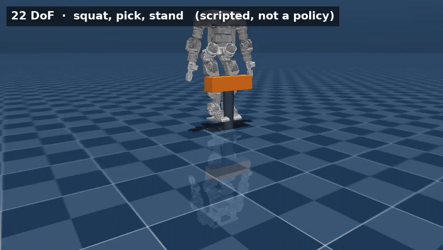
  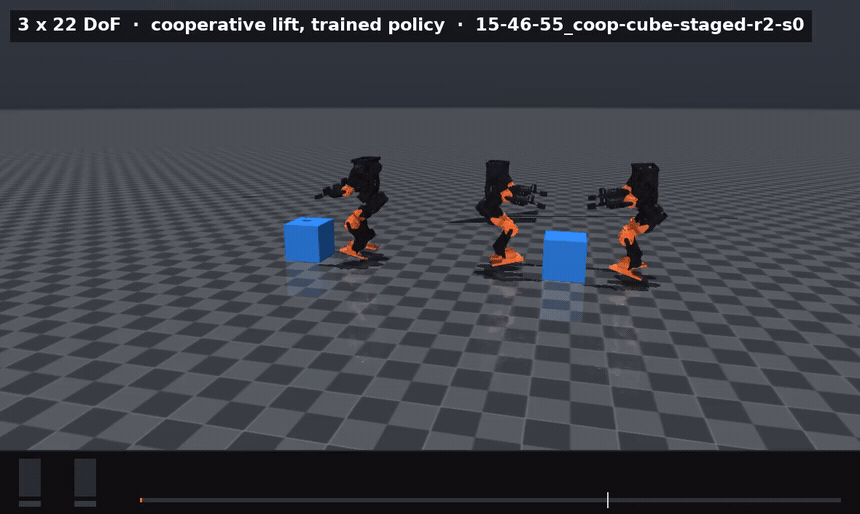<br>
  <sub>Left is <b>not</b> a policy — it is a scripted joint interpolation, the
  reachability check that says the pose exists. Right is the learned thing.
  Everything below is the distance between those two clips.</sub>
</p>

<p align="center">
  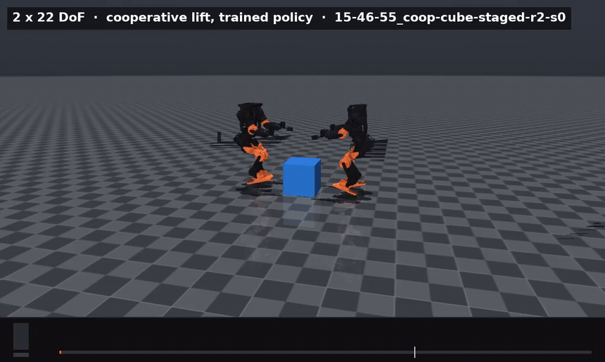
  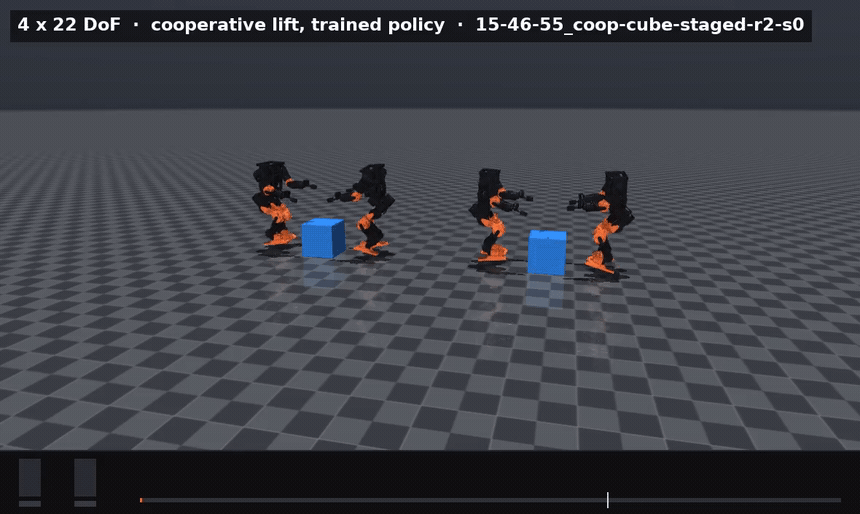<br>
  <sub>Left, one pair. Right, two pairs running the same learned policy. They
  close on the object and hold — the pinch forms, the lift does not. Each clip
  runs the seed that stays upright longest out of twelve, picked by
  <code>scripts/bench/pick_seed.py</code> rather than left at seed 0, so the
  clip and the numbers below it are the same rollout. For one pair that is
  <b>7.8 cm of lift, hands inside the pinch gate 98% of the time, both robots
  still standing at 12 s</b> — four seconds past the trained horizon. The median
  across all twelve seeds is 5.5 cm.</sub>
</p>

<picture>
  <source media="(prefers-color-scheme: dark)" srcset="results/charts/coop_ablation-dark.svg">
  
</picture>

Fourteen knobs, then three seeds on the four that mattered — and the seeds
overturned the headline. The pinch gap between arms is inside seed noise. What
survives three seeds out of three is the **fall rate**: never paying for height
produces the only arm that reliably stays upright. Ordering the reward — pinch
first, height second — then gets a pinch, a clamp, a lift bonus and the highest
reward of any arm, with height still pinned at 4 cm.

### Giving them eyes made it worse

The obvious next move is to put a camera on the lift. A ray-cast depth camera
per robot tracks the payload's transform, so the cube stays visible as it moves
— no RTX renderer needed. Two arms: depth *replacing* the privileged object
pose, and depth *added alongside* it.

<p align="center">
  
  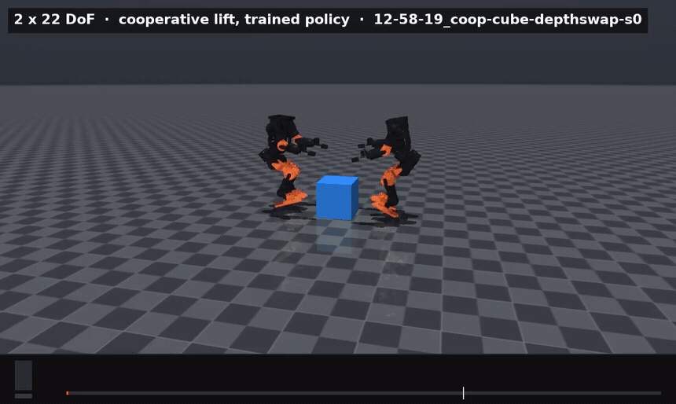<br>
  <sub>Same task, same 4,000 iterations. Left blind, right with depth replacing
  the object pose. The red outline is a fall, held for the rest of the clip.
  The strip down the right of the sighted clip is <b>what that policy is
  reading</b> — colour under the white rule for context, the raw 64×64 depth
  frame under the orange, and under the blue the <b>8×8 vector it is actually
  handed</b>. That bottom pane is the entire visual input: 64 numbers, pooled,
  in place of an exact object pose.</sub>
</p>

<p align="center">
  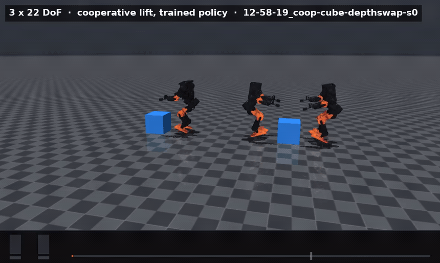
  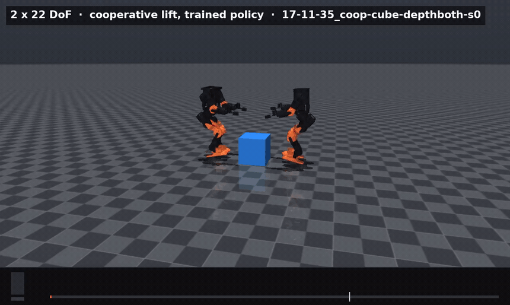
  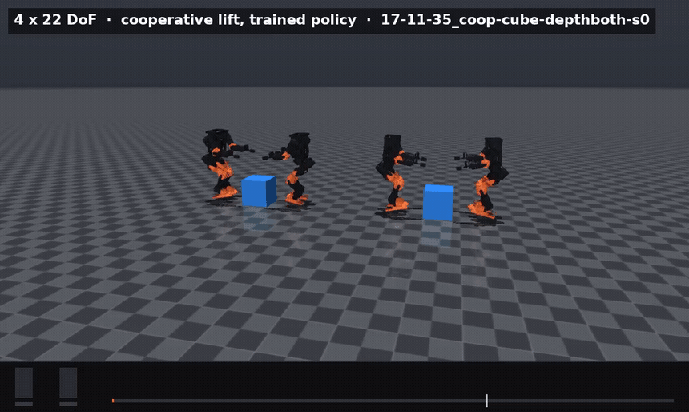<br>
  <sub>Not one unlucky rollout. Left, depth replacing the pose; centre and
  right, depth added alongside it — the arm that never forms a pinch at all.
  Every one carries its own POV strip, and in every one the cube is plainly
  visible in the depth panes for the whole clip. These policies are not
  failing to see the payload. They are failing to act on 64 pooled numbers
  where the blind arm was handed the pose exactly.</sub>
</p>

| | pinch | held lift | fell |
|---|---|---|---|
| **blind** | **0.42 – 0.91** | **4.0 – 4.8 cm** | **0.12 – 0.25** |
| depth replaces pose | 0.03 – 0.18 | 0.2 – 0.7 cm | 0.62 – 1.00 |
| depth added alongside | 0.00 | −0.1 cm | 0.88 – 1.00 |

**Finding.** Not a small regression — the sighted policies stop forming a pinch
at all and fall in almost every episode. The reason is visible in the setup
rather than the training: the actor is *already handed the exact object pose*.
Depth here does not add information, it substitutes a 64-dim pooled image for a
quantity the policy was being given exactly, and pools away the spatial
precision a pinch depends on. Vision earns its place when the payload is unknown
or occluded, which is a different experiment.

### And the other two objects

The recipe that lifts the cube was only ever run on the cube. Rerun on both:

| object | pinch | lift bonus |
|---|---|---|
| cube | 0.298 | 0.93 |
| yoga ball | 0.063 | 0.51 |
| ladder | **0.000** | 0.00 |

**The ball is the only arm whose height curriculum ever moved, and it did not
survive the cross-check.** In PhysX it climbs 4 cm → 6 cm → 13 cm → **20.9 cm**,
stopping just under the 22 cm cap; that curriculum promotes only on repeated
success, so inside the trainer this is a real lift. Replayed in MuJoCo, the same
weights fall over in **0.72 s**, in **0 of 6 seeds**, and — put in the cube scene
instead — in 0 of 6 there too, at 0.77 s. The collapse travels with the weights,
not the payload. The 21 cm is a single-engine number and this repo does not
count those.

**A geometry advantage looked real at six seeds and did not survive twelve.**
The tempting story is mechanical: squeezing a sphere from two sides gives
contact normals angled inward *and upward*, so the squeeze carries its own
vertical component, where a cube's vertical faces give purely horizontal normals
and every newton of lift has to come from friction. Drop the *cube*-trained
policy into a ball scene it has never seen and the first six seeds agree — 9.1 cm
against 6.1 cm on its own cube.

Twelve seeds reverse it.

| cube policy, 12 seeds | median lift | mean lift | max lift | upright at 12 s |
|---|---|---|---|---|
| in the **cube** scene | **5.1 cm** | **5.2 cm** | 7.8 cm | **6/12** |
| in the **ball** scene | 3.1 cm | 3.7 cm | 9.1 cm | 1/12 |

Both 6-seed figures were maxima, and the ball's distribution is the one with the
long tail: a higher best, a lower middle, and a fall in eleven runs out of
twelve at a mean of 1.5 s. A peak height reached during a topple is not a lift,
and *peak* is the wrong statistic for a claim about lifting — the median says
the ball is worse, and the upright count says it is much worse. **The wedge
argument is not supported by this data.** It is left here as the hypothesis it
is, and what the run actually shows is that a 65 cm sphere is harder to stand
next to than a 28 cm box.

| policy | scene | upright at 2 s | mean fall |
|---|---|---|---|
| ball | ball | 0/6 | 0.72 s |
| ball | cube | 0/6 | 0.77 s |
| cube | ball | 0/6 | 1.73 s |
| cube | cube | **5/6** | **6.65 s** |

Nothing here is a solved lift. The cube arm is the only one that reliably stays
upright, and it lifts 5 cm. Cooperative lifting on this robot is not done.

<p align="center">
  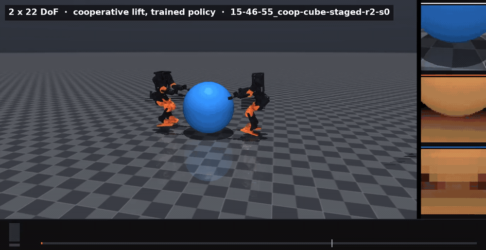
  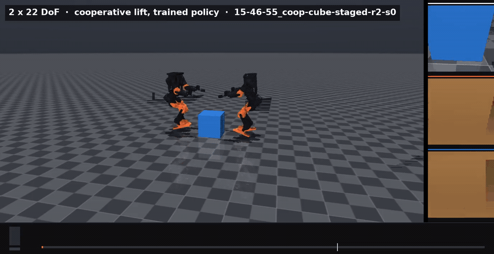<br>
  <sub>Right is the best rollout in the project: <b>7.8 cm of lift, hands inside
  the pinch gate 98% of the time, and the fall criterion never triggered across
  the full 12 s</b> — four seconds longer than the horizon it was trained on.
  "Never fell" is doing exact work there: the test is training's own
  torso-orientation termination, and over those 12 s the base also settles about
  14 cm, which is a deep crouch and not a fall, but is not standing either. Left is the same
  weights on a ball they have never seen, which reaches higher on its best seed
  and falls on eleven of twelve, and is why the table above reads medians. The
  strip on the right of each frame is that robot's own head camera, three views
  from one pose at one instant: <b>colour</b> under the white rule, the
  <b>raw 64x64 depth frame</b> under the orange, and under the blue the
  <b>8x8 the network is actually handed</b>. The two depth panes are masked to
  floor and payload because that is the target list the ray-caster casts
  against — they are the tensor the policy receives, not a picture of the room,
  and the gap between them is the resolution it does not get.</sub>
</p>

<p align="center">
  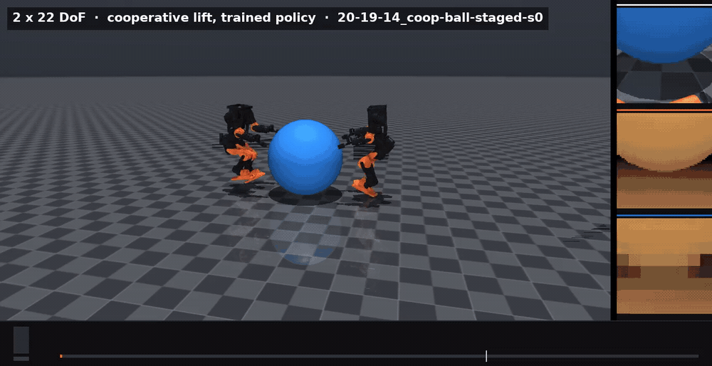<br>
  <sub>The 21 cm arm, cross-checked. It falls at 0.72 s having never touched the
  payload — the ball does not move a millimetre. This is what a single-engine
  result looks like from the other engine.</sub>
</p>

The ladder is at pinch identically zero for the third recipe in a row, and its
staging latch never fires at all. That stops being "we never retried it" and
becomes a property of the object: long, thin and light puts the two contact
points further apart than the shoulders can span, with nothing to squeeze
against.

<p align="center">
  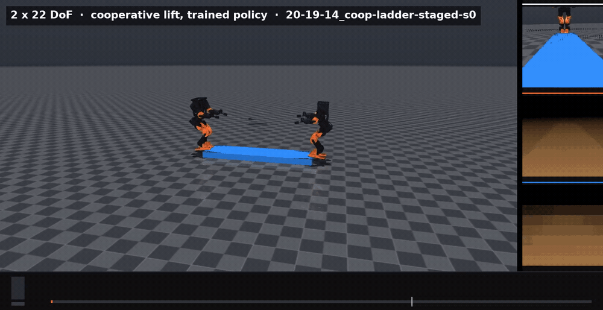<br>
  <sub>The third object, rendered for the first time. <b>Twelve seeds out of
  twelve: 0.0 cm of lift, closest approach 39 cm, and the fall criterion never
  triggered.</b> That last part is misleading on its own, and the clip is why
  it is here: the pair sinks about 34 cm in the first two seconds and stays
  down, torso level the whole way, which training's orientation test does not
  score as a fall. They do not lift and they do not stay up — they subside. The
  pair starts 1.7 m apart across a 1.5 m plank whose contact points are 75 cm
  from its centre,
  further apart than shoulders that cannot adduct past 36 cm can span. Note how
  much darker the depth panes are here than in the cube clips: the same camera,
  the same fixed ramp, a payload 8 cm tall seen from 85 cm away. Unlike every
  other null in this section, this one is not a stability failure.</sub>
</p>

### Nine interventions, and the one that worked was taking the pose away

Height sat at exactly 4 cm — the curriculum's floor — in every cube arm that had
been run. So it got attacked from nine directions at once: twice the training,
the tilt penalty halved and removed, an exploration bonus at two weights, a
randomised payload, occlusion, and a recurrent policy.

<picture>
  <source media="(prefers-color-scheme: dark)" srcset="results/charts/coop_nine-dark.svg">
  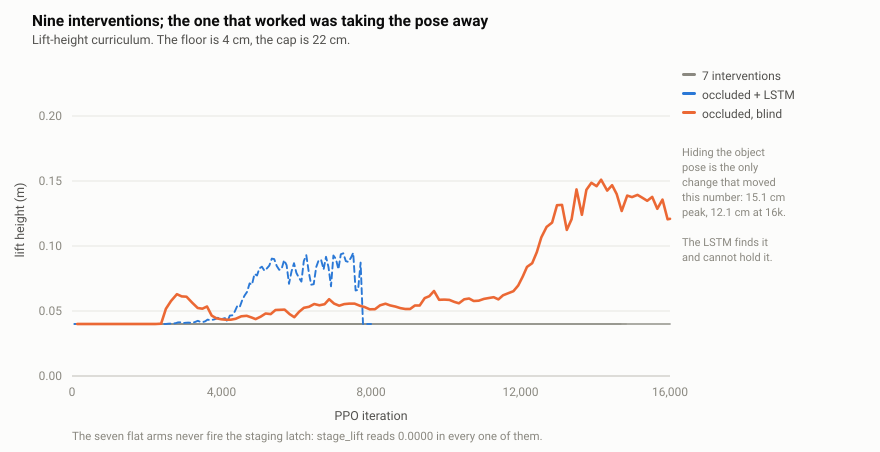
</picture>

| arm | pinch | lift bonus | height |
|---|---|---|---|
| 16k iterations, seed 1 / 2 | 0.290 / 0.320 | 0.00 | 0.0400 |
| tilt penalty × 0.5 | 0.223 | 0.00 | 0.0400 |
| tilt penalty removed | 0.273 | 0.00 | 0.0400 |
| exploration bonus 0.003 | 0.207 | 0.00 | 0.0400 |
| exploration bonus 0.010 | 0.048 | 0.00 | 0.0400 |
| randomised payload | 0.254 | 0.00 | 0.0400 |
| **occluded, blind** | 0.397 peak | **0.53** | **0.1250** (sustained peak 0.1510) |
| occluded, blind + LSTM | 0.408 peak | 3.19 peak, 0.00 final | 0.0947 peak, 0.0400 final |

**Finding — hiding the object is what moved the number.** Seven of the nine sit
on the floor with `stage_lift` at 0.0000: the latch never fires, so the lift
reward stays at zero, so the curriculum never sees a success. They all landed
upstream of a switch that stayed off.

The occlusion arm is the exception, and it is the project's first sustained cube
lift: the latch fires, holds, and the height curriculum climbs to a **15.1 cm
sustained peak, ending at 12.5 cm after 16,000 iterations**. Not a spike — a
level it reaches and stays at for thousands of iterations. (Heights here are
read off a 133-iteration mean. The raw series touches 21.1 cm for a single
iteration, which is not a number worth leading with.)

The control for that is unusually clean, because the arm was accidentally run
twice. The first run predates the `apply_depth_flags` fix, which was injecting
`object_pos_a`/`object_pos_b` into every task's policy group — so the "occluded"
arm was quietly handed the exact object pose after all. Same config, same 16,000
iterations, same seed:

| occluded-blind, 16k iters | pose | stage_lift | lift bonus | final height |
|---|---|---|---|---|
| before the fix | **restored by the bug** | 0.0000 | 0.00 | 0.0400 |
| after the fix | **actually hidden** | 1.0000 | 0.53 | **0.1250** |

Which lines up exactly with why depth made things worse two sections above. The
blind policy was never short of information — it was handed the object pose
exactly, and a pose it does not have to work for is a pose it never learns to
close on. Take it away and the lift finally happens. **Occlusion was filed as a
robustness stressor and turned out to be the curriculum.**

The recurrent variant finds the same thing and cannot hold it: the highest lift
bonus in the project, 3.19, and then a collapse back to the floor by iteration
8,000 with the bonus at zero.

One arm is still missing, and it is now the interesting one. `occluded, depth`
and `occluded, depth + LSTM` have only ever run *before* the fix, which means
neither was ever actually occluded — both are mislabelled repeats of the sighted
experiment, and both are pinned at 0.0400. Depth-under-occlusion is the arm that
says whether a camera helps once the privileged pose is gone, which is the one
condition under which §"giving them eyes" predicts it should. It is running now,
alongside two more seeds of the blind occluded arm, because a first sustained
lift on one seed is a lead and not yet a result.

It also retires an earlier explanation. `notilt` peaked at 15.9 cm and the tilt
penalty looked like the cap; removing it entirely changes nothing. And the seven
pinned arms reporting the *identical* 0.0400 rather than a spread was always the
tell — a genuine plateau scatters, a switch that never flips does not.

> **Corrections.** Two earlier readings of this section were wrong, and both are
> worth stating because the same mistake produced them.
>
> The first blamed an unreachable staging threshold, comparing a best pinch of
> 0.32 against a threshold of 0.40. Those are different quantities — 0.32 is an
> episode-mean *reward* for a term carrying weight 2.0, and the threshold is
> read against an instantaneous kernel in [0, 1].
>
> The second said the number never moved in any of the nine. It moved in two of
> them, to 12.5 cm. That claim came from `tail -1` on a training log rather than
> from the trainer's event file, and the log's last line was not the last
> iteration. Both readings scraped a summary instead of reading the series.

[Read §5](docs/REPORT.md#5--cooperative-lift-can-two-of-them-learn-to-pick-something-up)

---

## How any of this is measured

Upstream's sim2sim script constructs a gamepad, blocks on joystick input,
requires a GUI, sleeps to hold realtime, and emits **no metric of any kind**. It
is a thing to watch, not a thing to measure.

<p align="center">
  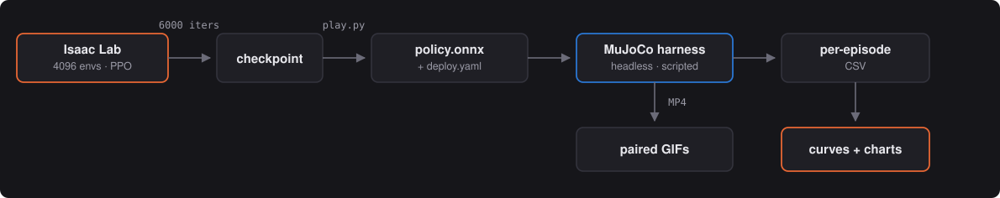
</p>

The harness drives the policy through upstream's **own** `RlController`, so
observation construction is bit-identical to the sim2real deployment path. An
evaluator that rebuilt the 45-dim observation independently would be measuring
its own reimplementation. A fall reuses training's own `bad_orientation`
threshold; velocity error is computed in the yaw frame, because that is the
frame upstream rewards.

Six commanded velocities × five seeds × 10 s episodes, identical for every
policy, on one fixed terrain seed.

[Protocols, metric definitions, and the cluster notes](docs/REPORT.md#how-any-of-this-is-measured)

---

## Reproducing

```bash
git clone --recurse-submodules https://github.com/joses2017smjh/bhl-robustness-ladder.git
cd bhl-robustness-ladder
sbatch slurm/00_build_container.sbatch   # ~4 min
sbatch slurm/01_uv_sync.sbatch           # ~30-60 min, ~30 GB
sbatch slurm/02_smoke_train.sbatch       # gate check
```

Isaac Sim needs glibc ≥ 2.34 and the login node is Rocky 8, so everything runs
inside an Apptainer image with the venv on shared storage outside the git tree.
Jobs declare several partitions and an explicit GPU-architecture constraint —
one partition's per-user GPU cap is what the queue actually binds on, and the
OS tag alone will happily hand you a card the pinned torch has no kernels for.

The full job list, the partition map, and what each one produces are in the
[report](docs/REPORT.md#reproducing).

---

## Repo layout

```
external/Berkeley-Humanoid-Lite   upstream, pinned (submodule, unmodified)
src/bhl_robust/
  tasks/        overlay env configs registering new gym task ids
  curricula/    push-magnitude ramp + adaptive rule
  terrains/     rough / slope / obstacle / stairs generators
  eval/         headless MuJoCo harness, MJCF repair, height fields, depth, video
  audit/        three-way URDF / USD / MJCF consistency
  usd/          scripted OpenUSD stages (terrain variants, lab scene)
scripts/        vendored train/play entrypoints, curves, charts, GIFs, benches
slurm/          sbatch scripts (OSU COE HPC)
docs/           REPORT.md, interactive run explorer, README clips
results/        curves, charts, per-episode CSVs, aggregated tables, audit JSON
```

## What was found in upstream

Six genuine breakages, all worked around without modifying `external/` —
including a curriculum config bound to the wrong attribute name (every
curriculum term dead code), and an MJCF whose mesh paths mean **the MuJoCo model
does not load at all**. [The list](docs/REPORT.md#what-was-found-in-upstream).

## License

Experiment code MIT. Upstream BHL retains its own license under `external/`.
