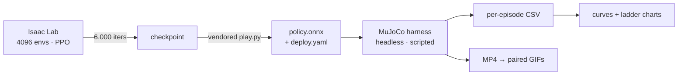

# bhl-robustness-ladder

**An 11.3 kg 3D-printed humanoid with 6 Nm joints. How much can it take before
it stops learning?**

Those two numbers drive everything here. This machine has very little authority
to arrest a disturbance, so the question is not rhetorical — and answering it
needed an instrument, because upstream ships flat-ground locomotion with no
curriculum and **no way to score a policy at all**.

So: train in Isaac Lab (PhysX), score in MuJoCo. Different simulator on purpose.
A policy that only works where it trained has learned PhysX, not locomotion.

<p align="center">
  <br>
  <sub>Four policies, one world, identical 0.45 m/s shoves. Not a composite —
  they share a solver and a clock. The un-randomized robot is the one on the
  ground.</sub>
</p>

<p align="center">
<b>89 policies trained</b> · <b>6,348 scored sim2sim episodes</b> · <b>288 rendered rollouts</b><br>
<a href="https://claude.ai/code/artifact/de955af8-2236-4912-84fb-577e0a43ccbe"><b>Explore every run interactively</b></a> — isolate a run, switch metrics, watch the axis rescale.
</p>

---

## What came out of it

| | Finding |
|---|---|
| **1** | **Transfer inverts the training-reward ranking.** Highest training reward falls **23%** of the time in MuJoCo; the repo default falls **0%**. |
| **2** | **0.2 m/s of shove-rejection is free** — and the "0.87 m/s ceiling" was an artifact of a safety cap. Uncapped, the curriculum oscillates 0 → 1.8 m/s and never converges. |
| **3** | **Randomization alone buys most of terrain robustness.** A blind policy that never saw rough ground holds to d≈0.4. Arms push that to d≈0.6. |
| **4** | **The terrain plateau is torque, not sensing.** An exact height map of the ground underfoot moves the curriculum **not at all**. Looking *ahead* does. |
| **5** | **Depth never needed the RTX renderer.** Ray-cast depth costs **1.6%** of throughput at 4,096 envs and lifts terrain level **11%**. |
| **6** | **The sim2sim gap is physics, not bookkeeping.** URDF, USD and MJCF agree; swapping collision primitives for convex meshes moves neither reward nor transfer. |
| **7** | **Two robots can form a pinch, but not a lift.** Ordering the reward — pinch first, height second — is what closes the hands. Height never leaves 4 cm. |
| **8** | **Arms buy recoverable perturbation, not a higher step.** No 12-DoF policy crosses the lab floor; two of four 22-DoF policies do. |

Every claim below links into the [full technical report](docs/REPORT.md), which
carries the protocols, the caveats, and the corrections.

---

## The ladder: what randomization costs, and what it buys

Every range in upstream's `EventsCfg` is rewritten as one scale `s`, so
randomization becomes a continuous axis instead of three named presets.

<p align="center">
  <br>
  <sub>Identical strafe command in MuJoCo. Left <code>s=1.0</code>, right
  <code>s=0</code>. Neither policy ever saw MuJoCo during training.</sub>
</p>

<picture>
  <source media="(prefers-color-scheme: dark)" srcset="results/charts/dr_ladder_summary-dark.svg">
  
</picture>

The training column and the transfer column disagree, and that disagreement is
the point. `s = 0` wins training by 49% and loses transfer outright. Reward
declines smoothly; **fall rate** is the quantity with a knee — and upstream's
shipped default sits on the last rung before it.

[Read §1](docs/REPORT.md#1--domain-randomization-the-fidelity-ladder)

---

## How hard a shove is learnable

<p align="center">
  <br>
  <sub>Identical 0.5 m/s shoves. Left trained with a push curriculum, right
  without. <b>0/6 falls against 3/6.</b></sub>
</p>

<picture>
  <source media="(prefers-color-scheme: dark)" srcset="results/charts/push_sweep-dark.svg">
  
</picture>

0.2 m/s is free. 1.5 m/s destroys the gait — reward climbs to 24.7 and then
collapses to 3.0 as the ramp passes 0.7 m/s. A competence-gated rule does far
better, but lifting its safety cap showed it never actually converges: it
climbs until the gait breaks, drops to zero, and repeats.

[Read §2](docs/REPORT.md#2--push-recovery-how-hard-a-shove-is-learnable)

---

## Rough ground, and what actually pays for it

<p align="center">
  <br>
  <sub>Identical rough ground at <code>d = 0.80</code>. Left trained on terrain,
  right flat-trained with the same randomization. <b>0/6 falls against 3/6.</b></sub>
</p>

<picture>
  <source media="(prefers-color-scheme: dark)" srcset="results/charts/terrain_retention-dark.svg">
  
</picture>

Plain domain randomization, with **zero terrain exposure**, carries the robot to
roughly d = 0.4. Terrain training is what holds past that — 11× fewer falls at
d = 1.0. Evaluation terrain is generated by completely different code from
training terrain, so a policy that memorised its height field scores nothing.

[Read §3](docs/REPORT.md#3--rough-terrain-what-actually-buys-terrain-robustness)

---

## The plateau is torque, not sensing

The curriculum stalls at level 1.4 of 9. That was attributed to "6 Nm joints
**and** no height sensing" — two hypotheses in one sentence. Giving the policy a
perfect height map of the ground underfoot separates them.

<picture>
  <source media="(prefers-color-scheme: dark)" srcset="results/charts/terrain_plateau-dark.svg">
  
</picture>

The privileged arm lands **on** the blind curve. Perfect terrain knowledge buys
nothing, which leaves joint authority as the thing that runs out — a hardware
claim about this robot, not an observation-design one. What does move it is
looking *ahead*.

[Read §3b](docs/REPORT.md#3--rough-terrain-what-actually-buys-terrain-robustness)

---

## Depth, without the renderer that will not start

Isaac Sim 5.1's RTX renderer segfaults on this cluster inside
`omni.usd.create_hydra_engine`. That was recorded as blocking every vision
experiment. It was not: `RayCasterCamera` intersects a pinhole ray bundle with
the scene mesh in warp and never asks for a Hydra engine at all.

<p align="center">
  <br>
  <sub>Left, the scored episode. Right, the robot's own 64×64 depth image. This
  one is MuJoCo's offscreen depth buffer, not Isaac Lab's ray-caster — a
  different renderer, a different projection, a different simulator. Two
  independent paths agreeing is the argument this repo makes everywhere.</sub>
</p>

| | envs | env-steps/s |
|---|---|---|
| physics only | 4,096 | 21,844 |
| **+ depth 48×48** | 4,096 | **21,490** |

Validated against the closed-form depth image of a flat plane before anything
trained on it: **100% finite pixels, 2.9% mean relative error**. Warp returns
all-NaN rather than an error when the mesh paths are wrong, so the check is not
optional.

[Read §6](docs/REPORT.md#6--depth-without-a-renderer)

---

## The lab floor

Tile, carpet strip, cable, door threshold, ramp — the geometry a depth sensor
would actually be aimed at, and a course to cross rather than a texture to
sample.

<p align="center">
  <br>
  <sub>Four 22-DoF policies, no shove. The hero run wears the orange shell; a
  fallen robot darkens and the frame takes a red outline. Along the bottom is
  that robot's own egocentric depth, with a scrolling waterfall of the centre
  column — so an obstacle is visible in the sensor <i>before</i> it matters to
  the feet.</sub>
</p>

No 12-DoF policy finishes upright. Two of four 22-DoF policies cross the whole
course. Three of the four biped runs end at a **2.5 cm cable** — 9% of leg
length. The sharpest comparison is the same recipe on both bodies: `randomized`
falls at the cable on 12 DoF and finishes on 22.

Arms are not free stability, and the table says so: `no-randomization` is
*worse* with arms. More mass higher up, with no policy trained to use it, is a
liability.

[Read §8](docs/REPORT.md#8--do-the-arms-buy-stability-walk-the-lab-floor-and-see)

---

## Two robots, one object

16 kg each, 6 Nm joints, no fingers, shoulders that cannot adduct past ~36 cm.
Can a pair *learn* a non-prehensile side-lift? One PPO, 44 actions, privileged
critic — the recipe contact-rich dual-arm papers actually train with.

<p align="center">
  
  <br>
  <sub>Left, one pair. Right, two pairs running the same learned policy. They
  close on the object and hold — the pinch forms, the lift does not.</sub>
</p>

<picture>
  <source media="(prefers-color-scheme: dark)" srcset="results/charts/coop_ablation-dark.svg">
  
</picture>

Fourteen knobs, then three seeds on the four that mattered — and the seeds
overturned the headline. The pinch gap between arms is inside seed noise. What
survives three seeds out of three is the **fall rate**: never paying for height
produces the only arm that reliably stays upright. Ordering the reward — pinch
first, height second — then gets a pinch, a clamp, a lift bonus and the highest
reward of any arm, with height still pinned at 4 cm.

[Read §5](docs/REPORT.md#5--cooperative-lift-can-two-of-them-learn-to-pick-something-up)

---

## How any of this is measured

Upstream's sim2sim script constructs a gamepad, blocks on joystick input,
requires a GUI, sleeps to hold realtime, and emits **no metric of any kind**. It
is a thing to watch, not a thing to measure.



The harness drives the policy through upstream's **own** `RlController`, so
observation construction is bit-identical to the sim2real deployment path. An
evaluator that rebuilt the 45-dim observation independently would be measuring
its own reimplementation. A fall reuses training's own `bad_orientation`
threshold; velocity error is computed in the yaw frame, because that is the
frame upstream rewards.

Six commanded velocities × five seeds × 10 s episodes, identical for every
policy, on one fixed terrain seed.

[Protocols, metric definitions, and the cluster notes](docs/REPORT.md#how-any-of-this-is-measured)

---

## Reproducing

```bash
git clone --recurse-submodules https://github.com/joses2017smjh/bhl-robustness-ladder.git
cd bhl-robustness-ladder
sbatch slurm/00_build_container.sbatch   # ~4 min
sbatch slurm/01_uv_sync.sbatch           # ~30-60 min, ~30 GB
sbatch slurm/02_smoke_train.sbatch       # gate check
```

Isaac Sim needs glibc ≥ 2.34 and the login node is Rocky 8, so everything runs
inside an Apptainer image with the venv on shared storage outside the git tree.
Jobs declare several partitions and an explicit GPU-architecture constraint —
one partition's per-user GPU cap is what the queue actually binds on, and the
OS tag alone will happily hand you a card the pinned torch has no kernels for.

The full job list, the partition map, and what each one produces are in the
[report](docs/REPORT.md#reproducing).

---

## Repo layout

```
external/Berkeley-Humanoid-Lite   upstream, pinned (submodule, unmodified)
src/bhl_robust/
  tasks/        overlay env configs registering new gym task ids
  curricula/    push-magnitude ramp + adaptive rule
  terrains/     rough / slope / obstacle generators (no stairs)
  eval/         headless MuJoCo harness, MJCF repair, height fields, depth, video
  audit/        three-way URDF / USD / MJCF consistency
  usd/          scripted OpenUSD stages (terrain variants, lab scene)
scripts/        vendored train/play entrypoints, curves, charts, GIFs, benches
slurm/          sbatch scripts (OSU COE HPC)
docs/           REPORT.md, interactive run explorer, README clips
results/        curves, charts, per-episode CSVs, aggregated tables, audit JSON
```

## What was found in upstream

Six genuine breakages, all worked around without modifying `external/` —
including a curriculum config bound to the wrong attribute name (every
curriculum term dead code), and an MJCF whose mesh paths mean **the MuJoCo model
does not load at all**. [The list](docs/REPORT.md#what-was-found-in-upstream).

## License

Experiment code MIT. Upstream BHL retains its own license under `external/`.
