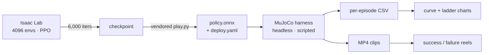

# bhl-robustness-ladder

Robustness experiments on the [Berkeley Humanoid Lite](https://github.com/HybridRobotics/Berkeley-Humanoid-Lite)
(BHL) — an open-source, 3D-printed, **11.3 kg** humanoid whose joints are limited to **6 Nm**.
Those two numbers drive almost every result here: this machine has very little
authority to arrest a disturbance, so "how much can it take before it stops
learning?" is a real question rather than a formality.

Upstream ships flat-ground locomotion with a fixed domain-randomization preset,
no curriculum, and no way to score a policy. This repo adds three experiments
and — necessarily — the instrument to measure them.

**[▶ Explore every run interactively](https://claude.ai/code/artifact/de955af8-2236-4912-84fb-577e0a43ccbe)**
— isolate a run, switch metrics, watch the axis rescale.

| | Experiment | Question | Status |
|---|---|---|---|
| 1 | **Push recovery** | Can a disturbance curriculum buy shove-rejection, and how much? | pass 1 done, pass 2 training |
| 2 | **DR fidelity ladder** | How does performance trade off against randomization strength? | 5-rung curve, filling in |
| 3 | **Rough terrain** | Does a terrain curriculum transfer to a robot this weak? | not started |

---

## Results so far

### The fidelity ladder

Randomization strength is expressed as a single scale `s`, where every range in
upstream's config is `center ± s·half_width`. `s = 1.0` is exactly what BHL
ships; `s = 0` pins every physics parameter to nominal.

<picture>
  <source media="(prefers-color-scheme: dark)" srcset="results/charts/dr_training_curves-dark.svg">
  
</picture>

<picture>
  <source media="(prefers-color-scheme: dark)" srcset="results/charts/dr_ladder_summary-dark.svg">
  
</picture>

| rung | final reward (3 seeds) | fall rate | learns? |
|---|---|---|---|
| `s = 0.0` no randomization | 49.4 / 49.3 / 48.9 | 0.015 | yes |
| `s = 0.5` | 34.3 / 35.7 / 36.1 * | 0.065 * | yes |
| `s = 1.0` repo default | 32.9 / 34.8 / 33.2 | 0.041 | yes |
| `s = 1.5` | 8.3 * | 0.506 * | **degrading** |
| `s = 2.0` double-width | 4.6 / 4.3 / 4.5 | 0.68 | **no** |

<sub>* still training — values are at ~1,000 of 6,000 iterations.</sub>

**The cliff sits between `s = 1.0` and `s = 1.5`.** Reward drops roughly 4× and
the fall rate goes from 0.04 to 0.51. Notably, upstream's shipped default sits
just *below* that edge — which is a more interesting finding than a smooth
tradeoff would have been.

> **Reading these numbers honestly:** training reward is *not* a performance
> ranking across rungs. A policy trained under heavier randomization is solving
> a strictly harder problem, so lower reward is expected and means nothing on
> its own. The real deliverable is **retention through sim2sim**, which is what
> the MuJoCo harness below measures. The curve above locates where training
> *breaks*; it does not yet say which rung transfers best.

### Push recovery — a negative result, and what it taught

<picture>
  <source media="(prefers-color-scheme: dark)" srcset="results/charts/push_collapse-dark.svg">
  
</picture>

Pass 1 ramped the push to **1.5 m/s**. The curriculum arm learned to walk —
reward 24.7 by iteration 1,599 — and then the ramp destroyed it, ending at ~3.0
with **93% of episodes terminating on bad orientation**. The fixed-magnitude
control never learned at all (~2.5 throughout).

That pair is informative rather than merely disappointing:

- The fixed arm failing confirms the curriculum was the right *idea* — full-strength
  shoves from step zero knock the robot over before a gait exists, so it never
  collects the data that would teach recovery.
- The curriculum arm peaking *then* collapsing shows the ceiling, not the schedule,
  was wrong. Collapse begins as the ramp passes ≈0.7 m/s.

Pass 2 therefore treats the ceiling as the variable and sweeps it
(0.2 / 0.4 / 0.6 m/s), which answers "how much disturbance can this machine
learn to reject" instead of asserting one number.

---

## Methodology

### Why this needed its own instrument

The obvious plan — "evaluate through the sim2sim path the repo already gives you"
— does not survive contact with the code. Upstream's `scripts/sim2sim/play_mujoco.py`:

- constructs a `Se2Gamepad()` and blocks on joystick input,
- calls `mj_viewer.sync()`, requiring a GUI,
- `sleep()`s to hold wall-clock realtime,
- loops forever and emits **no metric of any kind**.

It is a thing to watch, not a thing to measure. So `src/bhl_robust/eval/` keeps
the parts that determine transfer fidelity — the MJCF, the PD controller, the
sensor-derived observation layout — and drops the interactive scaffolding.

**The single most important design decision here:** the harness drives the policy
through upstream's *own* `RlController`. Observation construction is therefore
bit-identical to the sim2real deployment path. An evaluator that rebuilt the
45-dim observation vector independently would be measuring my reimplementation,
not the transfer.

### What gets measured

Every policy is scored on the identical protocol — 6 commanded velocities ×
5 seeds × 10 s episodes:

| metric | why |
|---|---|
| fall / survival time | fall threshold mirrors training's `bad_orientation` (0.78 rad), so a fall means the same thing it meant during training |
| linear velocity error | computed in the **yaw frame**, because that is the frame upstream rewards (`track_lin_vel_xy_yaw_frame_exp`); any other frame is not comparable |
| yaw-rate error, distance, height, tilt | gait quality beyond mere survival |
| push survival | fraction of shoves the policy stays upright through |

Tracking errors average over **surviving steps only** — otherwise a policy that
falls instantly posts a flatteringly small error.

### Pipeline



Training and evaluation deliberately use **different simulators** — Isaac Lab
(PhysX) to train, MuJoCo to score. That gap *is* the measurement: a policy that
only works in the simulator it was trained in has not learned locomotion, it has
learned PhysX.

### Experiment design notes

**DR ladder.** Rungs are a continuous scale rather than three named presets,
which is what turns three points into a curve and lets the cliff be *located*
rather than merely hit. `s = 0/1/2` reproduce the originally-trained rungs
bit-for-bit. One subtlety: mass is an *additive offset*, so it scales from zero,
while friction and gain multipliers scale around their centre — scaling mass
around its centre would silently inject a constant +0.5 kg at `s = 0` and break
agreement with the policies already trained.

**Push curriculum.** Implemented as a real Isaac Lab curriculum term that mutates
the live event config each iteration, logging the current magnitude so the ramp
is visible in TensorBoard. It binds to `curriculum` — **not** upstream's
`curriculums`. Isaac Lab builds its manager from `cfg.curriculum` (singular), so
upstream's `CurriculumsCfg` is never read; binding to the plural name would have
silently no-opped the entire experiment while still training and reporting a
plausible-looking number.

**Initial-state randomization is held constant** across every rung, so the ladder
isolates one variable.

### Reproducibility

The whole stack is pinned. Upstream is a submodule at `984741a`; the Python
environment resolves from upstream's `uv.lock` with `--locked`, so all runs share
a bit-identical dependency set. Every run also dumps its own fully-resolved
`params/env.yaml`, which is how the DR overrides were *verified* to land rather
than assumed.

<details>
<summary><b>Why a container, and why the login node can't run any of this</b></summary>

The cluster login node is Rocky 8 (**glibc 2.28**); Isaac Sim 5.1 requires
**≥ 2.34**. Conda cannot fix that — it ships its own `libstdc++`, not glibc.
Compute nodes are Rocky 9.8 (glibc 2.34), *exactly* at the boundary, so
`container/bhl.def` builds an Ubuntu 22.04 (glibc 2.35) base and sidesteps the
question. The NVIDIA driver and Vulkan ICD are injected at runtime via
`apptainer --nv`.

The image contains **no Python packages** — `uv` resolves the stack into a venv
outside the git tree, so the repo stays movable without a 30-minute resync.

Cluster-specific gotchas that cost real debugging time, documented in commits:

- `apptainer --cleanenv` drops every unforwarded variable — this killed a 9-job
  array in one second on `TASK: unbound variable`.
- `apptainer --env` splits values on **commas**, mangling every `[lo,hi]` range,
  so Hydra overrides are passed by file path.
- `/scratch` is **node-local, not shared**.
- TensorBoard's data server needs `GLIBC_2.29`, so on the login node it serves a
  page while silently reading nothing. It runs inside the container.
- numpy's C extension will not import on the login node at all.
</details>

---

## What was found in upstream

Working through this surfaced five genuine breakages, all worked around without
modifying `external/`:

| | issue | consequence |
|---|---|---|
| 1 | `CurriculumsCfg` bound to `curriculums`, Isaac Lab reads `curriculum` | every curriculum term is dead code, incl. their unused `terrain_levels_vel` |
| 2 | MJCF declares `meshdir="assets"` + `merged/*.stl`; meshes live flat in `meshes/` | **the MuJoCo model does not load at all** |
| 3 | `play.py` uses `OnPolicyRunner.obs_normalizer`, removed in rsl-rl 3.x | ONNX export raises before writing anything |
| 4 | `play.py` playback loop assumes old `env.get_observations()` arity | upstream's render path is unusable |
| 5 | `--experiment_name` is parsed but never applied | all runs land in one directory |

(2) is the interesting one: the meshes are **visual-only** (`contype="0"`; every
collision geom is a primitive), so physics is unaffected — but the model still
won't load, so it has to be repaired regardless.

---

## Repo layout

```
external/Berkeley-Humanoid-Lite   upstream, pinned at 984741a (submodule, unmodified)
src/bhl_robust/
  tasks/        overlay env configs registering new gym task ids
  curricula/    push-magnitude ramp
  eval/         headless MuJoCo harness, MJCF repair, video renderer
scripts/        vendored train/play entrypoints, chart + curve generation
slurm/          sbatch scripts (OSU COE HPC, `gpu` partition)
docs/           the interactive run explorer
results/        curves, charts, per-episode CSVs
```

## Running it

```bash
git clone --recurse-submodules https://github.com/joses2017smjh/bhl-robustness-ladder.git
cd bhl-robustness-ladder
sbatch slurm/00_build_container.sbatch   # ~4 min
sbatch slurm/01_uv_sync.sbatch           # ~30-60 min, ~30 GB
sbatch slurm/02_smoke_train.sbatch       # gate check

sbatch slurm/10_dr_ladder.sbatch         # DR rungs s=0,1,2
sbatch slurm/12_dr_ladder_fill.sbatch    # s=0.5, 1.5
sbatch slurm/13_push_sweep.sbatch        # push ceilings 0.2/0.4/0.6
sbatch slurm/20_evaluate_all.sbatch      # export -> score -> render

sbatch slurm/90_tensorboard.sbatch       # live curves
```

## Hardware

OSU COE HPC, `gpu` partition: Quadro RTX 8000 (48 GB, driver 595.71.05),
Rocky 9.8. One GPU per run; 6,000 PPO iterations at 4,096 envs takes ≈3 h.

## License

Experiment code MIT. Upstream BHL retains its own license under `external/`.
