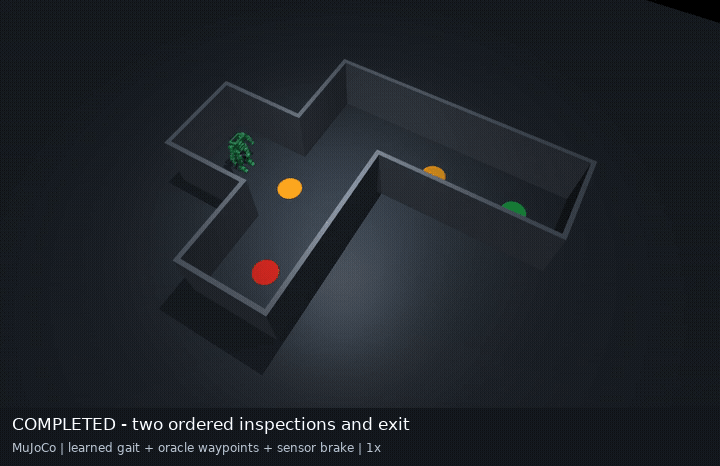

# Humanoid Robustness Ladder

**Train humanoid policies in Isaac Lab and test what they actually accomplish.**

I built the task curricula, sensor adapters, MuJoCo evaluation harnesses and
Slurm checkpoint gates around the upstream Berkeley Humanoid Lite. The project
studies locomotion, goal reaching and multi-robot coordination, with scored
recordings and negative controls.

[Watch the demo](results/weekend-20260919/inspection-maze.mp4) ·
[Results](docs/WEEKEND_RESULTS_2026-09-20.md) ·
[Success/failure gallery](docs/GALLERY.md) ·
[Portfolio case study](https://jose-sanchez-portfolio-com.vercel.app/projects/bhl-robustness-ladder/)

[](results/weekend-20260919/inspection-maze.mp4)

*Actual 17.36-second MuJoCo rollout: frozen learned gait, known map/pose and
sensor braking. Inspection means proximity dwell. This older 22-DoF gait is
separate from the new 12-DoF Isaac checkpoints evaluated below.*

## Results and limits

| Experiment | Measured result | What the result covers |
|---|---|---|
| Goal-reaching PPO | **379/384** successful first episodes in the final stage; all **36** curriculum jobs completed | Four sensor conditions × three seeds × 32 environments; fixed route, oracle waypoints, observation noise disabled |
| Inspection mission | **3/3** nominal; wrong-branch and complete-outage controls **0/3** each | Frozen gait and supervised navigation in MuJoCo; no object recognition |
| Two-/three-robot airlock | **5/5** each; both negative controls **0/5** each | Shared physical world and explicit synchronization; no carrying or newly trained MARL |
| Separate dual-arm folding study | Baseline short pants **8/24**, adapted seed 1 **3/24**; **5/12** evaluation cells completed | Official ever-triggered checker; no demonstrated adaptation improvement |

The [dated report](docs/WEEKEND_RESULTS_2026-09-20.md) links per-seed evidence.
[Published records](docs/PUBLIC_EVIDENCE.md) retain scores, episode outcomes
and traces while omitting new private machine paths and scheduler receipts.
[Folding clips](docs/FOLDING_MEDIA.md) distinguish historical checker success
from the new adaptation failure. A completed rendering job is not a successful fold.

## Why this project

Training reward can hide task failure. The evaluation harness measures arrivals,
dwells, falls and physics-step contacts, then checks matched failure controls.
The [historical findings](docs/FINDINGS.md) also preserve corrected and retracted
claims, including an ice-patch placement error and a camera quaternion mismatch.

Key engineering decisions:

- **Gate checkpoint promotion:** each curriculum stage loads the exact checkpoint
  that passed the preceding task evaluation.
- **Separate training from evaluation:** Isaac supplies parallel PPO training;
  selected exported gaits run through the upstream controller in MuJoCo.
- **Validate sensor input:** timestamps, stale packets, invalid depth and IMU
  conventions have explicit contracts and tests. RGB stereo matching remains a
  separate component from the paired ray-depth policy observations.
- **Keep the denominator:** first-episode scores avoid inflating success by
  repeatedly completing easier episodes. Partial folding arrays stay incomplete.

## Quickstart: CPU checks

Use Python 3.11 on Linux. No Isaac installation or policy weights are needed for
the unit tests. The nested upstream assets supply two robot-configuration fixtures.

```bash
git clone --recurse-submodules https://github.com/joses2017smjh/bhl-robustness-ladder.git
cd bhl-robustness-ladder
python3.11 -m venv .venv
source .venv/bin/activate
python -m pip install torch==2.7.0 --index-url https://download.pytorch.org/whl/cpu
python -m pip install -r requirements-test.txt
OMP_NUM_THREADS=2 PYTHONPATH=src python -m pytest -q tests
```

**146 CPU tests pass** on the publication snapshot in the existing Python 3.11
environment. The fresh-environment installation above has not been independently
validated; [exact versions and prerequisites](docs/REPRODUCIBILITY.md) are recorded.
Unit tests cover sensor validity, stereo geometry, task gates, contact scoring,
quaternions, garment splits and robot invariants. They do not certify GPU rendering
or policy performance.

## Architecture and stack


| Component | Responsibility |
|---|---|
| `src/bhl_robust/tasks/` | Isaac task configurations, rewards and curriculum stages |
| `src/bhl_robust/eval/` | MuJoCo missions, contacts, sensor supervision and recording |
| `src/bhl_robust/cloth/` | Humanoid sorting primitives and folding-data validation |
| `scripts/bench/`, `tests/` | Task gates and CPU regression checks |
| `slurm/` | Cluster launchers, dependencies and checkpoint promotion |

Python · PyTorch · Isaac Lab / Isaac Sim · MuJoCo · OpenCV · ONNX Runtime ·
Apptainer · Slurm. The project maintains separate Isaac Lab 2.3.2 / Sim 5.1 and
Lab 3.0 beta / Sim 6.0 environments; their compatibility limits are documented.

## Training, deployment and remaining work

GPU training requires external Isaac installations, robot assets and cluster
configuration. MuJoCo policy evaluation also requires exported weights that are
not bundled. The Slurm scripts contain site-specific paths and account settings;
follow [reproducibility](docs/REPRODUCIBILITY.md) before adapting them.

This is a simulation research repository; no hosted interactive simulator or
hardware deployment is claimed. Open work includes held-out layouts, reducing
privileged navigation inputs, completing folding evaluations and validating
stable terminal folds. [Publication checks](docs/PUBLICATION_CHECK_2026-09-20.md) and the
[campaign protocol](docs/WEEKEND_CAMPAIGN.md) record the current boundaries.

## Author and license

Jose Sanchez Gonzalez — seeking **ML/AI engineering and robotics roles**.
[Portfolio](https://jose-sanchez-portfolio-com.vercel.app) ·
[Résumé](https://jose-sanchez-portfolio-com.vercel.app/resume.pdf) ·
[Email](mailto:josejsanchez20172@gmail.com)

No repository-level license has been selected. Upstream code, models and assets
retain their own licenses; see the nested upstream repositories.
