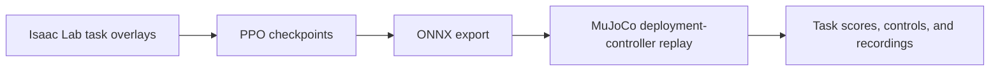

# Humanoid Robustness Ladder

**Train in Isaac Lab. Measure task success in MuJoCo. Keep the controls and failures visible.**

I built evaluation infrastructure around [Berkeley Humanoid Lite](https://github.com/HybridRobotics/Berkeley-Humanoid-Lite): PPO task overlays, sensor checks, checkpoint gates, shared-world missions, and Slurm experiments. The goal is to explain which policies work, where they fail, and whether a change survives a controlled comparison.

[Portfolio](https://jose-sanchez-portfolio-com.vercel.app/projects/bhl-robustness-ladder/) · [Technical report](docs/REPORT.md) · [Findings](docs/FINDINGS.md) · [All demos](docs/GALLERY.md)

[](docs/RANDOM_MAZE.md)

*Learned gait, scripted A* on a lidar-built map, oracle pose and goal. Stereo, optical-flow, and IMU overlays in this clip are display only. Playback is accelerated; aggregate results are linked below.*

## Problem and approach

Training reward can improve while transfer or task completion gets worse. I train locomotion policies in Isaac Lab, export ONNX, and score selected checkpoints in headless MuJoCo using upstream's deployment controller. Versioned tasks, sensor validity checks, physics-step contact scoring, and predeclared gates separate a successful experiment from a job that merely completed.

## October 7: reproducible evaluation results

[Resume project sections](docs/resume-results-20261007/resume-projects.pdf) ·
[Methods, evidence and limits](docs/resume-results-20261007/revamp-report.pdf)

The saved October 6 confirmation contains **3,600 locomotion episodes** across
five randomization settings and three training seeds. Default randomization
records **0/360 flat falls** versus **77/360** without randomization, and
**13/360 disturbed falls** versus **341/360**. The flat replication gate passed;
push results are descriptive. [Locomotion verdict](campaigns/20261006-confirmatory/results/dr_verdict.json).

The separate **384-episode** navigation confirmation retained its **NEGATIVE**
zero-fall verdict: learned navigators meet the goal-count thresholds, but record
six falls across 288 learned-actor episodes. The matched A* control records zero
falls in 96 episodes. [Navigation verdict](campaigns/20261006-confirmatory/results/verdict.json).
These saved artifacts were verified for the revamp rather than rerun. Shared
layouts and reset seeds are clustered observations; navigation uses oracle pose
and goal. Earlier cohorts below remain their historical records.

## Measured results

- **Randomization versus transfer:** the 12-DoF biped without randomization falls in 21/90 MuJoCo episodes; the default setting falls in 0/90. Each setting covers three trained policies, six commands, and five evaluation seeds. Training reward ranks them differently. [Protocol](docs/REPORT.md#1--domain-randomization-the-fidelity-ladder) · [Aggregate CSV](results/flat_summary.csv)
- **Unknown-maze navigation:** the biped reaches 24/24 mazes across 5×5 and 6×6 layouts, with no falls or wall contacts. One qualified 22-DoF humanoid checkpoint reaches 12/12 fresh 6×6 layouts. Both use learned gaits, scripted mapping/planning, and oracle pose and goal. [Study](docs/RANDOM_MAZE.md) · [Humanoid scores](results/maze-humanoid-20260928/humanoid-hard-6x6/summary.json)
- **Sensor-dropout stress test:** at 35% lidar packet dropout, 12/12 hard mazes reach the goal; 11/12 have no wall contacts. This is a separate condition, not an extension of the clean nominal result. [Scores](results/maze-robust-20260926/dropout35-hard-6x6/summary.json)
- **Learned navigation without a planner:** a PPO navigator trained in a 2-D gym (lidar, a visitation memory, and a coarse map) drives the biped to 11/12, 12/12, and 12/12 fresh 6×6 mazes across three training seeds, with no falls; the bar, set before the runs, was 10/12 each. Scripted A* reaches 12/12 on the same mazes. Learned gait and navigator, oracle pose and goal. [Transfer verdict](results/navgym-v5-transfer-20261002/verdict.json) · [Gym verdict](results/navgym-v5-20261002/verdict_v5.json)

These are simulation results. They do not establish hardware locomotion or learned-policy transfer to a physical robot. My [Quest arm teleoperation](https://github.com/joses2017smjh/quest-vr-teleop) is a separate hardware project.

## Latest study: turning gait, October 2

Putting a gait clock in the policy input enables turning across three training seeds. Only one seed also passes the unchanged straight-walk and push qualification; the recipe requires two of three, so it **fails**. The critic-only clock control qualifies zero of three. [Actor-clock verdict](results/repo-gpu-20260923/turngait-r12-20261001/verdict/R1.json) · [Critic-only verdict](results/repo-gpu-20260923/turngait-r12-20261001/verdict/R2.json)

Plate crossing, cooperative carry, and standing placement remain incomplete or negative. The [status ledger](docs/STATUS.md) records their mechanisms and next tests. Earlier invalid findings remain identified in the [findings ledger](docs/FINDINGS.md).

## Architecture and decisions


```mermaid
flowchart LR
  A[Isaac Lab task overlays] --> B[PPO checkpoints]
  B --> C[ONNX export]
  C --> D[MuJoCo deployment-controller replay]
  D --> E[Task scores, controls, and recordings]
```

- `src/bhl_robust/tasks/`: task, observation, reward, and curriculum configurations.
- `src/bhl_robust/eval/`: MuJoCo assembly, replay, sensing, and scoring.
- `scripts/bench/`: checkpoint and task gates; `slurm/`: experiment launchers.
- `results/` and `SLURM_JOBS.md`: committed score artifacts and experiment provenance.

Ray-cast depth provides a cheap geometric baseline; it is not calibrated physical stereo. Separate Isaac 5.1 and 6.0 stacks preserve older results while testing newer rendering. Frozen checkpoint qualification avoids promoting a training run on reward alone. Oracle state simplifies diagnosis but limits claims about autonomous navigation.

## Portable simulation regression replay

[Measured replay results](results/resume-revamp-20261007/replay_report.json) ·
[Raw timing samples](results/resume-revamp-20261007/policy_timing.csv) ·
[Navigation pilot](results/resume-revamp-20261007/navigation_development.json)

The October 7 revamp packages an actual trained **12-DoF biped** checkpoint,
upstream controller, deployment configuration, MJCF and referenced meshes with
30 file hashes and pinned runtime versions. A relocated bundle ran from `/tmp`
with `PYTHONPATH` unset; it uses no Isaac installation or GPU inference.

Five seeded nominal trajectories reproduced exactly on the same host, and
**40/40 injected sensor, action and contact-scoring regressions** were detected.
A changed trajectory is a regression relative to the reference; these gates do
not establish safe behavior under faults or cross-host determinism.

The speedup below compares cached versus uncached added validators; it does not measure faster ONNX inference or the original unguarded controller.

Caching immutable validation limits preserves **208/208** tested decisions and
reduces median observation/inference/validation time **49–69%** in two
counterbalanced 5,000-call comparisons. A separate 10,000-call warm measurement
reports **p99 1.09 ms**, max 16.28 ms and **0 observed misses** against the
configured **40 ms policy period** on an Intel Xeon Platinum 8480CL host. Physics,
networking, startup and real-time scheduling are excluded; the lower-level
4 ms control deadline is outside this measurement.

```bash
# Supply an actual 12-DoF, no-history deployment and its upstream assets.
PYTHONPATH=src python scripts/bench/sim_regression.py \
  --deploy path/to/deploy.yaml --checkpoint path/to/policy.onnx \
  --upstream path/to/Berkeley-Humanoid-Lite --out /tmp/bhl-replay-bundle
OMP_NUM_THREADS=1 OPENBLAS_NUM_THREADS=1 MKL_NUM_THREADS=1 \
  python /tmp/bhl-replay-bundle/replay.py --bundle /tmp/bhl-replay-bundle \
  --out /tmp/bhl-replay-results --calls 10000
```

The builder refuses missing models; replay verifies source, asset and runtime
hashes before physics. Output directories cannot be reused. This integration
suite complements the existing unit tests. A manual CI template is available at
[`ci/replay-workflow.yml.example`](ci/replay-workflow.yml.example); its artifact
intake passed local checks, and the workflow has not been executed on GitHub. Bundle generation and relocation
were tested with the existing environment; a fresh dependency installation and
GitHub-hosted execution remain unverified.

The separate fresh navigation pilot evaluated the existing yaw filter on one
actor, two layouts and two sensing conditions (**8 episodes**). Both baseline and
candidate reached **2/4** goals with no falls; command flip rates fell about
**53%**. This establishes reduced chatter in the pilot, without establishing a
goal-success or fall-rate improvement. The consumed layouts are development data.

The measured frozen bundle is included at
[`results/resume-revamp-20261007/portable-bundle.zip`](results/resume-revamp-20261007/portable-bundle.zip).
Its SHA256 is `10c37e8749792330dcc52293bc2a14c2f766688326619c7ad0eef60250f51b08`.
It contains the trained checkpoint, relative asset paths, source hashes and
upstream license. Follow the archive's `USAGE.txt` in a compatible Python 3.11
environment. Its frozen source is the measured artifact; a newly built bundle
from this publication checkout has its own source fingerprints.

Local measurement-checkout testing returned **2,105 passed, two stale assertion
failures, three skipped**. The two assertions were corrected and their affected
tests passed; the full suite was not rerun. These are historical measurement
receipts, rather than a full-suite certification of this publication checkout.
[Receipt](results/resume-revamp-20261007/final_validation.json).

This publication checkout separately passed both changed tests and all nine
actual-asset integration checks using a freshly built bundle.
[Publication validation](results/resume-revamp-20261007/publication_validation.json).

## Setup and testing

This is an HPC research workspace. Policies and shared environments referenced by absolute paths in result JSON are not public downloads. A clean clone is not a ready-to-run robot package. See [reproducibility requirements](docs/REPRODUCIBILITY.md).

```bash
git clone --recurse-submodules https://github.com/joses2017smjh/bhl-robustness-ladder.git
cd bhl-robustness-ladder
# Adapt account, partition, and paths in slurm/_env.sh before submission.
sbatch slurm/00_build_container.sbatch
sbatch slurm/01_uv_sync.sbatch
sbatch slurm/02_smoke_train.sbatch
```

Those launchers describe the original Isaac Sim 5.1 / Isaac Lab 2.3.2 stack. The parallel 6.0 / 3.0 campaign needs its own environment. The smoke gate checks that training advances and episodes last beyond the first step.

In a compatible CPU environment with required upstream assets and dependencies:

```bash
PYTHONPATH=src python -m pytest -q tests
```

CPU tests check logic and artifact contracts. GPU integration gates and saved physics evaluations establish task performance; neither substitutes for the other.

**Stack:** Python, PyTorch, Isaac Lab/Sim, MuJoCo, ONNX Runtime, Warp, rsl-rl, Slurm, Apptainer, uv.

## Attribution and license

The robot design and deployment controller come from Berkeley Humanoid Lite; this repository adds experiments and evaluation infrastructure. No repository-level license is currently provided. Upstream code, models, and external assets retain their respective licenses.
