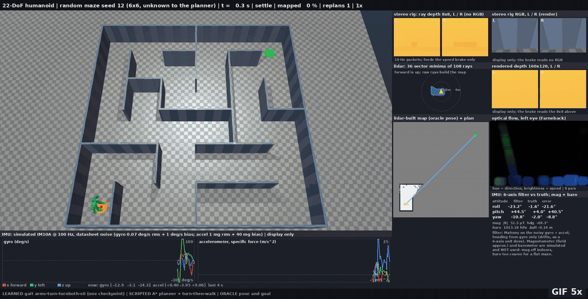
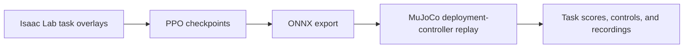

# Humanoid Robustness Ladder

**Train in Isaac Lab. Measure task success in MuJoCo. Keep the controls and failures visible.**

I built evaluation infrastructure around [Berkeley Humanoid Lite](https://github.com/HybridRobotics/Berkeley-Humanoid-Lite): PPO task overlays, sensor checks, checkpoint gates, shared-world missions, and Slurm experiments. The goal is to explain which policies work, where they fail, and whether a change survives a controlled comparison.

[Portfolio](https://jose-sanchez-portfolio-com.vercel.app/projects/bhl-robustness-ladder/) · [Technical report](docs/REPORT.md) · [Findings](docs/FINDINGS.md) · [All demos](docs/GALLERY.md)

[](docs/RANDOM_MAZE.md)

*Learned gait, scripted A* on a lidar-built map, oracle pose and goal. Stereo, optical-flow, and IMU overlays in this clip are display only. Playback is accelerated; aggregate results are linked below.*

## Problem and approach

Training reward can improve while transfer or task completion gets worse. I train locomotion policies in Isaac Lab, export ONNX, and score selected checkpoints in headless MuJoCo using upstream's deployment controller. Versioned tasks, sensor validity checks, physics-step contact scoring, and predeclared gates separate a successful experiment from a job that merely completed.

## Measured results

- **Randomization versus transfer:** the 12-DoF biped without randomization falls in 21/90 MuJoCo episodes; the default setting falls in 0/90. Each setting covers three trained policies, six commands, and five evaluation seeds. Training reward ranks them differently. [Protocol](docs/REPORT.md#1--domain-randomization-the-fidelity-ladder) · [Aggregate CSV](results/flat_summary.csv)
- **Unknown-maze navigation:** the biped reaches 24/24 mazes across 5×5 and 6×6 layouts, with no falls or wall contacts. One qualified 22-DoF humanoid checkpoint reaches 12/12 fresh 6×6 layouts. Both use learned gaits, scripted mapping/planning, and oracle pose and goal. [Study](docs/RANDOM_MAZE.md) · [Humanoid scores](results/maze-humanoid-20260928/humanoid-hard-6x6/summary.json)
- **Sensor-dropout stress test:** at 35% lidar packet dropout, 12/12 hard mazes reach the goal; 11/12 have no wall contacts. This is a separate condition, not an extension of the clean nominal result. [Scores](results/maze-robust-20260926/dropout35-hard-6x6/summary.json)

These are simulation results. They do not establish hardware locomotion or learned-policy transfer to a physical robot. My [Quest arm teleoperation](https://github.com/joses2017smjh/quest-vr-teleop) is a separate hardware project.

## Latest study: turning gait, October 2

Putting a gait clock in the policy input enables turning across three training seeds. Only one seed also passes the unchanged straight-walk and push qualification; the recipe requires two of three, so it **fails**. The critic-only clock control qualifies zero of three. [Actor-clock verdict](results/repo-gpu-20260923/turngait-r12-20261001/verdict/R1.json) · [Critic-only verdict](results/repo-gpu-20260923/turngait-r12-20261001/verdict/R2.json)

Plate crossing, cooperative carry, and standing placement remain incomplete or negative. The [status ledger](docs/STATUS.md) records their mechanisms and next tests. Earlier invalid findings remain identified in the [findings ledger](docs/FINDINGS.md).

## Architecture and decisions


```mermaid
flowchart LR
  A[Isaac Lab task overlays] --> B[PPO checkpoints]
  B --> C[ONNX export]
  C --> D[MuJoCo deployment-controller replay]
  D --> E[Task scores, controls, and recordings]
```

- `src/bhl_robust/tasks/`: task, observation, reward, and curriculum configurations.
- `src/bhl_robust/eval/`: MuJoCo assembly, replay, sensing, and scoring.
- `scripts/bench/`: checkpoint and task gates; `slurm/`: experiment launchers.
- `results/` and `SLURM_JOBS.md`: committed score artifacts and experiment provenance.

Ray-cast depth provides a cheap geometric baseline; it is not calibrated physical stereo. Separate Isaac 5.1 and 6.0 stacks preserve older results while testing newer rendering. Frozen checkpoint qualification avoids promoting a training run on reward alone. Oracle state simplifies diagnosis but limits claims about autonomous navigation.

## Setup and testing

This is an HPC research workspace. Policies and shared environments referenced by absolute paths in result JSON are not public downloads. A clean clone is not a ready-to-run robot package. See [reproducibility requirements](docs/REPRODUCIBILITY.md).

```bash
git clone --recurse-submodules https://github.com/joses2017smjh/bhl-robustness-ladder.git
cd bhl-robustness-ladder
# Adapt account, partition, and paths in slurm/_env.sh before submission.
sbatch slurm/00_build_container.sbatch
sbatch slurm/01_uv_sync.sbatch
sbatch slurm/02_smoke_train.sbatch
```

Those launchers describe the original Isaac Sim 5.1 / Isaac Lab 2.3.2 stack. The parallel 6.0 / 3.0 campaign needs its own environment. The smoke gate checks that training advances and episodes last beyond the first step.

In a compatible CPU environment with required upstream assets and dependencies:

```bash
PYTHONPATH=src python -m pytest -q tests
```

CPU tests check logic and artifact contracts. GPU integration gates and saved physics evaluations establish task performance; neither substitutes for the other.

**Stack:** Python, PyTorch, Isaac Lab/Sim, MuJoCo, ONNX Runtime, Warp, rsl-rl, Slurm, Apptainer, uv.

## Attribution and license

The robot design and deployment controller come from Berkeley Humanoid Lite; this repository adds experiments and evaluation infrastructure. No repository-level license is currently provided. Upstream code, models, and external assets retain their respective licenses.
