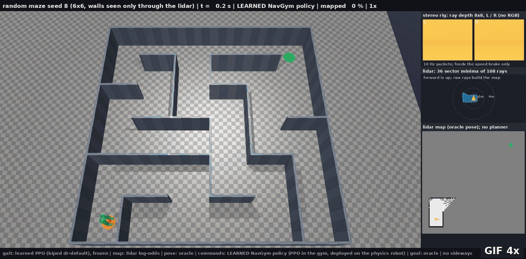
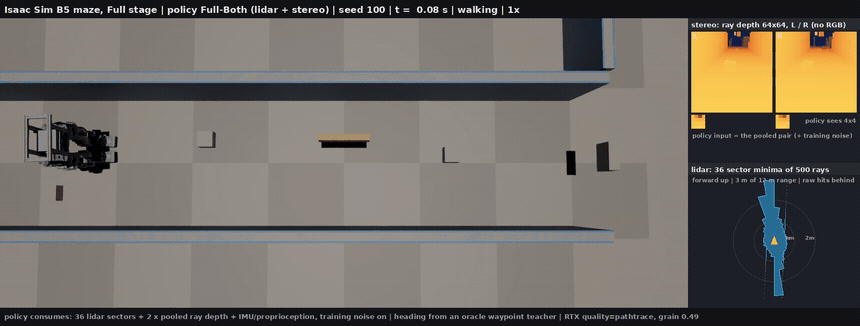
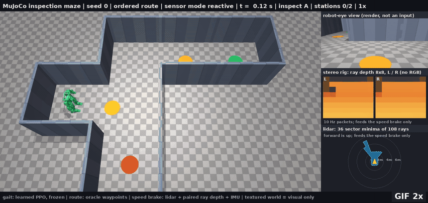
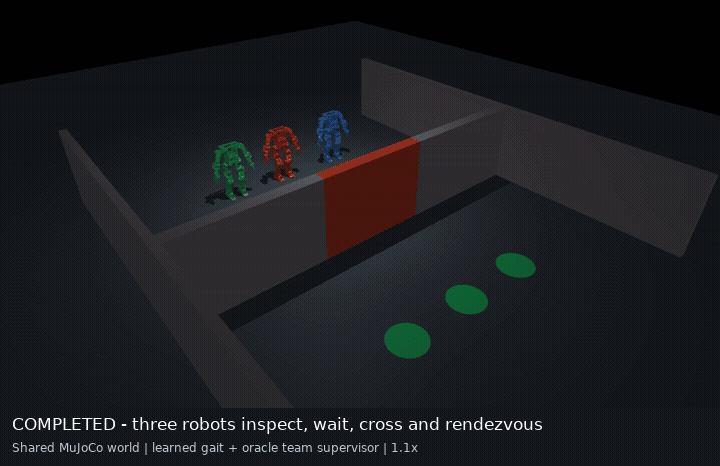
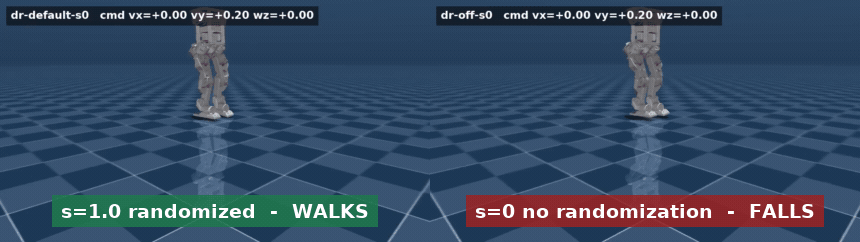
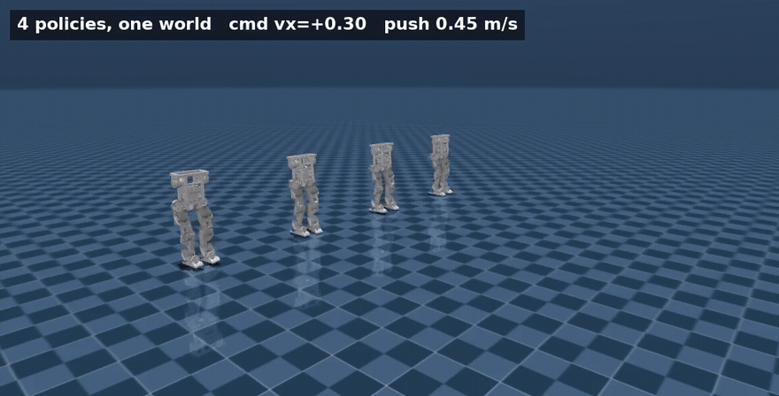
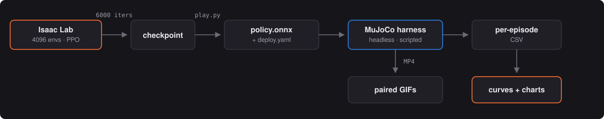

# bhl-robustness-ladder

**Robot-learning experiments with checks that distinguish task success from a job that merely ran.**

Train Berkeley Humanoid Lite policies in Isaac Lab, evaluate selected gaits in
MuJoCo, and record checkpoints, task scores, negative controls and failures.
My contribution is the infrastructure around the upstream robot: curricula,
sensor adapters, shared-world missions and Slurm evaluation gates.

Jose Sanchez · MS Artificial Intelligence, Oregon State ·
[portfolio](https://jose-sanchez-portfolio-com.vercel.app) ·
[findings](docs/FINDINGS.md) ·
[gallery](docs/GALLERY.md) ·
[sanchej7@oregonstate.edu](mailto:sanchej7@oregonstate.edu)

Seeking robotics ML / simulation engineering roles. Python · PyTorch · Isaac
Lab · MuJoCo · ONNX · Slurm/HPC.

[Results, September 20](docs/WEEKEND_RESULTS_2026-09-20.md) ·
[Root causes and tests, October 1–2](docs/SOLUTIONS_2026-10-01.md) ·
[Reproduce and inspect](docs/REPRODUCIBILITY.md) ·
[Architecture](#architecture) · [Job ledger](SLURM_JOBS.md) · [Roadmap and stretch goals](docs/ROADMAP.md)

<p align="center">
  <a href="docs/gifs/random-maze-humanoid-sensors.gif"></a><br>
  <sub>The 22-DoF humanoid in a maze it has never seen: a new maze every seed, so the route cannot be memorized. Learned gait
  (one qualified turning checkpoint); scripted A* on a map the robot builds from its own lidar; it turns in place, then walks forward.
  Oracle pose and goal. <b>12/12</b> never-seen hard mazes, no falls, no wall contact; the 12-DoF biped runs the same mission at <b>24/24</b>.
  Right-hand column and IMU strip are <b>display only</b>: stereo RGB, rendered depth, optical flow and a simulated
  IM10A IMU with datasheet noise. Click for full size &middot;
  <a href="docs/gifs/random-maze-explore-sensors.gif">biped version</a> &middot; <a href="docs/RANDOM_MAZE.md">tables and stress tests</a></sub>
</p>

## Highlights

<table>
  <tr>
    <td width="50%" align="center">
      <br>
      <sub><b>Exploratory.</b> The planner is replaced by a PPO navigation policy trained in a 2-D gym and deployed unchanged on the physics biped (no planner in the loop; oracle pose and goal).
      <b>10/12</b> never-seen 6×6 mazes, 0 falls (A*: 12/12); the policy missed its predeclared gym bar by one clause, and this clip's maze is inside its training-seed range.</sub>
    </td>
    <td width="50%" align="center">
      <br>
      <sub>Isaac Sim: a learned PPO policy that reads its own 36 lidar sectors and pooled ray depth (no RGB) reaches the button; oracle waypoint heading.
      This checkpoint <b>32/32</b>, all 12 checkpoints <b>380/384</b> with training observation noise on. Blind policies score 95/96, so this is not a sensor-benefit claim.</sub>
    </td>
  </tr>
  <tr>
    <td width="50%" align="center">
      <br>
      <sub>Two ordered inspection stops and the exit of a two-turn maze, with the lidar and ray depth that drive its speed brake. Learned gait, oracle waypoints. <b>3/3</b>; both failure controls <b>0/3</b> (<a href="docs/gifs/weekend-inspection-failure.gif">wrong-branch control</a>).</sub>
    </td>
    <td width="50%" align="center">
      <br>
      <sub>Three robots in one world: inspect, wait, cross the airlock, rendezvous. Learned gait, oracle team supervisor. <b>5/5</b>; both controls <b>0/5</b>.</sub>
    </td>
  </tr>
  <tr>
    <td width="50%" align="center">
      <br>
      <sub>Isaac-trained PPO, scored in MuJoCo. The highest-training-reward policy (right, no randomization) falls in <b>21/90</b> episodes; the default randomization <b>0/90</b>.</sub>
    </td>
    <td width="50%" align="center">
      <sub><a href="docs/GALLERY.md">Every clip, successes and failures</a> ·
      <a href="docs/STATUS.md">status of every workstream, negatives included</a> ·
      <a href="SLURM_JOBS.md">job ledger with predeclared rules</a></sub>
    </td>
  </tr>
</table>

<sub>Learned = PPO policy, frozen at evaluation. Scripted = hand-written planner or supervisor.
Oracle = simulator ground truth (pose, goal, waypoints) given to the controller.</sub>

## Latest measured results

| Experiment | Evidence | Boundary |
|---|---|---|
| Turning gait with a gait clock (Oct 2) | Clock as a policy input: **every seed turns in place** (18/18 turns from a settled stand, 0 falls; 28/30 on fresh seeds). **1 of 3 qualifies**, the second qualified turning checkpoint overall; the other two drift more than 15° on straight walks, so the predeclared recipe rule (2 of 3) **fails**. Same clock in the critic only: **0 of 3** seeds turn | LEARNED gait, MuJoCo gates; a single qualified checkpoint, not a reliable recipe ([R1](results/repo-gpu-20260923/turngait-r12-20261001/verdict/R1.json), [R2](results/repo-gpu-20260923/turngait-r12-20261001/verdict/R2.json)) |
| Mission 7 plate crossing (Oct 2) | Both predeclared crossing plans **negative**: bench v1 **8/64** clears, 8 falls (26 lost in the bench's own run-up); run-up-free bench v2 with turn-while-stepping **16/41**, 5 falls, wall contact in 30/41, 180° entries **0/8** (pass needs ≥ 39/41) | LEARNED shipped gait, SCRIPTED stage controller, ORACLE layout and plate pose ([v1](results/mission7-campaign-20260923/m2-plate-bench/verdict.json), [v2](results/mission7-campaign-20260923/m3-plate-bench-v2/verdict.json)) |
| Cooperative carry with flush hand pads (Oct 2) | Probe **negative**: the cube still rolls in the hands; 0/5 seeds stay within 0.35 rad (peak tilt 0.70–0.74 rad), so the scored stage did not run. Reading, not a gate: the unchanged lift-and-hold rule passes **5/5** (stock hands: 0/10) | LEARNED gait, SCRIPTED arms, ORACLE cube pose for scoring only; modified end-effector, not the stock robot ([verdict](results/coop-flushpad-20261002/probe/verdict.json)) |
| Learned navigation, map updated at each lidar packet's capture pose (Oct 1) | **Negative**: weaker actor 15 → 17/24 mazes (needed net +4), stronger actor 23 → 23/24; 0 falls, fewer wall contacts; the fix stays opt-in | LEARNED gait and NavGym v4 actors; ORACLE pose and goal ([verdict](results/navgym-v4-capture-pose-20261001/screen/verdict.json)) |
| In flight (Oct 2) | Standing cube-to-shelf with a roll-proof lift reward (2 seeds); NavGym v5 navigator with a visit map (3 seeds), then physics transfer on 12 never-seen mazes | Rules predeclared in the [job ledger](SLURM_JOBS.md) before any run |
| Randomized-maze mission (Sept 24–28) | **24/24** unseen mazes, 0 falls, 0 wall contacts; 6×6 at 35 % packet dropout: **12/12** reached, 11 clean; 22-DoF humanoid (one qualified turning checkpoint) **12/12** never-seen 6×6, 0 falls | Learned gait, scripted A* on the robot's own lidar map, oracle pose and goal; MuJoCo only |
| Learned navigation on the physics biped (Sept 27) | **10/12** never-seen 6×6 mazes, 0 falls (A* 12/12) | Exploratory: the gym policy missed its predeclared held-out bar by one clause; oracle pose and goal |
| Turning gait, cooperative lift, standing cube-to-shelf (Sept 27) | Turning: 1 of 12 seeds qualifies; scripted lift-and-hold **0/10**; standing policy stands but never places | Negatives, recorded with their mechanisms in [status](docs/STATUS.md) |
| Repaired goal-reaching PPO | **379/384** final-stage first episodes; 4 sensor conditions × 3 seeds × 32 envs; all 36 curriculum jobs completed | 12-DoF biped, fixed corridor, oracle waypoints, observation noise disabled; not a sensor-benefit claim |
| Two-turn inspection mission | **3/3** nominal; **0/3** wrong-branch and **0/3** complete-outage controls | 22-DoF MuJoCo humanoid; known map/pose and frozen gait |
| Two-/three-robot airlock | **5/5** each; both negative controls **0/5** each | One physical world, explicit synchronization; no carrying or newly trained MARL |
| Dual-arm cloth folding | Baseline short pants **8/24**, adapted seed 1 **3/24**; only **5/12** evaluation cells completed | No demonstrated adaptation improvement; remaining cells failed/timed out; not humanoid folding |

[Raw result report](results/weekend-20260919/SUMMARY.md) ·
[Protocols and limits](docs/WEEKEND_CAMPAIGN.md) ·
[Cloth diagnosis](docs/CLOTH_FOLDING_WEEKEND.md).

---

## Problem, solution, result

| | |
|---|---|
| **Problem** | High training reward can hide task failure or poor transfer to another physics engine. |
| **Solution** | Train in Isaac Lab (PhysX, 4,096 envs). Export ONNX. Score with upstream's own `RlController` in headless MuJoCo — bit-identical observations to the sim2real path. |
| **Contribution** | Versioned tasks, checkpoint-gated curricula, sensor validity checks, physics-step contact scoring and an auditable job ledger. |
| **Result** | Transfer **inverts** the training-reward ranking. Highest training reward falls **23%** in MuJoCo; the repo-default randomization falls **0%**. |

Training and evaluation use different simulators **on purpose**.

---

## Case studies

Each row is a short visual argument. The numbers live in
[docs/FINDINGS.md](docs/FINDINGS.md); every clip is in
[docs/GALLERY.md](docs/GALLERY.md).

### 1 · Domain randomization vs transfer

<p align="center">
  <br>
  <sub>Identical 0.45 m/s shoves. The un-randomized robot is the one on the ground.</sub>
</p>

A single scale `s` rewrites every range in upstream's `EventsCfg`. `s = 0` wins
training by 49% and loses transfer outright. Fall rate has a knee; upstream's
shipped default sits on the last rung before it.

### 2 · Depth without a renderer

Isaac Sim 5.1's RTX renderer segfaults on this cluster. Geometric depth never
needed it: `RayCasterCamera` costs **1.6%** of throughput at 4,096 envs, 2.9%
mean error vs closed-form floor geometry. On rough terrain, looking ahead raises
the curriculum; a privileged height map of the ground underfoot does not.

A later "depth helps on invisible ice" result is **retracted**: the friction
patches spawned a median 72 m from the robots. 4.4% could reach one in an
episode. The +10.6% was §6's rough-terrain depth gain again.

### 3 · Arms on a real floor

No 12-DoF biped finishes the lab course upright; three of four fall on a
**2.5 cm cable** (9% of leg length). Two of four 22-DoF policies clear it. At
terrain `d = 1.0` the humanoid falls **11.7%** where the biped falls **37.8%**.
Arms buy recoverable perturbation, not a higher step — and one recipe is *worse*
with arms.

### 4 · Cloth sorting, after the first scene was unreachable

The garment sat 0.74 m away; fingertips reach 0.28 m forward; in Isaac the robot
faced the other way. Redesigned inside a measured IK table. The shipped hands
had no colliders. Bare 4 Nm PD lagged 65–72 mm; inverse-dynamics feedforward
through the same drive tracks 1.4–1.6 mm.

**The free-standing robot sorts 22 of 24 rigid proxies, no falls** (shirt 6/8,
sock 8/8, jacket 8/8). One 8×8 Newton shirt on a pinned base sorts 4/4 under
one-way coupling. Two-way coupling goes NaN when the hand pushes the cloth.

---

## Results at a glance

**Where it wins**

| | |
|---|---|
| Domain randomization | blind policy holds to terrain difficulty d≈0.4; randomized arms reach d≈0.6 |
| Low-res cloth | **467 env-steps/s** at 81 vertices vs G-C1's 182 at 961 — 2.6× while carrying 3× the DoF |
| Depth on low friction | final curriculum level **0.65 vs 0.26** blind — 3 seeds, no overlap |
| Ray-cast depth cost | **1.6%** of throughput at 4,096 envs, 2.9% mean error vs closed form |
| Restoring the grippers | mean episode length **6.3 → 427.7** steps, 6 cells a side |
| Free-standing sort | **22 of 24** rigid proxies, no falls |

**Where it loses**

| | |
|---|---|
| Cooperative lift | best rollout is 7.8 cm; the pair drops 41 cm before touching the cube |
| Plank task | 0.0 cm across 18 seeds — contact points exceed the shoulder span |
| Vision on the lift | depth-conditioned policies fall in almost every episode; blind ones do not |
| Earlier manipulation tasks | **zero** success on the three tested two-robot object tasks, gripper included; separate from successful airlock navigation |
| Stereo on terrain | **retracted** — cameras were written `(w, x, y, z)`, Isaac Lab 3.0 reads `(x, y, z, w)`. Pointed down, 4×4 stereo **1.29** vs blind 0.74 |
| Depth on invisible hazards | **retracted** — ice spawned 72 m away |
| Limb factorisation | **did not replicate** — +11% on the mean at n=3, not +47% |
| Historical Isaac spawn | Earlier coop/TaskV2 runs spawned under the floor; quaternion conversion is now corrected. This does not retroactively validate those runs. |

Four findings are retractions of earlier claims here. They stay in: a repo whose
argument is that the measurement was wrong cannot quietly fix its own
measurements.

---

## Quickstart

Isaac Sim needs a GPU and ~30 GB. These batch scripts contain **Oregon
State-specific paths, account and partition settings**; adapt them before
submission elsewhere. They describe the original v51 setup, not the parallel
v60 campaign environment. See [requirements](docs/REPRODUCIBILITY.md).

```bash
git clone --recurse-submodules https://github.com/joses2017smjh/bhl-robustness-ladder.git
cd bhl-robustness-ladder
sbatch slurm/00_build_container.sbatch    # apptainer image, ~4 min
sbatch slurm/01_uv_sync.sbatch            # Isaac Lab 2.3.2 + deps, ~45 min, ~30 GB
sbatch slurm/02_smoke_train.sbatch        # 3 iterations; fails loudly if the stack is broken
```

`02` is the gate. It asserts a training iteration was logged **and** that mean
episode length exceeds 2 — a task where every episode ends on its first step
reports healthy iteration counts and learns nothing, which cost nine GPU-days
here before the check existed.

Scoring a trained policy needs no GPU:

```bash
python scripts/bench/coop_sim2sim.py --run-dir <run> --upstream external/Berkeley-Humanoid-Lite \
    --cache-dir /tmp/mjcf --seeds 8 --crews 2 3 4
```

What is running, and which Slurm id produced which number:
[SLURM_JOBS.md](SLURM_JOBS.md).

## Testing and engineering decisions

The full CPU suite passes **1,252 tests**, 1 skipped (Slurm job `21509357`, October 2):

```bash
PYTHONPATH=src python -m pytest -q tests
sbatch slurm/repo20260923/cpu_pytest_full.sbatch   # the same suite as a 16 GB CPU job
```

Unit tests do not certify Isaac rendering or learned task performance. Those
require separate GPU/physics gates and their saved JSON results.

- Keep legacy task IDs unchanged; corrected maze tasks are versioned.
- Promote only the exact checkpoint that passed a separate task evaluation.
- Use ray depth for cheap geometric baselines; real stereo matching remains a
  separate calibrated component, not a claim of deployed perception.
- Record negative controls and invalid observations. Training loss, surviving
  to timeout and Slurm `COMPLETED` are not task-success metrics.
- Use RTX/A40 hardware for the tested rendering path, H100/V100 for compatible
  learning workloads, and CPUs for MuJoCo scoring.

## Architecture

<p align="center">
  
</p>

| component | role |
|---|---|
| `src/bhl_robust/tasks/` | Isaac Lab env configs — terrain, push, depth, RGB, cooperative lift, cloth-sort |
| `src/bhl_robust/cloth/` | Isaac-free cloth-sort core: garments, sweep primitive, kinematic C0–C5, cost gate |
| `src/bhl_robust/eval/` | MuJoCo replay: MJCF patching, crew assembly, scoring, video |
| `src/bhl_robust/curricula/` | push and terrain-level curricula upstream lacks |
| `scripts/bench/` | gates. Each answers one question and refuses a verdict without a control |
| `slurm/` | job scripts; `inner/` holds what runs inside the container |

The MuJoCo harness drives the policy through upstream's own `RlController`, so
observation construction is bit-identical to the sim2real deployment path.

## Stack

- Isaac Lab 2.3.2 / Isaac Sim 5.1 (PPO, 4,096 envs) — and a parallel Isaac Lab 3.0 / Isaac Sim 6.0 stack for RGB, because 5.1's RTX renderer segfaults on this cluster
- MuJoCo 3.x — scoring, replay, video
- rsl-rl 3.0.1 (v51) / 5.0.1 (v60); skrl 1.4.3 for MAPPO and IPPO
- PyTorch 2.7, Warp, ONNX Runtime
- Apptainer, Slurm, `uv`

## License

No repository-level license file is currently provided. Upstream BHL retains
its own license under `external/`; external assets and models retain theirs.
