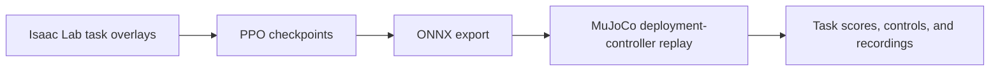

# Humanoid Robustness Ladder

**Train in Isaac Lab. Measure task success in MuJoCo. Keep the controls and failures visible.**

I built evaluation infrastructure around [Berkeley Humanoid Lite](https://github.com/HybridRobotics/Berkeley-Humanoid-Lite): PPO task overlays, sensor checks, checkpoint gates, shared-world missions, and Slurm experiments. The goal is to explain which policies work, where they fail, and whether a change survives a controlled comparison.

[Portfolio](https://jose-sanchez-portfolio-com.vercel.app/projects/bhl-robustness-ladder/) · [Technical report](docs/REPORT.md) · [Findings](docs/FINDINGS.md) · [All demos](docs/GALLERY.md)

[Current open tasks and October 8 closures](docs/TASK_CLOSURE_2026-10-08.md)
tracks completed deliverables, negative experiments and remaining objectives.

**October 10 research implementation:** [native map recovery, stereo–IMU, terrain control, sensor-fault/fusion comparisons and perceptive PPO](docs/RESEARCH_METHODS_2026-10-10.md) now have executable experiments and retained smoke evidence. Full development campaigns are queued or running; their planned counts are not completed results. Native stereo–IMU initialization and the first full terrain teacher already have measured negative outcomes. The report maps each implementation to the original six follow-ups.

**October 8:** [H1 navigation confirmation passes](docs/H1_NAVIGATION_CONFIRMATION_2026-10-08.md)
all three actors' frozen gates across **576 episodes**: **259/288** candidate
goals versus **247/288** baseline, **0 versus 9** observed falls, and **51.5%**
lower mean yaw-command sign-flip rate. This is a matched 12-DoF biped simulation
study with oracle pose/goal.

**H3/H4 final reports:** the [22-DoF H4 R1HO recipe passes all three seeds](docs/H3_H4_CAMPAIGN_2026-10-08.md): **30/30 qualification turns**, **9/9 straight walks**, with push falls **8/60, 9/60 and 8/60**. These are independently seeded fine-tunes of one parent, evaluated with simulator yaw. The matched IMU-history ablation completed **720 episodes** and is **NEGATIVE**: **0/3** seed pairs show the required gain at 80 ms delay. [Final evidence](results/h34-campaign-20261008/README.md).

**Stereo–lidar pilot completed:** [72 simulated stereo pairs across three scenes](docs/SENSOR_PILOT_RESULTS_2026-10-08.md), with actual pretrained C-Fast-FoundationStereo GPU inference, five fusion arms, 3D terrain maps, and estimator-input exports. On the single held-out scene, common-mask depth RMSE is **0.310 m SGBM versus 0.147 m C-FFS**; warm decode-plus-inference p95 is **29.0 versus 92.6 ms**. Confidence gating does not meet the proposed fusion improvement target. [Measured demo](results/sensor-campaign-20261008/demo/stereo-lidar-demo.png) · [Implementation and follow-up queue](docs/SENSOR_CAMPAIGN_2026-10-08.md).

**October 9 measured follow-up:** [native FAST-LIO2 replay passes all three scene gates](docs/NATIVE_CAMPAIGN_RESULTS_2026-10-09.md), with **1.04–1.96 cm aligned ATE RMSE** and **10.10–10.86 ms native compute p95** on short ideal simulated recordings. Native LiDAR–IMU pose drives a frozen **12-DoF learned gait to 9/9 clean goals**, with **zero falls or contacts**, across three routes and three development seed groups; measured estimator latency enters the controller. The **18-episode blind terrain qualification screen is negative**: 3 clean goals, 15 side-wall contacts, zero qualified actors and zero confirmation episodes. Native ORB-SLAM3 replay is **NEGATIVE overall (1/3 scene gates)**: two scenes never initialize, while the held-out ramp/step scene passes with 0.44 cm aligned ATE and 48.60 ms compute p95. Stereo-pose navigation is **NEGATIVE: 1/9 clean goals**, zero falls/contacts; six episodes change native map IDs and trigger the declared stop. [Native replay plot](results/native-campaign-20261009/lio-replay-v4/replay-observer/actual-native-replay.png) · [Actual navigation paths](results/native-campaign-20261009/navigation-lio-v2/development-observer/actual-navigation-paths.png) · [Published 450-pair capture](https://github.com/joses2017smjh/bhl-robustness-ladder/releases/tag/native-sensor-replay-20261009).

[](docs/RANDOM_MAZE.md)

*Learned gait, scripted A* on a lidar-built map, oracle pose and goal. Stereo, optical-flow, and IMU overlays in this clip are display only. Playback is accelerated; aggregate results are linked below.*

## Problem and approach

Training reward can improve while transfer or task completion gets worse. I train locomotion policies in Isaac Lab, export ONNX, and score selected checkpoints in headless MuJoCo using upstream's deployment controller. Versioned tasks, sensor validity checks, physics-step contact scoring, and predeclared gates separate a successful experiment from a job that merely completed.

## October 7: reproducible evaluation results

[Resume project sections](docs/resume-results-20261007/resume-projects.pdf) ·
[Methods, evidence and limits](docs/resume-results-20261007/revamp-report.pdf)

The saved October 6 confirmation contains **3,600 locomotion episodes** across
five randomization settings and three training seeds. Default randomization
records **0/360 flat falls** versus **77/360** without randomization, and
**13/360 disturbed falls** versus **341/360**. The flat replication gate passed;
push results are descriptive. [Locomotion verdict](campaigns/20261006-confirmatory/results/dr_verdict.json).

The separate **384-episode** navigation confirmation retained its **NEGATIVE**
zero-fall verdict: learned navigators meet the goal-count thresholds, but record
six falls across 288 learned-actor episodes. The matched A* control records zero
falls in 96 episodes. [Navigation verdict](campaigns/20261006-confirmatory/results/verdict.json).
These saved artifacts were verified for the revamp rather than rerun. Shared
layouts and reset seeds are clustered observations; navigation uses oracle pose
and goal. Earlier cohorts below remain their historical records.

## Measured results

- **Randomization versus transfer:** the 12-DoF biped without randomization falls in 21/90 MuJoCo episodes; the default setting falls in 0/90. Each setting covers three trained policies, six commands, and five evaluation seeds. Training reward ranks them differently. [Protocol](docs/REPORT.md#1--domain-randomization-the-fidelity-ladder) · [Aggregate CSV](results/flat_summary.csv)
- **Unknown-maze navigation:** the biped reaches 24/24 mazes across 5×5 and 6×6 layouts, with no falls or wall contacts. One qualified 22-DoF humanoid checkpoint reaches 12/12 fresh 6×6 layouts. Both use learned gaits, scripted mapping/planning, and oracle pose and goal. [Study](docs/RANDOM_MAZE.md) · [Humanoid scores](results/maze-humanoid-20260928/humanoid-hard-6x6/summary.json)
- **Sensor-dropout stress test:** at 35% lidar packet dropout, 12/12 hard mazes reach the goal; 11/12 have no wall contacts. This is a separate condition, not an extension of the clean nominal result. [Scores](results/maze-robust-20260926/dropout35-hard-6x6/summary.json)
- **Learned navigation without a planner:** a PPO navigator trained in a 2-D gym (lidar, a visitation memory, and a coarse map) drives the biped to 11/12, 12/12, and 12/12 fresh 6×6 mazes across three training seeds, with no falls; the bar, set before the runs, was 10/12 each. Scripted A* reaches 12/12 on the same mazes. Learned gait and navigator, oracle pose and goal. [Transfer verdict](results/navgym-v5-transfer-20261002/verdict.json) · [Gym verdict](results/navgym-v5-20261002/verdict_v5.json)

These are simulation results. They do not establish hardware locomotion or learned-policy transfer to a physical robot. My [Quest arm teleoperation](https://github.com/joses2017smjh/quest-vr-teleop) is a separate hardware project.

## Turning gait: repeated-seed confirmation passes

The command-latched-heading **R1HO** follow-up passes the unchanged joint
qualification in **3/3** seeds, exceeding the predeclared **2/3** requirement.
Every seed qualifies **10/10 turns** and **3/3 straight walks**; push falls are
**8/60, 9/60, 8/60**, within the unchanged **≤9/60** limit. This result uses
22 actuated joints, simulator yaw and three fine-tunes of one selected parent;
estimated heading and physical-robot transfer remain separate work.
[Scientific summary and raw gates](results/h34-campaign-20261008/h4/finalization/collection/scientific-summary.json).

The earlier negative recipe results remain retained:

Putting a gait clock in the policy input enables turning across three training seeds. Only one seed also passes the unchanged straight-walk and push qualification; the recipe requires two of three, so it **fails**. The critic-only clock control qualifies zero of three. [Actor-clock verdict](results/repo-gpu-20260923/turngait-r12-20261001/verdict/R1.json) · [Critic-only verdict](results/repo-gpu-20260923/turngait-r12-20261001/verdict/R2.json)

The heading-hold follow-up is also complete: **0/3** seeds pass the joint rule.
Seed 2 passes turn-test v2 but scores **8/10** qualification turns against the
unchanged **9/10** requirement. R1H itself remains NEGATIVE.
[Heading-hold verdict](results/repo-gpu-20260923/turngait-hold-20261002/verdict/R1H.json).

The [H3/H4 campaigns](docs/H3_H4_CAMPAIGN_2026-10-08.md) are complete: H3 retains its negative matched history/latency result, and H4 passes the declared repeated-seed simulation criterion.

Plate crossing, cooperative carry, and standing placement remain incomplete or negative. The [status ledger](docs/STATUS.md) records their mechanisms and next tests. Earlier invalid findings remain identified in the [findings ledger](docs/FINDINGS.md).

## Architecture and decisions


```mermaid
flowchart LR
  A[Isaac Lab task overlays] --> B[PPO checkpoints]
  B --> C[ONNX export]
  C --> D[MuJoCo deployment-controller replay]
  D --> E[Task scores, controls, and recordings]
```

- `src/bhl_robust/tasks/`: task, observation, reward, and curriculum configurations.
- `src/bhl_robust/eval/`: MuJoCo assembly, replay, sensing, and scoring.
- `scripts/bench/`: checkpoint and task gates; `slurm/`: experiment launchers.
- `results/` and `SLURM_JOBS.md`: committed score artifacts and experiment provenance.

Ray-cast depth provides a cheap geometric baseline; it is not calibrated physical stereo. Separate Isaac 5.1 and 6.0 stacks preserve older results while testing newer rendering. Frozen checkpoint qualification avoids promoting a training run on reward alone. Oracle state simplifies diagnosis but limits claims about autonomous navigation.

## Portable simulation regression replay

[Measured replay results](results/resume-revamp-20261007/replay_report.json) ·
[Raw timing samples](results/resume-revamp-20261007/policy_timing.csv) ·
[Navigation pilot](results/resume-revamp-20261007/navigation_development.json)

The October 7 revamp packages an actual trained **12-DoF biped** checkpoint,
upstream controller, deployment configuration, MJCF and referenced meshes with
30 file hashes and pinned runtime versions. A relocated bundle ran from `/tmp`
with `PYTHONPATH` unset; it uses no Isaac installation or GPU inference.

Five seeded nominal trajectories reproduced exactly on the same host, and
**40/40 injected sensor, action and contact-scoring regressions** were detected.
A changed trajectory is a regression relative to the reference; these gates do
not establish safe behavior under faults. On October 8, a fresh pinned CPU
installation reproduced **5/5** two-second seeded trajectories on a second HPC
host with exact state, velocity, joint-target and contact agreement. This is
limited to the frozen bundle and those five cases, rather than general
cross-platform determinism. [Cross-host comparison](results/task-closure-20261008/h2-replay/cross-host.json).

The speedup below compares cached versus uncached added validators; it does not measure faster ONNX inference or the original unguarded controller.

Caching immutable validation limits preserves **208/208** tested decisions and
reduces median observation/inference/validation time **49–69%** in two
counterbalanced 5,000-call comparisons. A separate 10,000-call warm measurement
reports **p99 1.09 ms**, max 16.28 ms and **0 observed misses** against the
configured **40 ms policy period** on an Intel Xeon Platinum 8480CL host. Physics,
networking, startup and real-time scheduling are excluded; the lower-level
4 ms control deadline is outside this measurement.

```bash
# Supply an actual 12-DoF, no-history deployment and its upstream assets.
PYTHONPATH=src python scripts/bench/sim_regression.py \
  --deploy path/to/deploy.yaml --checkpoint path/to/policy.onnx \
  --upstream path/to/Berkeley-Humanoid-Lite --out /tmp/bhl-replay-bundle
OMP_NUM_THREADS=1 OPENBLAS_NUM_THREADS=1 MKL_NUM_THREADS=1 \
  python /tmp/bhl-replay-bundle/replay.py --bundle /tmp/bhl-replay-bundle \
  --out /tmp/bhl-replay-results --calls 10000
```

The builder refuses missing models; replay verifies source, asset and runtime
hashes before physics. Output directories cannot be reused. The active
[CPU workflow](.github/workflows/cpu-replay.yml) installs a pinned CPU runtime,
runs the full CPU suite, then checks actual trained assets, injected regressions
and timings. [GitHub run 37817975052](https://github.com/joses2017smjh/bhl-robustness-ladder/actions/runs/37817975052)
passed the full suite, **9/9** trained-asset checks, **5/5** nominal repeats and
**40/40** injected regressions. H2 is closed with
[durable validation receipts](results/task-closure-20261008/h2-replay/closure.json).
The earlier [manual template](ci/replay-workflow.yml.example) remains a historical
reference. Each run retains its own hardware and timing receipt.

The separate fresh navigation pilot evaluated the existing yaw filter on one
actor, two layouts and two sensing conditions (**8 episodes**). Both baseline and
candidate reached **2/4** goals with no falls; command flip rates fell about
**53%**. This establishes reduced chatter in the pilot, without establishing a
goal-success or fall-rate improvement. The consumed layouts are development data.

H1's fresh matched confirmation is **DONE, PASS**: **576 validated episodes**
across three actors, baseline/filter, nominal/35% lidar dropout and 48 shared
fresh layouts. Each actor clears its original goal and zero-fall clauses.
Candidate goals are **259/288 (89.9%)**, baseline **247/288 (85.8%)**; observed
falls are **0/288 versus 9/288**. Mean gait yaw-command sign flips fall
**51.5%**. Wall contacts remain: clean goals are **258/288 versus 246/288**.
[Results, plot and limits](docs/H1_NAVIGATION_CONFIRMATION_2026-10-08.md) ·
[Frozen protocol and verification](results/task-closure-20261008/h1-navigation/USAGE.txt).

The measured frozen bundle is included at
[`results/resume-revamp-20261007/portable-bundle.zip`](results/resume-revamp-20261007/portable-bundle.zip).
Its SHA256 is `10c37e8749792330dcc52293bc2a14c2f766688326619c7ad0eef60250f51b08`.
It contains the trained checkpoint, relative asset paths, source hashes and
upstream license. Follow the archive's `USAGE.txt` in a compatible Python 3.11
environment. Its frozen source is the measured artifact; a newly built bundle
from this publication checkout has its own source fingerprints.

Local measurement-checkout testing returned **2,105 passed, two stale assertion
failures, three skipped**. The two assertions were corrected and their affected
tests passed; the full suite was not rerun. These are historical measurement
receipts, rather than a full-suite certification of this publication checkout.
[Receipt](results/resume-revamp-20261007/final_validation.json).

This publication checkout separately passed both changed tests and all nine
actual-asset integration checks using a freshly built bundle.
[Publication validation](results/resume-revamp-20261007/publication_validation.json).

On October 8, the corrected publication code passed **1,998 tests plus six
subtests** in a fresh local CPU environment and **1,997 tests plus six subtests**
on GitHub. The respective **123 and 124 existing optional skips** retain their
Isaac runtime, historical export, ROS/video and other prerequisite limits.
These full-suite results supplement the historical receipts above.
[Local receipt](results/task-closure-20261008/h2-replay/local-validation.json) ·
[Hosted receipt](results/task-closure-20261008/h2-replay/github-ci/validation.json).

## Setup and testing

This is an HPC research workspace. Policies and shared environments referenced by absolute paths in result JSON are not public downloads. A clean clone is not a ready-to-run robot package. See [reproducibility requirements](docs/REPRODUCIBILITY.md).

```bash
git -c url.https://github.com/.insteadOf=git@github.com: clone \
  --recurse-submodules https://github.com/joses2017smjh/bhl-robustness-ladder.git
cd bhl-robustness-ladder
# Adapt account, partition, and paths in slurm/_env.sh before submission.
sbatch slurm/00_build_container.sbatch
sbatch slurm/01_uv_sync.sbatch
sbatch slurm/02_smoke_train.sbatch
```

Those launchers describe the original Isaac Sim 5.1 / Isaac Lab 2.3.2 stack. The parallel 6.0 / 3.0 campaign needs its own environment. The smoke gate checks that training advances and episodes last beyond the first step.

For the CPU suite in a fresh Python 3.11 environment:

```bash
git -c url.https://github.com/.insteadOf=git@github.com: submodule update --init --recursive
python3.11 -m venv .venv-cpu
source .venv-cpu/bin/activate
python -m pip install torch==2.7.0 torchvision==0.22.0 \
  --index-url https://download.pytorch.org/whl/cpu
python -m pip install -r requirements-test.txt
python -m pip check
OMP_NUM_THREADS=1 OPENBLAS_NUM_THREADS=1 MKL_NUM_THREADS=1 \
  PYTHONPATH=src:external/Berkeley-Humanoid-Lite/source/berkeley_humanoid_lite_lowlevel \
  python -m pytest -q tests
```

CPU tests check logic and artifact contracts. GPU integration gates and saved physics evaluations establish task performance; neither substitutes for the other.
Isaac runtime and unpublished historical training-artifact checks retain their
existing optional prerequisites. The CPU suite includes a hashed, original
22-DoF gait fixture for its cooperative physics checks; it does not train a new
policy.

**Stack:** Python, PyTorch, Isaac Lab/Sim, MuJoCo, ONNX Runtime, Warp, rsl-rl, Slurm, Apptainer, uv.

## Attribution and license

The robot design and deployment controller come from Berkeley Humanoid Lite; this repository adds experiments and evaluation infrastructure. No repository-level license is currently provided. Upstream code, models, and external assets retain their respective licenses.
