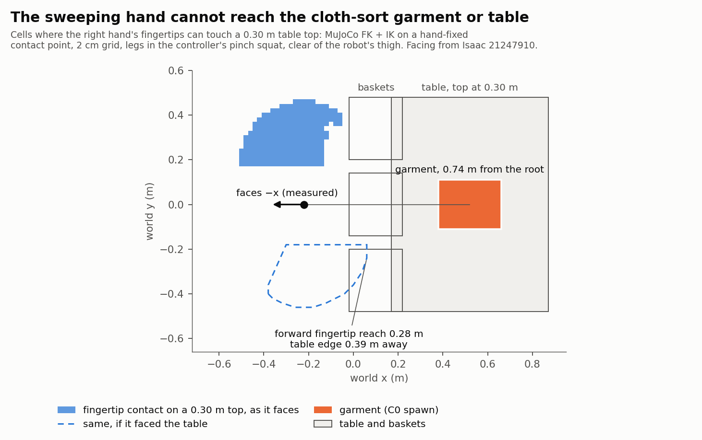

# Sorting garments into baskets

> **Status, 2026-09-14: all three garment classes sort in Isaac on a fixed base,
> 32 of 32; the free-base squat cannot stand.** The first scene was never reachable —
> the garment sat 0.74 m away, the fingertips reach 0.28 m forward, and in Isaac the
> robot faced the other way. The layout is rebuilt in the robot's own frame, inside a
> measured fingertip table. In Isaac the shipped hands turned out to collide with
> nothing, and once they did, the arm could not follow its schedule on bare position
> targets: the fingertip ran 65–72 mm behind and cut through the shirt before the sweep
> began. With inverse-dynamics feedforward through the unchanged arm drive the
> fingertip follows within 1.4–1.6 mm, and **with the root pinned the scripted sweep
> sorts shirt, sock and jacket proxies 32 times in 32**, each with its first sweep (see
> [In Isaac](#in-isaac-why-the-hand-did-not-sort-2026-09-13)). With the root free, the
> robot falls backward in under a second **even with its arm held still**. The planted
> pinch squat is not a stance it can hold, and the reach table and layout are built on
> it. End-to-end deformable RL stays rejected.

This is an evidence-driven redesign. G-C1 answered that Newton cloth cannot
carry the training workload. The research question moved with that measurement:
can a sweep strategy learned or planned on cheap object representations
transfer onto low-resolution cloth, and then onto a five-garment scene?


## The layout was never reachable (2026-09-11)

Found while asking why no Isaac cell ever moved the garment, and it outranks
every other result in this file.

<p align="center">
  
</p>

`scripts/cloth/plot_reach.py` draws it from the committed IK table and the
layout constants; no simulator needed.

**Reach, by forward kinematics** (MuJoCo, the same crew builder that measured
the vertical reach band). Right arm over its full joint range, legs held in the
pinch squat the controller commands (heights are the hand-link *origin*; the
fingertips hang about 13 cm lower):

| hand-link height | furthest forward reach | lateral span there |
|---|---:|---|
| 0.30–0.35 m | +0.064 m | right side only |
| 0.35–0.40 m | +0.170 m | right side only |
| 0.45–0.50 m | +0.258 m | right side only |
| 0.60–0.65 m | +0.289 m | right side only |

**Corrected 2026-09-13.** This paragraph said the hand could not reach a 0.30 m
table top at all. That measured the hand-link origin, whose lowest point is
0.339 m; the fingertips hang about 13 cm below it. A contact table built on a
hand-fixed contact point (`scripts/cloth/build_contact_table.py`) shows the
fingertips **can** touch a 0.30 m top — but only on the robot's right, and never
more than **0.28 m forward** of the root. Height was not what ruled the layout
out; distance and facing were.

| feature of the old layout | distance from the robot root |
|---|---:|
| basket centre | 0.320 m |
| table near edge | 0.390 m |
| **garment spawn** | **0.740 m** |

**Facing, in Isaac** (`21247910`, `scripts/cloth/hand_probe.py`). The hands sit
at (−0.208, +0.192) from the root; FK facing +x puts them at (+0.209, −0.177).
Both axes flip — a half-turn, not a mirror — so under `(0, 0, 1, 0)` the robot
faces **−x**, away from the table, with its geometry matching MuJoCo to 2–4 mm.
The right hand was **0.97 m** from the garment. `ROBOT_YAW` is now π.

**What that does to the numbers below.** The kinematic env had no reach model:
a sweep was two planar points the hand was assumed to follow, so its 1.00s meant
"a hand that could go anywhere would sort these". It also let a plan it had
flagged invalid push the garment. `bhl_robust.cloth.reach` now carries the
measured workspace — a 2 cm IK table from FK plus damped least squares, 1,380
reachable voxels, `assets/cloth/right_arm_ik_pinch.npz` — and the controller
refuses a plan the hand cannot follow:

| Experiment | Physics | Policy | Episodes | Success | Sweeps refused |
|---|---|---|---:|---:|---:|
| C0 | kinematic + reach | scripted | 64 | **0.00** | 100% |
| C1 | kinematic + reach, DR | learned residual | 64 | **0.00** | 100% |
| C4 | kinematic + reach, DR | linear BC | 64 | **0.00** | 100% |
| C5 | kinematic + reach, Mode B | scripted | 32 | **0.00** | 100% |

`results/cloth/reach/`. The no-reach files are left where they were.

**What is reachable** is a patch on the robot's right: robot-frame x
−0.12…+0.26 m, y −0.44…−0.08 m, hand-link heights 0.34–0.54 m, never crossing
the midline. The hand mesh hangs 2–13 cm below its link origin depending on
the pose, so "contact height" has to be defined on the hand's underside, not
its origin. The robot's own right hip and foot reach y = −0.17. A layout inside
that patch — smaller garments, a side table, baskets off its reachable edges —
is the next step, and it is what decision rule 1 asks for.

The robot falling in ~13 steps (below) is now the smaller problem, and it may
share a cause with this one: the cloth robot spawns at the *standing* planted
height, −0.027 m, while the squat plants at **−0.137 m**, so it drops 11 cm at
every reset. The zero-action probe's root bounced between −0.05 and −0.20.
Not yet tested.


## The redesign, inside the reach (2026-09-13)

Everything is placed in the **robot frame** — root at the origin, +x forward,
−y the robot's right — inside the fingertip contact table, and converted to
world coordinates through the measured facing (`layout.robot_rect_to_world`).

**The contact table** (`scripts/cloth/build_contact_table.py`,
`assets/cloth/right_hand_contact_pinch.npz`; the layout was placed against it, and
the sweep now runs on its continuous successor, `right_hand_tip_table.npz` —
[below](#in-isaac-why-the-hand-did-not-sort-2026-09-13)). A contact point fixed on the hand —
the median lowest mesh vertex over the sweep poses, 13 cm below the hand-link
origin — is IK'd onto a 2 cm grid at table-top heights 0.28–0.42 m. A cell
counts when the solve lands within 5 mm, no part of the hand dips below the
top, and the cell clears the right thigh. **0.30 m has the most usable cells
(252)**; 123 of them also allow the hand to hover 7 cm up.

**The scene.**

| | robot frame (x, y) | world centre | size |
|---|---|---|---|
| table, top 0.30 m | x −0.04…0.16, y −0.38…−0.20 | (−0.28, 0.29) | 0.20 × 0.18 m |
| shirts basket, off the front edge | x 0.18…0.33, y −0.355…−0.205 | (−0.475, 0.28) | 0.15 × 0.15 m |
| socks basket, off the outer edge | x 0.00…0.14, y −0.52…−0.40 | (−0.29, 0.46) | 0.14 × 0.12 m |
| jackets basket, off the back edge | x −0.21…−0.055, y −0.41…−0.255 | (−0.088, 0.332) | 0.155 × 0.155 m |

Widened after the first Isaac success (`21317170`), when a shirt came to rest across
the rims of a 0.12 m opening. `assert_layout` now requires every opening to be wider than
the diagonal of each garment bound for it, plus 1 cm.

`assert_layout` refuses a table cell outside the contact table, basket walls
that overlap each other or the robot's right leg, a basket opening under the
table, and an opening a garment could rest across. The robot spawns at the planted squat height, −0.137 m, instead of
the standing height that dropped it 11 cm at every reset.

**Garments are scaled to fit** (`garments.py`, `scale` 0.33–0.45, mass by
area): the originals were the size of the whole workspace. The table holds one
garment at a time, so **five-garment runs are sequential** — the next garment is
placed when one is sorted and the rest wait off to the side. That is Mode B, and
it is not five garments on a table at once.

**A sweep is a schedule** (`bhl_robust.cloth.schedule`). The hand cannot hover
everywhere it can touch, so a sweep descends at an *anchor* — a cell where it can
do both — glides at contact height to the start (skipping anchors whose glide
would cross the garment), sweeps, glides to another anchor, and lifts. Every
waypoint's arm configuration comes from the contact table. In Isaac one RL step
executes one whole sweep (4.0 s of physics, 6.0 s since the feedforward
schedule), read from the garment's position through the robot's actual root pose. The previous action term latched a
hand-tuned mapping every 40 ms, never read the garment, and ran its timer 8× fast.

**Kinematic ladder under the reach model** (`results/cloth/redesign/`):

| Experiment | Physics | Policy | Episodes | Success | Plans refused | Sweeps |
|---|---|---|---:|---:|---:|---:|
| C0 | kinematic + reach | scripted | 64 | **1.00** | 0% | 1.00 |
| C1 | kinematic + reach, DR | learned residual | 64 | **1.00** | 0% | 1.92 |
| C4 | kinematic + reach, DR | linear BC | 64 | **1.00** | 0% | 1.00 |
| C5 | kinematic + reach, sequential | scripted | 32 | **1.00** | 0% | 5.00 |

Kinematic still means a sliding-rectangle push model with no balance — but the
planner can now only command sweeps the measured hand can make, which the old
1.00s could not claim.

**The same ladder under the v3 planner** (`results/cloth/redesign_v3/`), which also
replays the hand hull, routes around the garment and refuses a sweep that would start on
it: C0 **1.00** and C5 **1.00**, no plan refused. **C1 (REINFORCE linear residual) 0.56
and C4 (linear BC) 0.56.** The drops are policies issuing sweeps v1 accepted and v3
refuses, not the planner being wrong:
- the kinematic scripts never passed the garment's yaw to the scripted sweep, so under
  ±0.6 rad randomization it started the hand on the garment. With the yaw
  (`scripted.scripted_for`), scripted C1 is 64/64;
- BC fit on unrandomized scenes scores 64/64 there, but a linear map cannot express the
  yaw-dependent start, and 138 of its randomized sweeps start on the garment;
- REINFORCE's baseline was a fixed 2.0, so the residual random-walked 5–8 cm off the
  scripted start. A running-mean baseline still ends at 0.56: ±27° of angle exploration
  is coarse for a planner that refuses imprecise starts.


## In Isaac: why the hand did not sort (2026-09-13)

Every row here is scripted C0 on the rigid shirt proxy, 4 episodes unless noted.
On the free base the robot falls in the first sweep, so most rows use a
**fixed-base diagnostic** (`ClothSort-BHL-RigidFixedBase-Oracle-v0`): the root
link is pinned and the legs stay on their squat targets. It asks "does the sweep
move the garment?" apart from "can the robot stay up?", and it is labelled
`rung: C0F` in every file it writes. The garment starts 0.17–0.18 m from its
basket.

| job | base | hand collider | schedule | success | garment moved | largest travel | final distance | plans refused | fell |
|---|---|---|---|---:|---:|---:|---:|---:|---:|
| `21300348` | free | none | v1 | 0/4 | — | — | — | 0% | 4/4 ¹ |
| `21300493` | fixed | none | v1 | 0/4 | 0/4 | 0.07 mm | 0.172 m | 0% | 0 |
| `21300603` | fixed | box | v1 | 0/4 | 4/4 | 7.2 cm | 0.253 m | 54% | 0 |
| `21307211` | fixed | hull | v2 | 0/4 | 4/4 | 12.3 cm | 0.289 m | 67% | 0 |
| `21307213` | free | hull | v2 | 0/4 | — | — | — | 0% | 4/4 |
| `21317170` | fixed | hull | **v3 feedforward** | **7/8** | 1/1 ² | 18.0 cm ² | 0.015 m ² | 0% | 0 |
| `21317388` | fixed | hull | v3, widened baskets, shirt, 16 eps | **16/16** | — ³ | — | — | 0% | 0 |
| `21317389` | fixed | hull | v3, widened baskets, **sock**, 8 eps | **8/8** | — ³ | — | — | 0% | 0 |
| `21317390` | fixed | hull | v3, widened baskets, **jacket**, 8 eps | **8/8** | — ³ | — | — | 0% | 0 |
| `21317172` | free, **arm held still** | hull | — (hold) | 0/2 | — | — | — | — | **2/2** |
| `21317173` | free | hull | v3 feedforward | 0/4 | — | — | — | 0% | 4/4 |

¹ Measured with a fall test that read the quaternion in the wrong order (below).
`21307213` re-measured it with the order corrected: the robot does fall.
² Episode 0 only — the failure, resting on the rims 1.5 cm from the basket centre. Travel
and final position are read between steps that did not end the episode, and each of the
seven successes ended on its first sweep.
³ Every episode sorted with its first sweep, so none has a between-step position to read.
"—" is unmeasured: an episode that ends on its first step has no position to read
between steps.

**1. The hands collided with nothing.** The largest garment displacement over four
fixed-base episodes was 0.07 mm, and the clip (`21300494`) shows the right hand
coming down *on* the garment and lifting away with it unmoved. The Berkeley Humanoid
Lite URDF gives each hand link a visual and no collision; the USD and the MuJoCo
model inherit that. `assets/cloth/berkeley_humanoid_lite_hand_colliders.usda`
sublayers the untouched USD and adds one collider per hand link — now the 64-vertex
convex hull of the hand mesh, within 1.7 mm of the full hull. With a collider the
garment moved in every episode.

**2. The schedule swung the hand through the garment.** The clip of `21300603`
(`21300604`) shows the hand landing on the shirt's far corner, riding up its edge and
flipping it. A MuJoCo replay of the same joint schedule, with perfect tracking, put
the fault in the plan. Hover and contact at one cell came from different IK
branches, so a 0.2 s "vertical" descent swung the fingertip 7 cm toward the garment
and back; neighbouring glide cells flipped branch too. The 12 mm contact clearance
left 3 mm of a 1.5 cm garment edge to push. The v2 schedule fixes each:

- `scripts/cloth/build_tip_table.py` grows the fingertip table cell by cell from the
  table centre, each solve seeded by a solved neighbour: 219 contact cells, at most
  0.28 rad between neighbours, the fingertip within 1.3 mm of the straight line
  between cells, the hand's lowest point 3 mm above the top. Over the table's
  interior the elbow is already fully bent, so only 78 edge cells can lift the hand
  clear. Those are the anchors.
- Glides at table height are routed around the garment (A* on contact cells), and
  every candidate plan is replayed through forward kinematics of the hand hull
  (`bhl_robust/cloth/arm_fk.py`, equal to MuJoCo to 4e-16 m). A plan that touches
  the garment before the sweep, touches where the garment should be after it, or
  enters the table is refused.

**3. The arm could not follow the schedule.** v2 moved the shirt further and put it
further from its basket. The trace of `21307211` says why. Forward kinematics of
Isaac's *measured* joints lands on Isaac's hand link to 0.0 mm, so the geometry is
right, but the fingertip ran **65 / 72 / 59 mm** (mean) behind its schedule on
approach / sweep / retreat, 14 cm at worst. The arm drive shipped with the robot is PD
at 10 N m/rad and 2 N m s/rad with a 4 N m limit. Bare position targets lag it by
Kd/Kp = 0.2 s, and the v2 schedule's 3 rad/s moves saturate it. The shirt first moved
at 0.50 s — during the approach, 0.55 s before the sweep — when the lagging hand cut
through it. It came to rest on the jackets basket's rim, and every later plan was
rightly refused.

A MuJoCo arm with the same drive, fed the same commands, reproduces Isaac's measured
joints to 0.001 rad until the hand touches something. So an offline arm is a fair
judge of a schedule; the numpy copy the tests use (`arm_fk.simulate_pd`) matches to
0.002 rad. The v3 schedule keeps the actuator — same gains, same 4 N m limit, no
change to the articulation — and changes what it is sent:

- every phase is re-timed to start and end at rest (quintic time scaling, same peak
  speeds; the macro step grows from 4 s to 6 s);
- the position target carries the inverse-dynamics torque divided by Kp, and a
  velocity target cancels the damping drag (`arm_fk.inverse_dynamics`, equal to
  MuJoCo's `mj_rne` to 3e-15 N m). The drive's torque is that feedforward plus PD on
  whatever error remains, still clipped at 4 N m by the simulator;
- a phase whose feedforward would need more than 3.4 N m is slowed, and the Isaac term
  refuses to start if the arm actuator is not the one the feedforward was computed
  for. Every static table pose needs at most 2.15 N m against gravity.

In the Isaac-calibrated arm, the scripted schedules' fingertip error:

| garment | commanded as | approach | sweep | retreat | peak drive torque |
|---|---|---:|---:|---:|---:|
| shirt | bare position targets, as Isaac ran v2 (`21307211`, measured) | 65 mm (124) | 72 mm (136) | 59 mm (139) | saturated |
| shirt | bare position targets, v3 timing (model) | 56 mm (111) | 51 mm (73) | 71 mm (109) | 1.8 N m |
| shirt | **v3 feedforward** (model) | **0.7 mm (1.8)** | **0.5 mm (1.0)** | **0.6 mm (1.2)** | 3.6 N m |
| sock | v3 feedforward (model) | 0.5 mm (1.6) | 0.5 mm (1.0) | 0.7 mm (1.7) | 3.3 N m |
| jacket | v3 feedforward (model) | 0.6 mm (1.8) | 0.5 mm (1.0) | 0.6 mm (1.7) | 2.1 N m |

Mean, with the maximum in brackets. The kinematic ladder still sorts at 1.00 under the
v3 schedule (C0 64 episodes, C5 32, no plan refused).

**In Isaac it does.** The trace of `21317170` has the fingertip 1.4–1.6 mm (mean) behind
the schedule on the sweep, 2.6 mm at worst. The shirt first moved at 2.35 s, inside the
sweep's window (2.07–2.88 s). **Seven of eight episodes sorted, each with its first
sweep**, with no plan refused and none in the wrong basket. The eighth shirt was pushed
over the rims turned 68°, and at that angle 10 × 8 cm spans 12.2 cm, wider than the
12 cm opening. It came to rest across both rims, 6 mm above the success box, where no
later sweep could reach it. The baskets are now wider than every garment's diagonal (the
layout table above). **On them, shirt, sock and jacket sort 32 times in 32**, each with its
first sweep and no plan refused (`21317388`–`390`).

<p align="center">
  
</p>

`21317391`: the scripted sweep on the widened baskets, filmed through a camera sensor.
**The robot's root is pinned and the shirt is a rigid 10 × 8 cm box**: this is the
fixed-base diagnostic, not cloth and not a standing robot. The episode ends when the
shirt's centre enters the basket, so the clip stops as it drops.

**4. The free base falls backward, and not because of the arm.** With the fall test
corrected, the free-base robot still goes over on the first sweep in every episode
(`21307213`, `21317173`): pitch −17° at 0.5 s, −65° at 0.75 s, lying down by 1.0 s, tipped
away from the table. **Holding the arm still changes nothing** (`21317172`, 2 of 2): −15°
at 0.5 s, −48° at 0.75 s, down by 0.9 s. The planted pinch squat the whole redesign stands
on is not a stance this robot holds with its legs on their targets. Raising the leg gains
would misrepresent a 6 N m actuator. So the free-base task needs a different stance, or a
balance controller on the legs, and because the fingertip table was solved with the legs
in this squat, the reach table and the layout will have to follow a new stance.

Why, measured offline: a MuJoCo robot with the same leg and arm drives reproduces Isaac's
arm-still fall (pitch −17° at 0.5 s and −45° at 0.7 s, against Isaac's −15° and −39°).

- **The knees cannot hold the squat.** Each needs 5.5–6.0 N m at knee 1.45 rad, at its
  limit. The PD sags up to 0.3 rad, the pelvis drops 3 cm, and the centre of mass slides
  back off the heels.
- **The spawn also buries the toes.** At ankle −0.55 the sole is pitched 2.9° toe-down,
  and the root at −0.137 puts the toe edge 2.5 cm into the floor. Correcting that alone
  does not stop the fall.
- **A shallower stance plus a leg controller stands, in that model.** At knee 1.0 a
  flat-soled, level stance needs about 3.1 N m. But a 20 N m/rad ankle is softer than
  gravity's toppling stiffness there (about 64 N m/rad), so it needs feedback. Leg
  feedforward (settled torque over Kp) plus IMU ankle pitch and roll feedback stood 6 s
  under Isaac's ±0.04 rad reset noise for 31 of 144 gain sets. The chosen set stands 8 of 8
  resets for 10 s with the arm still (worst tilt 3.1°) and 7 of 8 with the arm playing the
  scripted sweep. Its neighbours mostly fall with the arm moving, so it is narrow.

That controller is `bhl_robust.cloth.balance`, applied by the Isaac sweep term to the leg
targets, with the same gains and limits as the upstream actuator. Whether it stands in
Isaac is the probe `ClothSort-BHL-RigidBalance-Oracle-v0` (`21329076`–`078`). If it does, the
table rises with the root (+5.95 cm) and the fingertip table moves with it unchanged.
Everything above is reproducible with `scripts/cloth/stance_mujoco.py all`.

**The first cloth rung (C2) on the fixed base is void so far.** One 8×8 Newton cloth: the
success predicate fired 4 of 4 and the cloth did settle in the basket, but the arm's joint
state went NaN mid-sweep (`21328765`, t = 2.83 s). A success in a blown-up simulation is not
a sort. The eval now reports `success_rate_finite`, and the diagnosis runs are queued
(larger MuJoCo-Warp constraint buffers; arm held still).

**Quaternion order.** Isaac Lab 3.0 stores quaternions `(x, y, z, w)`; 2.x stored
`(w, x, y, z)`, and every literal and hand-written unpack in this repo assumed the
latter. In the cloth task the fall test counted a 30° yaw as 30° of tilt and could
not see a 60° roll; the garment and robot yaw were wrong the same way. They now read
through a probed order (`bhl_robust.quat_order`). The same misreading pitched the
maze stereo cameras up and flipped their images (fixed in `3f7b679`), and very
likely explains the under-floor spawn of the coop and TaskV2 robots.

## Original gate result

Deformable simulation **failed the throughput gate**.

G-C1 (`21185969`, 2026-09-05) ran Isaac Lab's Franka cloth scene — **one**
961-vertex deformable, a **7-DoF** arm, assets localised — and measured:

| envs | env-steps/s |
|---:|---:|
| 8 | **182** |
| 32 | 177 |
| 128 | **71** |
| 512 | overflow (signed 32-bit array dim, 7.3e9) |

Parallel throughput **falls** as environment count increases. There is no
scale to buy.

### Why that kills end-to-end RL

A normal training arm here is:

- 8,000 iterations
- 2,048 environments
- ~48 environment steps per iteration
- **786 million** environment steps

At 182 env-steps/s that is about **50 days** of wall clock against **~6
minutes** at this project's rigid-body rate. At the 128-env point the same
job is ~128 days (`scripts/cloth/estimate_cost.py`).

And that measurement is generous. This design needs **five** garments and a
**22-DoF** humanoid: more collision geometry, more robot-cloth contacts,
cloth-cloth and cloth-environment interactions. The scene that already fails
the gate is lighter than the one the original proposal asked for.

### Consequence

**Full five-garment, 22-DoF end-to-end deformable RL is rejected as the
primary training method.**

The previous write-up concluded "scripted demonstrations, not RL" and stopped.
That was the right call *for cloth physics as the training engine*. It was
the wrong call for the experiment. The experiment is still worth running if
learning happens where it is cheap.


## Stage 2: one low-resolution Newton cloth

`ClothSort-BHL-Deformable-Oracle-v0` replaces the rigid `garment_0` with an
Isaac Lab `MeshRectangleCfg` surface cloth. Default resolution is **8×8 (64
vertices)**, not the 961-vertex Franka mesh from G-C1. `sim.dt` is `1/60` to
match the Franka cloth scene; that change is documented. Construction raises
if Newton is missing — it does not silently train a cube.

`ClothSort-BHL-ActiveCloth-Oracle-v0` is Mode B: **one** live cloth (`sock_a`
as `garment_0`) plus four rigid proxies. That is not five simultaneous cloths.

Success on cloth is the vertex-fraction predicate (`>= 0.60` in the correct
basket AABB), not the rigid CoM test.


## New approach

```
rigid proxy training
    → single-cloth validation
        → limited deformable adaptation if necessary
            → five-garment evaluation
```

| Stage | Physics | Parallelism | Role |
|---|---|---|---|
| 1 | thin rigid rectangles | 1024–2048 *after a measured rigid throughput* | learn / plan where to sweep |
| 2 | 1 low-res deformable (8×8 … 16×16, not 961) | 8–32 | does the primitive transfer? |
| 3 | 5 garments, 3 baskets | 1–8, eval only | demonstration. Mode B if five live cloths do not fit |

Cheap simulation for learning. Expensive simulation for validation.


## Research questions

Primary:

> Can manipulation behavior learned or planned on inexpensive object
> representations transfer to low-resolution deformable garments and then to
> a realistic multi-garment cloth-sorting scene?

Secondary:

- How large is the rigid-to-deformable gap? (`transfer_gap = rigid_success − deformable_success`)
- Which failures appear only when the garment bends?
- How much deformable fine-tuning is required — if any?
- Does a learned sweep planner beat a fixed scripted sweep?
- How sensitive is success to mass, friction, size, spawn, basket pose?


## Morphology, unchanged

No fingers. 4 Nm arms. Hands that do not adduct past 0.355 m. The robot is
the stock **22-DoF** Berkeley Humanoid Lite with its normal left and right
arms. "Experimental arm" means an experimental *condition*. It must never
mean a third physical limb.

A humanoid with no fingers cannot pick up a sock. The task is **sweeping**,
not pick-and-place. The table top sits at `GRASP_Z = 0.30 m` (the measured
squat band). Baskets sit under the robot-facing edge. The robot spawns
already addressing the table — walking there is a different problem and is
not mixed into this reward.


## Architecture

```
Observation / Perception  (oracle state first; sensors later)
        → Garment localization
        → Target selection
        → Sweep planner     (scripted geometry  or  learned 5-D action)
        → Sweep controller  (pinch-pose + bounded arm offsets)
        → Humanoid          (22-DoF, unchanged articulation)
        → Object physics    (rigid proxy  or  low-res cloth)
```

The policy outputs

`[dx_start, dy_start, sweep_angle, sweep_distance, sweep_speed]`

in `[-1, 1]`. It does **not** rediscover 22-DoF motor coordination. The
controller reuses the measured pinch/squat hold from the coop tasks and
refuses trajectories that leave the joint walls.

Oracle observations are privileged and labeled as such. A later sensor rung
can replace `garment_xy` without rewriting the planner or the controller.
Blind / LiDAR / stereo variants are compatible and are not a blocker for
Stage 1.


## Garment set and baskets

Five garments, three baskets, one class per basket — at least one basket
takes two items, so a policy cannot succeed by memorising a 1-1 layout.
Scaled 2026-09-13 to fit a table the robot can reach (mass scales with area):

| garment | class | basket | rigid proxy (m) | scale | mass (kg) |
|---|---|---|---|---:|---:|
| sock_a, sock_b | sock | socks | 0.080 × 0.045 × 0.015 | 0.45 | 0.008 |
| shirt_a, shirt_b | shirt | shirts | 0.100 × 0.080 × 0.015 | 0.36 | 0.016 |
| jacket | jacket | jackets | 0.110 × 0.085 × 0.018 | 0.33 | 0.024 |

Success is geometric:

- rigid: centre of mass inside the correct basket AABB
- deformable: `fraction_of_vertices_in_correct_basket >= threshold` (default 0.60)

Wrong-basket is a separate bit from "not yet sorted".


## Experiment ladder

| id | physics | policy | purpose |
|---|---|---|---|
| **C0** | rigid proxy | scripted | geometry + controller |
| **C1** | rigid proxy | learned 5-D | high-throughput strategy |
| **C2** | 1 low-res cloth | scripted | does the primitive transfer? |
| **C3** | 1 low-res cloth | C1 zero-shot | measure `transfer_gap` |
| **C4** | 1 low-res cloth | BC / residual / small RL | only if C3 is poor; cost-gated |
| **C5** | 5-garment eval | best of the above | Mode A: five live cloths. Mode B: one active, others frozen/rigid |

Decision rules:

- C0 fails → fix controller/layout, do not train
- C1 fails → fix reward/action, do not introduce cloth
- C2 fails → physics/controller, not RL
- C2 works and C3 fails → transfer gap, not "cloth is unsolvable"
- C3 is already good → do not fine-tune for the sake of fine-tuning
- five live cloths do not fit → Mode B, and say so

C4 is refused unless `scripts/cloth/estimate_cost.py` accepts the job.


## What has been measured

**Superseded 2026-09-11 — this table ran with no reach model.** Under one,
every cell is 0.00; see *The layout was never reachable*. Kept because the
numbers were published.

Kinematic rigid proxy, login node, 2026-09-10. **Not Isaac rigid-body
physics. Not cloth.** Fall rate is 0 because this integrator does not
simulate balance; that number is not a locomotion result.

Success and sweep counts here are deterministic under their seeds and
reproduce exactly on re-run. The **throughput column does not**: it was
re-measured at 600 and 572 env-steps/s against the 350 and 357 recorded below,
on a shared login node under different load. Treat those two cells as an order
of magnitude, not a measurement — a real env-steps/s for this task has to come
off a compute node.

| Experiment | Physics | Policy | NUM_ENVS | Throughput | Success |
|---|---|---|---:|---:|---:|
| C0 | kinematic rigid | scripted | 1 | 350 env-steps/s | **1.00** (64 eps, 1.0 sweep) |
| C1 | kinematic rigid + DR | learned residual | 1 | 554 (train) | **1.00** eval (64 eps, 3.45 sweeps) |
| C1 control | kinematic rigid + DR | scripted | 1 | — | **1.00** (64 eps, 1.05 sweeps) |
| C2 | deformable | scripted | — | not yet measured | N/A |
| C3 | deformable | C1 zero-shot | — | not yet measured | N/A (`transfer_gap` refused) |
| C4 | kinematic rigid + DR | linear BC | 1 | — | **1.00** (64 eps, 1.14 sweeps). **Not cloth.** |
| C4 deformable | 1 low-res cloth | adapted | — | not yet measured | N/A |
| C5 | kinematic rigid, Mode B | scripted | 1 | 357 env-steps/s | **1.00** (32 eps, 5.0 sweeps) |

C1 matches C0's success and loses on efficiency. On this model the scripted
planner is the better high-level policy. Kinematic C4 BC recovers that
efficiency (1.14 sweeps vs C1's 3.45) because it clones the scripted
action. That is **not** a deformable fine-tune and is not a reason to skip
C3.

### Isaac, 2026-09-10 — the scene runs and the robot falls over

The rigid ids now construct, reset and step (`21233957`), and a 3-iteration
pass through the real `scripts/train.py` clears the training gate
(`21233958`). Both report the stock articulation: **22 joints, 2 arms**,
5-D action.

| cell | job | what it measured |
|---|---|---|
| rigid construct/step | `21233957` | 22 joints, 2 arms, action_dim 5, 4 envs |
| C1 training smoke | `21233958` | **1,001 steps/s at 64 envs**, 3 iterations, mean episode length **12.83** |
| C0 scripted | `21233959` | 12.25 steps/episode |
| deformable build | `21233960` | Newton cloth initialises: 8 instances, **81 vertices at `resolution=8`** |

**The result is negative and it is not about cloth.** In both the trained and
the scripted cell, `Episode_Termination/fallen = 1.0000` and
`Episode_Reward/progress = 0.0000`: the humanoid topples about 0.51 s into
every episode and the garment never moves toward a basket. The layout is not
the cause — the robot at x = −0.22 clears the table (x ≥ 0.17) and the baskets
(x ≤ 0.22), checked geometrically. The open hypothesis is that it cannot hold
the pinch/squat pose: legs are position-controlled at stiffness 20 against a
6 Nm effort limit at hips −0.85 / knees 1.45, and FINDINGS already records the
coop policy's torso sinking to −0.23 m rather than holding a squat.
`slurm/95g_cloth_spawn_probe.sbatch` measured that directly, and **it is not
the squat**. Three leg poses, zero action, 60 steps (`21234166`):

| pose | final tilt | root z | fell (>0.78 rad) |
|---|---:|---:|---|
| configured squat | 0.267 rad | −0.199 | **no** |
| half squat | 0.045 rad | −0.108 | **no** |
| default, no squat | 0.142 rad | −0.139 | **no** |

None of the three falls, and the root sinks **12–20 cm in every one of them**,
including the pose with no crouch at all. So crouch depth is not the variable.
What the probe shows is a robot with **no balance control**: the leg position
targets sag under gravity and it oscillates to within half the fall limit
before the task has done anything. Policy-driven arm motion on top of that is
what carries it past 0.78 rad inside ~13 steps.

That is a design decision, not a bug to patch quietly. The task needs one of:
a balance controller, a fixed or supported base for the manipulation stage, or
a fall criterion chosen for a stationary manipulator rather than the
locomotion limit of 0.78 rad. Whichever is chosen changes what a cloth-sort
success rate *means*, so it is left open rather than picked here.

**Decision rule 1 applies: C0 fails, so fix the controller or the layout, and
do not train.** No C1 arm is queued and no success number is claimed.

**`21233959`'s success and fall rates were not measurements.** `eval_isaac.py`
reported both while assigning neither — `em.fell` was never written, and the
success lookup indexed a `(num_envs, n_terms)` **tensor** with a string, which
raises into a bare `except: pass`. Both were pinned to 0.0 and could not have
moved whatever the robot did. They read through
`termination_manager.get_term()` now and raise on a missing term.

Re-run as `21234259`, the same cell reports **`fall_rate` 1.00** and
**`success_rate` 0.00** over 4 episodes — matching the trainer's
`Episode_Termination/fallen = 1.0000` from an entirely separate code path.
That agreement is what makes the 0.00 success a measurement rather than a
default.

| Experiment | Physics | Policy | NUM_ENVS | Throughput | Success |
|---|---|---|---:|---:|---:|
| C0 Isaac | Isaac rigid | scripted | 4 | — | **0.00** success, **1.00 fall rate**, 12.75 steps/episode (`21234259`) |
| C1 Isaac | Isaac rigid | learned 5-D | 64 | **1,001 steps/s** (3-iter smoke) | **N/A** — `fallen = 1.0000`, `progress = 0.0000` |
| C2/C3/C4 Isaac | 1 low-res cloth (81 verts) | — | 8 | **467 env-steps/s** | N/A — blocked behind the same fall |

### Isaac throughput, measured (`21234167`)

Warmed, three throwaway steps then 40 timed, one GPU node.
`results/cloth_sort_bench.csv`, summarised in `results/cloth_sort_bench.md`.

| robot | deformables | resolution | vertices | envs | env-steps/s |
|---|---:|---|---:|---:|---:|
| BHL 22-DoF | 0 | — | 0 | 8 | 128.6 |
| BHL 22-DoF | 0 | — | 0 | 32 | 623.9 |
| BHL 22-DoF | 0 | — | 0 | 64 | **1,117.6** |
| BHL 22-DoF | 1 | 8×8 | **81** | 8 | **467.2** |
| BHL 22-DoF | 1 | 10×10 | **121** | 8 | 438.3 |

**This is the number the redesign was betting on, and it landed.** Against
G-C1 — Franka, 7 DoF, one **961**-vertex cloth — at the same 8 environments:

| scene | robot | vertices | envs | env-steps/s |
|---|---|---:|---:|---:|
| G-C1 (`21185969`) | Franka, 7 DoF | 961 | 8 | 182 |
| this task (`21234167`) | **BHL, 22 DoF** | **81** | 8 | **467** |

A **2.6×** speed-up while carrying three times the DoF, bought entirely by
dropping mesh resolution. Going 8×8 → 10×10 costs only 6% (467 → 438), so
there is headroom to raise fidelity in Stage 2 rather than lower it.

Two cautions, because neither of these is a licence to scale up:

- **Deformable parallelism is still unmeasured.** Every cloth row above is at
  **8 envs**. G-C1's finding was that cloth throughput *falls* with
  environment count (182 → 71 from 8 → 128). Nothing here contradicts that; it
  was not tested. Do not read 467 env-steps/s as an 8,000-iteration budget.
- **The rigid path scales and the cloth path is untested at scale.** Rigid
  goes 128.6 → 623.9 → 1,117.6 across 8 → 32 → 64 envs, close to linear, which
  is what makes Stage 1 the place to learn. The 1024–2048 claim is still an
  extrapolation from 64.

Cloth **build** cost is real and separate from stepping: the Newton scene took
**56.5 s** to construct against 1–6 s for rigid (`21234165`). That is a fixed
cost per job, not per step, but it is why a deformable cell is not something
to launch casually.

G-C1 (Franka, 961 vertices) remains this repo's reference cloth measurement:
182 / 177 / 71 env-steps/s at 8 / 32 / 128 envs.


## Isaac bring-up: what the port actually cost

The kinematic ladder ran on a login node from the first day. Getting the same
task to construct in Isaac took four GPU round-trips, and each returned exactly
one bug. They are recorded because every one of them was a class of mistake
that a login-node check can catch, and three of the four are now caught there.

| # | job | died on | why it was invisible offline |
|---|---|---|---|
| 1 | `21228029` | `TypeError: 'NoneType' object is not callable` | `SweepActionCfg` declared `class_type: type = None` and patched the class attribute afterwards. `configclass` freezes field defaults when it builds the dataclass, so every *instance* still held `None`. |
| 2 | `21233802` | `"bitwise_and_cuda" not implemented for 'Float'` | `&` binds tighter than `<=` in Python, so the basket test was a chained comparison, not a mask. The predicate had never evaluated. |
| 3 | `21233866` | `mean episode length is 1.00` | the fall test used an absolute `R[2,2] < 0.70`, and this asset's stand-up quaternion `(0,0,1,0)` has `R[2,2] = -1`. A standing robot read as fallen at reset. |
| 4 | `21233868` | `FrameView prim '.../table' is a Newton physics body` | the table and basket walls carried `rigid_props`; Newton promotes that to a physics body, which `AssetBaseCfg` refuses. |

Three consequences worth stating outright, because two of them are fidelity
decisions rather than repairs:

**The fall test is measured relative to the spawn pose.** Not against an
absolute body-z convention. This asset's identity orientation is not upright —
the quaternion the spawn photographs (`21218517`/`21218627`) show standing, and
which matches MuJoCo to 9 mm, has `R[2,2] = -1`. Rather than re-open this
repo's long-running argument about which matrix element is "up" for this
asset, `fallen` measures the angle between the robot's current orientation and
the one it spawned with. That reads 0 at reset by construction, and a yaw
jitter still reads 0 because yaw is not tilt. The algebra is
`bhl_robust.cloth.kinematics.relative_up_z`, shared by the torch path and the
numpy tests rather than written twice. **Caveat:** this measures orientation
only, and it cannot tell a squat from a collapse — the same limitation
FINDINGS records for the coop tilt term.

**The cloth table and baskets are collider-only, in the rigid scene too.**
They were kinematic rigid bodies. Newton rejects that, and the obvious fix —
collider-only under Newton, rigid body under PhysX — would have put a physics
difference between C0/C1 and C2/C3 and then charged the difference to the
cloth, which is precisely the measurement this ladder exists to make. Both
scenes now spawn the same static geometry. The maze, plinth, shelf and net are
untouched and keep `rigid_props`; a test enforces that split so no future edit
silently re-times a published number.

**One basket volume, not two.** The Isaac predicate re-derived the basket box
from `BASKET_INNER` with a *half*-extent for z, giving a 0.07 m ceiling where
`layout.basket_aabb` — what the kinematic ladder scores against — uses the full
0.14 m. The two engines were scoring the same garment differently, in a
document that claims they cannot drift because they read one layout object.
Both now call `basket_aabb`.

Also fixed while reading the step path, without a job failing on it:
`progress_to_basket` carried its previous-distance state across episode
boundaries, so the first step after a reset paid the policy for the garment
teleporting back to spawn. That would not have crashed anything — it would
have biased C1's reward toward whichever spawn happened to land nearer a
basket.

### Guards, on the login node

`tests/test_cloth_sort.py` grew from 28 to 43 tests. The new ones parse the
Isaac modules rather than importing them, because a login node cannot
bootstrap Kit — the reason these four bugs reached a GPU queue in the first
place. Each guard was verified to **fail** when its bug is reintroduced:

- no `@configclass` may default `class_type` to a constant, and no module-level
  `SomeCfg.class_type = ...` patching
- the action term class must be defined before the cfg that defaults to it
- no bitwise `&`/`|` inside an unparenthesised comparison
- `cloth_resolution` may not be assigned after construction, and the Isaac
  scripts must build through `build_cfg()`
- `cloth_sort_mdp` may not re-derive the basket box from `BASKET_INNER`
- cloth furniture collider-only, maze/coop furniture not
- the spawn-relative tilt algebra, including the exact `(0,0,1,0)` case that
  broke `21233866`

### A benchmark that cannot mislabel itself

`cloth_resolution` was being assigned *after* the env cfg was constructed, but
the cloth mesh is spawned inside `__post_init__`. A "10×10" bench row would
have been an 8×8 cloth wearing the wrong label. Resolution now goes through
`build_cfg()`, which passes it to `__init__` and then reads the resolution back
off the spawned scene; a mismatch raises instead of writing the row. The CSV
reports what the scene built, not what was requested.

The smoke's throughput field was also folding scene construction into its
timing — tens of seconds of USD loading divided by six steps. It now reports
`build_s` and `step_env_steps_per_s` separately, and neither is the bench
number: `scripts/bench/cloth_sort_isaac_bench.py` warms up first and is the
only thing here that measures throughput.


## Cost gate

```bash
python3 scripts/cloth/estimate_cost.py --physics deformable --num-envs 2048
# exits 2: ~128 days at the G-C1 128-env rate. Refused.

python3 scripts/cloth/estimate_cost.py --physics deformable --num-envs 8 \
    --iterations 20 --steps-per-iter 24
# accepted: ~21 s at 182 env-steps/s
```

A deformable training job that cannot print this report is not submitted.


## Commands

Kinematic ladder (no GPU, no Isaac). **Use the stack's python, not the login
node's** — `/usr/local/apps/python/3.14` has no numpy, so a bare `python3`
fails at the first import:

```bash
export PYTHONPATH=src
PY=/nfs/hpc/share/$USER/Humanoid_Lite/venv/bin/python3   # v51 stack; v60 works too

$PY tests/test_cloth_sort.py -v      # 50 tests, ~0.2 s, no GPU
$PY scripts/cloth/eval_scripted.py --rung C0 --episodes 64 \
    --out results/cloth/c0_scripted.json
$PY scripts/cloth/train_rigid.py --episodes 200 --eval-episodes 64 \
    --out results/cloth/c1_learned.json
$PY scripts/cloth/eval_five.py --episodes 32 \
    --out results/cloth/c5_scripted.json
$PY scripts/cloth/eval_transfer.py --rigid results/cloth/c0_scripted.json \
    --out results/cloth/c3_transfer.json
$PY scripts/cloth/adapt.py --collect 64 --eval-episodes 64 \
    --out results/cloth/c4_bc.json
$PY scripts/bench/cloth_sort_bench.py
$PY scripts/cloth/estimate_cost.py --physics deformable --num-envs 2048
```

Isaac (v60, GPU, after SimulationApp). **Smoke first. No 8,000-iter cloth
job. No 2048-env cloth job.**

```bash
sbatch slurm/95c_cloth_smoke.sbatch          # rigid construct/reset/step
sbatch slurm/95d_cloth_c1_smoke.sbatch     # 3 iters, 64 envs, rigid only
sbatch slurm/95e_cloth_isaac_eval.sbatch   # 4 scripted C0 episodes
sbatch slurm/95f_cloth_deform_smoke.sbatch  # 8×8 cloth, 8 envs, cost-gated
sbatch slurm/95b_cloth_sort_bench.sbatch  # throughput; stop on fall/OOM
sbatch slurm/95g_cloth_spawn_probe.sbatch  # why the robot topples: 3 leg poses, zero action

# after 95c, a human can also:
# python scripts/cloth/eval_isaac.py --rung C0 --headless
```

Replay / render of an Isaac run uses the existing play path:

```bash
python3 scripts/cloth/replay.py --task ClothSort-BHL-Rigid-Oracle-v0
# → BHL_STACK=v60 ENABLE_CAMERAS=1 python scripts/train_play.py --task ... --headless --enable_cameras
```

Registered gym ids (imported after SimulationApp, like every other overlay):

| id | stage |
|---|---|
| `ClothSort-BHL-Rigid-Oracle-v0` | C0 / C1, one rigid proxy |
| `ClothSort-BHL-RigidResidual-Oracle-v0` | C1 with residual actions around the scripted sweep (`residual_scale` 0.30) |
| `ClothSort-BHL-RigidFixedBase-Oracle-v0` | **diagnostic, fixed base** — root link pinned, to ask "does the sweep move the garment?" apart from balance |
| `ClothSort-BHL-RigidBalance-Oracle-v0` | **balance probe** — free base in the knee-1.0 stance with the leg controller (`bhl_robust.cloth.balance`); the table is not raised, so the hand sweeps above the garment |
| `ClothSort-BHL-RigidFive-Oracle-v0` | C5 rigid stand-in, Mode B |
| `ClothSort-BHL-Deformable-Oracle-v0` | Stage 2: one 8×8 Newton `MeshRectangle` |
| `ClothSort-BHL-DeformableFixedBase-Oracle-v0` | **diagnostic, fixed base** — the same cloth with the root link pinned; C2 asked apart from balance |
| `ClothSort-BHL-ActiveCloth-Oracle-v0` | Mode B: 1 cloth + 4 rigid proxies |


## What this is not

- Not five simultaneously active high-res cloths unless a bench says that
  fits, and then only for evaluation.
- Not a report of Mode B as "five live garments".
- Not a silent fidelity drop: kinematic cells are labeled kinematic.
- Not a change to the robot articulation, the maze, or any trained checkpoint.
- Not a deletion of `results/cloth_probe.txt` or the G-C1 ledger rows.


## Layout numbers

Robot at `(-0.22, 0)`, root z −0.137, facing **−x** as measured (`21247910`).
Table top 0.30 m, centred at `(-0.28, 0.29)`, 0.20 × 0.18 m; baskets at
`(-0.475, 0.28)`, `(-0.29, 0.46)`, `(-0.088, 0.332)` — see *The redesign*.
Constants live in `src/bhl_robust/cloth/layout.py`, defined in the robot frame,
and are the same object the Isaac scene spawns from, so the two cannot drift by
editing one file.
