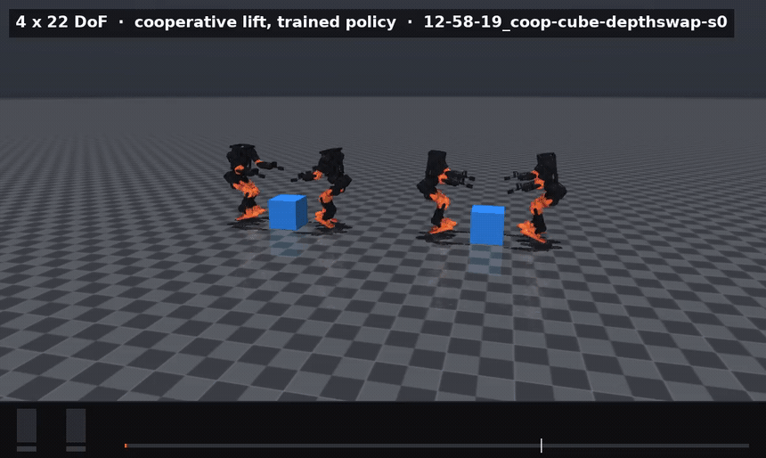
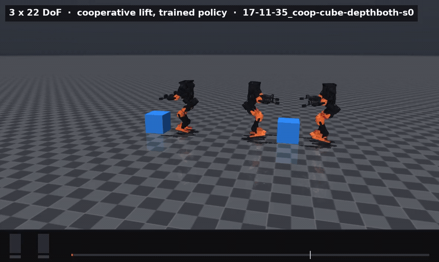

# Every clip, in one place

All 23 are MuJoCo. Isaac Sim has never written a frame in this project — see
[the note at the bottom](#why-none-of-these-are-isaac). Each is a real scored
episode from the same harness that produced the numbers, except `squat_pick`,
which says on its face that it is scripted.

Pick the ones you want on the front page and tell me the names.

---

## Locomotion — the pair tests

Two policies, one command, one world. Left is the intervention, right the
control.

| | |
|---|---|
|  | **`dr_pair`** — identical strafe. Left `s=1.0`, right `s=0`. Neither policy ever saw MuJoCo in training. |
|  | **`push_pair`** — identical 0.5 m/s shoves. Left has a push curriculum. **0/6 falls against 3/6.** |
|  | **`terrain_pair`** — rough ground at `d = 0.80`. Left terrain-trained, right flat-trained with the same randomization. **0/6 against 3/6.** |
|  | **`arms_dr_pair`** — the same three comparisons on the 22-DoF body. At `d = 1.0` the humanoid falls 11.7% where the biped falls 37.8%. |
|  | **`arms_push_pair`** — 12 DoF against 22. The arms move angular momentum away from the legs: worth 0.2 m/s of shove rejection, and free. |
|  | **`arms_terrain_pair`** — arms on rough ground. |

## Four policies at once

| | |
|---|---|
|  | **`multi_race`** — four policies, identical 0.45 m/s shoves. Same solver, same clock, not a composite. The un-randomized robot is the one on the ground. |
|  | **`multi_lab`** — the current README hero. Four colour-coded policies crossing plank, beam and ramp, with the orange robot's egocentric depth and a scrolling waterfall along the bottom. **14 MB.** |

## Depth

| | |
|---|---|
|  | **`depth_pair`** — left the scored episode, right the robot's own 64×64 depth. This is MuJoCo's offscreen depth buffer, not Isaac's ray-caster: a different renderer and a different projection. |

## The cooperative lift — what it looks like when it fails

| | |
|---|---|
|  | **`squat_pick`** — scripted joint interpolation, not a policy. The control for every failure below: the pose exists and is reachable. |
|  | **`carry_3`** — left the scripted reachability check, right the learned thing. The gap between those two clips is the finding. |
|  | **`carry_2`** — one pair closing on the cube. |
|  | **`carry_4`** — one pair against two running the same policy. The pinch forms, the lift does not. Each clip is the seed that stays upright longest out of twelve. |

## Robot POV — colour, raw depth, and the 8×8 the network sees

| | |
|---|---|
|  | **`carry_cube_pov`** — the best rollout in the project. 7.8 cm of lift, hands inside the pinch gate 98% of the time, 12 s without a fall. Also a controlled collapse: the pair drops 41 cm before contact. |
|  | **`carry_ball_native_pov`** — the 21 cm arm cross-checked in the other engine. It falls at 0.72 s having never touched the ball. |
|  | **`carry_ball_transfer_pov`** — the same arm, transfer condition. |
|  | **`carry_ladder_pov`** — the plank. 12 seeds of 12 at 0.0 cm, closest approach 39 cm. The contact points are further apart than shoulders that cannot adduct past 36 cm can span. |

## Vision made it worse

| | |
|---|---|
|  | **`carry_vision_swap_2`** — left blind, right depth *replacing* the object pose. The red outline is a fall, held for the rest of the clip. |
|  | **`carry_vision_swap_3`** — three pairs, same comparison. |
|  | **`carry_vision_both_4`** — depth *added alongside* the pose. The cube is plainly visible in every depth pane. They are not failing to see it; they are failing to act on 64 pooled numbers. |
|  | **`carry_vision_both_2`** — the two-robot version. |
|  | **`carry_vision_swap_4`** — currently unused anywhere. |
|  | **`carry_vision_both_3`** — currently unused anywhere. |

---

## Why none of these are Isaac

Isaac Sim has produced **zero** video files here. Not because its renderer is
broken — Vulkan comes up fine on the A40, and RTX initialises — but because six
attempts have each died in the policy-loading path of `train_play.py` before
the rollout that would draw a frame:

| # | died on |
|---|---|
| 1 | 4 s, empty log |
| 2 | `FileNotFoundError` — log root resolved against the wrong directory |
| 3 | `MLPModel.__init__() got an unexpected keyword argument 'stochastic'` |
| 4 | `AttributeError: 'PPO' object has no attribute 'policy'` |
| 5 | `AttributeError: 'CoopLiftSceneCfg' object has no attribute 'robot'` |
| 6 | in progress |

Every one is the same shape: a line written for the single-robot locomotion
task on rsl-rl 3.0.1, running against a two-robot task on rsl-rl 5.0.1. Attempt
5 got far enough to attach the video recorder and name the output folder, so
what remains is a short stretch of file, not a renderer problem.

The MuJoCo path was never a fallback. It scores in a different simulator from
the one that trained, which is the point of the project, and it has produced
every clip on this page without needing an RTX context.
