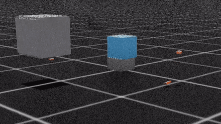
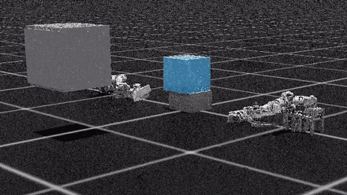

# Every clip, with what made it

**23 clips from MuJoCo, 2 from Isaac Sim.** Renderer is in the folder name:
`docs/gifs/` is MuJoCo, `docs/gifs/isaac/` is Isaac Sim. Every clip is a real
scored episode from the harness that produced the numbers, except `squat_pick`,
which says on its face that it is scripted.

Tell me which names you want on the front page.

## Index

| clip | renderer | task / rung | verdict |
|---|---|---|---|
| [`dr_pair`](#locomotion) | MuJoCo | domain randomization | **works** |
| [`push_pair`](#locomotion) | MuJoCo | push curriculum | **works** |
| [`terrain_pair`](#locomotion) | MuJoCo | terrain curriculum | **works** |
| [`arms_dr_pair`](#locomotion) | MuJoCo | 22-DoF vs 12-DoF, randomization | **works** |
| [`arms_push_pair`](#locomotion) | MuJoCo | 22-DoF vs 12-DoF, shove | **works** |
| [`arms_terrain_pair`](#locomotion) | MuJoCo | 22-DoF vs 12-DoF, terrain | **works** |
| [`multi_race`](#four-policies-at-once) | MuJoCo | 4 policies, one shove | **works** |
| [`multi_lab`](#four-policies-at-once) | MuJoCo | 4 policies, obstacle course + depth | **works** |
| [`depth_pair`](#depth) | MuJoCo | ray-cast depth | **works** |
| [`squat_pick`](#the-cooperative-lift) | MuJoCo | scripted reachability control | n/a — scripted |
| [`carry_2`](#the-cooperative-lift) | MuJoCo | cooperative cube lift | **fails** |
| [`carry_3`](#the-cooperative-lift) | MuJoCo | learned vs scripted | **fails** |
| [`carry_4`](#the-cooperative-lift) | MuJoCo | one pair vs two | **fails** |
| [`carry_cube_pov`](#robot-pov) | MuJoCo | cube lift, POV | **fails** — best is 7.8 cm |
| [`carry_ball_native_pov`](#robot-pov) | MuJoCo | ball lift, POV | **fails** — 0/6 seeds |
| [`carry_ball_transfer_pov`](#robot-pov) | MuJoCo | ball, transfer condition | **fails** |
| [`carry_ladder_pov`](#robot-pov) | MuJoCo | plank lift, POV | **fails** — 0.0 cm, 18 seeds |
| [`carry_vision_swap_2`](#vision-made-it-worse) | MuJoCo | depth replacing object pose | **fails** |
| [`carry_vision_swap_3`](#vision-made-it-worse) | MuJoCo | same, three pairs | **fails** |
| [`carry_vision_swap_4`](#vision-made-it-worse) | MuJoCo | same, four pairs — unused | **fails** |
| [`carry_vision_both_2`](#vision-made-it-worse) | MuJoCo | depth alongside object pose | **fails** |
| [`carry_vision_both_3`](#vision-made-it-worse) | MuJoCo | same, three pairs — unused | **fails** |
| [`carry_vision_both_4`](#vision-made-it-worse) | MuJoCo | same, four pairs | **fails** |
| [`isaac/cubetoshelf_gripper`](#isaac-sim) | **Isaac Sim** | v2 CubeToShelf, 24-DoF gripper | **fails** — survives, never lifts |
| [`isaac/cubetoshelf_welded`](#isaac-sim) | **Isaac Sim** | v2 CubeToShelf, welded hands | **fails** — ~8 steps |

---

## Locomotion

Two policies, one command, one world. Left is the intervention, right the control.

| | |
|---|---|
|  | **`dr_pair`** — identical strafe. Left `s=1.0`, right `s=0`. Neither policy ever saw MuJoCo in training. |
|  | **`push_pair`** — identical 0.5 m/s shoves. Left has a push curriculum. **0/6 falls against 3/6.** |
|  | **`terrain_pair`** — rough ground at `d = 0.80`. Left terrain-trained, right flat-trained. **0/6 against 3/6.** |
|  | **`arms_dr_pair`** — the same three comparisons on the 22-DoF body. At `d = 1.0` the humanoid falls 11.7% where the biped falls 37.8%. |
|  | **`arms_push_pair`** — 12 DoF against 22. Arms move angular momentum away from the legs: 0.2 m/s of shove rejection, free. |
|  | **`arms_terrain_pair`** — arms on rough ground. |

## Four policies at once

| | |
|---|---|
|  | **`multi_race`** — identical 0.45 m/s shoves. Same solver, same clock, not a composite. The un-randomized robot is the one on the ground. |
|  | **`multi_lab`** — current README hero. Four colour-coded policies crossing plank, beam and ramp, with the orange robot's egocentric depth along the bottom. **14 MB.** |

## Depth

| | |
|---|---|
|  | **`depth_pair`** — left the scored episode, right the robot's own 64×64 depth. MuJoCo's offscreen depth buffer, not Isaac's ray-caster. |

## The cooperative lift

| | |
|---|---|
|  | **`squat_pick`** — scripted joint interpolation, not a policy. The control for every failure below: the pose exists and is reachable. |
|  | **`carry_3`** — left the scripted check, right the learned thing. The gap is the finding. |
|  | **`carry_2`** — one pair closing on the cube. |
|  | **`carry_4`** — one pair against two. The pinch forms, the lift does not. Each is the seed that stays upright longest out of twelve. |

## Robot POV

Colour, raw 64×64 depth, and the 8×8 the network actually receives.

| | |
|---|---|
|  | **`carry_cube_pov`** — the best rollout in the project. 7.8 cm of lift, hands in the pinch gate 98% of the time, 12 s without a fall. Also a controlled collapse: the pair drops 41 cm before contact. |
|  | **`carry_ball_native_pov`** — the 21 cm arm cross-checked in the other engine. Falls at 0.72 s having never touched the ball. |
|  | **`carry_ball_transfer_pov`** — the same arm, transfer condition. |
|  | **`carry_ladder_pov`** — the plank. 18 seeds at 0.0 cm, closest approach 39 cm. Contact points are further apart than shoulders that cannot adduct past 36 cm can span. |

## Vision made it worse

| | |
|---|---|
|  | **`carry_vision_swap_2`** — left blind, right depth *replacing* the object pose. The red outline is a fall, held for the rest of the clip. |
|  | **`carry_vision_swap_3`** — three pairs. |
|  | **`carry_vision_both_4`** — depth *added alongside* the pose. The cube is plainly visible in every depth pane. They are not failing to see it. |
|  | **`carry_vision_both_2`** — two robots. |
|  | **`carry_vision_swap_4`** — unused anywhere. |
|  | **`carry_vision_both_3`** — unused anywhere. |

## Isaac Sim

The only two clips in this repo that Isaac rendered, and the first frames it has
ever produced here. PhysX/RTX, 1280×720, cropped to the subject and denoised —
the path-traced floor grain makes an uncropped GIF 25 MB.

They are unflattering and that is the result. The grey box is the shelf, the
blue box the cube, and the small orange shapes are the robots — **lying down**.
Success is 0 on this task either way; the gripper arm's contribution is that it
stays alive for 427 steps against 8 while doing it.

| | |
|---|---|
|  | **`isaac/cubetoshelf_gripper`** — `TaskV2-BHL-CubeToShelfGrip-Blind-v0`, the 24-DoF gripper asset. |
|  | **`isaac/cubetoshelf_welded`** — `TaskV2-BHL-CubeToShelf-Blind-v0`, the shipped welded-hand asset. |

Framing is still wide — the viewer camera is set from `BHL_VIEW_EYE` /
`BHL_VIEW_LOOKAT` (colon-separated; both `sbatch --export` and Apptainer's
`--env` split on commas) and has not been tuned. The source mp4s are 77–88 MB
and stay out of the repo.
