# Every clip, with what made it

Renderer is in the folder name:
`docs/gifs/` is MuJoCo, `docs/gifs/isaac/` is Isaac Sim. Every clip is a real
scored episode from the harness that produced the numbers, except `squat_pick`,
which says on its face that it is scripted.

## September 24: three-panel maze clips (top view + the robot's own sensors)

| Actual recording | Result and scope |
|---|---|
| [Inspection maze, three panels](gifs/inspection-maze-panels.gif) · [MP4 (1×, not in git)](../results/repo-gpu-20260923/maze-panels/inspection-maze-panels.mp4) · [sidecar](gifs/inspection-maze-panels.json) | The README's episode (seed 0, ordered route, reactive sensor brake) **re-run through the same harness** with a per-step recorder: completed at **17.36 s, the recording's time to the hundredth**, 2 stations, 0 wall contacts. Main view: overhead render of the textured world (materials and lights only; geometry and contact arrays checked identical to the plain world). Right column: a robot-eye render (for the viewer, not an input), the stereo rig's 8×8 **paired ray depth** (no RGB matching) and the **36-sector lidar** exactly as the speed brake received them at 10 Hz; "brake ×0.57" shows the brake acting near the exit wall. Gait: learned PPO, frozen; route: oracle waypoints. GIF plays at 2× (badged); 1.19 MB |
# Every clip, with what made it

Renderer is in the folder name:
`docs/gifs/` is MuJoCo, `docs/gifs/isaac/` is Isaac Sim. Every clip is a real
scored episode from the harness that produced the numbers, except `squat_pick`,
which says on its face that it is scripted.

## September 24: three-panel maze clips (top view + the robot's own sensors)

| Actual recording | Result and scope |
|---|---|
| [Inspection maze, three panels](gifs/inspection-maze-panels.gif) · [MP4 (1×, not in git)](../results/repo-gpu-20260923/maze-panels/inspection-maze-panels.mp4) · [sidecar](gifs/inspection-maze-panels.json) | The README's episode (seed 0, ordered route, reactive sensor brake) **re-run through the same harness** with a per-step recorder: completed at **17.36 s, the recording's time to the hundredth**, 2 stations, 0 wall contacts. Main view: overhead render of the textured world (materials and lights only; geometry and contact arrays checked identical to the plain world). Right column: a robot-eye render (for the viewer, not an input), the stereo rig's 8×8 **paired ray depth** (no RGB matching) and the **36-sector lidar** exactly as the speed brake received them at 10 Hz; "brake ×0.57" shows the brake acting near the exit wall. Gait: learned PPO, frozen; route: oracle waypoints. GIF plays at 2× (badged); 1.19 MB |
# Every clip, with what made it

Renderer is in the folder name:
`docs/gifs/` is MuJoCo, `docs/gifs/isaac/` is Isaac Sim. Every clip is a real
scored episode from the harness that produced the numbers, except `squat_pick`,
which says on its face that it is scripted.

## September 24: three-panel maze clips (top view + the robot's own sensors)

| Actual recording | Result and scope |
|---|---|
| [Inspection maze, three panels](gifs/inspection-maze-panels.gif) · [MP4 (1×, not in git)](../results/repo-gpu-20260923/maze-panels/inspection-maze-panels.mp4) · [sidecar](gifs/inspection-maze-panels.json) | The README's episode (seed 0, ordered route, reactive sensor brake) **re-run through the same harness** with a per-step recorder: completed at **17.36 s, the recording's time to the hundredth**, 2 stations, 0 wall contacts. Main view: overhead render of the textured world (materials and lights only; geometry and contact arrays checked identical to the plain world). Right column: a robot-eye render (for the viewer, not an input), the stereo rig's 8×8 **paired ray depth** (no RGB matching) and the **36-sector lidar** exactly as the speed brake received them at 10 Hz; "brake ×0.57" shows the brake acting near the exit wall. Gait: learned PPO, frozen; route: oracle waypoints. GIF plays at 2× (badged); 1.19 MB |
# Every clip, with what made it

Renderer is in the folder name:
`docs/gifs/` is MuJoCo, `docs/gifs/isaac/` is Isaac Sim. Every clip is a real
scored episode from the harness that produced the numbers, except `squat_pick`,
which says on its face that it is scripted.

## September 24: three-panel maze clips (top view + the robot's own sensors)

| Actual recording | Result and scope |
|---|---|
| [Inspection maze, three panels](gifs/inspection-maze-panels.gif) · [MP4 (1×, not in git)](../results/repo-gpu-20260923/maze-panels/inspection-maze-panels.mp4) · [sidecar](gifs/inspection-maze-panels.json) | The README's episode (seed 0, ordered route, reactive sensor brake) **re-run through the same harness** with a per-step recorder: completed at **17.36 s, the recording's time to the hundredth**, 2 stations, 0 wall contacts. Main view: overhead render of the textured world (materials and lights only; geometry and contact arrays checked identical to the plain world). Right column: a robot-eye render (for the viewer, not an input), the stereo rig's 8×8 **paired ray depth** (no RGB matching) and the **36-sector lidar** exactly as the speed brake received them at 10 Hz; "brake ×0.57" shows the brake acting near the exit wall. Gait: learned PPO, frozen; route: oracle waypoints. GIF plays at 2× (badged); 1.19 MB |
| [Isaac B5 maze, three panels](gifs/isaac/maze_both_panels.gif) · [sidecar](gifs/isaac/maze_both_panels.json) | The published **Full-stage `Both` s0 policy** (380/384 noise-on rescore) at seed 100, training noise on, reaching the button in **6.44 s** (161 steps, 1×). Main view: a fixed overhead RTX camera over the corridor. Right column: the stereo pair's **ray depth** (64×64 per eye, no RGB matching) with the pooled 4×4 the policy actually reads, and the **36 lidar sectors** the policy reads with the 500 raw hits behind them — these two are the policy's inputs, unlike the MuJoCo row above where they only drive a brake. Heading comes from the oracle waypoint teacher. **Rendered with path tracing through the OptiX denoiser** (`maze_record.py --render-quality pathtrace`): spatial grain 0.32 against 36 for every earlier Isaac clip, so no denoise pass was applied. **First pass, over-exposed:** the path tracer washes the overlay colours to white under the stock lights; the second pass (`21408711`: lights ×0.3 with an auto-exposure trim, checker floor, corridor crop) replaces this file when it passes the same bar; 0.91 MB |

Why every earlier Isaac clip is speckled: this stack renders RealTimePathTracing at 1 spp and leaves the clean-up to an NGX denoiser that does not initialise on these nodes; `docs/ISAAC_RENDER.md` §12 has the measurements. Why the September 20 GIF below looks flat: it was rendered from the plain world (one point light, untextured grey walls on a navy floor, no skybox) from 8.6 m away at 720 px, then quantised to 64 colours. The clip above is the same run with a checker floor, brick-textured walls, shadows and a closer overhead camera; none of that touches the physics.

## September 20: mission demos and a rejected route

| Actual recording | Result and scope |
|---|---|
| [Inspection GIF](gifs/weekend-inspection.gif) · [MP4](../results/weekend-20260919/inspection-maze.mp4) | Two ordered dwells and exit; frozen gait, oracle waypoints, actual sensor braking; 17.36 s recording |
| [Wrong-branch GIF](gifs/weekend-inspection-failure.gif) · [MP4](../results/weekend-20260919/inspection-maze-failure.mp4) | Intentional supervisor-error control, rejected at 7.00 s; not a learned-policy or renderer failure |
| [Three-robot GIF](gifs/weekend-team3.gif) · [MP4](../results/weekend-20260919/team3-airlock.mp4) | Shared-world inspection, synchronization, crossing and rendezvous; original 30.68 s completion; GIF labelled 1.1× |

Adjacent GIF JSON sidecars contain source hashes, scores and playback speed.
These use the older full-body gait, not the new Isaac maze checkpoints.
The [dated results](WEEKEND_RESULTS_2026-09-20.md) link their multi-seed controls.
Existing `multi_race` and `dr_pair` below show learned-policy successes and
falls. New folding-policy media from the September 20 array was **cancelled**, not
blocked (`21360436`/`21360437`, CANCELLED 2026-09-20); one repaired episode
rendered (`21367715`, fold failed). Folding now runs in the linked repository's
own campaigns — see [`CLOTH_FOLDING_WEEKEND.md`](CLOTH_FOLDING_WEEKEND.md). Do not relabel old
replay controls as current adaptation successes.

## September 23: Mission 7 — one layout, the stall and the crossing fix

> Re-rendered 2026-09-24 from the same deterministic episodes with an overhead camera: the first renders used a tracking camera that sat behind the maze walls and showed only wall. The red outline now marks the failing panel.

| Actual recording | Result and scope |
|---|---|
| Approach −x centring [GIF](gifs/mission7-approach-negx-centering.gif) (overhead camera, re-rendered 2026-09-24) · [baseline MP4](../results/mission7-campaign-20260923/media/overhead/approach-negx14-baseline.mp4) · [centred MP4](../results/mission7-campaign-20260923/media/overhead/approach-negx14-centered.mp4) | Left: the evaluated 0.50 m/s privileged recovery controller strikes `goal_post_-1` on its first stride and is rejected at 2.12 s. Right: gap-midline centring with a +0.015 m pre-bias passes the same layout at 4.40 s. Both reproduce the evaluated episodes (reset order replayed). **Gate passed on the full matrix: 62/64, 0 falls, 16/16/16/14** (`21401966`), geometry, spawn and predicates unchanged; privileged pose, scripted centring, frozen gait. [Sidecar](gifs/mission7-approach-negx-centering.json). |
| Doors/1 stall vs crossing fix [GIF](gifs/mission7-doors1-stall-vs-crossing-fix.gif) (overhead camera, 18 s at 4×, re-rendered 2026-09-24) · [baseline MP4](../results/mission7-campaign-20260923/media/overhead/doors1-baseline-stall.mp4) · [fix MP4](../results/mission7-campaign-20260923/media/overhead/doors1-crossing-fix-success.mp4) | Left: the unchanged guarded plate stage hands back on the plate edge and the frozen gait settles into its standing fixed point (recording stopped at 70 s of a 180 s timeout). Right: the same layout with the stage-owned crossing — `prev_actions` kick, cross-until-clear, centre-aimed exit ramp, waypoint advance — completes at 77.7 s. Deterministic reruns of one development layout; GIF at 1.94×. **Not a promoted candidate:** the crossing fails the exact ten-fall replay regression (7/10 to 9/10 across variants) and was never evaluated on the route rate. The [sidecar](gifs/mission7-doors1-stall-vs-crossing-fix.json) carries source hashes, outcomes and configurations. |

The learned-policy Mission 7 results remain 0/16 validation success; the route
controller evidence lives in [`MISSION7_TASKS.md`](MISSION7_TASKS.md).

> **Corrections, 2026-09-23.** A repository-wide audit checked every entry
> below against its own evidence files. Corrected here: `arms_push_pair`
> (caption and GIF labels inverted the n=60 result), `arms_dr_pair` (quoted a
> terrain-sweep number on a flat clip), `ice_pair` / `ice_pair_placed` (the
> MuJoCo renders are flat ground; the harness has no ice world),
> `multi_lab` (course description), `carry_ladder_pov` (12 seeds, not 18) and
> `isaac/maze_stereo_fixed` (seed-0 vs 3-seed-mean comparison; the corrected
> stereo arm is a null result against blind). Full mapping:
> [`REPO_TASKS.md`](REPO_TASKS.md).

## Index

| clip | renderer | task / rung | verdict |
|---|---|---|---|
| mission7/approach_negx_centering | MuJoCo | Mission 7 privileged Approach, world −x, test layout 14 | works — gate passed 62/64, 0 falls (privileged pose, scripted centring, frozen gait) |
| mission7/doors1_stall_vs_crossing_fix | MuJoCo | Mission 7 Doors, validation layout 1 | render works — the crossing fix reaches the goal on this layout; not promoted (replay regression 7–9/10) |
| [`dr_pair`](#locomotion) | MuJoCo | domain randomization | **works** |
| [`push_pair`](#locomotion) | MuJoCo | push curriculum | **works** — matched-protocol check with three seeds (2026-09-24): push-adaptive 0.122 vs no-push control 0.211 (n = 90 / 90, p = 0.08), supported in direction only |
| [`terrain_pair`](#locomotion) | MuJoCo | terrain curriculum | **works** |
| [`arms_dr_pair`](#locomotion) | MuJoCo | 22-DoF, randomization s=1.0 vs s=0 | **works** — walk vs walk by design (0/60 falls each on flat; two training seeds) |
| [`arms_push_pair`](#locomotion) | MuJoCo | 22-DoF push-trained vs DR-only, shove | render works — **no detectable effect of push training** at four seeds: arms-push 0.167 (n = 120) vs DR-only 0.117 (n = 60), p = 0.87 / 0.26 either way; caption corrected 2026-09-23, seeds added 2026-09-24 |
| [`arms_terrain_pair`](#locomotion) | MuJoCo | 22-DoF vs 12-DoF, terrain | **works** |
| [`multi_race`](#four-policies-at-once) | MuJoCo | 4 policies, one shove | **works** |
| [`multi_lab`](#four-policies-at-once) | MuJoCo | 4 policies, obstacle course + depth | render works — **course cleared 5/20 (22 DoF) and 2/20 (12 DoF) over 5 seeds**, not reliably |
| [`depth_pair`](#depth) | MuJoCo | ray-cast depth | **works** |
| [`ice_pair`](#b3--ice) | MuJoCo | B3 — blind vs depth policies, rendered on **flat MuJoCo ground** (the harness has no ice world) | render works — **result retracted**: in training the ice was never under the robots ([probe verdict](../results/ice_placement_probe_21328532.txt)) |
| [`ice_pair_placed`](#b3--ice) | MuJoCo | B3 — policies retrained with patches at terrain origins (median 0.8 m), rendered on **flat MuJoCo ground** | **works as a render of the placed policies**; n=2, depth terrain level 2.92 vs blind 2.59 |
| [`isaac/maze_recovery_pair`](#terrain-sensing-the-b5-maze-rung) | Isaac Sim | B5 maze recovery, Full stage: the 380/384 `Both` s0 policy reaching the button (left) and the `Blind` s1 policy falling (right), seeds 100/101, training noise on | **works** — recorded 2026-09-24, verdicts from the episode JSONs; raw frames denoised (1 spp RTX) |
| [`isaac/maze_stereo_fixed`](#terrain-sensing-the-b5-maze-rung) | Isaac Sim | B5 — the corrected 16×16 stereo policy, and what its camera saw before and after the fix | render works — seed-0 terrain level 0.877 vs pre-fix seed 0 0.001; corrected 3-seed mean 0.774 sits inside blind's 0.545–1.037, so it shows the camera fix, **not a stereo advantage** |
| [`isaac/mazenav_seed0`](#terrain-sensing-the-b5-maze-rung) | Isaac Sim | B5 navigation — seed-0 blind/lidar/stereo/both in the fused-mesh corridor | **walks, does not reach the button** — button 0/12 |
| [`isaac/terrain_sensors`](#terrain-sensing-the-b5-maze-rung) | Isaac Sim | B5 — blind, lidar, stereo at two widths | render only — the result is the table, not the clip |
| [`isaac/cloth_sort_free_base_shirt`](#cloth-sorting-free-base) | Isaac Sim | cloth-sort C0, scripted sweep, rigid shirt proxy, **free-standing robot**, two sweeps | **works** — free base 22/24 on balance v2 |
| [`isaac/cloth_sort_free_base_jacket`](#cloth-sorting-free-base) | Isaac Sim | cloth-sort C0, scripted sweep, rigid jacket proxy, **free-standing robot** | **works** — jacket 8/8 free-base |
| [`isaac/cloth_sort_fixed_base`](#cloth-sorting-fixed-base-diagnostic) | Isaac Sim | cloth-sort C0, scripted sweep, rigid shirt proxy, **root pinned** | **works** — 32/32 on this layout; not cloth, not a standing robot |
| [`squat_pick`](#the-cooperative-lift) | MuJoCo | scripted reachability control | n/a — scripted |
| [`carry_2`](#the-cooperative-lift) | MuJoCo | cooperative cube lift | **fails** |
| [`carry_3`](#the-cooperative-lift) | MuJoCo | learned vs scripted | **fails** |
| [`carry_4`](#the-cooperative-lift) | MuJoCo | one pair vs two | **fails** |
| [`carry_cube_pov`](#robot-pov) | MuJoCo | cube lift, POV | **fails** — best is 7.8 cm |
| [`carry_ball_native_pov`](#robot-pov) | MuJoCo | ball lift, POV | **fails** — 0/6 seeds |
| [`carry_ball_transfer_pov`](#robot-pov) | MuJoCo | ball, transfer condition | **fails** |
| [`carry_ladder_pov`](#robot-pov) | MuJoCo | plank lift, POV | **fails** — 0.0 cm, 12 seeds |
| [`carry_vision_swap_2`](#vision-made-it-worse) | MuJoCo | depth replacing object pose | **fails** |
| [`carry_vision_swap_3`](#vision-made-it-worse) | MuJoCo | same, three pairs | **fails** |
| [`carry_vision_swap_4`](#vision-made-it-worse) | MuJoCo | same, four pairs — unused | **fails** |
| [`carry_vision_both_2`](#vision-made-it-worse) | MuJoCo | depth alongside object pose | **fails** |
| [`carry_vision_both_3`](#vision-made-it-worse) | MuJoCo | same, three pairs — unused | **fails** |
| [`carry_vision_both_4`](#vision-made-it-worse) | MuJoCo | same, four pairs | **fails** |
| [`occlusion_s0_lifted_pov`](#the-occlusion-seed-cross-checked) | MuJoCo | occlusion, the seed that lifted | **fails in MuJoCo** |
| [`occlusion_s1_flat_pov`](#the-occlusion-seed-cross-checked) | MuJoCo | occlusion, a flat sibling | holds the pinch, never lifts |
| [`isaac/cubetoshelf_upright_welded`](#isaac-sim) | **Isaac Sim** | v2 CubeToShelf, corrected spawn | spawns underground, extruded upward — see retraction |
| [`isaac/cubetoshelf_upright_gripper`](#isaac-sim) | **Isaac Sim** | same, 24-DoF gripper | spawns underground |
| [`isaac/cubetoshelf_gripper`](#isaac-sim) | **Isaac Sim** | v2 CubeToShelf, 24-DoF gripper | **fails** — survives, never lifts |
| [`isaac/cubetoshelf_welded`](#isaac-sim) | **Isaac Sim** | v2 CubeToShelf, welded hands | **fails** — ~8 steps |

---

## Locomotion

Two policies, one command, one world. Left is the intervention, right the control.

| | |
|---|---|
|  | **`dr_pair`** — identical strafe. Left `s=1.0`, right `s=0`. Neither policy ever saw MuJoCo in training. |
|  | **`push_pair`** — identical 0.5 m/s shoves. Left has a push curriculum. **0/6 falls against 3/6.** |
|  | **`terrain_pair`** — rough ground at `d = 0.80`. Left terrain-trained, right flat-trained. **0/6 against 3/6.** |
|  | **`arms_dr_pair`** — the same three comparisons on the 22-DoF body. A walk-vs-walk strafe by design: on flat ground the 22-DoF body falls 0/60 at both s=1.0 and s=0, where the 12-DoF biped at s=0 falls 21/90. (The 11.7 % vs 37.8 % comparison belongs to the terrain sweep, `arms_terrain_pair`, and mixes n=60 with n=90.) Two training seeds. |
|  | **`arms_push_pair`** — **caption corrected 2026-09-23.** 22-DoF push-trained (left) against 22-DoF DR-only (right) under the same 0.5 m/s shove. This clip is the one command of six in the filming run where the ordering favours push training; over n=60 the push-trained policy falls **more** (0.15) than the DR-only control (0.10), and in the filming run itself 2/6 against 1/6. No push benefit is shown on the 22-DoF body. The earlier caption ('0.2 m/s of shove rejection, free') transplanted a biped training-side finding and inverted this result. [Sidecar](gifs/arms_push_pair.json). |
|  | **`arms_terrain_pair`** — arms on rough ground. |

## Four policies at once

| | |
|---|---|
|  | **`multi_race`** — identical 0.45 m/s shoves. Same solver, same clock, not a composite. The un-randomized robot is the one on the ground. |
|  | **`multi_lab`** — current README hero. Four colour-coded policies on a carpet, cable, threshold and ramp course (the clip is one rollout per policy; a 5-seed rerun, [`lab_traverse_5seed.json`](../results/lab-traverse-20260923/lab_traverse_5seed.json), finishes the course 1/5, 0/5, 2/5, 2/5 for randomized, no-randomization, push-trained and terrain-trained on 22 DoF and 0/5, 0/5, 0/5, 2/5 on 12 DoF: the course is cleared sometimes, not reliably, and the no-randomization 22-DoF policy stalls past the carpet every time), with the orange robot's egocentric depth along the bottom. **14 MB.** |

## Depth

| | |
|---|---|
|  | **`depth_pair`** — left the scored episode, right the robot's own 64×64 depth. MuJoCo's offscreen depth buffer, not Isaac's ray-caster. |

## B3 — ice

> **Retracted, 2026-09-14.** In Isaac training the patches spawned a median 72 m
> from the robots, and 4.4% could have reached one in an episode
> (`scripts/bench/ice_placement_probe.py`, FINDINGS *Ice*). `ice_pair` is those
> policies, trained on bumpy ground, dropped onto ice in MuJoCo.
>
> **Placed, 2026-09-17.** Probe `21342561` put the patches at the terrain origins
> (median 0.8 m, reachable 1.000). `ice_pair_placed` is the retrained pair.

The old +10.6% (depth 1.519 against blind 1.374) was measured on bumpy tiles.
On the actual ice, last-50 terrain level is depth **2.92** against blind **2.59**
(n=2). Visible-ice matches blind seed-for-seed (proprioception-only).

It had no clip because `render_multi` could not drive a depth-conditioned
policy: upstream's controller assembles the observation from raw pieces and
knows nothing about depth, so a 301-wide network was handed 45 numbers and the
run raised before drawing a frame. `DepthRlController` appends the term where
Isaac puts it — after `prev_actions` — and the clip is the same harness that
produced the numbers.

| | |
|---|---|
| 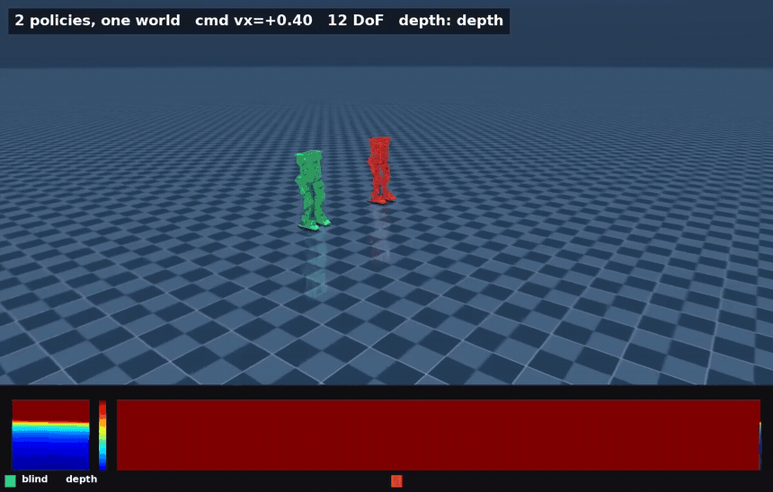 | **`ice_pair`** — green blind, red depth, identical command. Along the bottom is the depth robot's own egocentric view and a scrolling waterfall of the centre column. **14 MB.** Retracted as evidence about ice: the patches were 72 m away in training ([probe verdict](../results/ice_placement_probe_21328532.txt)). **The MuJoCo harness has no ice world, so this clip is plain flat ground** — it shows two policies walking, not ice handling. |
| 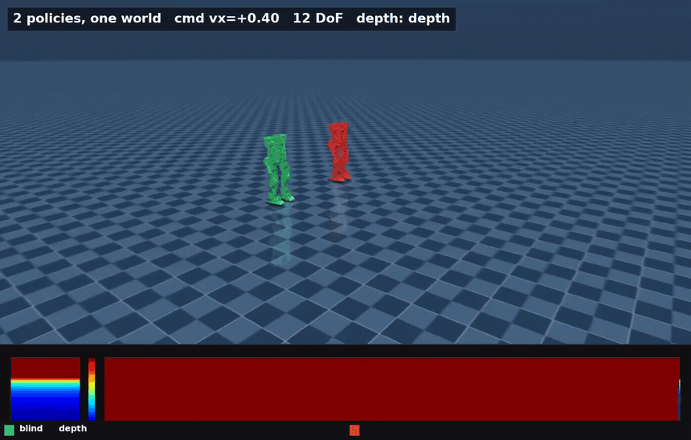 | **`ice_pair_placed`** — the same pair after `21342561` put the patches at the terrain origins (median 0.8 m, reachable 1.000). Both stay upright; peak x +4.66 m (blind) / +4.45 m (depth). Job `21352982`. Last-50 terrain level: depth 2.92 against blind 2.59 (n=2, 'visible' bitwise-identical to blind). **Rendered on flat MuJoCo ground (no ice in the harness)** — the clip shows two upright policies, not ice handling; whether the training rung exercised the patches is the open exposure probe. **13 MB.** |

## The cooperative lift

| | |
|---|---|
|  | **`squat_pick`** — scripted joint interpolation, not a policy. The control for every failure below: the pose exists and is reachable. |
|  | **`carry_3`** — left the scripted check, right the learned thing. The gap is the finding. |
|  | **`carry_2`** — one pair closing on the cube. |
|  | **`carry_4`** — one pair against two. The pinch forms, the lift does not. Each is the seed that stays upright longest out of twelve. |

## Robot POV

Colour, raw 64×64 depth, and the 8×8 the network actually receives.

| | |
|---|---|
|  | **`carry_cube_pov`** — the best rollout in the project. 7.8 cm of lift, hands in the pinch gate 98% of the time, 12 s without a fall. Also a controlled collapse: the pair drops 41 cm before contact. |
|  | **`carry_ball_native_pov`** — the 21 cm arm cross-checked in the other engine. Falls at 0.72 s having never touched the ball. |
|  | **`carry_ball_transfer_pov`** — the same arm, transfer condition. |
|  | **`carry_ladder_pov`** — the plank. 12 seeds at 0.0 cm, closest approach 39 cm. Contact points are further apart than shoulders that cannot adduct past 36 cm can span. |

## Vision made it worse

| | |
|---|---|
|  | **`carry_vision_swap_2`** — left blind, right depth *replacing* the object pose. The red outline is a fall, held for the rest of the clip. |
|  | **`carry_vision_swap_3`** — three pairs. |
|  | **`carry_vision_both_4`** — depth *added alongside* the pose. The cube is plainly visible in every depth pane. They are not failing to see it. |
|  | **`carry_vision_both_2`** — two robots. |
|  | **`carry_vision_swap_4`** — unused anywhere. |
|  | **`carry_vision_both_3`** — unused anywhere. |

## The occlusion seed, cross-checked

Finding 7 is that the only cube arm which ever lifted is a single seed that did
not replicate. Replayed in the other engine it does worse than that: **the arm
that lifted is the one that falls.**

| | closest pinch | peak lift | in-pinch | fell |
|---|---|---|---|---|
| **s0** — reached 13 cm in Isaac | 0.251 m | 0.0 cm | **0%** | **yes, at 0.8 s** |
| **s1** — flat at the 4 cm floor in Isaac | 0.167 m | 0.0 cm | **96%** | no |

The seed that looked best in training never forms a pinch and goes down inside a
second; the seed that looked like a failure stays up and holds the pinch for
almost the whole episode. Same pattern as the ball arm in §1 — a result that
exists in one engine and not the other.

| | |
|---|---|
| 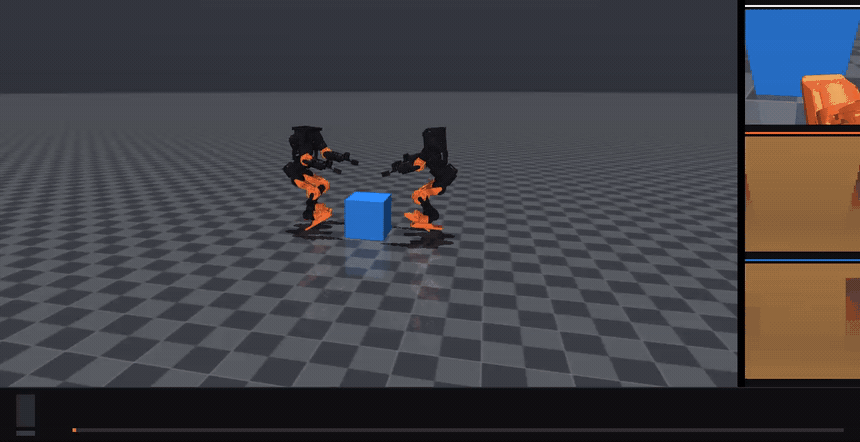 | **`occlusion_s0_lifted_pov`** — the 13 cm seed. Every pair down at 0.8 s. |
| 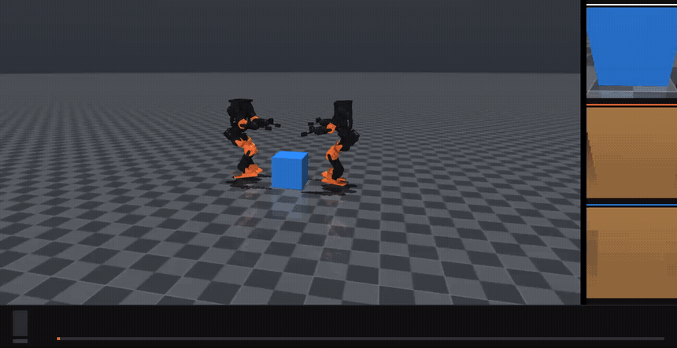 | **`occlusion_s1_flat_pov`** — the flat seed. Upright, pinch held 96% of the episode, 0.0 cm of lift. |

## Isaac Sim

These two historical clips were the first Isaac-rendered frames produced here.
PhysX/RTX, 1280×720, cropped to the subject and denoised —
the path-traced floor grain makes an uncropped GIF 25 MB.

They are unflattering and that is the result. The grey box is the shelf, the
blue box the cube, and the small orange shapes are the robots — **lying down**.
Success is 0 on this task either way; the gripper arm's contribution is that it
stays alive for 427 steps against 8 while doing it.

| | |
|---|---|
|  | **`isaac/cubetoshelf_gripper`** — `TaskV2-BHL-CubeToShelfGrip-Blind-v0`, the 24-DoF gripper asset. |
|  | **`isaac/cubetoshelf_welded`** — `TaskV2-BHL-CubeToShelf-Blind-v0`, the shipped welded-hand asset. |

### Terrain sensing (the B5 "maze" rung)

| | |
|---|---|
| 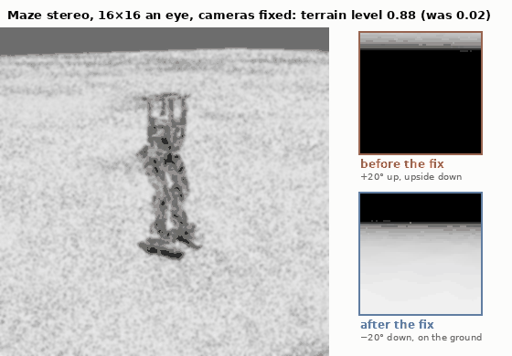 | **`isaac/maze_stereo_fixed`** — the stereo policy fed 16×16 an eye, retrained with its cameras pointed down (`mazefix-stereo-s0`, seed-0 terrain level 0.877 against 0.001 for pre-fix seed 0; 3-seed means 0.774 and 0.021). The corrected arm's mean sits inside blind's seed range 0.545–1.037, so this clip shows the camera fix, not a stereo advantage. Right, the left eye's 64×64 depth each frame, bright near and black at the 6 m limit. **Top: the pose every B5 run on Isaac Lab 3.0 had before `3f7b679`** — the quaternion read in the wrong order, 20° up and upside down, with ground only in a strip along the top. **Bottom: the corrected pose** this policy trained on. Both eyes ride the same robot in the same run (`21329137`). Cropped and lightly blurred, because the bumpy terrain is per-pixel noise GIF cannot compress. **9.5 MB.** |
| 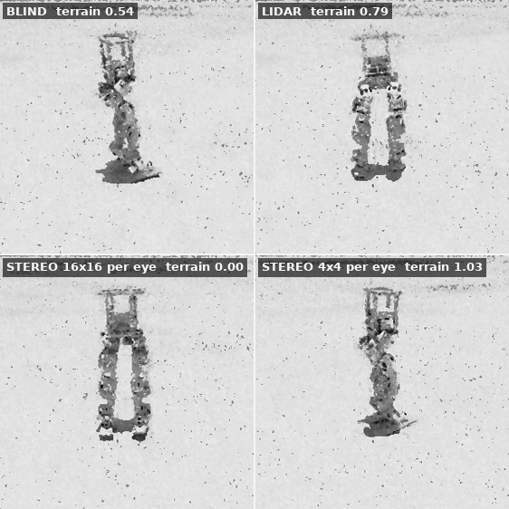 | **`isaac/terrain_sensors`** — the four seed-0 policies, each followed by its own camera: blind, lidar, stereo fed at 16×16 an eye, and stereo pooled to 4×4. Labels are each clip's own terrain level (3-seed means are in FINDINGS). **Watch it for what the policies look like, not for the result**: over twelve seconds all four walk, because the difference is how far the terrain curriculum promoted them, which one clip on one patch cannot show. There are no walls in shot because there never were any near the robots — see FINDINGS. **Both stereo policies here trained with their cameras looking 20° up, upside down** — `isaac/maze_stereo_fixed` above shows the difference (Isaac Lab 3.0 reads the pose quaternion in a different order; FINDINGS, *Terrain sensing*), so those two panels show what the policies did, not what stereo sees. Denoised and cropped from 640×360 path-traced frames. **10 MB.** |
| 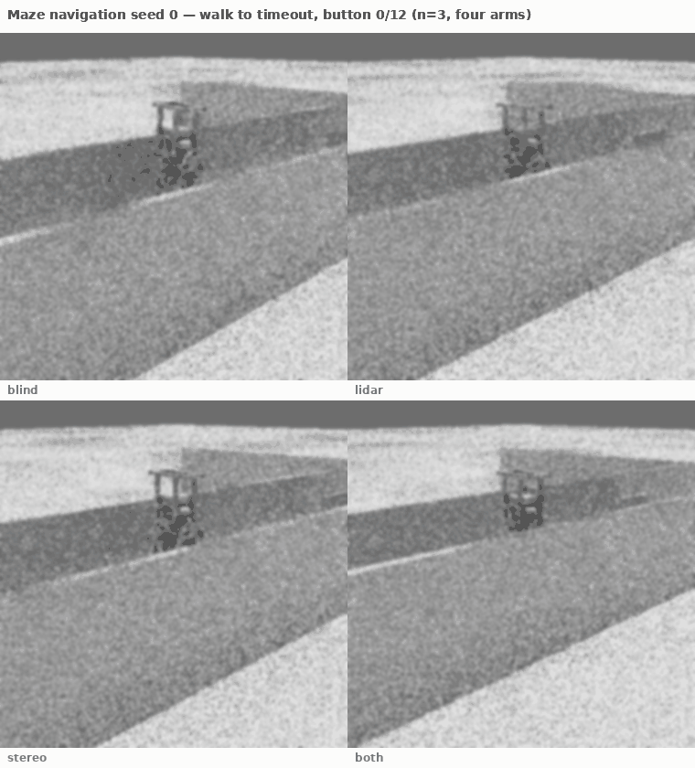 | **`isaac/mazenav_seed0`** — the four seed-0 *navigation* policies (`mazenav-{blind,lidar,stereo,both}-s0`) after the walls were fused into `/World/ground`. Robot in shot, walls in shot. They walk the corridor until timeout; they do not reach the plate. Job `21355466`, 200 frames an arm, cropped and blurred. **14 MB.** |

**How the render got fixed.** The first attempt (`21247917`) filmed corridors
and no robot. The viewport, which `RecordVideo` records, draws an articulation
at its stale USD pose when fabric is on — here the env's grid origin, tens of
metres from the terrain patch the robot walks on. A camera *sensor* draws the
body where physics has it (`21299608`), so `train_play` now records through
one; `docs/ISAAC_RENDER.md` §10 has the recipe.

### Cloth sorting, free base

| | |
|---|---|
| 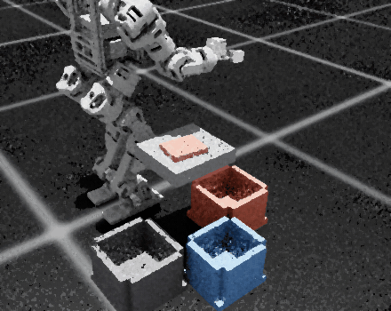 | **`isaac/cloth_sort_free_base_shirt`** — job `21330405`, balance v2 (`42ba537`). The free-standing robot's first sweep leaves the shirt proxy at the table's edge. The second, planned from where the shirt lay, drops it into the red basket. On balance v2 the free base sorts shirt 6/8, sock 8/8 and jacket 8/8 with no falls. A rigid box, not cloth. Real time at 10 fps. **7.0 MB.** |
| 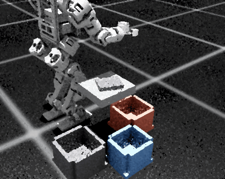 | **`isaac/cloth_sort_free_base_jacket`** — `ClothSort-BHL-Rigid-Oracle-v0` with `--garment jacket`, job `21329392`. **The robot is free-standing**: its legs hold a knee-bent stance with gravity feedforward and IMU ankle feedback (`bhl_robust.cloth.balance`), and the table stands 5.9 cm higher to match. The hand sweeps the dark jacket proxy off the table's back edge into the grey jackets basket. On balance v1 this layout sorted jackets 8/8 and socks 7/8 but shirts 1/8 (`21329260`–`262`); balance v2 brought the shirt to 6/8. A rigid box, not cloth. Frames brightened because the jacket is near-black. **3.8 MB.** |

### Cloth sorting, fixed-base diagnostic

| | |
|---|---|
| 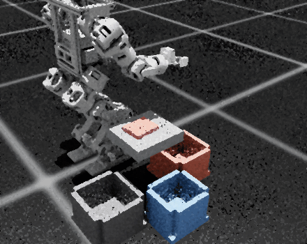 | **`isaac/cloth_sort_fixed_base`** — `ClothSort-BHL-RigidFixedBase-Oracle-v0`, job `21317391`. The scripted sweep: the right hand descends at an anchor beside the table, glides around the red shirt proxy, and sweeps it off the front edge into the red shirts basket. **The robot's root is pinned and the shirt is a rigid 10 × 8 cm box.** With the root free this robot falls backward within a second even with its arm still (`21317172`), so this clip shows the manipulation half alone. On this layout shirt, sock and jacket sort 32 of 32 (`21317388`–`390`). The episode ends when the shirt's centre enters the basket, so the clip stops as it drops. Camera sensor, 640×360 path-traced, cropped and denoised. **3.9 MB.** |

### On the corrected *rotation* — and a spawn that is still wrong

**Retraction.** These were published as "the first clips of this robot spawning
upright". They are not. Watch the first second: the robots are not visible at
all, because they spawn **entirely underneath the floor** and are extruded
upward by the physics solver over the following twenty frames.

Measured at reset with the corrected rotation: **27 of 27 bodies below z = 0**,
the lowest at -0.85 m. The rotation fix made the burial *worse* -- it was 19 of
27 when the robot was lying on its side, because standing it upright put its
full height below a root that sits at -0.07.

The numbers below are real and were produced in that state, which is what makes
them hard to interpret rather than simply good.

| | start | tail |
|---|---|---|
| `Curriculum/base_height` | +0.684 | **+0.773** — rising, not collapsing |
| `Curriculum/lift_height` | 0.0400 | **0.0478** — off the floor for the first time |
| `Episode_Reward/lifting_object` | 0.0003 | **+1.212** |
| `Episode_Termination/time_out` | 0.020 | **0.331** |
| mean episode length | ~8 (before the fix) | **258.9** |

Every earlier arm in this project sat on `lift_height = 0.0400` exactly and
never promoted. This one does — but it does so while being pushed out of the
ground for the first fifth of every episode, so what the promotion is measuring
is not yet established. **Task success is still 0.**

Two thirds of episodes still end in a fall, so several seconds of both clips are
robots tangled around a tipped cube.

| | |
|---|---|
| 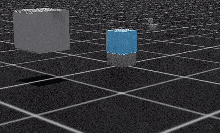 | **`isaac/cubetoshelf_upright_welded`** — welded hands, corrected spawn. Mean episode length 258.9, reward +10.73. |
| 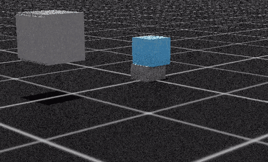 | **`isaac/cubetoshelf_upright_gripper`** — the 24-DoF gripper on the same spawn. |

Framing is still wide — the viewer camera is set from `BHL_VIEW_EYE` /
`BHL_VIEW_LOOKAT` (colon-separated; both `sbatch --export` and Apptainer's
`--env` split on commas) and has not been tuned. The source mp4s are 77–88 MB
and stay out of the repo.
 it was rendered from the plain world (one point light, untextured grey walls on a navy floor, no skybox) from 8.6 m away at 720 px, then quantised to 64 colours. The clip above is the same run with a checker floor, brick-textured walls, shadows and a closer overhead camera; none of that touches the physics.

## September 20: mission demos and a rejected route

| Actual recording | Result and scope |
|---|---|
| [Inspection GIF](gifs/weekend-inspection.gif) · [MP4](../results/weekend-20260919/inspection-maze.mp4) | Two ordered dwells and exit; frozen gait, oracle waypoints, actual sensor braking; 17.36 s recording |
| [Wrong-branch GIF](gifs/weekend-inspection-failure.gif) · [MP4](../results/weekend-20260919/inspection-maze-failure.mp4) | Intentional supervisor-error control, rejected at 7.00 s; not a learned-policy or renderer failure |
| [Three-robot GIF](gifs/weekend-team3.gif) · [MP4](../results/weekend-20260919/team3-airlock.mp4) | Shared-world inspection, synchronization, crossing and rendezvous; original 30.68 s completion; GIF labelled 1.1× |

Adjacent GIF JSON sidecars contain source hashes, scores and playback speed.
These use the older full-body gait, not the new Isaac maze checkpoints.
The [dated results](WEEKEND_RESULTS_2026-09-20.md) link their multi-seed controls.
Existing `multi_race` and `dr_pair` below show learned-policy successes and
falls. New folding-policy media from the September 20 array was **cancelled**, not
blocked (`21360436`/`21360437`, CANCELLED 2026-09-20); one repaired episode
rendered (`21367715`, fold failed). Folding now runs in the linked repository's
own campaigns — see [`CLOTH_FOLDING_WEEKEND.md`](CLOTH_FOLDING_WEEKEND.md). Do not relabel old
replay controls as current adaptation successes.

## September 23: Mission 7 — one layout, the stall and the crossing fix

> Re-rendered 2026-09-24 from the same deterministic episodes with an overhead camera: the first renders used a tracking camera that sat behind the maze walls and showed only wall. The red outline now marks the failing panel.

| Actual recording | Result and scope |
|---|---|
| Approach −x centring [GIF](gifs/mission7-approach-negx-centering.gif) (overhead camera, re-rendered 2026-09-24) · [baseline MP4](../results/mission7-campaign-20260923/media/overhead/approach-negx14-baseline.mp4) · [centred MP4](../results/mission7-campaign-20260923/media/overhead/approach-negx14-centered.mp4) | Left: the evaluated 0.50 m/s privileged recovery controller strikes `goal_post_-1` on its first stride and is rejected at 2.12 s. Right: gap-midline centring with a +0.015 m pre-bias passes the same layout at 4.40 s. Both reproduce the evaluated episodes (reset order replayed). **Gate passed on the full matrix: 62/64, 0 falls, 16/16/16/14** (`21401966`), geometry, spawn and predicates unchanged; privileged pose, scripted centring, frozen gait. [Sidecar](gifs/mission7-approach-negx-centering.json). |
| Doors/1 stall vs crossing fix [GIF](gifs/mission7-doors1-stall-vs-crossing-fix.gif) (overhead camera, 18 s at 4×, re-rendered 2026-09-24) · [baseline MP4](../results/mission7-campaign-20260923/media/overhead/doors1-baseline-stall.mp4) · [fix MP4](../results/mission7-campaign-20260923/media/overhead/doors1-crossing-fix-success.mp4) | Left: the unchanged guarded plate stage hands back on the plate edge and the frozen gait settles into its standing fixed point (recording stopped at 70 s of a 180 s timeout). Right: the same layout with the stage-owned crossing — `prev_actions` kick, cross-until-clear, centre-aimed exit ramp, waypoint advance — completes at 77.7 s. Deterministic reruns of one development layout; GIF at 1.94×. **Not a promoted candidate:** the crossing fails the exact ten-fall replay regression (7/10 to 9/10 across variants) and was never evaluated on the route rate. The [sidecar](gifs/mission7-doors1-stall-vs-crossing-fix.json) carries source hashes, outcomes and configurations. |

The learned-policy Mission 7 results remain 0/16 validation success; the route
controller evidence lives in [`MISSION7_TASKS.md`](MISSION7_TASKS.md).

> **Corrections, 2026-09-23.** A repository-wide audit checked every entry
> below against its own evidence files. Corrected here: `arms_push_pair`
> (caption and GIF labels inverted the n=60 result), `arms_dr_pair` (quoted a
> terrain-sweep number on a flat clip), `ice_pair` / `ice_pair_placed` (the
> MuJoCo renders are flat ground; the harness has no ice world),
> `multi_lab` (course description), `carry_ladder_pov` (12 seeds, not 18) and
> `isaac/maze_stereo_fixed` (seed-0 vs 3-seed-mean comparison; the corrected
> stereo arm is a null result against blind). Full mapping:
> [`REPO_TASKS.md`](REPO_TASKS.md).

## Index

| clip | renderer | task / rung | verdict |
|---|---|---|---|
| mission7/approach_negx_centering | MuJoCo | Mission 7 privileged Approach, world −x, test layout 14 | works — gate passed 62/64, 0 falls (privileged pose, scripted centring, frozen gait) |
| mission7/doors1_stall_vs_crossing_fix | MuJoCo | Mission 7 Doors, validation layout 1 | render works — the crossing fix reaches the goal on this layout; not promoted (replay regression 7–9/10) |
| [`dr_pair`](#locomotion) | MuJoCo | domain randomization | **works** |
| [`push_pair`](#locomotion) | MuJoCo | push curriculum | **works** — matched-protocol check with three seeds (2026-09-24): push-adaptive 0.122 vs no-push control 0.211 (n = 90 / 90, p = 0.08), supported in direction only |
| [`terrain_pair`](#locomotion) | MuJoCo | terrain curriculum | **works** |
| [`arms_dr_pair`](#locomotion) | MuJoCo | 22-DoF, randomization s=1.0 vs s=0 | **works** — walk vs walk by design (0/60 falls each on flat; two training seeds) |
| [`arms_push_pair`](#locomotion) | MuJoCo | 22-DoF push-trained vs DR-only, shove | render works — **no detectable effect of push training** at four seeds: arms-push 0.167 (n = 120) vs DR-only 0.117 (n = 60), p = 0.87 / 0.26 either way; caption corrected 2026-09-23, seeds added 2026-09-24 |
| [`arms_terrain_pair`](#locomotion) | MuJoCo | 22-DoF vs 12-DoF, terrain | **works** |
| [`multi_race`](#four-policies-at-once) | MuJoCo | 4 policies, one shove | **works** |
| [`multi_lab`](#four-policies-at-once) | MuJoCo | 4 policies, obstacle course + depth | render works — **course cleared 5/20 (22 DoF) and 2/20 (12 DoF) over 5 seeds**, not reliably |
| [`depth_pair`](#depth) | MuJoCo | ray-cast depth | **works** |
| [`ice_pair`](#b3--ice) | MuJoCo | B3 — blind vs depth policies, rendered on **flat MuJoCo ground** (the harness has no ice world) | render works — **result retracted**: in training the ice was never under the robots ([probe verdict](../results/ice_placement_probe_21328532.txt)) |
| [`ice_pair_placed`](#b3--ice) | MuJoCo | B3 — policies retrained with patches at terrain origins (median 0.8 m), rendered on **flat MuJoCo ground** | **works as a render of the placed policies**; n=2, depth terrain level 2.92 vs blind 2.59 |
| [`isaac/maze_recovery_pair`](#terrain-sensing-the-b5-maze-rung) | Isaac Sim | B5 maze recovery, Full stage: the 380/384 `Both` s0 policy reaching the button (left) and the `Blind` s1 policy falling (right), seeds 100/101, training noise on | **works** — recorded 2026-09-24, verdicts from the episode JSONs; raw frames denoised (1 spp RTX) |
| [`isaac/maze_stereo_fixed`](#terrain-sensing-the-b5-maze-rung) | Isaac Sim | B5 — the corrected 16×16 stereo policy, and what its camera saw before and after the fix | render works — seed-0 terrain level 0.877 vs pre-fix seed 0 0.001; corrected 3-seed mean 0.774 sits inside blind's 0.545–1.037, so it shows the camera fix, **not a stereo advantage** |
| [`isaac/mazenav_seed0`](#terrain-sensing-the-b5-maze-rung) | Isaac Sim | B5 navigation — seed-0 blind/lidar/stereo/both in the fused-mesh corridor | **walks, does not reach the button** — button 0/12 |
| [`isaac/terrain_sensors`](#terrain-sensing-the-b5-maze-rung) | Isaac Sim | B5 — blind, lidar, stereo at two widths | render only — the result is the table, not the clip |
| [`isaac/cloth_sort_free_base_shirt`](#cloth-sorting-free-base) | Isaac Sim | cloth-sort C0, scripted sweep, rigid shirt proxy, **free-standing robot**, two sweeps | **works** — free base 22/24 on balance v2 |
| [`isaac/cloth_sort_free_base_jacket`](#cloth-sorting-free-base) | Isaac Sim | cloth-sort C0, scripted sweep, rigid jacket proxy, **free-standing robot** | **works** — jacket 8/8 free-base |
| [`isaac/cloth_sort_fixed_base`](#cloth-sorting-fixed-base-diagnostic) | Isaac Sim | cloth-sort C0, scripted sweep, rigid shirt proxy, **root pinned** | **works** — 32/32 on this layout; not cloth, not a standing robot |
| [`squat_pick`](#the-cooperative-lift) | MuJoCo | scripted reachability control | n/a — scripted |
| [`carry_2`](#the-cooperative-lift) | MuJoCo | cooperative cube lift | **fails** |
| [`carry_3`](#the-cooperative-lift) | MuJoCo | learned vs scripted | **fails** |
| [`carry_4`](#the-cooperative-lift) | MuJoCo | one pair vs two | **fails** |
| [`carry_cube_pov`](#robot-pov) | MuJoCo | cube lift, POV | **fails** — best is 7.8 cm |
| [`carry_ball_native_pov`](#robot-pov) | MuJoCo | ball lift, POV | **fails** — 0/6 seeds |
| [`carry_ball_transfer_pov`](#robot-pov) | MuJoCo | ball, transfer condition | **fails** |
| [`carry_ladder_pov`](#robot-pov) | MuJoCo | plank lift, POV | **fails** — 0.0 cm, 12 seeds |
| [`carry_vision_swap_2`](#vision-made-it-worse) | MuJoCo | depth replacing object pose | **fails** |
| [`carry_vision_swap_3`](#vision-made-it-worse) | MuJoCo | same, three pairs | **fails** |
| [`carry_vision_swap_4`](#vision-made-it-worse) | MuJoCo | same, four pairs — unused | **fails** |
| [`carry_vision_both_2`](#vision-made-it-worse) | MuJoCo | depth alongside object pose | **fails** |
| [`carry_vision_both_3`](#vision-made-it-worse) | MuJoCo | same, three pairs — unused | **fails** |
| [`carry_vision_both_4`](#vision-made-it-worse) | MuJoCo | same, four pairs | **fails** |
| [`occlusion_s0_lifted_pov`](#the-occlusion-seed-cross-checked) | MuJoCo | occlusion, the seed that lifted | **fails in MuJoCo** |
| [`occlusion_s1_flat_pov`](#the-occlusion-seed-cross-checked) | MuJoCo | occlusion, a flat sibling | holds the pinch, never lifts |
| [`isaac/cubetoshelf_upright_welded`](#isaac-sim) | **Isaac Sim** | v2 CubeToShelf, corrected spawn | spawns underground, extruded upward — see retraction |
| [`isaac/cubetoshelf_upright_gripper`](#isaac-sim) | **Isaac Sim** | same, 24-DoF gripper | spawns underground |
| [`isaac/cubetoshelf_gripper`](#isaac-sim) | **Isaac Sim** | v2 CubeToShelf, 24-DoF gripper | **fails** — survives, never lifts |
| [`isaac/cubetoshelf_welded`](#isaac-sim) | **Isaac Sim** | v2 CubeToShelf, welded hands | **fails** — ~8 steps |

---

## Locomotion

Two policies, one command, one world. Left is the intervention, right the control.

| | |
|---|---|
|  | **`dr_pair`** — identical strafe. Left `s=1.0`, right `s=0`. Neither policy ever saw MuJoCo in training. |
|  | **`push_pair`** — identical 0.5 m/s shoves. Left has a push curriculum. **0/6 falls against 3/6.** |
|  | **`terrain_pair`** — rough ground at `d = 0.80`. Left terrain-trained, right flat-trained. **0/6 against 3/6.** |
|  | **`arms_dr_pair`** — the same three comparisons on the 22-DoF body. A walk-vs-walk strafe by design: on flat ground the 22-DoF body falls 0/60 at both s=1.0 and s=0, where the 12-DoF biped at s=0 falls 21/90. (The 11.7 % vs 37.8 % comparison belongs to the terrain sweep, `arms_terrain_pair`, and mixes n=60 with n=90.) Two training seeds. |
|  | **`arms_push_pair`** — **caption corrected 2026-09-23.** 22-DoF push-trained (left) against 22-DoF DR-only (right) under the same 0.5 m/s shove. This clip is the one command of six in the filming run where the ordering favours push training; over n=60 the push-trained policy falls **more** (0.15) than the DR-only control (0.10), and in the filming run itself 2/6 against 1/6. No push benefit is shown on the 22-DoF body. The earlier caption ('0.2 m/s of shove rejection, free') transplanted a biped training-side finding and inverted this result. [Sidecar](gifs/arms_push_pair.json). |
|  | **`arms_terrain_pair`** — arms on rough ground. |

## Four policies at once

| | |
|---|---|
|  | **`multi_race`** — identical 0.45 m/s shoves. Same solver, same clock, not a composite. The un-randomized robot is the one on the ground. |
|  | **`multi_lab`** — current README hero. Four colour-coded policies on a carpet, cable, threshold and ramp course (the clip is one rollout per policy; a 5-seed rerun, [`lab_traverse_5seed.json`](../results/lab-traverse-20260923/lab_traverse_5seed.json), finishes the course 1/5, 0/5, 2/5, 2/5 for randomized, no-randomization, push-trained and terrain-trained on 22 DoF and 0/5, 0/5, 0/5, 2/5 on 12 DoF: the course is cleared sometimes, not reliably, and the no-randomization 22-DoF policy stalls past the carpet every time), with the orange robot's egocentric depth along the bottom. **14 MB.** |

## Depth

| | |
|---|---|
|  | **`depth_pair`** — left the scored episode, right the robot's own 64×64 depth. MuJoCo's offscreen depth buffer, not Isaac's ray-caster. |

## B3 — ice

> **Retracted, 2026-09-14.** In Isaac training the patches spawned a median 72 m
> from the robots, and 4.4% could have reached one in an episode
> (`scripts/bench/ice_placement_probe.py`, FINDINGS *Ice*). `ice_pair` is those
> policies, trained on bumpy ground, dropped onto ice in MuJoCo.
>
> **Placed, 2026-09-17.** Probe `21342561` put the patches at the terrain origins
> (median 0.8 m, reachable 1.000). `ice_pair_placed` is the retrained pair.

The old +10.6% (depth 1.519 against blind 1.374) was measured on bumpy tiles.
On the actual ice, last-50 terrain level is depth **2.92** against blind **2.59**
(n=2). Visible-ice matches blind seed-for-seed (proprioception-only).

It had no clip because `render_multi` could not drive a depth-conditioned
policy: upstream's controller assembles the observation from raw pieces and
knows nothing about depth, so a 301-wide network was handed 45 numbers and the
run raised before drawing a frame. `DepthRlController` appends the term where
Isaac puts it — after `prev_actions` — and the clip is the same harness that
produced the numbers.

| | |
|---|---|
|  | **`ice_pair`** — green blind, red depth, identical command. Along the bottom is the depth robot's own egocentric view and a scrolling waterfall of the centre column. **14 MB.** Retracted as evidence about ice: the patches were 72 m away in training ([probe verdict](../results/ice_placement_probe_21328532.txt)). **The MuJoCo harness has no ice world, so this clip is plain flat ground** — it shows two policies walking, not ice handling. |
|  | **`ice_pair_placed`** — the same pair after `21342561` put the patches at the terrain origins (median 0.8 m, reachable 1.000). Both stay upright; peak x +4.66 m (blind) / +4.45 m (depth). Job `21352982`. Last-50 terrain level: depth 2.92 against blind 2.59 (n=2, 'visible' bitwise-identical to blind). **Rendered on flat MuJoCo ground (no ice in the harness)** — the clip shows two upright policies, not ice handling; whether the training rung exercised the patches is the open exposure probe. **13 MB.** |

## The cooperative lift

| | |
|---|---|
|  | **`squat_pick`** — scripted joint interpolation, not a policy. The control for every failure below: the pose exists and is reachable. |
|  | **`carry_3`** — left the scripted check, right the learned thing. The gap is the finding. |
|  | **`carry_2`** — one pair closing on the cube. |
|  | **`carry_4`** — one pair against two. The pinch forms, the lift does not. Each is the seed that stays upright longest out of twelve. |

## Robot POV

Colour, raw 64×64 depth, and the 8×8 the network actually receives.

| | |
|---|---|
|  | **`carry_cube_pov`** — the best rollout in the project. 7.8 cm of lift, hands in the pinch gate 98% of the time, 12 s without a fall. Also a controlled collapse: the pair drops 41 cm before contact. |
|  | **`carry_ball_native_pov`** — the 21 cm arm cross-checked in the other engine. Falls at 0.72 s having never touched the ball. |
|  | **`carry_ball_transfer_pov`** — the same arm, transfer condition. |
|  | **`carry_ladder_pov`** — the plank. 12 seeds at 0.0 cm, closest approach 39 cm. Contact points are further apart than shoulders that cannot adduct past 36 cm can span. |

## Vision made it worse

| | |
|---|---|
|  | **`carry_vision_swap_2`** — left blind, right depth *replacing* the object pose. The red outline is a fall, held for the rest of the clip. |
|  | **`carry_vision_swap_3`** — three pairs. |
|  | **`carry_vision_both_4`** — depth *added alongside* the pose. The cube is plainly visible in every depth pane. They are not failing to see it. |
|  | **`carry_vision_both_2`** — two robots. |
|  | **`carry_vision_swap_4`** — unused anywhere. |
|  | **`carry_vision_both_3`** — unused anywhere. |

## The occlusion seed, cross-checked

Finding 7 is that the only cube arm which ever lifted is a single seed that did
not replicate. Replayed in the other engine it does worse than that: **the arm
that lifted is the one that falls.**

| | closest pinch | peak lift | in-pinch | fell |
|---|---|---|---|---|
| **s0** — reached 13 cm in Isaac | 0.251 m | 0.0 cm | **0%** | **yes, at 0.8 s** |
| **s1** — flat at the 4 cm floor in Isaac | 0.167 m | 0.0 cm | **96%** | no |

The seed that looked best in training never forms a pinch and goes down inside a
second; the seed that looked like a failure stays up and holds the pinch for
almost the whole episode. Same pattern as the ball arm in §1 — a result that
exists in one engine and not the other.

| | |
|---|---|
|  | **`occlusion_s0_lifted_pov`** — the 13 cm seed. Every pair down at 0.8 s. |
|  | **`occlusion_s1_flat_pov`** — the flat seed. Upright, pinch held 96% of the episode, 0.0 cm of lift. |

## Isaac Sim

These two historical clips were the first Isaac-rendered frames produced here.
PhysX/RTX, 1280×720, cropped to the subject and denoised —
the path-traced floor grain makes an uncropped GIF 25 MB.

They are unflattering and that is the result. The grey box is the shelf, the
blue box the cube, and the small orange shapes are the robots — **lying down**.
Success is 0 on this task either way; the gripper arm's contribution is that it
stays alive for 427 steps against 8 while doing it.

| | |
|---|---|
|  | **`isaac/cubetoshelf_gripper`** — `TaskV2-BHL-CubeToShelfGrip-Blind-v0`, the 24-DoF gripper asset. |
|  | **`isaac/cubetoshelf_welded`** — `TaskV2-BHL-CubeToShelf-Blind-v0`, the shipped welded-hand asset. |

### Terrain sensing (the B5 "maze" rung)

| | |
|---|---|
|  | **`isaac/maze_stereo_fixed`** — the stereo policy fed 16×16 an eye, retrained with its cameras pointed down (`mazefix-stereo-s0`, seed-0 terrain level 0.877 against 0.001 for pre-fix seed 0; 3-seed means 0.774 and 0.021). The corrected arm's mean sits inside blind's seed range 0.545–1.037, so this clip shows the camera fix, not a stereo advantage. Right, the left eye's 64×64 depth each frame, bright near and black at the 6 m limit. **Top: the pose every B5 run on Isaac Lab 3.0 had before `3f7b679`** — the quaternion read in the wrong order, 20° up and upside down, with ground only in a strip along the top. **Bottom: the corrected pose** this policy trained on. Both eyes ride the same robot in the same run (`21329137`). Cropped and lightly blurred, because the bumpy terrain is per-pixel noise GIF cannot compress. **9.5 MB.** |
|  | **`isaac/terrain_sensors`** — the four seed-0 policies, each followed by its own camera: blind, lidar, stereo fed at 16×16 an eye, and stereo pooled to 4×4. Labels are each clip's own terrain level (3-seed means are in FINDINGS). **Watch it for what the policies look like, not for the result**: over twelve seconds all four walk, because the difference is how far the terrain curriculum promoted them, which one clip on one patch cannot show. There are no walls in shot because there never were any near the robots — see FINDINGS. **Both stereo policies here trained with their cameras looking 20° up, upside down** — `isaac/maze_stereo_fixed` above shows the difference (Isaac Lab 3.0 reads the pose quaternion in a different order; FINDINGS, *Terrain sensing*), so those two panels show what the policies did, not what stereo sees. Denoised and cropped from 640×360 path-traced frames. **10 MB.** |
|  | **`isaac/mazenav_seed0`** — the four seed-0 *navigation* policies (`mazenav-{blind,lidar,stereo,both}-s0`) after the walls were fused into `/World/ground`. Robot in shot, walls in shot. They walk the corridor until timeout; they do not reach the plate. Job `21355466`, 200 frames an arm, cropped and blurred. **14 MB.** |

**How the render got fixed.** The first attempt (`21247917`) filmed corridors
and no robot. The viewport, which `RecordVideo` records, draws an articulation
at its stale USD pose when fabric is on — here the env's grid origin, tens of
metres from the terrain patch the robot walks on. A camera *sensor* draws the
body where physics has it (`21299608`), so `train_play` now records through
one; `docs/ISAAC_RENDER.md` §10 has the recipe.

### Cloth sorting, free base

| | |
|---|---|
|  | **`isaac/cloth_sort_free_base_shirt`** — job `21330405`, balance v2 (`42ba537`). The free-standing robot's first sweep leaves the shirt proxy at the table's edge. The second, planned from where the shirt lay, drops it into the red basket. On balance v2 the free base sorts shirt 6/8, sock 8/8 and jacket 8/8 with no falls. A rigid box, not cloth. Real time at 10 fps. **7.0 MB.** |
|  | **`isaac/cloth_sort_free_base_jacket`** — `ClothSort-BHL-Rigid-Oracle-v0` with `--garment jacket`, job `21329392`. **The robot is free-standing**: its legs hold a knee-bent stance with gravity feedforward and IMU ankle feedback (`bhl_robust.cloth.balance`), and the table stands 5.9 cm higher to match. The hand sweeps the dark jacket proxy off the table's back edge into the grey jackets basket. On balance v1 this layout sorted jackets 8/8 and socks 7/8 but shirts 1/8 (`21329260`–`262`); balance v2 brought the shirt to 6/8. A rigid box, not cloth. Frames brightened because the jacket is near-black. **3.8 MB.** |

### Cloth sorting, fixed-base diagnostic

| | |
|---|---|
|  | **`isaac/cloth_sort_fixed_base`** — `ClothSort-BHL-RigidFixedBase-Oracle-v0`, job `21317391`. The scripted sweep: the right hand descends at an anchor beside the table, glides around the red shirt proxy, and sweeps it off the front edge into the red shirts basket. **The robot's root is pinned and the shirt is a rigid 10 × 8 cm box.** With the root free this robot falls backward within a second even with its arm still (`21317172`), so this clip shows the manipulation half alone. On this layout shirt, sock and jacket sort 32 of 32 (`21317388`–`390`). The episode ends when the shirt's centre enters the basket, so the clip stops as it drops. Camera sensor, 640×360 path-traced, cropped and denoised. **3.9 MB.** |

### On the corrected *rotation* — and a spawn that is still wrong

**Retraction.** These were published as "the first clips of this robot spawning
upright". They are not. Watch the first second: the robots are not visible at
all, because they spawn **entirely underneath the floor** and are extruded
upward by the physics solver over the following twenty frames.

Measured at reset with the corrected rotation: **27 of 27 bodies below z = 0**,
the lowest at -0.85 m. The rotation fix made the burial *worse* -- it was 19 of
27 when the robot was lying on its side, because standing it upright put its
full height below a root that sits at -0.07.

The numbers below are real and were produced in that state, which is what makes
them hard to interpret rather than simply good.

| | start | tail |
|---|---|---|
| `Curriculum/base_height` | +0.684 | **+0.773** — rising, not collapsing |
| `Curriculum/lift_height` | 0.0400 | **0.0478** — off the floor for the first time |
| `Episode_Reward/lifting_object` | 0.0003 | **+1.212** |
| `Episode_Termination/time_out` | 0.020 | **0.331** |
| mean episode length | ~8 (before the fix) | **258.9** |

Every earlier arm in this project sat on `lift_height = 0.0400` exactly and
never promoted. This one does — but it does so while being pushed out of the
ground for the first fifth of every episode, so what the promotion is measuring
is not yet established. **Task success is still 0.**

Two thirds of episodes still end in a fall, so several seconds of both clips are
robots tangled around a tipped cube.

| | |
|---|---|
|  | **`isaac/cubetoshelf_upright_welded`** — welded hands, corrected spawn. Mean episode length 258.9, reward +10.73. |
|  | **`isaac/cubetoshelf_upright_gripper`** — the 24-DoF gripper on the same spawn. |

Framing is still wide — the viewer camera is set from `BHL_VIEW_EYE` /
`BHL_VIEW_LOOKAT` (colon-separated; both `sbatch --export` and Apptainer's
`--env` split on commas) and has not been tuned. The source mp4s are 77–88 MB
and stay out of the repo.
 it was rendered from the plain world (one point light, untextured grey walls on a navy floor, no skybox) from 8.6 m away at 720 px, then quantised to 64 colours. The clip above is the same run with a checker floor, brick-textured walls, shadows and a closer overhead camera; none of that touches the physics.

## September 20: mission demos and a rejected route

| Actual recording | Result and scope |
|---|---|
| [Inspection GIF](gifs/weekend-inspection.gif) · [MP4](../results/weekend-20260919/inspection-maze.mp4) | Two ordered dwells and exit; frozen gait, oracle waypoints, actual sensor braking; 17.36 s recording |
| [Wrong-branch GIF](gifs/weekend-inspection-failure.gif) · [MP4](../results/weekend-20260919/inspection-maze-failure.mp4) | Intentional supervisor-error control, rejected at 7.00 s; not a learned-policy or renderer failure |
| [Three-robot GIF](gifs/weekend-team3.gif) · [MP4](../results/weekend-20260919/team3-airlock.mp4) | Shared-world inspection, synchronization, crossing and rendezvous; original 30.68 s completion; GIF labelled 1.1× |

Adjacent GIF JSON sidecars contain source hashes, scores and playback speed.
These use the older full-body gait, not the new Isaac maze checkpoints.
The [dated results](WEEKEND_RESULTS_2026-09-20.md) link their multi-seed controls.
Existing `multi_race` and `dr_pair` below show learned-policy successes and
falls. New folding-policy media from the September 20 array was **cancelled**, not
blocked (`21360436`/`21360437`, CANCELLED 2026-09-20); one repaired episode
rendered (`21367715`, fold failed). Folding now runs in the linked repository's
own campaigns — see [`CLOTH_FOLDING_WEEKEND.md`](CLOTH_FOLDING_WEEKEND.md). Do not relabel old
replay controls as current adaptation successes.

## September 23: Mission 7 — one layout, the stall and the crossing fix

> Re-rendered 2026-09-24 from the same deterministic episodes with an overhead camera: the first renders used a tracking camera that sat behind the maze walls and showed only wall. The red outline now marks the failing panel.

| Actual recording | Result and scope |
|---|---|
| Approach −x centring [GIF](gifs/mission7-approach-negx-centering.gif) (overhead camera, re-rendered 2026-09-24) · [baseline MP4](../results/mission7-campaign-20260923/media/overhead/approach-negx14-baseline.mp4) · [centred MP4](../results/mission7-campaign-20260923/media/overhead/approach-negx14-centered.mp4) | Left: the evaluated 0.50 m/s privileged recovery controller strikes `goal_post_-1` on its first stride and is rejected at 2.12 s. Right: gap-midline centring with a +0.015 m pre-bias passes the same layout at 4.40 s. Both reproduce the evaluated episodes (reset order replayed). **Gate passed on the full matrix: 62/64, 0 falls, 16/16/16/14** (`21401966`), geometry, spawn and predicates unchanged; privileged pose, scripted centring, frozen gait. [Sidecar](gifs/mission7-approach-negx-centering.json). |
| Doors/1 stall vs crossing fix [GIF](gifs/mission7-doors1-stall-vs-crossing-fix.gif) (overhead camera, 18 s at 4×, re-rendered 2026-09-24) · [baseline MP4](../results/mission7-campaign-20260923/media/overhead/doors1-baseline-stall.mp4) · [fix MP4](../results/mission7-campaign-20260923/media/overhead/doors1-crossing-fix-success.mp4) | Left: the unchanged guarded plate stage hands back on the plate edge and the frozen gait settles into its standing fixed point (recording stopped at 70 s of a 180 s timeout). Right: the same layout with the stage-owned crossing — `prev_actions` kick, cross-until-clear, centre-aimed exit ramp, waypoint advance — completes at 77.7 s. Deterministic reruns of one development layout; GIF at 1.94×. **Not a promoted candidate:** the crossing fails the exact ten-fall replay regression (7/10 to 9/10 across variants) and was never evaluated on the route rate. The [sidecar](gifs/mission7-doors1-stall-vs-crossing-fix.json) carries source hashes, outcomes and configurations. |

The learned-policy Mission 7 results remain 0/16 validation success; the route
controller evidence lives in [`MISSION7_TASKS.md`](MISSION7_TASKS.md).

> **Corrections, 2026-09-23.** A repository-wide audit checked every entry
> below against its own evidence files. Corrected here: `arms_push_pair`
> (caption and GIF labels inverted the n=60 result), `arms_dr_pair` (quoted a
> terrain-sweep number on a flat clip), `ice_pair` / `ice_pair_placed` (the
> MuJoCo renders are flat ground; the harness has no ice world),
> `multi_lab` (course description), `carry_ladder_pov` (12 seeds, not 18) and
> `isaac/maze_stereo_fixed` (seed-0 vs 3-seed-mean comparison; the corrected
> stereo arm is a null result against blind). Full mapping:
> [`REPO_TASKS.md`](REPO_TASKS.md).

## Index

| clip | renderer | task / rung | verdict |
|---|---|---|---|
| mission7/approach_negx_centering | MuJoCo | Mission 7 privileged Approach, world −x, test layout 14 | works — gate passed 62/64, 0 falls (privileged pose, scripted centring, frozen gait) |
| mission7/doors1_stall_vs_crossing_fix | MuJoCo | Mission 7 Doors, validation layout 1 | render works — the crossing fix reaches the goal on this layout; not promoted (replay regression 7–9/10) |
| [`dr_pair`](#locomotion) | MuJoCo | domain randomization | **works** |
| [`push_pair`](#locomotion) | MuJoCo | push curriculum | **works** — matched-protocol check with three seeds (2026-09-24): push-adaptive 0.122 vs no-push control 0.211 (n = 90 / 90, p = 0.08), supported in direction only |
| [`terrain_pair`](#locomotion) | MuJoCo | terrain curriculum | **works** |
| [`arms_dr_pair`](#locomotion) | MuJoCo | 22-DoF, randomization s=1.0 vs s=0 | **works** — walk vs walk by design (0/60 falls each on flat; two training seeds) |
| [`arms_push_pair`](#locomotion) | MuJoCo | 22-DoF push-trained vs DR-only, shove | render works — **no detectable effect of push training** at four seeds: arms-push 0.167 (n = 120) vs DR-only 0.117 (n = 60), p = 0.87 / 0.26 either way; caption corrected 2026-09-23, seeds added 2026-09-24 |
| [`arms_terrain_pair`](#locomotion) | MuJoCo | 22-DoF vs 12-DoF, terrain | **works** |
| [`multi_race`](#four-policies-at-once) | MuJoCo | 4 policies, one shove | **works** |
| [`multi_lab`](#four-policies-at-once) | MuJoCo | 4 policies, obstacle course + depth | render works — **course cleared 5/20 (22 DoF) and 2/20 (12 DoF) over 5 seeds**, not reliably |
| [`depth_pair`](#depth) | MuJoCo | ray-cast depth | **works** |
| [`ice_pair`](#b3--ice) | MuJoCo | B3 — blind vs depth policies, rendered on **flat MuJoCo ground** (the harness has no ice world) | render works — **result retracted**: in training the ice was never under the robots ([probe verdict](../results/ice_placement_probe_21328532.txt)) |
| [`ice_pair_placed`](#b3--ice) | MuJoCo | B3 — policies retrained with patches at terrain origins (median 0.8 m), rendered on **flat MuJoCo ground** | **works as a render of the placed policies**; n=2, depth terrain level 2.92 vs blind 2.59 |
| [`isaac/maze_recovery_pair`](#terrain-sensing-the-b5-maze-rung) | Isaac Sim | B5 maze recovery, Full stage: the 380/384 `Both` s0 policy reaching the button (left) and the `Blind` s1 policy falling (right), seeds 100/101, training noise on | **works** — recorded 2026-09-24, verdicts from the episode JSONs; raw frames denoised (1 spp RTX) |
| [`isaac/maze_stereo_fixed`](#terrain-sensing-the-b5-maze-rung) | Isaac Sim | B5 — the corrected 16×16 stereo policy, and what its camera saw before and after the fix | render works — seed-0 terrain level 0.877 vs pre-fix seed 0 0.001; corrected 3-seed mean 0.774 sits inside blind's 0.545–1.037, so it shows the camera fix, **not a stereo advantage** |
| [`isaac/mazenav_seed0`](#terrain-sensing-the-b5-maze-rung) | Isaac Sim | B5 navigation — seed-0 blind/lidar/stereo/both in the fused-mesh corridor | **walks, does not reach the button** — button 0/12 |
| [`isaac/terrain_sensors`](#terrain-sensing-the-b5-maze-rung) | Isaac Sim | B5 — blind, lidar, stereo at two widths | render only — the result is the table, not the clip |
| [`isaac/cloth_sort_free_base_shirt`](#cloth-sorting-free-base) | Isaac Sim | cloth-sort C0, scripted sweep, rigid shirt proxy, **free-standing robot**, two sweeps | **works** — free base 22/24 on balance v2 |
| [`isaac/cloth_sort_free_base_jacket`](#cloth-sorting-free-base) | Isaac Sim | cloth-sort C0, scripted sweep, rigid jacket proxy, **free-standing robot** | **works** — jacket 8/8 free-base |
| [`isaac/cloth_sort_fixed_base`](#cloth-sorting-fixed-base-diagnostic) | Isaac Sim | cloth-sort C0, scripted sweep, rigid shirt proxy, **root pinned** | **works** — 32/32 on this layout; not cloth, not a standing robot |
| [`squat_pick`](#the-cooperative-lift) | MuJoCo | scripted reachability control | n/a — scripted |
| [`carry_2`](#the-cooperative-lift) | MuJoCo | cooperative cube lift | **fails** |
| [`carry_3`](#the-cooperative-lift) | MuJoCo | learned vs scripted | **fails** |
| [`carry_4`](#the-cooperative-lift) | MuJoCo | one pair vs two | **fails** |
| [`carry_cube_pov`](#robot-pov) | MuJoCo | cube lift, POV | **fails** — best is 7.8 cm |
| [`carry_ball_native_pov`](#robot-pov) | MuJoCo | ball lift, POV | **fails** — 0/6 seeds |
| [`carry_ball_transfer_pov`](#robot-pov) | MuJoCo | ball, transfer condition | **fails** |
| [`carry_ladder_pov`](#robot-pov) | MuJoCo | plank lift, POV | **fails** — 0.0 cm, 12 seeds |
| [`carry_vision_swap_2`](#vision-made-it-worse) | MuJoCo | depth replacing object pose | **fails** |
| [`carry_vision_swap_3`](#vision-made-it-worse) | MuJoCo | same, three pairs | **fails** |
| [`carry_vision_swap_4`](#vision-made-it-worse) | MuJoCo | same, four pairs — unused | **fails** |
| [`carry_vision_both_2`](#vision-made-it-worse) | MuJoCo | depth alongside object pose | **fails** |
| [`carry_vision_both_3`](#vision-made-it-worse) | MuJoCo | same, three pairs — unused | **fails** |
| [`carry_vision_both_4`](#vision-made-it-worse) | MuJoCo | same, four pairs | **fails** |
| [`occlusion_s0_lifted_pov`](#the-occlusion-seed-cross-checked) | MuJoCo | occlusion, the seed that lifted | **fails in MuJoCo** |
| [`occlusion_s1_flat_pov`](#the-occlusion-seed-cross-checked) | MuJoCo | occlusion, a flat sibling | holds the pinch, never lifts |
| [`isaac/cubetoshelf_upright_welded`](#isaac-sim) | **Isaac Sim** | v2 CubeToShelf, corrected spawn | spawns underground, extruded upward — see retraction |
| [`isaac/cubetoshelf_upright_gripper`](#isaac-sim) | **Isaac Sim** | same, 24-DoF gripper | spawns underground |
| [`isaac/cubetoshelf_gripper`](#isaac-sim) | **Isaac Sim** | v2 CubeToShelf, 24-DoF gripper | **fails** — survives, never lifts |
| [`isaac/cubetoshelf_welded`](#isaac-sim) | **Isaac Sim** | v2 CubeToShelf, welded hands | **fails** — ~8 steps |

---

## Locomotion

Two policies, one command, one world. Left is the intervention, right the control.

| | |
|---|---|
|  | **`dr_pair`** — identical strafe. Left `s=1.0`, right `s=0`. Neither policy ever saw MuJoCo in training. |
|  | **`push_pair`** — identical 0.5 m/s shoves. Left has a push curriculum. **0/6 falls against 3/6.** |
|  | **`terrain_pair`** — rough ground at `d = 0.80`. Left terrain-trained, right flat-trained. **0/6 against 3/6.** |
|  | **`arms_dr_pair`** — the same three comparisons on the 22-DoF body. A walk-vs-walk strafe by design: on flat ground the 22-DoF body falls 0/60 at both s=1.0 and s=0, where the 12-DoF biped at s=0 falls 21/90. (The 11.7 % vs 37.8 % comparison belongs to the terrain sweep, `arms_terrain_pair`, and mixes n=60 with n=90.) Two training seeds. |
|  | **`arms_push_pair`** — **caption corrected 2026-09-23.** 22-DoF push-trained (left) against 22-DoF DR-only (right) under the same 0.5 m/s shove. This clip is the one command of six in the filming run where the ordering favours push training; over n=60 the push-trained policy falls **more** (0.15) than the DR-only control (0.10), and in the filming run itself 2/6 against 1/6. No push benefit is shown on the 22-DoF body. The earlier caption ('0.2 m/s of shove rejection, free') transplanted a biped training-side finding and inverted this result. [Sidecar](gifs/arms_push_pair.json). |
|  | **`arms_terrain_pair`** — arms on rough ground. |

## Four policies at once

| | |
|---|---|
|  | **`multi_race`** — identical 0.45 m/s shoves. Same solver, same clock, not a composite. The un-randomized robot is the one on the ground. |
|  | **`multi_lab`** — current README hero. Four colour-coded policies on a carpet, cable, threshold and ramp course (the clip is one rollout per policy; a 5-seed rerun, [`lab_traverse_5seed.json`](../results/lab-traverse-20260923/lab_traverse_5seed.json), finishes the course 1/5, 0/5, 2/5, 2/5 for randomized, no-randomization, push-trained and terrain-trained on 22 DoF and 0/5, 0/5, 0/5, 2/5 on 12 DoF: the course is cleared sometimes, not reliably, and the no-randomization 22-DoF policy stalls past the carpet every time), with the orange robot's egocentric depth along the bottom. **14 MB.** |

## Depth

| | |
|---|---|
|  | **`depth_pair`** — left the scored episode, right the robot's own 64×64 depth. MuJoCo's offscreen depth buffer, not Isaac's ray-caster. |

## B3 — ice

> **Retracted, 2026-09-14.** In Isaac training the patches spawned a median 72 m
> from the robots, and 4.4% could have reached one in an episode
> (`scripts/bench/ice_placement_probe.py`, FINDINGS *Ice*). `ice_pair` is those
> policies, trained on bumpy ground, dropped onto ice in MuJoCo.
>
> **Placed, 2026-09-17.** Probe `21342561` put the patches at the terrain origins
> (median 0.8 m, reachable 1.000). `ice_pair_placed` is the retrained pair.

The old +10.6% (depth 1.519 against blind 1.374) was measured on bumpy tiles.
On the actual ice, last-50 terrain level is depth **2.92** against blind **2.59**
(n=2). Visible-ice matches blind seed-for-seed (proprioception-only).

It had no clip because `render_multi` could not drive a depth-conditioned
policy: upstream's controller assembles the observation from raw pieces and
knows nothing about depth, so a 301-wide network was handed 45 numbers and the
run raised before drawing a frame. `DepthRlController` appends the term where
Isaac puts it — after `prev_actions` — and the clip is the same harness that
produced the numbers.

| | |
|---|---|
|  | **`ice_pair`** — green blind, red depth, identical command. Along the bottom is the depth robot's own egocentric view and a scrolling waterfall of the centre column. **14 MB.** Retracted as evidence about ice: the patches were 72 m away in training ([probe verdict](../results/ice_placement_probe_21328532.txt)). **The MuJoCo harness has no ice world, so this clip is plain flat ground** — it shows two policies walking, not ice handling. |
|  | **`ice_pair_placed`** — the same pair after `21342561` put the patches at the terrain origins (median 0.8 m, reachable 1.000). Both stay upright; peak x +4.66 m (blind) / +4.45 m (depth). Job `21352982`. Last-50 terrain level: depth 2.92 against blind 2.59 (n=2, 'visible' bitwise-identical to blind). **Rendered on flat MuJoCo ground (no ice in the harness)** — the clip shows two upright policies, not ice handling; whether the training rung exercised the patches is the open exposure probe. **13 MB.** |

## The cooperative lift

| | |
|---|---|
|  | **`squat_pick`** — scripted joint interpolation, not a policy. The control for every failure below: the pose exists and is reachable. |
|  | **`carry_3`** — left the scripted check, right the learned thing. The gap is the finding. |
|  | **`carry_2`** — one pair closing on the cube. |
|  | **`carry_4`** — one pair against two. The pinch forms, the lift does not. Each is the seed that stays upright longest out of twelve. |

## Robot POV

Colour, raw 64×64 depth, and the 8×8 the network actually receives.

| | |
|---|---|
|  | **`carry_cube_pov`** — the best rollout in the project. 7.8 cm of lift, hands in the pinch gate 98% of the time, 12 s without a fall. Also a controlled collapse: the pair drops 41 cm before contact. |
|  | **`carry_ball_native_pov`** — the 21 cm arm cross-checked in the other engine. Falls at 0.72 s having never touched the ball. |
|  | **`carry_ball_transfer_pov`** — the same arm, transfer condition. |
|  | **`carry_ladder_pov`** — the plank. 12 seeds at 0.0 cm, closest approach 39 cm. Contact points are further apart than shoulders that cannot adduct past 36 cm can span. |

## Vision made it worse

| | |
|---|---|
|  | **`carry_vision_swap_2`** — left blind, right depth *replacing* the object pose. The red outline is a fall, held for the rest of the clip. |
|  | **`carry_vision_swap_3`** — three pairs. |
|  | **`carry_vision_both_4`** — depth *added alongside* the pose. The cube is plainly visible in every depth pane. They are not failing to see it. |
|  | **`carry_vision_both_2`** — two robots. |
|  | **`carry_vision_swap_4`** — unused anywhere. |
|  | **`carry_vision_both_3`** — unused anywhere. |

## The occlusion seed, cross-checked

Finding 7 is that the only cube arm which ever lifted is a single seed that did
not replicate. Replayed in the other engine it does worse than that: **the arm
that lifted is the one that falls.**

| | closest pinch | peak lift | in-pinch | fell |
|---|---|---|---|---|
| **s0** — reached 13 cm in Isaac | 0.251 m | 0.0 cm | **0%** | **yes, at 0.8 s** |
| **s1** — flat at the 4 cm floor in Isaac | 0.167 m | 0.0 cm | **96%** | no |

The seed that looked best in training never forms a pinch and goes down inside a
second; the seed that looked like a failure stays up and holds the pinch for
almost the whole episode. Same pattern as the ball arm in §1 — a result that
exists in one engine and not the other.

| | |
|---|---|
|  | **`occlusion_s0_lifted_pov`** — the 13 cm seed. Every pair down at 0.8 s. |
|  | **`occlusion_s1_flat_pov`** — the flat seed. Upright, pinch held 96% of the episode, 0.0 cm of lift. |

## Isaac Sim

These two historical clips were the first Isaac-rendered frames produced here.
PhysX/RTX, 1280×720, cropped to the subject and denoised —
the path-traced floor grain makes an uncropped GIF 25 MB.

They are unflattering and that is the result. The grey box is the shelf, the
blue box the cube, and the small orange shapes are the robots — **lying down**.
Success is 0 on this task either way; the gripper arm's contribution is that it
stays alive for 427 steps against 8 while doing it.

| | |
|---|---|
|  | **`isaac/cubetoshelf_gripper`** — `TaskV2-BHL-CubeToShelfGrip-Blind-v0`, the 24-DoF gripper asset. |
|  | **`isaac/cubetoshelf_welded`** — `TaskV2-BHL-CubeToShelf-Blind-v0`, the shipped welded-hand asset. |

### Terrain sensing (the B5 "maze" rung)

| | |
|---|---|
|  | **`isaac/maze_stereo_fixed`** — the stereo policy fed 16×16 an eye, retrained with its cameras pointed down (`mazefix-stereo-s0`, seed-0 terrain level 0.877 against 0.001 for pre-fix seed 0; 3-seed means 0.774 and 0.021). The corrected arm's mean sits inside blind's seed range 0.545–1.037, so this clip shows the camera fix, not a stereo advantage. Right, the left eye's 64×64 depth each frame, bright near and black at the 6 m limit. **Top: the pose every B5 run on Isaac Lab 3.0 had before `3f7b679`** — the quaternion read in the wrong order, 20° up and upside down, with ground only in a strip along the top. **Bottom: the corrected pose** this policy trained on. Both eyes ride the same robot in the same run (`21329137`). Cropped and lightly blurred, because the bumpy terrain is per-pixel noise GIF cannot compress. **9.5 MB.** |
|  | **`isaac/terrain_sensors`** — the four seed-0 policies, each followed by its own camera: blind, lidar, stereo fed at 16×16 an eye, and stereo pooled to 4×4. Labels are each clip's own terrain level (3-seed means are in FINDINGS). **Watch it for what the policies look like, not for the result**: over twelve seconds all four walk, because the difference is how far the terrain curriculum promoted them, which one clip on one patch cannot show. There are no walls in shot because there never were any near the robots — see FINDINGS. **Both stereo policies here trained with their cameras looking 20° up, upside down** — `isaac/maze_stereo_fixed` above shows the difference (Isaac Lab 3.0 reads the pose quaternion in a different order; FINDINGS, *Terrain sensing*), so those two panels show what the policies did, not what stereo sees. Denoised and cropped from 640×360 path-traced frames. **10 MB.** |
|  | **`isaac/mazenav_seed0`** — the four seed-0 *navigation* policies (`mazenav-{blind,lidar,stereo,both}-s0`) after the walls were fused into `/World/ground`. Robot in shot, walls in shot. They walk the corridor until timeout; they do not reach the plate. Job `21355466`, 200 frames an arm, cropped and blurred. **14 MB.** |

**How the render got fixed.** The first attempt (`21247917`) filmed corridors
and no robot. The viewport, which `RecordVideo` records, draws an articulation
at its stale USD pose when fabric is on — here the env's grid origin, tens of
metres from the terrain patch the robot walks on. A camera *sensor* draws the
body where physics has it (`21299608`), so `train_play` now records through
one; `docs/ISAAC_RENDER.md` §10 has the recipe.

### Cloth sorting, free base

| | |
|---|---|
|  | **`isaac/cloth_sort_free_base_shirt`** — job `21330405`, balance v2 (`42ba537`). The free-standing robot's first sweep leaves the shirt proxy at the table's edge. The second, planned from where the shirt lay, drops it into the red basket. On balance v2 the free base sorts shirt 6/8, sock 8/8 and jacket 8/8 with no falls. A rigid box, not cloth. Real time at 10 fps. **7.0 MB.** |
|  | **`isaac/cloth_sort_free_base_jacket`** — `ClothSort-BHL-Rigid-Oracle-v0` with `--garment jacket`, job `21329392`. **The robot is free-standing**: its legs hold a knee-bent stance with gravity feedforward and IMU ankle feedback (`bhl_robust.cloth.balance`), and the table stands 5.9 cm higher to match. The hand sweeps the dark jacket proxy off the table's back edge into the grey jackets basket. On balance v1 this layout sorted jackets 8/8 and socks 7/8 but shirts 1/8 (`21329260`–`262`); balance v2 brought the shirt to 6/8. A rigid box, not cloth. Frames brightened because the jacket is near-black. **3.8 MB.** |

### Cloth sorting, fixed-base diagnostic

| | |
|---|---|
|  | **`isaac/cloth_sort_fixed_base`** — `ClothSort-BHL-RigidFixedBase-Oracle-v0`, job `21317391`. The scripted sweep: the right hand descends at an anchor beside the table, glides around the red shirt proxy, and sweeps it off the front edge into the red shirts basket. **The robot's root is pinned and the shirt is a rigid 10 × 8 cm box.** With the root free this robot falls backward within a second even with its arm still (`21317172`), so this clip shows the manipulation half alone. On this layout shirt, sock and jacket sort 32 of 32 (`21317388`–`390`). The episode ends when the shirt's centre enters the basket, so the clip stops as it drops. Camera sensor, 640×360 path-traced, cropped and denoised. **3.9 MB.** |

### On the corrected *rotation* — and a spawn that is still wrong

**Retraction.** These were published as "the first clips of this robot spawning
upright". They are not. Watch the first second: the robots are not visible at
all, because they spawn **entirely underneath the floor** and are extruded
upward by the physics solver over the following twenty frames.

Measured at reset with the corrected rotation: **27 of 27 bodies below z = 0**,
the lowest at -0.85 m. The rotation fix made the burial *worse* -- it was 19 of
27 when the robot was lying on its side, because standing it upright put its
full height below a root that sits at -0.07.

The numbers below are real and were produced in that state, which is what makes
them hard to interpret rather than simply good.

| | start | tail |
|---|---|---|
| `Curriculum/base_height` | +0.684 | **+0.773** — rising, not collapsing |
| `Curriculum/lift_height` | 0.0400 | **0.0478** — off the floor for the first time |
| `Episode_Reward/lifting_object` | 0.0003 | **+1.212** |
| `Episode_Termination/time_out` | 0.020 | **0.331** |
| mean episode length | ~8 (before the fix) | **258.9** |

Every earlier arm in this project sat on `lift_height = 0.0400` exactly and
never promoted. This one does — but it does so while being pushed out of the
ground for the first fifth of every episode, so what the promotion is measuring
is not yet established. **Task success is still 0.**

Two thirds of episodes still end in a fall, so several seconds of both clips are
robots tangled around a tipped cube.

| | |
|---|---|
|  | **`isaac/cubetoshelf_upright_welded`** — welded hands, corrected spawn. Mean episode length 258.9, reward +10.73. |
|  | **`isaac/cubetoshelf_upright_gripper`** — the 24-DoF gripper on the same spawn. |

Framing is still wide — the viewer camera is set from `BHL_VIEW_EYE` /
`BHL_VIEW_LOOKAT` (colon-separated; both `sbatch --export` and Apptainer's
`--env` split on commas) and has not been tuned. The source mp4s are 77–88 MB
and stay out of the repo.
 it was rendered from the plain world (one point light, untextured grey walls on a navy floor, no skybox) from 8.6 m away at 720 px, then quantised to 64 colours. The clip above is the same run with a checker floor, brick-textured walls, shadows and a closer overhead camera; none of that touches the physics.

## September 20: mission demos and a rejected route

| Actual recording | Result and scope |
|---|---|
| [Inspection GIF](gifs/weekend-inspection.gif) · [MP4](../results/weekend-20260919/inspection-maze.mp4) | Two ordered dwells and exit; frozen gait, oracle waypoints, actual sensor braking; 17.36 s recording |
| [Wrong-branch GIF](gifs/weekend-inspection-failure.gif) · [MP4](../results/weekend-20260919/inspection-maze-failure.mp4) | Intentional supervisor-error control, rejected at 7.00 s; not a learned-policy or renderer failure |
| [Three-robot GIF](gifs/weekend-team3.gif) · [MP4](../results/weekend-20260919/team3-airlock.mp4) | Shared-world inspection, synchronization, crossing and rendezvous; original 30.68 s completion; GIF labelled 1.1× |

Adjacent GIF JSON sidecars contain source hashes, scores and playback speed.
These use the older full-body gait, not the new Isaac maze checkpoints.
The [dated results](WEEKEND_RESULTS_2026-09-20.md) link their multi-seed controls.
Existing `multi_race` and `dr_pair` below show learned-policy successes and
falls. New folding-policy media from the September 20 array was **cancelled**, not
blocked (`21360436`/`21360437`, CANCELLED 2026-09-20); one repaired episode
rendered (`21367715`, fold failed). Folding now runs in the linked repository's
own campaigns — see [`CLOTH_FOLDING_WEEKEND.md`](CLOTH_FOLDING_WEEKEND.md). Do not relabel old
replay controls as current adaptation successes.

## September 23: Mission 7 — one layout, the stall and the crossing fix

> Re-rendered 2026-09-24 from the same deterministic episodes with an overhead camera: the first renders used a tracking camera that sat behind the maze walls and showed only wall. The red outline now marks the failing panel.

| Actual recording | Result and scope |
|---|---|
| Approach −x centring [GIF](gifs/mission7-approach-negx-centering.gif) (overhead camera, re-rendered 2026-09-24) · [baseline MP4](../results/mission7-campaign-20260923/media/overhead/approach-negx14-baseline.mp4) · [centred MP4](../results/mission7-campaign-20260923/media/overhead/approach-negx14-centered.mp4) | Left: the evaluated 0.50 m/s privileged recovery controller strikes `goal_post_-1` on its first stride and is rejected at 2.12 s. Right: gap-midline centring with a +0.015 m pre-bias passes the same layout at 4.40 s. Both reproduce the evaluated episodes (reset order replayed). **Gate passed on the full matrix: 62/64, 0 falls, 16/16/16/14** (`21401966`), geometry, spawn and predicates unchanged; privileged pose, scripted centring, frozen gait. [Sidecar](gifs/mission7-approach-negx-centering.json). |
| Doors/1 stall vs crossing fix [GIF](gifs/mission7-doors1-stall-vs-crossing-fix.gif) (overhead camera, 18 s at 4×, re-rendered 2026-09-24) · [baseline MP4](../results/mission7-campaign-20260923/media/overhead/doors1-baseline-stall.mp4) · [fix MP4](../results/mission7-campaign-20260923/media/overhead/doors1-crossing-fix-success.mp4) | Left: the unchanged guarded plate stage hands back on the plate edge and the frozen gait settles into its standing fixed point (recording stopped at 70 s of a 180 s timeout). Right: the same layout with the stage-owned crossing — `prev_actions` kick, cross-until-clear, centre-aimed exit ramp, waypoint advance — completes at 77.7 s. Deterministic reruns of one development layout; GIF at 1.94×. **Not a promoted candidate:** the crossing fails the exact ten-fall replay regression (7/10 to 9/10 across variants) and was never evaluated on the route rate. The [sidecar](gifs/mission7-doors1-stall-vs-crossing-fix.json) carries source hashes, outcomes and configurations. |

The learned-policy Mission 7 results remain 0/16 validation success; the route
controller evidence lives in [`MISSION7_TASKS.md`](MISSION7_TASKS.md).

> **Corrections, 2026-09-23.** A repository-wide audit checked every entry
> below against its own evidence files. Corrected here: `arms_push_pair`
> (caption and GIF labels inverted the n=60 result), `arms_dr_pair` (quoted a
> terrain-sweep number on a flat clip), `ice_pair` / `ice_pair_placed` (the
> MuJoCo renders are flat ground; the harness has no ice world),
> `multi_lab` (course description), `carry_ladder_pov` (12 seeds, not 18) and
> `isaac/maze_stereo_fixed` (seed-0 vs 3-seed-mean comparison; the corrected
> stereo arm is a null result against blind). Full mapping:
> [`REPO_TASKS.md`](REPO_TASKS.md).

## Index

| clip | renderer | task / rung | verdict |
|---|---|---|---|
| mission7/approach_negx_centering | MuJoCo | Mission 7 privileged Approach, world −x, test layout 14 | works — gate passed 62/64, 0 falls (privileged pose, scripted centring, frozen gait) |
| mission7/doors1_stall_vs_crossing_fix | MuJoCo | Mission 7 Doors, validation layout 1 | render works — the crossing fix reaches the goal on this layout; not promoted (replay regression 7–9/10) |
| [`dr_pair`](#locomotion) | MuJoCo | domain randomization | **works** |
| [`push_pair`](#locomotion) | MuJoCo | push curriculum | **works** — matched-protocol check with three seeds (2026-09-24): push-adaptive 0.122 vs no-push control 0.211 (n = 90 / 90, p = 0.08), supported in direction only |
| [`terrain_pair`](#locomotion) | MuJoCo | terrain curriculum | **works** |
| [`arms_dr_pair`](#locomotion) | MuJoCo | 22-DoF, randomization s=1.0 vs s=0 | **works** — walk vs walk by design (0/60 falls each on flat; two training seeds) |
| [`arms_push_pair`](#locomotion) | MuJoCo | 22-DoF push-trained vs DR-only, shove | render works — **no detectable effect of push training** at four seeds: arms-push 0.167 (n = 120) vs DR-only 0.117 (n = 60), p = 0.87 / 0.26 either way; caption corrected 2026-09-23, seeds added 2026-09-24 |
| [`arms_terrain_pair`](#locomotion) | MuJoCo | 22-DoF vs 12-DoF, terrain | **works** |
| [`multi_race`](#four-policies-at-once) | MuJoCo | 4 policies, one shove | **works** |
| [`multi_lab`](#four-policies-at-once) | MuJoCo | 4 policies, obstacle course + depth | render works — **course cleared 5/20 (22 DoF) and 2/20 (12 DoF) over 5 seeds**, not reliably |
| [`depth_pair`](#depth) | MuJoCo | ray-cast depth | **works** |
| [`ice_pair`](#b3--ice) | MuJoCo | B3 — blind vs depth policies, rendered on **flat MuJoCo ground** (the harness has no ice world) | render works — **result retracted**: in training the ice was never under the robots ([probe verdict](../results/ice_placement_probe_21328532.txt)) |
| [`ice_pair_placed`](#b3--ice) | MuJoCo | B3 — policies retrained with patches at terrain origins (median 0.8 m), rendered on **flat MuJoCo ground** | **works as a render of the placed policies**; n=2, depth terrain level 2.92 vs blind 2.59 |
| [`isaac/maze_recovery_pair`](#terrain-sensing-the-b5-maze-rung) | Isaac Sim | B5 maze recovery, Full stage: the 380/384 `Both` s0 policy reaching the button (left) and the `Blind` s1 policy falling (right), seeds 100/101, training noise on | **works** — recorded 2026-09-24, verdicts from the episode JSONs; raw frames denoised (1 spp RTX) |
| [`isaac/maze_stereo_fixed`](#terrain-sensing-the-b5-maze-rung) | Isaac Sim | B5 — the corrected 16×16 stereo policy, and what its camera saw before and after the fix | render works — seed-0 terrain level 0.877 vs pre-fix seed 0 0.001; corrected 3-seed mean 0.774 sits inside blind's 0.545–1.037, so it shows the camera fix, **not a stereo advantage** |
| [`isaac/mazenav_seed0`](#terrain-sensing-the-b5-maze-rung) | Isaac Sim | B5 navigation — seed-0 blind/lidar/stereo/both in the fused-mesh corridor | **walks, does not reach the button** — button 0/12 |
| [`isaac/terrain_sensors`](#terrain-sensing-the-b5-maze-rung) | Isaac Sim | B5 — blind, lidar, stereo at two widths | render only — the result is the table, not the clip |
| [`isaac/cloth_sort_free_base_shirt`](#cloth-sorting-free-base) | Isaac Sim | cloth-sort C0, scripted sweep, rigid shirt proxy, **free-standing robot**, two sweeps | **works** — free base 22/24 on balance v2 |
| [`isaac/cloth_sort_free_base_jacket`](#cloth-sorting-free-base) | Isaac Sim | cloth-sort C0, scripted sweep, rigid jacket proxy, **free-standing robot** | **works** — jacket 8/8 free-base |
| [`isaac/cloth_sort_fixed_base`](#cloth-sorting-fixed-base-diagnostic) | Isaac Sim | cloth-sort C0, scripted sweep, rigid shirt proxy, **root pinned** | **works** — 32/32 on this layout; not cloth, not a standing robot |
| [`squat_pick`](#the-cooperative-lift) | MuJoCo | scripted reachability control | n/a — scripted |
| [`carry_2`](#the-cooperative-lift) | MuJoCo | cooperative cube lift | **fails** |
| [`carry_3`](#the-cooperative-lift) | MuJoCo | learned vs scripted | **fails** |
| [`carry_4`](#the-cooperative-lift) | MuJoCo | one pair vs two | **fails** |
| [`carry_cube_pov`](#robot-pov) | MuJoCo | cube lift, POV | **fails** — best is 7.8 cm |
| [`carry_ball_native_pov`](#robot-pov) | MuJoCo | ball lift, POV | **fails** — 0/6 seeds |
| [`carry_ball_transfer_pov`](#robot-pov) | MuJoCo | ball, transfer condition | **fails** |
| [`carry_ladder_pov`](#robot-pov) | MuJoCo | plank lift, POV | **fails** — 0.0 cm, 12 seeds |
| [`carry_vision_swap_2`](#vision-made-it-worse) | MuJoCo | depth replacing object pose | **fails** |
| [`carry_vision_swap_3`](#vision-made-it-worse) | MuJoCo | same, three pairs | **fails** |
| [`carry_vision_swap_4`](#vision-made-it-worse) | MuJoCo | same, four pairs — unused | **fails** |
| [`carry_vision_both_2`](#vision-made-it-worse) | MuJoCo | depth alongside object pose | **fails** |
| [`carry_vision_both_3`](#vision-made-it-worse) | MuJoCo | same, three pairs — unused | **fails** |
| [`carry_vision_both_4`](#vision-made-it-worse) | MuJoCo | same, four pairs | **fails** |
| [`occlusion_s0_lifted_pov`](#the-occlusion-seed-cross-checked) | MuJoCo | occlusion, the seed that lifted | **fails in MuJoCo** |
| [`occlusion_s1_flat_pov`](#the-occlusion-seed-cross-checked) | MuJoCo | occlusion, a flat sibling | holds the pinch, never lifts |
| [`isaac/cubetoshelf_upright_welded`](#isaac-sim) | **Isaac Sim** | v2 CubeToShelf, corrected spawn | spawns underground, extruded upward — see retraction |
| [`isaac/cubetoshelf_upright_gripper`](#isaac-sim) | **Isaac Sim** | same, 24-DoF gripper | spawns underground |
| [`isaac/cubetoshelf_gripper`](#isaac-sim) | **Isaac Sim** | v2 CubeToShelf, 24-DoF gripper | **fails** — survives, never lifts |
| [`isaac/cubetoshelf_welded`](#isaac-sim) | **Isaac Sim** | v2 CubeToShelf, welded hands | **fails** — ~8 steps |

---

## Locomotion

Two policies, one command, one world. Left is the intervention, right the control.

| | |
|---|---|
|  | **`dr_pair`** — identical strafe. Left `s=1.0`, right `s=0`. Neither policy ever saw MuJoCo in training. |
|  | **`push_pair`** — identical 0.5 m/s shoves. Left has a push curriculum. **0/6 falls against 3/6.** |
|  | **`terrain_pair`** — rough ground at `d = 0.80`. Left terrain-trained, right flat-trained. **0/6 against 3/6.** |
|  | **`arms_dr_pair`** — the same three comparisons on the 22-DoF body. A walk-vs-walk strafe by design: on flat ground the 22-DoF body falls 0/60 at both s=1.0 and s=0, where the 12-DoF biped at s=0 falls 21/90. (The 11.7 % vs 37.8 % comparison belongs to the terrain sweep, `arms_terrain_pair`, and mixes n=60 with n=90.) Two training seeds. |
|  | **`arms_push_pair`** — **caption corrected 2026-09-23.** 22-DoF push-trained (left) against 22-DoF DR-only (right) under the same 0.5 m/s shove. This clip is the one command of six in the filming run where the ordering favours push training; over n=60 the push-trained policy falls **more** (0.15) than the DR-only control (0.10), and in the filming run itself 2/6 against 1/6. No push benefit is shown on the 22-DoF body. The earlier caption ('0.2 m/s of shove rejection, free') transplanted a biped training-side finding and inverted this result. [Sidecar](gifs/arms_push_pair.json). |
|  | **`arms_terrain_pair`** — arms on rough ground. |

## Four policies at once

| | |
|---|---|
|  | **`multi_race`** — identical 0.45 m/s shoves. Same solver, same clock, not a composite. The un-randomized robot is the one on the ground. |
|  | **`multi_lab`** — current README hero. Four colour-coded policies on a carpet, cable, threshold and ramp course (the clip is one rollout per policy; a 5-seed rerun, [`lab_traverse_5seed.json`](../results/lab-traverse-20260923/lab_traverse_5seed.json), finishes the course 1/5, 0/5, 2/5, 2/5 for randomized, no-randomization, push-trained and terrain-trained on 22 DoF and 0/5, 0/5, 0/5, 2/5 on 12 DoF: the course is cleared sometimes, not reliably, and the no-randomization 22-DoF policy stalls past the carpet every time), with the orange robot's egocentric depth along the bottom. **14 MB.** |

## Depth

| | |
|---|---|
|  | **`depth_pair`** — left the scored episode, right the robot's own 64×64 depth. MuJoCo's offscreen depth buffer, not Isaac's ray-caster. |

## B3 — ice

> **Retracted, 2026-09-14.** In Isaac training the patches spawned a median 72 m
> from the robots, and 4.4% could have reached one in an episode
> (`scripts/bench/ice_placement_probe.py`, FINDINGS *Ice*). `ice_pair` is those
> policies, trained on bumpy ground, dropped onto ice in MuJoCo.
>
> **Placed, 2026-09-17.** Probe `21342561` put the patches at the terrain origins
> (median 0.8 m, reachable 1.000). `ice_pair_placed` is the retrained pair.

The old +10.6% (depth 1.519 against blind 1.374) was measured on bumpy tiles.
On the actual ice, last-50 terrain level is depth **2.92** against blind **2.59**
(n=2). Visible-ice matches blind seed-for-seed (proprioception-only).

It had no clip because `render_multi` could not drive a depth-conditioned
policy: upstream's controller assembles the observation from raw pieces and
knows nothing about depth, so a 301-wide network was handed 45 numbers and the
run raised before drawing a frame. `DepthRlController` appends the term where
Isaac puts it — after `prev_actions` — and the clip is the same harness that
produced the numbers.

| | |
|---|---|
|  | **`ice_pair`** — green blind, red depth, identical command. Along the bottom is the depth robot's own egocentric view and a scrolling waterfall of the centre column. **14 MB.** Retracted as evidence about ice: the patches were 72 m away in training ([probe verdict](../results/ice_placement_probe_21328532.txt)). **The MuJoCo harness has no ice world, so this clip is plain flat ground** — it shows two policies walking, not ice handling. |
|  | **`ice_pair_placed`** — the same pair after `21342561` put the patches at the terrain origins (median 0.8 m, reachable 1.000). Both stay upright; peak x +4.66 m (blind) / +4.45 m (depth). Job `21352982`. Last-50 terrain level: depth 2.92 against blind 2.59 (n=2, 'visible' bitwise-identical to blind). **Rendered on flat MuJoCo ground (no ice in the harness)** — the clip shows two upright policies, not ice handling; whether the training rung exercised the patches is the open exposure probe. **13 MB.** |

## The cooperative lift

| | |
|---|---|
|  | **`squat_pick`** — scripted joint interpolation, not a policy. The control for every failure below: the pose exists and is reachable. |
|  | **`carry_3`** — left the scripted check, right the learned thing. The gap is the finding. |
|  | **`carry_2`** — one pair closing on the cube. |
|  | **`carry_4`** — one pair against two. The pinch forms, the lift does not. Each is the seed that stays upright longest out of twelve. |

## Robot POV

Colour, raw 64×64 depth, and the 8×8 the network actually receives.

| | |
|---|---|
|  | **`carry_cube_pov`** — the best rollout in the project. 7.8 cm of lift, hands in the pinch gate 98% of the time, 12 s without a fall. Also a controlled collapse: the pair drops 41 cm before contact. |
|  | **`carry_ball_native_pov`** — the 21 cm arm cross-checked in the other engine. Falls at 0.72 s having never touched the ball. |
|  | **`carry_ball_transfer_pov`** — the same arm, transfer condition. |
|  | **`carry_ladder_pov`** — the plank. 12 seeds at 0.0 cm, closest approach 39 cm. Contact points are further apart than shoulders that cannot adduct past 36 cm can span. |

## Vision made it worse

| | |
|---|---|
|  | **`carry_vision_swap_2`** — left blind, right depth *replacing* the object pose. The red outline is a fall, held for the rest of the clip. |
|  | **`carry_vision_swap_3`** — three pairs. |
|  | **`carry_vision_both_4`** — depth *added alongside* the pose. The cube is plainly visible in every depth pane. They are not failing to see it. |
|  | **`carry_vision_both_2`** — two robots. |
|  | **`carry_vision_swap_4`** — unused anywhere. |
|  | **`carry_vision_both_3`** — unused anywhere. |

## The occlusion seed, cross-checked

Finding 7 is that the only cube arm which ever lifted is a single seed that did
not replicate. Replayed in the other engine it does worse than that: **the arm
that lifted is the one that falls.**

| | closest pinch | peak lift | in-pinch | fell |
|---|---|---|---|---|
| **s0** — reached 13 cm in Isaac | 0.251 m | 0.0 cm | **0%** | **yes, at 0.8 s** |
| **s1** — flat at the 4 cm floor in Isaac | 0.167 m | 0.0 cm | **96%** | no |

The seed that looked best in training never forms a pinch and goes down inside a
second; the seed that looked like a failure stays up and holds the pinch for
almost the whole episode. Same pattern as the ball arm in §1 — a result that
exists in one engine and not the other.

| | |
|---|---|
|  | **`occlusion_s0_lifted_pov`** — the 13 cm seed. Every pair down at 0.8 s. |
|  | **`occlusion_s1_flat_pov`** — the flat seed. Upright, pinch held 96% of the episode, 0.0 cm of lift. |

## Isaac Sim

These two historical clips were the first Isaac-rendered frames produced here.
PhysX/RTX, 1280×720, cropped to the subject and denoised —
the path-traced floor grain makes an uncropped GIF 25 MB.

They are unflattering and that is the result. The grey box is the shelf, the
blue box the cube, and the small orange shapes are the robots — **lying down**.
Success is 0 on this task either way; the gripper arm's contribution is that it
stays alive for 427 steps against 8 while doing it.

| | |
|---|---|
|  | **`isaac/cubetoshelf_gripper`** — `TaskV2-BHL-CubeToShelfGrip-Blind-v0`, the 24-DoF gripper asset. |
|  | **`isaac/cubetoshelf_welded`** — `TaskV2-BHL-CubeToShelf-Blind-v0`, the shipped welded-hand asset. |

### Terrain sensing (the B5 "maze" rung)

| | |
|---|---|
|  | **`isaac/maze_stereo_fixed`** — the stereo policy fed 16×16 an eye, retrained with its cameras pointed down (`mazefix-stereo-s0`, seed-0 terrain level 0.877 against 0.001 for pre-fix seed 0; 3-seed means 0.774 and 0.021). The corrected arm's mean sits inside blind's seed range 0.545–1.037, so this clip shows the camera fix, not a stereo advantage. Right, the left eye's 64×64 depth each frame, bright near and black at the 6 m limit. **Top: the pose every B5 run on Isaac Lab 3.0 had before `3f7b679`** — the quaternion read in the wrong order, 20° up and upside down, with ground only in a strip along the top. **Bottom: the corrected pose** this policy trained on. Both eyes ride the same robot in the same run (`21329137`). Cropped and lightly blurred, because the bumpy terrain is per-pixel noise GIF cannot compress. **9.5 MB.** |
|  | **`isaac/terrain_sensors`** — the four seed-0 policies, each followed by its own camera: blind, lidar, stereo fed at 16×16 an eye, and stereo pooled to 4×4. Labels are each clip's own terrain level (3-seed means are in FINDINGS). **Watch it for what the policies look like, not for the result**: over twelve seconds all four walk, because the difference is how far the terrain curriculum promoted them, which one clip on one patch cannot show. There are no walls in shot because there never were any near the robots — see FINDINGS. **Both stereo policies here trained with their cameras looking 20° up, upside down** — `isaac/maze_stereo_fixed` above shows the difference (Isaac Lab 3.0 reads the pose quaternion in a different order; FINDINGS, *Terrain sensing*), so those two panels show what the policies did, not what stereo sees. Denoised and cropped from 640×360 path-traced frames. **10 MB.** |
|  | **`isaac/mazenav_seed0`** — the four seed-0 *navigation* policies (`mazenav-{blind,lidar,stereo,both}-s0`) after the walls were fused into `/World/ground`. Robot in shot, walls in shot. They walk the corridor until timeout; they do not reach the plate. Job `21355466`, 200 frames an arm, cropped and blurred. **14 MB.** |

**How the render got fixed.** The first attempt (`21247917`) filmed corridors
and no robot. The viewport, which `RecordVideo` records, draws an articulation
at its stale USD pose when fabric is on — here the env's grid origin, tens of
metres from the terrain patch the robot walks on. A camera *sensor* draws the
body where physics has it (`21299608`), so `train_play` now records through
one; `docs/ISAAC_RENDER.md` §10 has the recipe.

### Cloth sorting, free base

| | |
|---|---|
|  | **`isaac/cloth_sort_free_base_shirt`** — job `21330405`, balance v2 (`42ba537`). The free-standing robot's first sweep leaves the shirt proxy at the table's edge. The second, planned from where the shirt lay, drops it into the red basket. On balance v2 the free base sorts shirt 6/8, sock 8/8 and jacket 8/8 with no falls. A rigid box, not cloth. Real time at 10 fps. **7.0 MB.** |
|  | **`isaac/cloth_sort_free_base_jacket`** — `ClothSort-BHL-Rigid-Oracle-v0` with `--garment jacket`, job `21329392`. **The robot is free-standing**: its legs hold a knee-bent stance with gravity feedforward and IMU ankle feedback (`bhl_robust.cloth.balance`), and the table stands 5.9 cm higher to match. The hand sweeps the dark jacket proxy off the table's back edge into the grey jackets basket. On balance v1 this layout sorted jackets 8/8 and socks 7/8 but shirts 1/8 (`21329260`–`262`); balance v2 brought the shirt to 6/8. A rigid box, not cloth. Frames brightened because the jacket is near-black. **3.8 MB.** |

### Cloth sorting, fixed-base diagnostic

| | |
|---|---|
|  | **`isaac/cloth_sort_fixed_base`** — `ClothSort-BHL-RigidFixedBase-Oracle-v0`, job `21317391`. The scripted sweep: the right hand descends at an anchor beside the table, glides around the red shirt proxy, and sweeps it off the front edge into the red shirts basket. **The robot's root is pinned and the shirt is a rigid 10 × 8 cm box.** With the root free this robot falls backward within a second even with its arm still (`21317172`), so this clip shows the manipulation half alone. On this layout shirt, sock and jacket sort 32 of 32 (`21317388`–`390`). The episode ends when the shirt's centre enters the basket, so the clip stops as it drops. Camera sensor, 640×360 path-traced, cropped and denoised. **3.9 MB.** |

### On the corrected *rotation* — and a spawn that is still wrong

**Retraction.** These were published as "the first clips of this robot spawning
upright". They are not. Watch the first second: the robots are not visible at
all, because they spawn **entirely underneath the floor** and are extruded
upward by the physics solver over the following twenty frames.

Measured at reset with the corrected rotation: **27 of 27 bodies below z = 0**,
the lowest at -0.85 m. The rotation fix made the burial *worse* -- it was 19 of
27 when the robot was lying on its side, because standing it upright put its
full height below a root that sits at -0.07.

The numbers below are real and were produced in that state, which is what makes
them hard to interpret rather than simply good.

| | start | tail |
|---|---|---|
| `Curriculum/base_height` | +0.684 | **+0.773** — rising, not collapsing |
| `Curriculum/lift_height` | 0.0400 | **0.0478** — off the floor for the first time |
| `Episode_Reward/lifting_object` | 0.0003 | **+1.212** |
| `Episode_Termination/time_out` | 0.020 | **0.331** |
| mean episode length | ~8 (before the fix) | **258.9** |

Every earlier arm in this project sat on `lift_height = 0.0400` exactly and
never promoted. This one does — but it does so while being pushed out of the
ground for the first fifth of every episode, so what the promotion is measuring
is not yet established. **Task success is still 0.**

Two thirds of episodes still end in a fall, so several seconds of both clips are
robots tangled around a tipped cube.

| | |
|---|---|
|  | **`isaac/cubetoshelf_upright_welded`** — welded hands, corrected spawn. Mean episode length 258.9, reward +10.73. |
|  | **`isaac/cubetoshelf_upright_gripper`** — the 24-DoF gripper on the same spawn. |

Framing is still wide — the viewer camera is set from `BHL_VIEW_EYE` /
`BHL_VIEW_LOOKAT` (colon-separated; both `sbatch --export` and Apptainer's
`--env` split on commas) and has not been tuned. The source mp4s are 77–88 MB
and stay out of the repo.
