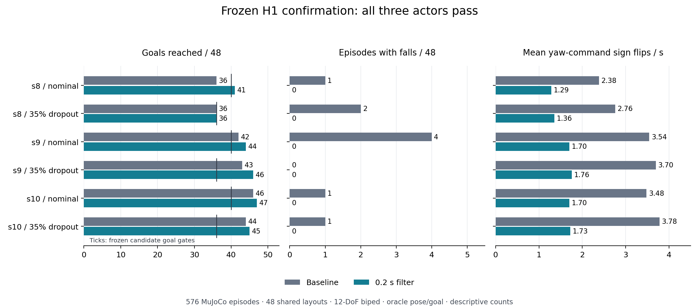

# H1 navigation confirmation — October 8, 2026

**DONE, PASS.** CPU job `21689706` finished at **13:27 PDT** on October 8
(20:27:37 UTC), after 3 h 24 min. The frozen report and independent verifier
agree: all **576 scored episodes** validate, with no missing/invalid records,
and all three navigation actors satisfy the original acceptance rule.

| Metric | Baseline | Existing 0.2 s yaw filter |
|---|---:|---:|
| Goals | 247/288 (85.8%) | 259/288 (89.9%) |
| Goals without wall contact | 246/288 | 258/288 |
| Episodes with falls | 9/288 | 0/288 |
| Wall-contact physics steps | 122 | 18 |
| Mean gait yaw-command sign flips/s | 3.274 | 1.588 |

The observed goal difference is **+4.17 percentage points**, with **51.5%**
lower mean command sign-flip rate. These are descriptive matched results,
not a formal significance claim. The filter is an existing scripted controller
component; no new policy training or physical-robot evaluation ran.

## Frozen design and acceptance

Three frozen learned navigation actors (s8/s9/s10) drive the same frozen
`dr-default-s0` learned gait on the **12-DoF biped**. Every actor runs the
baseline and the existing yaw filter, each under nominal sensing and 35%
simulated lidar-packet dropout, on the same 48 newly declared layouts
(seeds 120000–120047): **3 × 2 × 2 × 48 = 576 episodes**.

Each candidate actor must reach **at least 40/48 nominal goals and 36/48
dropout goals, with zero falls in both conditions**. The actor set, layouts,
filter parameter and success rules were frozen before scoring. No actor,
failure or condition was removed after the result. Two separate runtime-smoke
episodes at seed 119999 are excluded from these counts.

| Actor / condition | Baseline goals | Filter goals | Baseline / filter falls | Required filter goals |
|---|---:|---:|---:|---:|
| s8 / nominal | 36/48 | 41/48 | 1 / 0 | ≥40/48 |
| s8 / dropout | 36/48 | 36/48 | 2 / 0 | ≥36/48 |
| s9 / nominal | 42/48 | 44/48 | 4 / 0 | ≥40/48 |
| s9 / dropout | 43/48 | 46/48 | 0 / 0 | ≥36/48 |
| s10 / nominal | 46/48 | 47/48 | 1 / 0 | ≥40/48 |
| s10 / dropout | 44/48 | 45/48 | 1 / 0 | ≥36/48 |

Across the 288 matched pairs, both arms reach the goal in 233, only the filter
in 26, only the baseline in 14, and neither in 15. Candidate s9/dropout has
46 goals but 45 clean goals; zero falls does not mean collision-free operation.

## Metric definitions and limits

The chatter metric is `cmd_filter.gait_wz.flips_per_s`: consecutive opposite,
nonzero signs in the final yaw command sent to the gait after filtering and
the shared speed brake. Zero transitions do not count. It is sampled after
the one-second settling period at the 0.04 s policy tick; each episode's rate
is rounded to three decimals. The 51.5% reduction compares arithmetic means
over all 288 episodes per arm. It measures **command sign reversals**, not
physical robot yaw oscillation.

Among the **233 pairs where both arms reach the goal**, filter-minus-baseline
completion time has mean −5.875 s and median −6.20 s. This success-conditioned
subset cannot establish an all-episode speed improvement.

Navigation still uses **oracle robot pose and goal**, simulated lidar and the
existing map/observation pipeline. It does not test RGB stereo reconstruction,
physical lidar, estimated-pose navigation, or the 22-DoF humanoid turning
recipe. The 288 pairs reuse **48 layout blocks** across three actors and two
conditions; frames, repeats and actors are not hundreds of independent
environments. Zero observed falls is a cohort result, not guaranteed safety.
These results motivate the separate
[stereo–lidar research protocol](STEREO_LIDAR_RESEARCH_2026-10-08.md).

The older [384-episode A* comparison](../campaigns/20261006-confirmatory/results/verdict.json)
remains **NEGATIVE** because its unfiltered learned actors fell six times.
The two-layout filter pilot remains development data. Neither is relabeled
or pooled with this new confirmation.

## Evidence and reproduction

- [Frozen protocol](../results/task-closure-20261008/h1-navigation/protocol.json):
  SHA-256 `7b0b404ccac476340550166158b652b3d0eebb4a560aa0b397bf58eb75cd9112`.
- [Scheduler/runtime completion](../results/task-closure-20261008/h1-navigation/completion.json),
  [frozen report](../results/task-closure-20261008/h1-navigation/confirmation_report.json),
  and [independent verification](../results/task-closure-20261008/h1-navigation/independent-verification.json).
- [Paired metrics](../results/task-closure-20261008/h1-navigation/paired-metrics.json),
  [all 288 pair records](../results/task-closure-20261008/h1-navigation/paired-records.csv),
  and [analysis source](../results/task-closure-20261008/h1-navigation/paired_analysis.py).
- [All raw episode records](../results/task-closure-20261008/h1-navigation/episodes-21689706.tar.gz),
  [frozen campaign source](../results/task-closure-20261008/h1-navigation/frozen-campaign.tar.gz),
  [hash manifest](../results/task-closure-20261008/h1-navigation/published-evidence.json),
  and [verification/replay instructions](../results/task-closure-20261008/h1-navigation/USAGE.txt).

The independent verifier checks the original submitted protocol SHA, frozen
source/model/asset hashes, exact receipt arguments, numeric/boolean telemetry,
geometric goal consistency and layout pairing for all records. A scheduler
exit code alone was not used to close the experiment. Original shared MJCF and
mesh files remain site-specific dependencies for executable campaign replay;
the compressed records support independent descriptive reanalysis.

## Resume wording supported now

> Validated yaw-filtered learned navigation in 576 paired MuJoCo episodes,
> reaching 89.9% of goals versus 85.8% baseline, with 0 versus 9 observed falls
> and 51.5% fewer mean yaw-command sign reversals.

Keep the project description explicit: **12-DoF biped simulation, frozen
learned policies, scripted yaw filter, oracle pose/goal, three navigation
actors and 48 shared layouts**. The October 7 PDFs remain dated historical
deliverables; this is the supported October 8 addition. New stereo/fusion
targets may become resume results only after their declared tests run.
