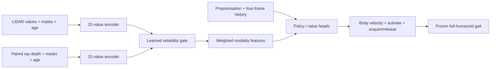

# Mission7: procedural sensor-driven humanoid missions

**September 23, second closeout — a validated, gate-compatible improvement
(411 of 512 CPU episodes; branch `mission7-approach-followup`).** Candidate 1
is the unchanged guarded plate stage with early handoff and a one-shot
`prev_actions := 0` that fires only after 3 s without progress — pauses stay
tick-identical, and the ten-fall replay gate is untouched by construction. On
every genuine stall observed (five across development and confirmation) it
restored forward progress, with route success in four and no regression. The
predeclared confirmatory on never-used validation layouts 16–31 (32 paired
episodes per arm, full denominator) gave Doors 1/16 → 1/16 and **Transport
2/16 → 4/16**, improved 2 / regressed 0, falls unchanged — reported as
**underpowered (two discordant pairs, p = 0.5), not null**, exactly as
predeclared. An earlier lateral-offset series was withdrawn after a
staging-anchor bug was found in the traces; the raised-plate crossing was then
traced end to end (settle → standing fixed point on the plate edge; sideways
crossing when unaligned; the gait cannot turn in place; the route walks back
to the pre-door waypoint after hand-back) and a composed fix completes Doors/1
in 77.7 s ([rendered](GALLERY.md)), but that composition fails the exact
replay 7–9/10 and is not promoted. Route and Approach gates stay closed on
their documented criteria; the test split is untouched. Checklist:
[`MISSION7_TASKS.md`](MISSION7_TASKS.md); evidence:
[`candidate1-confirmatory-summary.json`](../results/mission7-campaign-20260923/candidate1-confirmatory-summary.json).

**September 23 campaign closeout (349 CPU episodes, zero GPUs; branch
`mission7-approach-followup`).** Three mechanisms were established with
instrumented evidence and none yielded a validated end-to-end route
improvement. (1) *Post-stage stall* is a feedback fixed point of the frozen
gait: with `history_length 0` the only persistent policy input is the
22-element `prev_actions`; in every classifiable stall the joint-target range
fell to ≈2 % of walking amplitude with both feet planted and the 0.30 m/s
command verifiably delivered. Of five exposures, two were genuine stalls (Doors/1, Doors/6:
0.02 m and 0.00 m in the 20 s after the stall condition) and a one-shot
`prev_actions := 0` un-stuck both (3.5 m and 4.6 m; Doors/1 → success); the
other three were 0.8 s pauses the baseline recovered from unaided, and the
reset regressed Doors/3 downstream, so it was not promoted. (2) *In-stage failure* is geometric: the
plate centre sits 0.42 m off the corridor centreline, leaving the body
0.29–0.39 m from the wall against a 0.316 m half-body, and the stage waits
where nothing presses the plate. Ten one-factor arms (160 episodes) against
the 32-episode Campaign A baseline (Doors 3/16, Transport 1/16): none exceeded
3/16; the two that tied it (lateral 0.25 m with stage-owned activation)
removed five of the five falls but failed the exact replay gate 8/10 by
routing the approach across the raised plate; the gate-safe 0.35 m version is
1/16. (3) *World −x Approach* is marginal: both goal posts sit at
`goal + (0.52, ±0.35)`, so only −x crosses the 0.61 m gap, and the robot's
walking envelope is 0.546–0.605 m by geom AABB (the 0.632 m figure was a
sphere bound); six command-side arms over 96 episodes all landed at 7–9/16 or 0/16
with the succeeding layout set moving with crossing phase. All gates remain
closed and unweakened; the confirmatory set (validation 16–31) and the test
split were never read. Checklist and evidence:
[`MISSION7_TASKS.md`](MISSION7_TASKS.md),
[`campaign-a-summary.json`](../results/mission7-campaign-20260923/campaign-a-summary.json),
[`instage-summary.json`](../results/mission7-campaign-20260923/instage-summary.json),
[`approach-negx-summary.json`](../results/mission7-campaign-20260923/approach-negx-summary.json).

**September 22 Mission 7 closeout:** the exact unchanged ten-fall replay was
reproduced on the original physics node with zero pose error in all 10 episodes.
Every fall followed plate contact; minimum robot/plate clearance reached
−39.4 mm and six falls occurred during traversal, four after exit. No first
wall/door/goal-post contact preceded a retained fall. A staged pre-plate settle
and straight crossing with yaw correction frozen, guarded so that wrong-side
staging is used only when the correct plate is over 1.0 m away, reached the
existing exact **10/10 upright replay gate** on Slurm `21397732` without changing
geometry, activation semantics, or the fall predicate. The one-layout route
smoke completed on `21398074`, unlocking the documented route evaluation:
Doors **1/16** and Transport **0/16** on `21398514` using the existing
PlateSafeRouteController. The replay gate passed, but the separate privileged
Approach gate remains below threshold at 56/64 with world −x 8/16, so sensor
comparisons remain closed. Episode-level analysis showed that the route
campaign never activated the guarded `PlateStage`: it used the separate
`PlateSafeRouteController` switch/brake path, so the exact replay gate did not
test route-to-stage handoff. The corrected bounded six-episode handoff probe
completed under Slurm `21399211` after infrastructure-only failures `21399179`
and `21399201`; it activated the guarded stage in 4/6 episodes, completed 2/6,
and produced 1/6 full success. The required two-episode early-handoff probe
`21399449` then activated before target plate contact in both layout-1 cases;
all three staged crossings completed, Transport/1 succeeded end-to-end, and
Doors/1 timed out only after the first stage during route rejoin. Read-only
diagnostics in `21399494` showed a valid route-state transition followed by a
physical waypoint-8 stall in Doors/1, while Transport/1 advanced through the
same waypoint. The corrected single forward-pulse rerun `21399503` activated
the pulse but still timed out at waypoint 8. This supports early handoff as the
fix for the original layout-1 pre-contact falls.

**September 22 correction and closeout of the Doors/1 stall.** `21399503` is
withdrawn as evidence about forward drive: its "0.30 m/s forward restart pulse"
imposed 0.300 m/s while the route controller was already commanding 0.300 m/s
forward, a measured forward-command delta of **0.000000 m/s**. No additional
forward drive was ever applied. The contact probe `21400561` then settled the
mechanism. Across **775 post-stage steps Doors/1 touched a world geom in 19
(2.5 %), every one the just-crossed `plate_0_-1`, with no wall and no door
contact during the 134 s stall**; successful Transport/1 spent 70 of 292
post-stage steps (24.0 %) in contact across three plates and finished at
84.120 s. Doors/1 is therefore **neither physically blocked nor route-state
corrupted**: it stands in free space while the route commands a constant
0.300 m/s forward with no brake active, 0.05 rad heading error and the
waypoint-8 target 1.64 m ahead, and does not move. The remaining explanation is
**locomotion-policy failure from the post-stage entry state**, not route
rejoin. No new broad route or sensor campaign is open, and the privileged
Approach gate and sensor comparisons remain closed. Compact evidence:
[`early-handoff-probe-summary.json`](../results/mission7-approach-followup-20260922/early-handoff-probe-summary.json)
and
[`route-rejoin-contacts-cn-c22/result.json`](../results/mission7-approach-followup-20260922/route-rejoin-contacts-cn-c22/result.json).

**September 21 completed Approach diagnosis:** the six PPO cells failed their
stable-learning gates. Exact paired replays implicated raised pressure-plate
contact in ten route falls. The authorized privileged follow-up reached
**56/64 Approach successes with zero falls**, but world −x reached only 8/16
and matched standstill was 0/64. The unchanged-geometry contact-safe replay
was 8/10 upright; Doors reached 1/16 and Transport 1/16. The pressure-plate
and privileged Approach gates therefore remain closed, and no sensor study was
started. [Diagnosis and original evidence](MISSION7_APPROACH_DEBUG.md) and
[final follow-up results](MISSION7_APPROACH_FOLLOWUP.md).

This is a new, isolated benchmark, not an update to the earlier fixed-maze
results. It learns high-level navigation/interaction commands with the existing
RSL-RL PPO implementation and runs the actual 22-DoF Berkeley Humanoid Lite in
MuJoCo 3.3.5. Its frozen August 18 locomotion policy supplies joint targets.
No oracle route planner, localization supervisor, or sensor brake supplies the
learned policy's commands. Training is CPU-bound; these jobs allocate **zero GPUs**.

Implementation and submission are not evidence of learned mission success.
No sensor advantage, physical grasp, rendered-image stereo navigation, or
two-robot result is claimed by this experiment.

September 21 status: original pilot **21369796 finished at 0/16 validation
success** and failed its learning gate. All **14 overnight Slurm tasks
completed**: nine training studies and two audits executed; three sensor
studies skipped training because C4 failed its prerequisite. All nine learned
policies ended at **0/8 validation success**, including privileged-goal PPO.
C4 briefly reached 2/8 at update 100 but returned to zero. Across 1,386 recorded
training episodes there were no terminal successes. Learning already fails
at Approach; the jobs did not fail from scheduler errors or nonfinite PPO.
Qualification passed 160 tests and final targeted checks. The overnight
campaign used 16.22 allocated CPU-hours and zero GPUs.

Privileged full-route control succeeded **4/16 Doors and 4/16 Transport**;
localized components scored 13/16 doors and 7/8 transport. Later mechanics
can work but full-route reliability remains low. Reward sparsity and movement
discovery are the next diagnostic priorities. Sensors carry varying finite
features, but no sensor-performance comparison was released. See the
[final overnight audit and proposed next steps](MISSION7_OVERNIGHT.md).
The earlier status-only audit released no runs; the subsequent authorized
Approach diagnosis is linked above.
Original receipts remain in `results/mission7-20260920/`; overnight results
are in `results/mission7-overnight-20260920/`. The original per-cell plan is in
[`experiment-matrix.json`](../results/mission7-20260920/experiment-matrix.json).

Session files: added `src/bhl_robust/mission/{__init__,layout,state,sensors,policy,env}.py`,
`scripts/{mission7,submit_mission7,plot_mission7_layout}.py`,
`tests/test_mission7.py`, `slurm/mission7_cpu.sbatch`, this document and the
campaign artifacts. Modified `.gitignore` for runtime caches and `SLURM_JOBS.md`
for receipts/status. Pre-existing edits in other files were preserved.

## Task and the meaning of seven times

The full navigation stage contains **exactly seven junctions of degree at least
three on the start-to-goal route**, with at least four route turns. This is a
specified task-complexity proxy against a one-decision reference, not a measured
sevenfold difficulty or sample-complexity increase. The old 3 m oracle-guided
corridor did not actually require seven-wayfinding decisions divided by seven;
its commanded path concealed branch selection. Report the raw counts rather
than treating the ratio as an empirical result.

A randomized spanning tree connects a 6×6 grid. Walls exist at closed internal
edges as well as the outer boundary. Pitch varies among 1.5, 1.6 and 1.7 m,
leaving 1.42–1.62 m clear passages. The selected route has 13–20 edges,
**19.5–34 m** of centerline travel (6.5–11.3 times the old 3 m route), seven
decision junctions, blind corners, intersections and dead ends. The footprint
is approximately 9–10.2 m on each side; neither dimension was multiplied by
seven. There are no alternative loops in v1: both gates must be unavoidable.
Room enlargement, moving obstacles and bypass routes are later extensions.

Generation varies maze connectivity, route, pitch, button side, gate positions,
object position and destination. Layout manifests record every seed, edge,
route and geometry hash. The complete 352-layout test asserts disjoint geometry:

| Split | Generation seeds | Layouts | Use |
|---|---|---:|---|
| Train | 0–255 | 256 | PPO episodes |
| Validation | 10000–10031 | 32 | First 16 used for promotion and learning curves |
| Test | 20000–20063 | 64 | Final reporting only, never checkpoint selection |

Inspecting held-out geometry for generation invariants is permitted; held-out
policy outcomes must not tune rewards, architectures or checkpoints. Models
are reconstructed from deterministic layouts. The manifest is
[`layouts.json`](../results/mission7-20260920/layouts.json).


## Curriculum and physics

| Stage | Start / goal | Required completion |
|---|---|---|
| Approach | 0.65 m from final destination | Upright, slow arrival held for 1 s |
| Branches | Last four route edges | Same arrival rule through local geometry |
| Navigation | Full seven-decision route | Same arrival rule through the full maze |
| Doors | Full route, two initially closed gates | Intentionally activate both switches and cross both gates, then arrive |
| Transport | Full route plus parcel | Acquire, carry through both gates, release inside the drop zone, settle for 1 s |

Two collidable gates lift only after their corresponding pressure switches
activate. Each gate has a round correct plate and a square wrong plate with
randomized side. Activation requires **actual MuJoCo robot/plate contact with
normal force ≥1 N plus a positive policy activation action**. Contact is checked
at every 0.5 ms physics substep. Proximity never activates a plate. A passive
touch and a wrong plate both leave the gate closed. This is intentional
whole-body/foot switch activation, not a finger press. Door opening is a
scripted motor response implemented by moving a collidable mocap body upward.
Crossing must occur through the open gate plane in the intended direction.

The stock gait has no trained grasp skill. A positive acquire action within
0.45 m attaches the parcel kinematically at a body-frame carry mount; a release
action detaches it and it subsequently falls/settles under MuJoCo physics.
Attachment excludes parcel collision and payload forces while carried.
This is a **transport abstraction, not grasping or loaded locomotion**. Tilt
beyond 0.5 rad drops the object. Releases away from the destination count as
drops. Pickup rewards are issued only once, including after re-acquisition.

The valid floor drop zone is a 0.36 m radius disk. A 0.14 m cube must have
center within 0.29 m, center height 0.055–0.095 m, and combined linear/angular
velocity norm below 0.15 for 1 continuous second while released. Both gate
traversals and prior acquisition are required. Robot arrival alone cannot pass.
This first version uses a floor drop destination, not a raised shelf.

Falls (tilt ≥0.78 rad), more than five wall/gate/post contact intervals, and
deadlines terminate failure. Dead-end entries are scored, not instant failures;
the robot can recover. Approach/Branches/other deadlines are 18/50/180 s.
World and object state are permitted for scoring only. Physics warnings or
nonfinite states/actions abort the run rather than disappearing into metrics.

## Observations, sensor provenance and fusion

All four conditions use the same 1,564-dimensional observation and identical
network parameterization: four frames ×391 values. Unavailable modalities are
masked. The actor and critic consume the exact same observation group.

| Per-frame group | Width | Contents |
|---|---:|---|
| Proprioception / local state | 61 | Gravity direction, gyro, accelerometer and IMU validity; 22 joint positions and velocities; previous 5 actions; attachment and local plate-contact bits |
| LiDAR | 73 | 36 sector distances, 36 validity bits, age |
| Paired idealized ray depth | 257 | Two 8×8 optical-axis depth arrays, 128 validity bits, age |

LiDAR uses actual body-attached MuJoCo ray intersections: 108 horizontal rays,
36 sector minima, 12 m limit. The paired depth cameras use 60 mm baseline,
20° downward pitch, 60.5° vertical FOV and 6 m limit. Capture is nominally
10 Hz sampled on the 25 Hz gait clock; the learned controller updates at 5 Hz.
These full-body mounts differ from the old short biped's mount heights.

Missing returns remain invalid; stale/future/out-of-range/nonfinite data have
zero value **and zero mask**, never valid free-space values. Each modality has
its own timestamp and 150 ms freshness limit. The default 3 mm range noise and
40 mm noisy-condition perturbation are simulation stress assumptions, not
hardware calibration. Provenance records body mounts, baseline, pitch and
range conventions. The existing `sensor_io.imu_features` contract supplies IMU
features. No world yaw or translational pose is passed through it.

The `stereo` arm means **paired idealized ray depth**, not RGB stereo matching.
The calibrated image/SGBM adapter in [STEREO_INPUT.md](STEREO_INPUT.md) remains
available but is not integrated into this run. No custom button detector or
simulator geometry ID is substituted for image recognition. Low floor plates
may be invisible to the horizontal LiDAR; that is a meaningful modality limit.



The learned gate receives both embeddings, validity fractions and ages. Its
weights are multiplied by modality reliability and renormalized; missing
modalities have exactly zero weight, including the both-missing case. Actor
and critic have separate encoders. Evaluation records mean gate weights and
per-episode sensor validity traces. This is gated feature fusion, not
cross-attention or robot communication. Four-frame history covers 0.8 s;
there is no long-term recurrent map memory in v1.

## Privileged-input and reward audit

Legacy `MazeWaypointCommand`, `RecoveryWaypointCommand`, inspection targets,
global yaw/position and full maze geometry are absent from this policy path.
The low-level gait receives velocity commands produced directly by the learned
actor, IMU/gravity and joint state. The actor/critic receive no waypoint vector,
base translational velocity, object/door/button coordinates, map, shortest-path
distance, ground-truth class ID, success flag or curriculum-stage ID. Tests
check that adding arbitrary privileged fields cannot affect either network.

Rewards per 40 ms gait interval are: −0.01×dt time cost; −0.2 per interval with
wall/gate/post contact; −5 on fall/excessive contact; +2 once per correct plate;
−1 per new wrong-plate activation; +2 once per gate traversal; +2 once for
acquisition; +10 once for terminal mission completion. There is no waypoint
distance shaping, reward for repeated pickup, or exploration reward based on
an oracle map. Consequently long-route exploration may be difficult; the
one-seed learning gate must establish feasibility before a larger campaign.

State updates enforce monotonic physical timestamps and matching dt. Duplicate
calls do not advance dwell, invalid samples reset dwell, and terminal bonuses
cannot repeat. Timeouts are terminal failures of the finite-duration mission;
rollout boundaries alone retain PPO value bootstrapping.

## Experiment matrix and gates

Identical training layout distributions, seeds, rewards, action spaces,
hyperparameters, update budgets and promotion rules apply to all four arms.
Seed 0 pilot cells start from scratch, including Both; they do not inherit the
extra one-seed infrastructure-validation training.

| Phase | Jobs | Work | Resources per job | Release condition |
|---|---:|---|---|---|
| A | 1 | All arms × Approach/Doors/Transport finite PPO + reset smoke, contact and placement controls | 2 CPU, 12 GB, 0 GPU, 30 min | Local tests and smoke passed |
| B | 1 training job | Both, seed 0, Approach, 400×64 decisions | 2 CPU, 12 GB, 0 GPU, 4 h | `afterok:A` and passing smoke JSON |
| C | 4 training jobs | Fresh Approach, four arms, seed 0, 400×64 each | Same CPU allocation, 4 h | B measured validation gate |
| D | 56 additional training jobs | Eight seed-1/2 Approach cells; 4 later stages ×4 arms ×3 seeds | Same CPU allocation, 4 h each initially | Pilot gates and corresponding prior-stage validation |
| E | 108 evaluation jobs | 12 completed final policies ×9 sensor conditions ×64 held-out layouts | Same CPU allocation, 4 h | Exact hash-matched passed checkpoint |
| F | 0 | Optional two-robot extension | Undetermined | Stable single-robot mission |

There are **60 matched main training cells**, including C, plus the extra B
validation training: **61 training jobs**, one infrastructure job and **108
separate held-out evaluation jobs** if the entire planned matrix is released.
Validation rollouts run inside each training job; they are not additional Slurm
jobs. No GPU allocation is planned. Only A and B are authorized for immediate
release by current evidence; later phases remain planned and gated.

Matched per-stage budgets are 400/800/1600/1600/1600 PPO updates, each with
64 high-level decisions. Total per arm/seed is 384,000 decisions (five 40 ms
gait intervals per decision), or 4,608,000 decisions across 12 policies,
plus 25,600 decisions for B. Failed gates stop promotion; incomplete arms must
be reported, not silently excluded from comparisons. Reassess walltime using
measured throughput before releasing long stages. Individual submissions are
used for A/B; arrays are not submitted speculatively.

Promotion uses 16 fixed validation layouts. It requires ≥30% success and an
increase of ≥12.5 percentage points over the initial checkpoint, or retention
within 12.5 points when transferred behavior already passes 30%. This is a
feasibility gate, not statistical proof of improvement. Validation at updates
100/200/etc. records the first measured crossing of 30/50/80% thresholds.
Checkpoints are saved every 25 updates. All gate resumes verify checkpoint
SHA256, arm, seed, prior stage, validation split and episode count.

Evaluation conditions: normal; LiDAR missing; depth missing; both missing;
LiDAR stale; depth stale; 40 mm range noise; one-third rays/pixels occluded;
35% packet loss. Identical layout/reset seeds are used across arms and
conditions. Redundant missing-modality controls remain explicit. A separate
`--no-button` evaluation is available; wrong-plate and passive-touch physical
fixtures are required in A.

## Metrics and evidence

`episodes.jsonl` records actual terminal outcomes and layout seeds. Metrics
include mission success, distance, shortest-centerline efficiency, contact
intervals, falls/timeouts, dead-end entries, elapsed time, switch activation
times/wrong activations/retries, gate traversals, acquisition/drops/carried
distance, final object XYZ and placement error. Gate-solving time is derivable
from timestamps; the initial version records activation times rather than
detecting when a policy first began attempting a switch. `learning.jsonl`
contains PPO losses, returns, steps, episode counts and runtime, separately
from task-success validation. Aggregate uncertainty across three training seeds
only after those runs exist.

Carried distance measures robot-base travel while the attachment is active;
it is not a load-dynamics measurement. Collision counts are 40 ms control
intervals containing a contact, not distinct impact events.

Per-second traces retain scoring pose, command, door/parcel state and sensor
validity. `eval --video` renders the first rollout with MuJoCo at 5 fps when EGL
or OSMesa is available. Select a checkpoint and failure condition explicitly.
No learned successful-mission, grasp, or dropout-recovery video exists yet.
Structured metrics remain authoritative. Current physical contact/placement
fixtures deliberately reposition state and are **not policy demonstrations**.

## Running and checking

All new artifacts remain inside this repository. Existing experiments and jobs
are preserved. Slurm submissions use the existing `eecs`/`share` CPU convention
and existing MuJoCo/RSL Python environment. Source files are frozen under the
campaign's `source/`, hashed, and verified at job start. No shared environment,
upstream asset, existing checkpoint, or public result summary is modified.

```bash
cd /path/to/bhl-robustness-ladder
PY="${PYTHON:-python3}"
export PYTHONPATH="$PWD/src" OMP_NUM_THREADS=1 OPENBLAS_NUM_THREADS=1
"$PY" -m pytest -q tests

# New output paths are required; these commands intentionally do not overwrite.
"$PY" scripts/mission7.py smoke --out results/mission7-next/local-smoke
"$PY" scripts/submit_mission7.py smoke --campaign results/mission7-next
# Add --submit to submit a dry-run command.

# After the one-seed learning gate passes, prepare the four matched pilots:
for arm in blind lidar stereo both; do
  "$PY" scripts/submit_mission7.py pilot --campaign results/mission7-20260920 --arm "$arm"
done

squeue -u "$USER" -o "%.18i %.12P %.28j %.10T %.12M %.30R"
sacct -j 21369795,21369796 --format=JobID,JobName%28,State,ExitCode,Elapsed,AllocTRES%50 -X
cat results/mission7-20260920/submissions.jsonl
cat results/mission7-20260920/cluster-smoke/smoke.json
cat results/mission7-20260920/validation-both-s0/gate.json
tail -n 5 results/mission7-20260920/validation-both-s0/learning.jsonl
```

The submission helper defaults to dry-run and rejects duplicate destinations.
Failure of the dependent training's task gate exits nonzero even if PPO itself
ran correctly. See [SLURM_JOBS.md](../SLURM_JOBS.md) for actual receipts and the
dated status; a scheduled or completed job is never automatically a successful
policy.

## Remaining capability limits

The original pilot and both end-of-day diagnostics have now finished. The
pilot's final validation remained **0/16**; its exit 2 marks the failed learning
gate. Fast privileged approach control succeeded **22/32**, while slow and
stationary control each scored **0/32**. Sensor removal from the failed
checkpoint is only a sensitivity check. The separately authorized
[14-task overnight diagnosis](MISSION7_OVERNIGHT.md) isolates stages, PPO,
observations, rewards and later interactions without releasing the full matrix.

### September 20 end-of-day diagnostics

Phase B's update-100/200/300 validation remained 0/16. Two bounded CPU studies
were submitted instead of promoting the four-arm training sweep:

| Job | Question | Design |
|---|---|---|
| `21369990` | Can the frozen gait actually reach and dwell in the target under the current geometry/scorer? | 16 training layouts ×2 reset seeds ×privileged slow/fast control and stationary control =96 episodes |
| `21369991` | Does the final policy respond to sensor removal, and how does its behavior fail? | Exact update-400 checkpoint, 16 validation layouts ×normal/LiDAR missing/depth missing/both missing =64 episodes; `afterany:21369796` |

Each requests two CPUs, 12 GB, zero GPUs, and at most two hours. Both use
the same frozen task implementation as Phase B; no running training was
modified. The second job deliberately permits a failed **learning** gate:
it diagnoses the checkpoint and cannot promote it or launch further jobs.
If the exact final checkpoint is absent, it fails rather than selecting a
different checkpoint silently. Neither study uses test-layout performance.

The feasibility controller is explicitly privileged and consumes simulator
pose and the goal. Its success cannot count as learned navigation. The audit
records closest goal approach, slow goal samples, maximum dwell, contact names,
terminal outcomes and traces. It also masks modalities on identical stored
observations to measure action sensitivity; sensitivity alone is not sensor
utility. Local checks passed two new tests and all diagnostic execution modes;
one training-layout fixture passed with fast oracle control and timed out with
slow/stationary control. Broader feasibility remains to be measured.

Artifacts: `results/mission7-diagnostics-20260920/plan.json`,
`submissions.jsonl`, immutable `source/`, `feasibility/report.json`, and
`checkpoint/report.json`. Code: `scripts/mission7_diagnostic.py`,
`slurm/mission7_diagnostic.sbatch`, `tests/test_mission7_diagnostic.py`.

```bash
squeue -j 21369796,21369990,21369991
sacct -j 21369796,21369990,21369991 --format=JobID,State,ExitCode,Elapsed -X
```

True grasping, load-aware carrying, shelf placement, rendered stereo image
matching, physical sensor calibration, long-term memory, room/corridor width
variation within a layout, alternate loops, moving obstacles and cooperation
are not demonstrated by v1. Full-route learnability and sensor benefit remain
open research questions. The first longer run tests Approach learning; it does
not automatically launch the full multi-seed or two-robot experiment.
