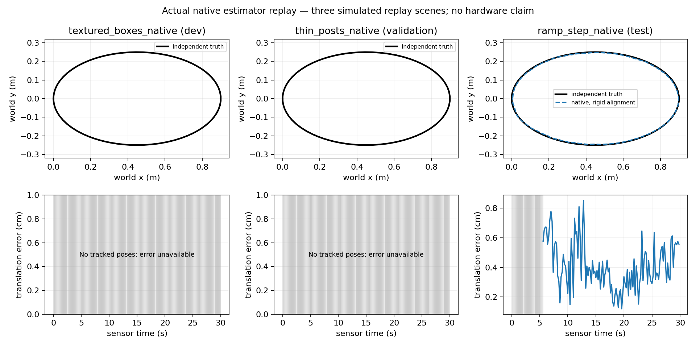
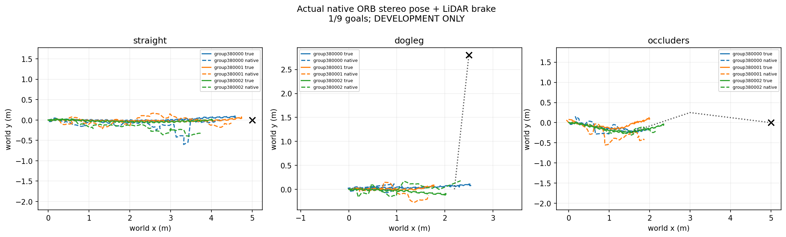

# Native estimation, navigation and terrain results — October 9, 2026

Actual FAST-LIO2 replay passes the three declared scene gates. Its native pose
also supports nine clean development navigation goals with a frozen learned
gait. The separate terrain qualification screen finishes negative. Native
ORB-SLAM3 completes all three replay scenes with an overall negative verdict:
two never initialize, while the held-out ramp/step scene passes. Stereo
navigation also finishes negative: one of nine clean development goals,
with zero falls or contacts.

| Experiment | Scored result | Scope |
|---|---|---|
| Native LiDAR–IMU replay | **PASS, 3/3 scenes**, 441/450 tracked outputs; 100% tracking after the first five seconds | Three 30-second ideal simulated recordings; fixed-scale evaluator alignment; zero navigation episodes |
| Native LiDAR–IMU navigation | **PASS development, 9/9 clean goals, 0 falls, 0 contacts** | One frozen 12-DoF gait, three scripted routes × three development seed groups, 40 seconds per episode; no independent confirmation |
| Terrain controller qualification | **NEGATIVE, 3/18 clean goals, 15 side-wall contacts, 0 falls** | Blind baseline, three frozen actors × three terrains × two screen seed groups; zero qualified actors and zero confirmation episodes |
| Native stereo SLAM replay | **NEGATIVE overall, 1/3 scene gates**, 122/450 tracked outputs | Two scenes never initialize; held-out ramp/step passes with 0.44 cm aligned ATE and 48.60 ms native compute p95 |
| Native stereo navigation | **NEGATIVE development, 1/9 clean goals, 0 falls, 0 contacts** | Same learned gait and route/seed schedule; six native map-ID changes trigger the declared permanent stop |

Smoke episodes never enter these scored counts. All outcomes are simulation
measurements. The 12-DoF navigation experiment is separate from H4's 22-DoF
turning result.

## Native replay

[Frozen protocol](NATIVE_CAMPAIGNS_2026-10-09.md) ·
[Independent result collection](../results/native-campaign-20261009/lio-replay-v4/replay-observer/report.md) ·
[Collection receipt](../results/native-campaign-20261009/lio-replay-v4/replay-observer/collection-receipt.json)

The capture contains 450 stereo pairs, 920,787 timed LiDAR returns and 18,000
IMU samples. Each scene includes five stationary seconds followed by a short
closed path. Scene roles were assigned before inference: textured boxes for
development, thin posts for validation, ramp/step for test. The synchronized
[raw capture is published with its checksum](https://github.com/joses2017smjh/bhl-robustness-ladder/releases/tag/native-sensor-replay-20261009).

| Scene | Role | Tracked / outputs | ATE RMSE | Rotation error p95 | Native compute p95 |
|---|---|---:|---:|---:|---:|
| Textured boxes | Development | 147/150 | 1.038 cm | 0.998° | 10.100 ms |
| Thin posts | Validation | 147/150 | 1.959 cm | 1.171° | 10.863 ms |
| Ramp/step | Test | 147/150 | 1.417 cm | 1.270° | 10.618 ms |

All scenes pass the unchanged post-initialization tracking ≥90%, one
continuous map, ATE RMSE ≤10 cm, rotation p95 ≤5° and native compute p95 ≤100 ms
readiness gates. Actual full job: `21743631`; its fresh same-source smoke was
`21743630`. Native build uses the pinned upstream FAST-LIO2 estimator with
transport shims and disclosed `-O1` compilation. “Tracked” means at least one
effective native point match; it is not an observability guarantee.

Truth is read only by the evaluator after inference. Alignment uses yaw and
translation with scale fixed at one. The final LiDAR interval lacking a truth
bracket is excluded from associated-pose error. Native compute is estimator
work; it excludes capture, export, process startup and imposed replay pacing.
These are short, ideal simulated sensor recordings, not physical calibration,
long-distance drift, loop-closure or generalization benchmarks.

## Native stereo replay

[Verified result collection](../results/native-campaign-20261009/orb-replay-v2/collection/report.md) ·
[Upstream integration and build provenance](ORB_NATIVE_2026-10-09.md)

Actual allocation step `21739893.8` follows same-source smoke step
`21739893.7`. All 450 original image pairs are processed at their original
timestamps, with replay pacing for native background mapping. Native
tracking, local mapping and loop-closure algorithms remain unchanged.

| Scene | Tracked / outputs | Post-init tracking | ATE RMSE | Native compute p95 | Readiness |
|---|---:|---:|---:|---:|---|
| Textured boxes, development | 0/150 | 0% | Unavailable | 45.11 ms | NEGATIVE |
| Thin posts, validation | 0/150 | 0% | Unavailable | 27.02 ms | NEGATIVE |
| Ramp/step, test | 122/150 | 97.6% | 0.439 cm | 48.60 ms | PASS |

The two failed scenes retain actual `NOT_INITIALIZED` native states and null
poses for every frame. The ramp/step scene has 28 uninitialized frames followed
by 122 actual `OK` states; rotation error p95 is 0.640°. There are no map resets.
The whole three-scene readiness rule fails; the held-out scene is not promoted
to an overall success. Error uses evaluator-only SE(3) alignment with scale
fixed at one. Tracking coverage differs between methods, so their ATE values
do not establish a matched accuracy improvement. No loop-closure event or
long-distance drift result is inferred from executing the native algorithm.

Earlier smoke exposed an upstream settings-printer uninitialized camera-pointer dereference before
inference. The replacement uses the upstream-supported legacy calibration
parser with the same intrinsics, 0.12 m baseline and feature settings, preserving
the actual compiled native binary. A real constructor check and fresh smoke
passed before scoring. No parameters were tuned after viewing these outcomes.

## Estimated-pose navigation

[Method and timing contract](NATIVE_NAVIGATION_2026-10-09.md) ·
[Actual nine-episode report](../results/native-campaign-20261009/navigation-lio-v2/development-observer/report.md) ·
[Independent outcome reconstruction](../results/native-campaign-20261009/navigation-lio-v2/development-outcome-audit.json) ·
[Final source/data audit](../results/native-campaign-20261009/navigation-lio-v2/development-final-audit.json)

Job `21741509`, following fresh smoke `21741213`, completes all nine declared
40-second episodes: straight, dogleg and occluder routes, each with seed groups
380000–380002. A frozen learned 12-DoF gait follows scripted waypoints using
native LiDAR–IMU pose and a raw LiDAR obstacle brake. Known initial frame
registration is declared. Ground-truth pose remains evaluator-only.

Native responses become available only after their measured client wall delay;
the controller retains the previous pose until arrival and stops on stale data.
All nine episodes reach a clean goal with zero falls, contacts or nonfinite
states. Native tracking is 1,674/1,701 outputs and 100% after initialization.
Per-episode aligned ATE RMSE is **1.46–2.89 cm**; equal-frame aggregate RMSE is
**2.04 cm**. Per-episode client wall p95 is **13.55–14.16 ms**. Final true goal
distances are 0.128–0.269 m, within the declared goal criterion.

This is a **development gate**, with one trained gait, three shared routes and
three reset seed groups. It is not nine trained policies or independent
confirmation. Ideal ray generation is not charged to LIO client wall time.
Stereo navigation additionally charges rendered image capture and uses the
same raw LiDAR brake, so its overall system is not stereo-only navigation and
the two latency scopes must not be compared as identical pipelines.

## Stereo-pose navigation

[Detailed original-input/native audit](../results/native-campaign-20261009/stereo-nav-v3/development-observer/report.md) ·
[Independent evaluator-matrix outcome audit](../results/native-campaign-20261009/stereo-nav-v3/development-outcome-audit.json) ·
[State and timing statistics](../results/native-campaign-20261009/stereo-nav-v3/development-final-statistics.json) ·
[Method](NATIVE_STEREO_NAVIGATION_2026-10-09.md)

Full job `21744334` follows fresh same-source smoke `21744333`. All nine
40-second development episodes finish, with **1/9 clean goals, zero falls and
zero contacts**. Only straight-route group380001 reaches a clean goal. The
predeclared nine-goal development gate fails; no confirmation cohort runs.

All **1,701 original stereo pairs** are retained with their hashes. Raw native
ORB reports `OK` on **1,391/1,701** frames, while the controller accepts only
**783/1,701** poses. **Six of nine episodes change native map IDs** and trigger
the declared permanent stop: a new native map does not preserve the original
controller world frame automatically. Loss and braking also affect the loop.
Thus raw tracking state, accepted continuous-frame pose and navigation success
are separate measured outcomes.

Per-episode client wall p95 is **33.31–38.75 ms**. Measured rendered capture,
PNG encoding and hashing p95 is **99.28 ms per pair**, with **135.82 s total**
charged capture work and zero unconsumed capture cost at episode horizons.
Capture cost and native client wall cost enter the declared causal delivery
rule. Directly measured same-request capture-plus-client wall p95 is
**131.30 ms** across all 1,701 requests, with none pending or excluded; the
40 ms physics delivery tick yields **160.0 ms delivery-delay p95**. The
[retained request vector](../results/native-campaign-20261009/stereo-nav-v3/development-final-statistics-combined-latency-vector.json)
binds this calculation to the original raw archive.
The LIO and stereo runs also use different hosts and capture/timing scopes;
their latency numbers establish no matched speedup.

[Original left/right input montage](../results/native-campaign-20261009/stereo-nav-v3/development-demo/original-stereo-input-demo.png)
shows the actual body-attached images at retained timestamps. The path figure
uses the controller's known-start registration, without evaluator alignment.
Its generation receipt binds the raw archive, source generator and PNG hashes.

This completed negative experiment motivates testing world-frame continuity
and calibrated sensor recovery on a new cohort. The successful LIO development
result and failed stereo result retain their original sensor, map-change and
latency contracts.

## Terrain screen and the next hypothesis

[Terrain methods](TERRAIN_TRAVERSAL_2026-10-09.md) ·
[Actual source-verified outcome summary](../results/native-campaign-20261009/terrain-v3/actual-results-summary.json)

Job `21742786` completes all 18 blind-baseline qualification episodes after
fresh same-source smoke `21742782`. Actor s0 reaches 3/6 clean goals; s1 and s2
reach 0/6 each. The other 15 episodes terminate on side-wall contact. No episode
falls or becomes nonfinite. The frozen qualification rule requires 6/6 clean
goals for each actor, so **zero actors qualify** and **zero confirmation episodes
run**. LiDAR maps are recorded and scored during the screen, but the LiDAR and
50% LiDAR-loss confirmation arms are unrun. This screen estimates no LiDAR
traversal improvement.

The course uses physical MuJoCo contact geometry for flat ground, 1 cm steps
and a 3° ramp. Its geometric elevation/slope/roughness baseline draws on the
[elevation-mapping research route](STEREO_LIDAR_RESEARCH_2026-10-08.md), without
claiming a reproduction of a probabilistic terrain-mapping paper. Map metrics
include all scene surfaces, including walls; they are not ground-only errors.

Side-wall termination motivates a separately declared heading-stabilization
screen with estimated pose and fresh seeds before another terrain comparison.
Future stereo/LiDAR research should retain calibrated timestamps/extrinsics,
compare each sensor alone with simple and confidence-gated fusion, and measure
false free space, missed hazards, tracking failures and closed-loop outcomes.
Physical recordings, independent navigation confirmation and robust terrain
traversal remain open objectives; no completed gate is relabeled or retuned.

## Research tasks opened by these results

At publication on October 9, these were proposed follow-ups, **not queued campaigns or achieved results**. The [October 10 implementation and execution ledger](RESEARCH_METHODS_2026-10-10.md) records subsequent work without changing this report's original measurements.
The [research protocol and primary references](STEREO_LIDAR_RESEARCH_2026-10-08.md)
and [native methods](NATIVE_CAMPAIGNS_2026-10-09.md) ground the algorithm choices.

[ORB-SLAM3](https://arxiv.org/abs/2007.11898) supports stereo–inertial estimation
with visual-first inertial initialization; retain visual initialization diagnostics
in that experiment. [FAST-LIO2](https://arxiv.org/abs/2107.06829) registers raw
3D returns with IMU-based motion compensation. [Fankhauser et al.](https://www.research-collection.ethz.ch/items/563227f2-bb05-434b-8aef-1b001a9fdebc)
model localization and range uncertainty in elevation maps. [Yao et al.](https://arxiv.org/abs/2504.05148)
study SGM-based dense-depth fusion with LiDAR semidensification and three-view
consistency; confidence-gated native pose recovery remains a separate project
hypothesis.

| Task | Experiment and control | Results to measure |
|---|---|---|
| Explain stereo initialization failures | Add read-only native keypoint/stereo-match diagnostics to the consumed recordings. Check calibration, epipolar residuals, texture and motion before selecting a new acquisition condition. Keep the original 450-frame verdict unchanged. | Initialization time, feature/match counts, disparity validity, failure-state duration; diagnostic data do not become new test data |
| Test stereo–inertial navigation | Compare native stereo, stereo–IMU and LiDAR–IMU pose on a new matched cohort with declared camera rate, exposure/motion blur and IMU perturbations. Freeze gates before execution. | Tracking loss, map resets, fixed-scale drift/error, clean goals, contacts/falls and measured delivery latency |
| Stress the successful LiDAR–IMU pipeline | Compare nominal input against matched timestamp offsets, extrinsic errors, IMU bias and return dropout on fresh data. Preserve per-point time and causal estimated-motion deskew. Calibrate health gates against observed failures. | Drift, initialization/tracking failures, goals, collisions, recovery delay and confidence calibration; one effective match is not a calibrated confidence score |
| Qualify heading control before terrain fusion | Run a separately declared estimated-heading controller screen on fresh seeds with the three frozen gaits and physical flat/step/ramp courses. Retain the failed blind screen; advance to independent terrain confirmation only after the new screen qualifies. | Cross-track/heading error, clean crossings, side-wall contacts, falls, height/roughness/hazard error and traversal time |
| Measure dense stereo–LiDAR fusion | Compare stereo SGM, sparse LiDAR, simple projected fusion and a disclosed SGM-cost/consistency method on new calibrated recordings under sparsity, occlusion and calibration perturbations. | Depth error/coverage, thin-obstacle recall, false free space and full pipeline latency |
| Test confidence-gated sensor recovery | Compare each native estimator alone, the declared permanent-stop baseline and confidence-gated recovery under matched visual degradation and LiDAR/IMU faults. Test world-frame continuity across map changes using estimated sensor overlap/motion, with no truth feedback. | False free space, missed obstacles, recovery time, failure tolerance, goals/collisions and complete pipeline latency |

These tasks connect the recorded stereo, timed 3D returns and IMU data to
robotics work in perception, estimation, controls and evaluation infrastructure.
For physical collection, retain synchronized original stereo, per-point LiDAR
timestamps and SI-unit IMU data, with camera intrinsics, sensor extrinsics and
time-offset calibration. Separate calibration/development/test recordings
before tuning and vary texture, lighting, body motion, slopes and thin obstacles.

Any future resume improvement percentage needs a fresh matched comparison;
this report supports only the measurements already completed above.

## Evidence integrity and resume wording

Full source/input manifests, raw traces, evaluator truth, native responses,
launch/completion receipts and failure records are retained. A concurrent
source edit correctly stopped one earlier replay smoke before inference. Its
exact original manifest bytes were restored for the replacement freeze, all
842 entries were independently checked, and a new fresh smoke passed before
the scored run. The freezer now verifies the exact bytes consumed by the
archive writer and refuses to create an executable intake after mutation.

Suggested supported project bullet:

> Integrated native FAST-LIO2 with a frozen 12-DoF learned gait in MuJoCo,
> reaching 9/9 development waypoint goals across three routes and three seed
> groups with zero falls or contacts while accounting for estimator latency.

The project description should retain the simulation and development scope.
An alternative infrastructure bullet is:

> Built a synchronized stereo/LiDAR–IMU evaluation pipeline for 450 image pairs,
> 920,787 timed returns and 18,000 IMU samples, comparing native ORB-SLAM3 and
> FAST-LIO2 with frozen tracking, pose-error and latency gates.

The native replay numbers can be a separate technical measurement with its
short-recording, CPU compilation and fixed-scale alignment conditions. The
terrain result supports a transparent experiment report, not a success claim.
