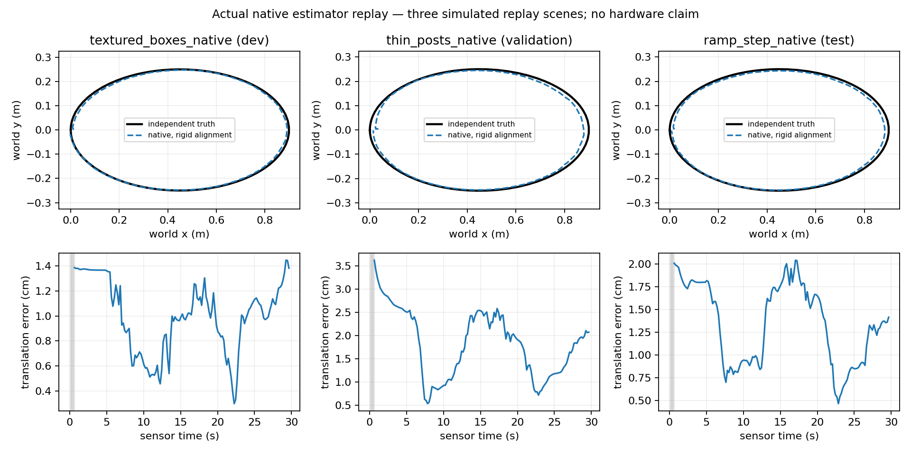
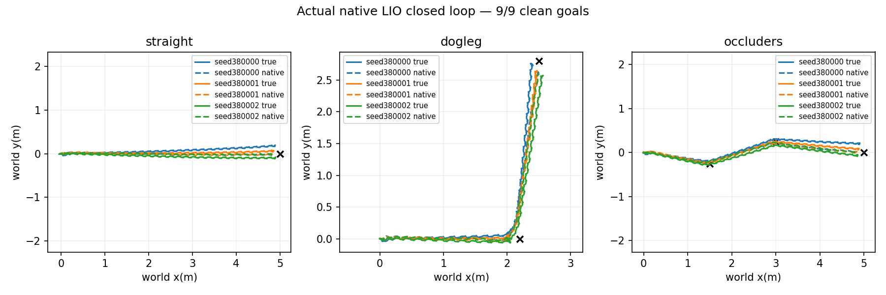

# Native estimation, navigation and terrain results — October 9, 2026

Actual FAST-LIO2 replay passes the three declared scene gates. Its native pose
also supports nine clean development navigation goals with a frozen learned
gait. The separate terrain qualification screen finishes negative. Native
ORB-SLAM3 has passed its executable build checks. Fresh stereo smoke exposed
a native startup crash before inference; scored stereo replay and navigation
have no outcome in this revision.

| Experiment | Scored result | Scope |
|---|---|---|
| Native LiDAR–IMU replay | **PASS, 3/3 scenes**, 441/450 tracked outputs; 100% tracking after the first five seconds | Three 30-second ideal simulated recordings; fixed-scale evaluator alignment; zero navigation episodes |
| Native LiDAR–IMU navigation | **PASS development, 9/9 clean goals, 0 falls, 0 contacts** | One frozen 12-DoF gait, three scripted routes × three development seed groups, 40 seconds per episode; no independent confirmation |
| Terrain controller qualification | **NEGATIVE, 3/18 clean goals, 15 side-wall contacts, 0 falls** | Blind baseline, three frozen actors × three terrains × two screen seed groups; zero qualified actors and zero confirmation episodes |
| Native stereo SLAM / navigation | Actual executable build **PASS**; scored results pending | Original rendered stereo inputs and unchanged native algorithms; startup integration repair and fresh smoke required before scoring |

Smoke episodes never enter these scored counts. All outcomes are simulation
measurements. The 12-DoF navigation experiment is separate from H4's 22-DoF
turning result.

## Native replay

[Frozen protocol](NATIVE_CAMPAIGNS_2026-10-09.md) ·
[Independent result collection](../results/native-campaign-20261009/lio-replay-v4/replay-observer/report.md) ·
[Collection receipt](../results/native-campaign-20261009/lio-replay-v4/replay-observer/collection-receipt.json)

The capture contains 450 stereo pairs, 920,787 timed LiDAR returns and 18,000
IMU samples. Each scene includes five stationary seconds followed by a short
closed path. Scene roles were assigned before inference: textured boxes for
development, thin posts for validation, ramp/step for test. The synchronized
[raw capture is published with its checksum](https://github.com/joses2017smjh/bhl-robustness-ladder/releases/tag/native-sensor-replay-20261009).

| Scene | Role | Tracked / outputs | ATE RMSE | Rotation error p95 | Native compute p95 |
|---|---|---:|---:|---:|---:|
| Textured boxes | Development | 147/150 | 1.038 cm | 0.998° | 10.100 ms |
| Thin posts | Validation | 147/150 | 1.959 cm | 1.171° | 10.863 ms |
| Ramp/step | Test | 147/150 | 1.417 cm | 1.270° | 10.618 ms |

All scenes pass the unchanged post-initialization tracking ≥90%, one
continuous map, ATE RMSE ≤10 cm, rotation p95 ≤5° and native compute p95 ≤100 ms
readiness gates. Actual full job: `21743631`; its fresh same-source smoke was
`21743630`. Native build uses the pinned upstream FAST-LIO2 estimator with
transport shims and disclosed `-O1` compilation. “Tracked” means at least one
effective native point match; it is not an observability guarantee.

Truth is read only by the evaluator after inference. Alignment uses yaw and
translation with scale fixed at one. The final LiDAR interval lacking a truth
bracket is excluded from associated-pose error. Native compute is estimator
work; it excludes capture, export, process startup and imposed replay pacing.
These are short, ideal simulated sensor recordings, not physical calibration,
long-distance drift, loop-closure or generalization benchmarks.

## Estimated-pose navigation

[Method and timing contract](NATIVE_NAVIGATION_2026-10-09.md) ·
[Actual nine-episode report](../results/native-campaign-20261009/navigation-lio-v2/development-observer/report.md) ·
[Independent outcome reconstruction](../results/native-campaign-20261009/navigation-lio-v2/development-outcome-audit.json) ·
[Final source/data audit](../results/native-campaign-20261009/navigation-lio-v2/development-final-audit.json)

Job `21741509`, following fresh smoke `21741213`, completes all nine declared
40-second episodes: straight, dogleg and occluder routes, each with seed groups
380000–380002. A frozen learned 12-DoF gait follows scripted waypoints using
native LiDAR–IMU pose and a raw LiDAR obstacle brake. Known initial frame
registration is declared. Ground-truth pose remains evaluator-only.

Native responses become available only after their measured client wall delay;
the controller retains the previous pose until arrival and stops on stale data.
All nine episodes reach a clean goal with zero falls, contacts or nonfinite
states. Native tracking is 1,674/1,701 outputs and 100% after initialization.
Per-episode aligned ATE RMSE is **1.46–2.89 cm**; equal-frame aggregate RMSE is
**2.04 cm**. Per-episode client wall p95 is **13.55–14.16 ms**. Final true goal
distances are 0.128–0.269 m, within the declared goal criterion.

This is a **development gate**, with one trained gait, three shared routes and
three reset seed groups. It is not nine trained policies or independent
confirmation. Ideal ray generation is not charged to LIO client wall time.
Stereo navigation additionally charges rendered image capture and uses the
same raw LiDAR brake, so its overall system is not stereo-only navigation and
the two latency scopes must not be compared as identical pipelines.

## Terrain screen and the next hypothesis

[Terrain methods](TERRAIN_TRAVERSAL_2026-10-09.md) ·
[Actual source-verified outcome summary](../results/native-campaign-20261009/terrain-v3/actual-results-summary.json)

Job `21742786` completes all 18 blind-baseline qualification episodes after
fresh same-source smoke `21742782`. Actor s0 reaches 3/6 clean goals; s1 and s2
reach 0/6 each. The other 15 episodes terminate on side-wall contact. No episode
falls or becomes nonfinite. The frozen qualification rule requires 6/6 clean
goals for each actor, so **zero actors qualify** and **zero confirmation episodes
run**. LiDAR maps are recorded and scored during the screen, but the LiDAR and
50% LiDAR-loss confirmation arms are unrun. This screen estimates no LiDAR
traversal improvement.

The course uses physical MuJoCo contact geometry for flat ground, 1 cm steps
and a 3° ramp. Its geometric elevation/slope/roughness baseline draws on the
[elevation-mapping research route](STEREO_LIDAR_RESEARCH_2026-10-08.md), without
claiming a reproduction of a probabilistic terrain-mapping paper. Map metrics
include all scene surfaces, including walls; they are not ground-only errors.

Side-wall termination motivates a separately declared heading-stabilization
screen with estimated pose and fresh seeds before another terrain comparison.
Future stereo/LiDAR research should retain calibrated timestamps/extrinsics,
compare each sensor alone with simple and confidence-gated fusion, and measure
false free space, missed hazards, tracking failures and closed-loop outcomes.
Physical recordings, independent navigation confirmation and robust terrain
traversal remain open objectives; no completed gate is relabeled or retuned.

## Evidence integrity and resume wording

Full source/input manifests, raw traces, evaluator truth, native responses,
launch/completion receipts and failure records are retained. A concurrent
source edit correctly stopped one earlier replay smoke before inference. Its
exact original manifest bytes were restored for the replacement freeze, all
842 entries were independently checked, and a new fresh smoke passed before
the scored run. The freezer now verifies the exact bytes consumed by the
archive writer and refuses to create an executable intake after mutation.

Suggested supported project bullet:

> Integrated native FAST-LIO2 with a frozen 12-DoF learned gait in MuJoCo,
> reaching 9/9 development waypoint goals across three routes and three seed
> groups with zero falls or contacts while accounting for estimator latency.

The project description should retain the simulation and development scope.
The native replay numbers can be a separate technical measurement with its
short-recording, CPU compilation and fixed-scale alignment conditions. The
terrain result supports a transparent experiment report, not a success claim.
