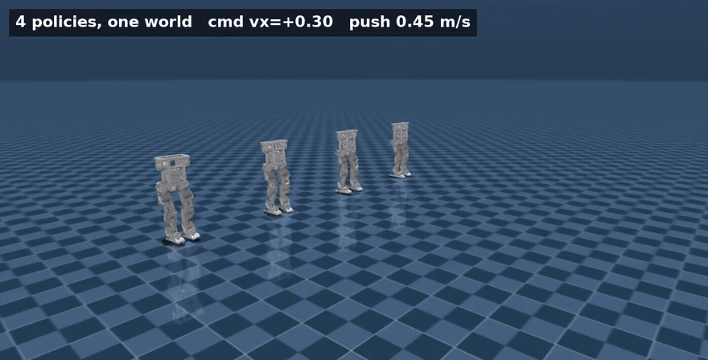
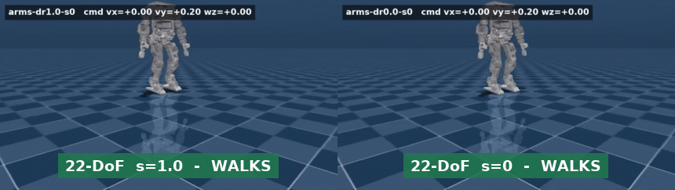
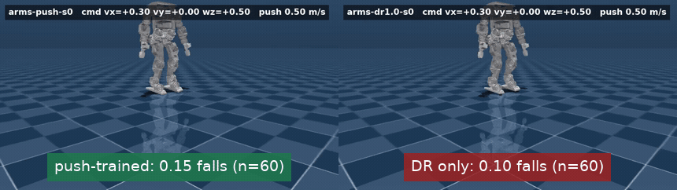
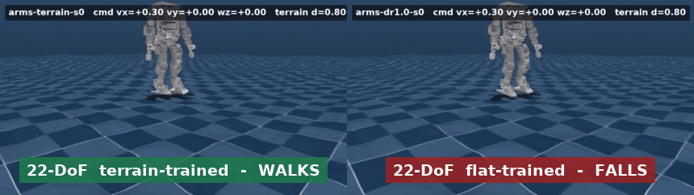
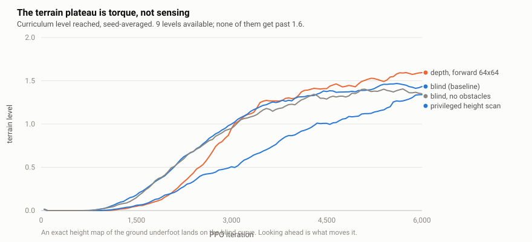
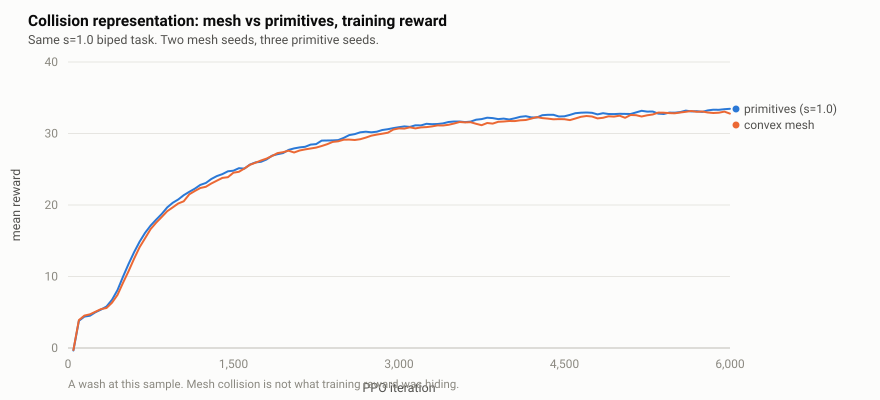
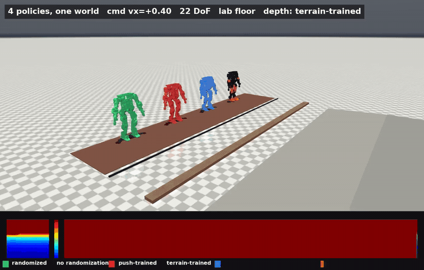
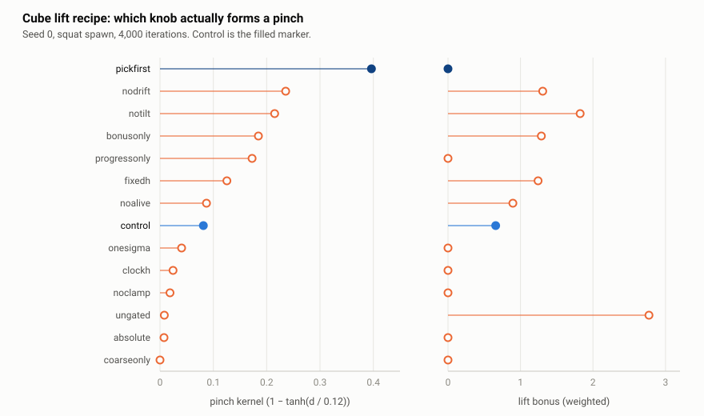
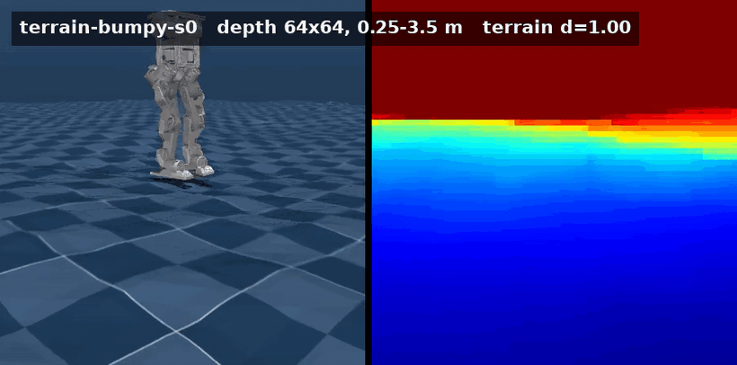
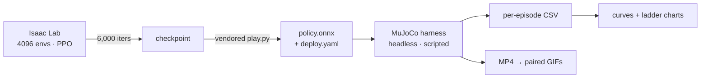

# bhl-robustness-ladder — full technical report

The complete record: every experiment, every number, every correction, and the
bugs that produced several of them. [The README](../README.md) is the short
version and links back to the sections here.

Its clips and charts are referenced relative to this file, so it renders
correctly on GitHub and in a local Markdown viewer alike.

---

Robustness experiments on the [Berkeley Humanoid Lite](https://github.com/HybridRobotics/Berkeley-Humanoid-Lite)
(BHL) — an open-source, 3D-printed, **11.3 kg** humanoid whose joints are limited
to **6 Nm**. Those two numbers drive every result here: this machine has very
little authority to arrest a disturbance, so "how much can it take before it
stops learning?" is a real question rather than a formality.

Upstream ships flat-ground locomotion with a fixed domain-randomization preset,
no curriculum, and no way to score a policy. This repo adds the experiments
below — and, necessarily, the instrument to measure them.

**89 policies trained** (48 biped + 8 22-DoF + 33 cooperative-lift) ·
**6,348 scored sim2sim episodes** · **288 rendered rollouts**

**[Explore every run interactively](https://claude.ai/code/artifact/de955af8-2236-4912-84fb-577e0a43ccbe)**
— isolate a run, switch metrics, watch the axis rescale.

### Results at a glance

| | Finding |
|---|---|
| **1** | **Sim2sim transfer inverts the training-reward ranking.** The policy with the *highest* training reward falls 23% of the time in MuJoCo; the repo-default randomization falls **0%**. |
| **2** | **0.2 m/s of shove-rejection is free — and the competence-gated ceiling was an artifact.** Uncapped, the adaptive rule does not converge: it oscillates between ~0 and **1.8 m/s** with a median of 0.22. |
| **3** | **Randomization alone buys most of terrain robustness — and arms buy more.** A blind biped that never saw rough ground handles it to d≈0.4; the 22-DoF version reaches d≈0.6 and falls **11.7%** at d=1.0 against the biped's **37.8%**. |
| **3b** | **The terrain plateau is torque, not sensing.** A privileged, exact height map of the ground underfoot does not move the curriculum (1.35 vs blind 1.44). Looking *ahead* with depth does (1.60). |
| **4** | **The sim2sim gap is physics, not bookkeeping.** URDF, USD, and MJCF agree on mass, inertia, limits, damping, and collision primitives. Swapping those primitives for convex meshes moves neither training reward nor **sim2sim fall rate** past seed noise. |
| **5** | **Ordering, not the objective.** Zeroing the lift reward until a pinch forms, then enabling it, gets pinch **0.30**, a clamp, a lift bonus and the highest reward of any arm. The single-seed "pinch 0.40 vs 0.08" it replaces did **not** survive three seeds. |
| **6** | **Depth never needed the renderer.** Isaac Sim 5.1's RTX renderer really does segfault here — and ray-cast depth costs **1.6%** of throughput at 4,096 envs, validated to 2.9% against closed-form geometry. It trains: **+11%** terrain level over blind. |
| **7** | **Symmetry augmentation buys nothing detectable.** 35.4 against a control spanning 32.9–34.8, one seed. |
| **8** | **Only the 22-DoF model crosses the lab floor upright.** Three of four biped policies end at a **2.5 cm cable** (9% of leg length); two of four humanoid policies clear the whole course. The same recipe that falls at $x=1.66$ on 12 DoF finishes on 22 — though one arm is *worse* with arms. |

<p align="center">
  <br>
  <sub>Four policies, one world, identical 0.45 m/s shoves. This is not a split-screen composite — they share a solver and a clock. The un-randomized robot is the one on the ground.</sub>
</p>

---

## 1 · Domain randomization: the fidelity ladder

**Question.** Randomization is supposed to trade training performance for
transfer. How much, and where does it stop paying?

Every range in upstream's `EventsCfg` is rewritten as a single scale $s$, so the
ladder is a continuous axis rather than three named presets. Absolute physical
quantities (friction, actuator-gain multipliers) scale about their centre;
additive offsets (mass delta, joint offset, external wrench) scale from zero:

$$
[\text{lo},\text{hi}]_s=
\begin{cases}
\;c \pm s\,w, & \text{absolute (friction, gains)}\\[4pt]
\;[\,s\cdot \text{lo}_1,\; s\cdot \text{hi}_1\,], & \text{additive (mass, offsets, wrench)}
\end{cases}
$$

where $c$ and $w$ are the centre and half-width of upstream's shipped range, so
$s=1$ reproduces it exactly. **The two cases are not cosmetic:** scaling mass
about its centre would inject a constant $+0.5$ kg at $s=0$ and quietly break
agreement with the un-randomized rung.

<p align="center">
  <br>
  <sub>Identical strafe command in MuJoCo. Left <code>s=1.0</code>, right <code>s=0</code>. Neither policy ever saw MuJoCo during training.</sub>
</p>

<p align="center">
  <br>
  <sub>Same command, 22-DoF. The biped at <code>s=0</code> falls 23% in MuJoCo; the 22-DoF counterpart falls <b>0%</b> (n=60). Arms are not decoration on this ladder.</sub>
</p>

<picture>
  <source media="(prefers-color-scheme: dark)" srcset="../results/charts/dr_ladder_summary-dark.svg">
  
</picture>

| rung | training reward (3 seeds) | training fall rate | **sim2sim fall rate** | sim2sim distance |
|---|---|---|---|---|
| `s = 0.0` none | **49.4 / 49.3 / 48.9** | 0.015 | **0.233** | 1.31 m |
| `s = 0.5` | 44.2 / 45.0 / 44.5 | 0.015 | 0.011 | 1.85 m |
| `s = 1.0` repo default | 32.9 / 34.8 / 33.2 | 0.041 | **0.000** | **1.98 m** |
| `s = 1.5` | 16.0 / 15.7 / 16.5 | 0.211 | **0.000** | 1.75 m |
| `s = 2.0` | 4.6 / 4.3 / 4.5 | 0.686 | 0.167 | 0.13 m † |

<sub>90 episodes per rung (6 commands × 5 seeds × 3 policies). † `s=2.0` barely
locomotes at all — 0.13 m in 10 s — so its low fall rate means "stands still",
not "robust". 22-DoF, same protocol, 2 seeds (n=60): <code>s=0</code> fall **0.000**
(distance 2.11 m), <code>s=1</code> fall **0.000** (1.88 m). Training reward is
not comparable across morphologies — the humanoid reward set adds arm-deviation
penalties — so the number that transfers is the MuJoCo fall rate.</sub>

**Finding.** The training column and the transfer column disagree, and that
disagreement is the whole point. `s = 0` wins training by 49% and *loses*
transfer outright, falling in 23% of MuJoCo episodes. Randomization is buying
something that training reward actively hides.

The two training panels also disagree with each other: reward declines smoothly
and almost linearly across the whole range, while the **fall rate** is the
quantity with a knee — flat to $s=1.0$, then turning sharply. Upstream's shipped
default sits right at the last rung before that knee, and it is also the best
transferring policy tested. That is a genuinely good default.

> **Correction.** An earlier version of this README reported a "cliff between
> $s=1.0$ and $s=1.5$". That was read off partially-trained runs where $s=1.5$
> sat at reward 8.3; fully trained it reaches 16.0 and the decline is smooth.

**Does the ranking also invert *within* a run?** If it did, "take the last
checkpoint" would be the wrong deployment rule and training reward could not
tell you so. Six checkpoints of four policies, scored through the same harness:

| iteration | 1000 | 2000 | 3000 | 4000 | 5000 | 5999 |
|---|---|---|---|---|---|---|
| `s = 0` none | 0.167 | 0.200 | 0.167 | 0.167 | 0.200 | **0.100** |
| `s = 1.0` default | 0.000 | 0.000 | 0.000 | 0.000 | 0.000 | 0.000 |
| `s = 2.0` | 0.167 | 0.167 | 0.167 | 0.167 | 0.167 | 0.167 |
| terrain | 0.000 | 0.000 | 0.000 | 0.000 | 0.000 | 0.000 |

<sub>Fall rate, 30 episodes per cell. Distance walked over the same
checkpoints: the default rung goes 1.70 → 1.97 m by iteration 3,000 and then
sits there; the terrain rung goes 0.43 → 1.63 m by 4,000 and sits there.</sub>

**Finding — a negative one.** It does not invert. Fall rate is flat across
training for every rung, and where it moves at all ($s = 0$) the *last*
checkpoint is the best one. Final-iteration selection is fine here.

What the sweep does show is that transfer saturates early: both surviving rungs
reach their final fall rate by iteration 1,000 and their final distance by
3,000–4,000, while training reward is still climbing. The last two thousand
iterations buy reward and nothing measurable in MuJoCo. Two caveats keep this
from being stronger than it is — three of the four rungs sit on the 0.000 floor,
where a 30-episode cell cannot resolve an improvement, and $s = 2.0$ is flat at
0.167 only because it barely locomotes (0.07–0.09 m) at every checkpoint.

---

## 2 · Push recovery: how hard a shove is learnable?

**Question.** A disturbance curriculum is standard practice. What does it cost,
and how large a push can a robot this weak actually learn to reject?

Upstream ships the `push_robot` event commented out. Enabled, it adds an
instantaneous velocity kick to the base every 5–9 s:

$$\mathbf{v} \leftarrow \mathbf{v} + \boldsymbol{\varepsilon}, \qquad
\varepsilon_x,\varepsilon_y \sim \mathcal{U}(-m,\, m)$$

Three ways of choosing $m$ were trained. A **fixed** magnitude; a **linear ramp**
on training progress $t$ (the step counter);

$$m(t) = m_0 + (m_1-m_0)\cdot\mathrm{clip}\!\left(\frac{t-t_0}{t_1-t_0},\,0,\,1\right)$$

and an **adaptive** rule that moves $m$ only in response to measured competence,
where $\hat f$ is the fall fraction among the environments resetting this step
and $f^\star = 0.20$ is the target:

$$m \leftarrow \mathrm{clip}\Big(m + \Delta\cdot\big[\mathbb{1}(\hat f < f^\star) - \mathbb{1}(\hat f > 2f^\star)\big],\; 0,\; m_{\max}\Big)$$

<p align="center">
  <br>
  <sub>Identical 0.5 m/s shoves. Left trained with a push curriculum, right without. <b>0/6 falls vs 3/6.</b></sub>
</p>

<p align="center">
  <br>
  <sub>Same 0.5 m/s protocol, 22-DoF. Push-trained fall 0.15; DR-only 0.10; un-randomized 0.45 (n=60). The arms help the fragile rung more than they help the curriculum.</sub>
</p>

<picture>
  <source media="(prefers-color-scheme: dark)" srcset="../results/charts/push_sweep-dark.svg">
  
</picture>

| ceiling $m_1$ | final reward | training fall rate | cost vs no push |
|---|---|---|---|
| none (baseline) | 33.0 | 0.041 | — |
| 0.2 m/s | 33.0 / 34.4 | 0.037 | **free** |
| 0.4 m/s | 29.1 / 32.2 | 0.047 | −12% |
| 0.6 m/s | 22.1 / 23.0 | 0.100 | −32% |
| 1.5 m/s | 2.9 / 3.1 / 3.2 | 0.928 | destroyed |
| **adaptive** | 14.2 / 14.4 | 0.253 | converged to **0.87 m/s** |

**Finding.** The first attempt asserted $m_1 = 1.5$ m/s and destroyed the policy —
reward rose to 24.7 by iteration 1,599 and then collapsed to 3.0 as the ramp
climbed past ≈0.7 m/s, ending with 93% of episodes terminating on bad
orientation. The fixed-magnitude control never learned at all (≈2.9 throughout).

That pair localises the failure precisely. The fixed arm failing shows the
curriculum was the right *idea* — full-strength shoves from step zero knock the
robot over before a gait exists, so it never collects the data that would teach
recovery. The ramp arm peaking *then* collapsing shows the **ceiling**, not the
schedule, was what was wrong.

The sweep then answered it properly: **0.2 m/s is free**, and the cost stays
modest to 0.6. The adaptive rule is the strongest version — it converged at
**0.85–0.88 m/s**, roughly twice the magnitude at which the time-based ramp
collapsed, and reports that number as an *outcome* rather than requiring it to
be guessed.

**Raising the cap does not turn the bound into a ceiling — it shows there
isn't one.** The adaptive arm was rerun with $m_{\max}$ at 2.0 instead of 1.0,
two seeds, everything else identical:

| | peak $m$ | median $m$ over last 1,500 iters | p10 → p90 | final reward |
|---|---|---|---|---|
| capped, $m_{\max}=1.0$ | 1.000 (pinned) | 0.87 | — | 14.2 / 14.4 |
| uncapped, $m_{\max}=2.0$ | **1.79 / 1.86** | **0.22 / 0.24** | 0.004 → 1.56 | 24.0 / 9.0 |

**Finding.** Without the cap the rule does not converge — it *oscillates*. It
climbs past 1.5 m/s, the gait breaks, the fall rate blows through $2f^\star$,
and the rule drives $m$ back to nearly zero before climbing again. Across the
whole run it spends 23–25% of iterations above 1.0 m/s and 47–48% below
0.1 m/s. That is a limit cycle, not a competence estimate.

So the published 0.87 m/s was never a lower bound being approached from below.
It was the *cap flattening an oscillation* — clip a signal that swings between 0
and 1.8 at 1.0 and its mean sits high and looks like convergence. The honest
statement is that this robot can transiently absorb ~1.8 m/s but cannot hold a
gait against sustained shoves anywhere near it, and the competence rule as
written has no fixed point in between.

> **Correction.** An earlier version of this README reported the adaptive
> curriculum as having "converged to 0.87 m/s" and called that a lower bound on
> tolerable disturbance. Both halves were wrong: it had not converged, and the
> number was an artifact of the safety cap rather than a property of the robot.

---

## 3 · Rough terrain: what actually buys terrain robustness?

**Question.** Isaac Lab's terrain curriculum promotes environments as they
succeed. Does it transfer on a robot with 6 Nm joints and **no height sensor**?

Training terrain is a generated height field of noise, slopes, and low discrete
obstacles — **no stairs**, since a step tall enough to be a stair is likely past
what this robot can lift a foot over and would poison every terrain level. An
environment is promoted when it walks more than half a terrain tile, demoted if
it fails to manage half the commanded distance:

$$\ell \leftarrow \ell + \mathbb{1}\big(d > \tfrac{1}{2}L\big) - \mathbb{1}\big(d < \tfrac{1}{2}\,\lVert\mathbf{v}_{\text{cmd}}\rVert\,T\big)$$

Evaluation terrain is generated by **completely different code**, parameterised
by one difficulty $d$ so terrain becomes a swept axis:

$$h(x,y) = \underbrace{0.15\,d\;u(x,y)}_{\text{undulation}} \;+\; \underbrace{0.05\,d\;\eta(x,y)}_{\text{noise}} \;+\; \underbrace{0.04\,d\;\mathbb{1}_{\text{obs}}(x,y)}_{\text{obstacles}}$$

At $d=1$ that is 0.33 m peak-to-trough with a p95 gradient of 12.2°, against a
15° training target — the same physical envelope, different surface. A policy
that only copes with the exact height field it trained on has memorised, not
learned.

<p align="center">
  <br>
  <sub>Identical rough ground at <code>d = 0.80</code>. Left trained on terrain, right flat-trained with the same randomization. <b>0/6 falls vs 3/6.</b></sub>
</p>

<p align="center">
  <br>
  <sub>Same <code>d = 0.80</code> ground, 22-DoF. The clip is the matched <code>d = 0.80</code> pair; the full retention curve is below.</sub>
</p>

<picture>
  <source media="(prefers-color-scheme: dark)" srcset="../results/charts/terrain_retention-dark.svg">
  
</picture>

| MuJoCo difficulty | no randomization | randomization only *(never saw terrain)* | trained on terrain | terrain, no obstacles |
|---|---|---|---|---|
| 0.00 (flat) | 0.233 | 0.000 | 0.000 | 0.000 |
| 0.05 | 0.756 | 0.000 | 0.000 | 0.000 |
| 0.10 | 0.878 | 0.000 | 0.000 | 0.000 |
| 0.20 | 1.000 | 0.000 | 0.000 | 0.000 |
| 0.40 | 1.000 | 0.033 | 0.000 | 0.000 |
| 0.60 | — | 0.122 | **0.000** | 0.017 |
| 0.80 | — | 0.211 | **0.011** | 0.033 |
| 1.00 | — | 0.378 | **0.033** | 0.067 |

<sub>Fall rate. n = 90 episodes per cell (6 commands × 5 seeds × 3 policies);
n = 60 for the no-obstacle ablation, which has 2 seeds. The `no randomization`
column was not run above d = 0.40 — it is already at 100%.</sub>

**Finding.** Plain domain randomization — with **zero terrain exposure** —
carries the robot to roughly $d = 0.4$ on its own. A policy that has only ever
walked on a flat plane, but trained with randomized friction, mass, and actuator
gains, handles moderately rough ground it has never seen.

Terrain training is what holds past that point, and the gap widens with
difficulty: at $d = 1.0$ the terrain policy falls in **3.3%** of episodes against
the randomized-only policy's **37.8%**, an 11× reduction. Notably the
no-obstacle ablation is consistently *worse* than the full terrain menu at high
difficulty (6.7% vs 3.3%), which is the same direction as the terrain-level
result below.

**The arms change this result, and by a lot.** The same sweep on the 22-DoF
model, same protocol, same fixed terrain seed:

| MuJoCo difficulty | no randomization | randomization only | trained on terrain | push-trained |
|---|---|---|---|---|
| 0.20 | 0.017 | 0.000 | 0.000 | 0.000 |
| 0.40 | 0.433 | 0.000 | 0.000 | 0.000 |
| 0.60 | 0.717 | 0.000 | 0.000 | 0.000 |
| 0.80 | 0.933 | 0.083 | **0.000** | 0.050 |
| 1.00 | 1.000 | 0.117 | **0.000** | 0.033 |

<sub>Fall rate, n = 60 per cell (6 commands × 5 seeds × 2 seeds of policy).</sub>

At $d = 1.0$ the 22-DoF randomization-only policy falls **11.7%** against the
biped's **37.8%**, and the 22-DoF terrain policy does not fall at all where the
biped falls 3.3%. Randomization alone carries the humanoid to $d \approx 0.6$
rather than the biped's $\approx 0.4$. Arms are not decoration on this ladder:
a humanoid sheds angular momentum by swinging them, which a 12-DoF biped cannot
do, and rough ground is exactly the disturbance that strategy answers. Upstream
penalises arm deviation, so this is that penalty *failing* to suppress the
strategy — which is the outcome the arm experiments were run to find out.

The push-trained arm is the other surprise: at 3.3% it is closer to the terrain
policy than to the randomization-only one, on ground it never trained on.

The training-side curriculum is consistent with that: it plateaus at about
**level 1.4 of 9**. The robot learns mildly rough ground and stops progressing.
The README used to attribute that to "6 Nm joints with no height sensing",
which is two hypotheses in one sentence. They are separable, and separating
them is the point of the next four rows:

| arm | what it knows about the ground | terrain level @ 6,000 |
|---|---|---|
| `terrain-bumpy` blind | nothing | 1.443 / 1.446 / 1.417 |
| `terrain-flatfill` blind, corrected ablation | nothing | 1.393 / 1.290 |
| **`scan-teacher`** privileged 11×7 height grid | **exact, underfoot** | **1.413 / 1.288** |
| `scan-student` distilled, recurrent, blind | nothing, but has memory | 1.570 (3,000 iters) |
| **`depth-bumpy`** 64×64 forward depth | **ahead, out to 6 m** | **1.601 / 1.598** |

<picture>
  <source media="(prefers-color-scheme: dark)" srcset="../results/charts/terrain_plateau-dark.svg">
  
</picture>

**Finding — the plateau is torque, not sensing.** Handing the policy an exact
height map of the ground beneath it does not move the curriculum at all: 1.35
mean against the blind baseline's 1.44. Perfect terrain knowledge buys nothing,
which leaves joint authority as the thing that runs out. An 11.3 kg robot with
6 Nm joints stalls at level ~1.4 of 9 *even when it can see the ground exactly*,
and that is a hardware claim rather than an observation-design one.

What does move it is looking **ahead** rather than down: the forward depth
camera reaches 1.60, an 11% gain over blind, and the recurrent distilled student
reaches 1.57 without any exteroception at all — in half the iterations — so
memory of what its own feet have already felt substitutes for part of what the
scan was supposed to provide.

> **Caveat, and it is a real one.** The depth and student arms change network
> input width (301 and recurrent, against 45 feedforward), so their gain is not
> cleanly attributable to information rather than capacity. The *scan* arm is
> the clean comparison — same MLP, same pipeline, 122 dims instead of 45 — and
> it shows no gain, which is what makes the torque conclusion the load-bearing
> one. Two seeds each; the scan seeds disagree by 0.12, which is most of the
> effect anyone would want to claim.

**The corrected obstacle ablation.** `terrain-smooth` removed the discrete
obstacles and redistributed their 20% share into rough ground and slope, so it
was also *rougher on average* — and it reached 1.244. `terrain-flatfill` holds
every other proportion fixed and fills the obstacle share with flat ground:
**1.393 / 1.290**, mean 1.342, against the full menu's 1.435. So roughly half
of the old ablation's apparent 0.19-level penalty was the confound and half was
real: removing obstacles properly costs about 0.09 levels.

That said, `terrain-flatfill`'s own two seeds differ by 0.103 — *more* than the
effect being claimed — so this is two seeds telling a directionally consistent
story and not a measurement. The earlier flat claim that "obstacles were not the
limiter" is too strong; they contribute, modestly, and the honest version is
that the curriculum stalls at ~1.4 whether or not they are present.

> **Correction.** An earlier version used the $s=0$ policy as the terrain
> baseline and reported flat-trained policies "collapsing between d = 0.05 and
> 0.10". True of *that* policy, but it was the most fragile one available, and
> comparing against it made terrain training look far more necessary than it is.

Two further caveats worth stating:

- The obstacles contribute but are not the limiter: 1.342 against 1.435, where
  the confounded version read 1.244 and made them look twice as costly.

---

## 4 · Asset consistency: is the sim2sim gap physics?

**Question.** BHL describes the same robot three times. Isaac Lab trains from
the USD; the sim2sim harness scores from the MJCF; the URDF is the nominal
source both were converted from. Every number this project reports as a
PhysX↔MuJoCo gap silently assumes those three agree. If they do not, part of
the measured transfer inversion is asset drift — bookkeeping, not physics.

Compared, per link and joint, at a 1% relative tolerance (5% on inertia):

| | mass | principal inertia | joint limits | damping | collision geoms |
|---|---|---|---|---|---|
| biped, 12 DoF, 11.343 kg | URDF = MJCF, $\Delta=0$ | 0 mismatches | URDF = MJCF = USD | 0 mismatches | 7 box/cylinder, both sides |
| humanoid, 22 DoF, 16.331 kg | URDF = MJCF, $\Delta=0$ | 0 mismatches | URDF = MJCF = USD | 0 mismatches | 11 box/cylinder, both sides |

The raw diagonal inertia *looks* swapped on several links
(`leg_*_knee_pitch` iyy↔izz). That is MuJoCo's convention, not a conversion
bug: MuJoCo stores inertia in the body's principal frame (`body_iquat` holds
the rotation) while URDF states it in the link frame. Sorted eigenvalues are
frame-independent, and those agree. Publishing the raw diagonals would have
been a false positive.

Collision geometry is primitives on all three descriptions — visual meshes
are `contype="0"`. That is an asset-optimization decision, not a loading
quirk, and it is the one the collision-representation ablation below
reverses.

**Finding.** The three descriptions agree. The transfer inversion in §1 is
a physics-engine difference, not an unaccounted mass or limit mismatch. Both
outcomes of this check would have been useful; this is the reassuring one.

The colliding *geometry* is a separate question. Two seeds trained the s=1.0
biped task with convex-decomposition meshes instead of the primitive
boxes/cylinders, 6,000 iterations, otherwise identical:

<picture>
  <source media="(prefers-color-scheme: dark)" srcset="../results/charts/collision_mesh-dark.svg">
  
</picture>

| collision | training reward | training fall rate |
|---|---|---|
| primitives, s=1.0 (3 seeds) | 32.9 / 34.8 / 33.2 | 0.045 / 0.036 / 0.041 |
| convex mesh (2 seeds) | 31.4 / 34.0 | 0.054 / 0.037 |

Swapping the colliding geometry does not move training reward or fall rate
past seed noise. The primitives were not the thing training reward was
hiding. Whether they were the thing the *sim2sim* inversion was hiding is a
different measurement, and it has now been made — both policies scored
through the same MuJoCo protocol as every rung in §1:

| MuJoCo condition | convex mesh, 2 seeds | primitives, s=1.0 |
|---|---|---|
| flat | 0.000 / 0.000 | 0.000 |
| terrain $d = 0.20$ | 0.000 / 0.000 | 0.000 |
| terrain $d = 0.60$ | 0.033 / 0.133 | 0.122 |

<sub>Fall rate, 30 episodes per cell. The $d = 0.60$ comparison is against the
*randomization-only* column of §3, because these policies trained on flat
ground with s = 1.0 and had never seen terrain either.</sub>

**Finding.** Null, in both halves. The mesh seeds bracket the primitive
baseline at the one difficulty where anything falls at all (0.033 and 0.133
against 0.122), and a two-seed spread that wide is the seed noise, not the
collision representation. So §4 is a clean two-part negative: the three
descriptions of the robot agree, **and** the choice between primitive and
convex-mesh collision moves neither training nor transfer. The sim2sim
inversion in §1 is not hiding in the colliding geometry.

The evaluation height field is also now a USD asset
(`results/usd/eval_terrain.usdc`) whose `difficulty` variant set is
`d000…d100`. Same generator, same seed as the MuJoCo harness, but $d$ is a
variant selection rather than a function argument. A composed lab floor —
tile, carpet strip, cable, door threshold, ramp — lives next to it as
`lab_scene.usda`.

<p align="center">
  <br>
  <sub>The same four policies on the composed lab floor, no shove. Tile, carpet
  strip, cable, door threshold, ramp — the geometry a depth sensor would be
  pointed at. §6 puts one there.</sub>
</p>

---

## 5 · Cooperative lift: can two of them learn to pick something up?

**Question.** The 22-DoF model has arms. A walking policy never uses them to
lift. A scripted squat only shows the kinematics are possible — it is not
the experiment. Can two of these machines — 16 kg, 6 Nm, no fingers,
shoulders that cannot adduct past ~36 cm — *learn* a non-prehensile
side-lift of a cube, a ladder, and a yoga ball?

This is a policy, trained. The interpolated-joint clip is a kinematics
check, same role as a reachability plot, and it lives in
`docs/gifs/squat_pick.gif` for that reason only.

The recipe is the one contact-rich dual-arm papers actually train with
(Isaac Lab Franka lift, DexPBT's single net for two arms, Dactyl in-grasp
resets, COLA's proprioceptive collaborative carry), not a tour of every MARL
variant:

- Spawn already in the squat-hold the kinematics check uses. Walking up to
  the object is a locomotion task and starves the lift of on-policy contact.
- One PPO, 44 actions. A pinch is one physical system; two independent
  learners spend the batch fighting. DexPBT uses the same single-net choice
  at 46 DoF. The critic is privileged (object twist, both robots) — that is
  the training-time teacher. The actor sees proprioception, object-in-root,
  and PD tracking residual, which is the contact proxy a real motor current
  would give. No vision, deliberately: this is a contact problem first, and
  §6 shows depth was never the thing blocking it.
- Hardware limits are physics. The URDF already refuses to adduct past
  ~36 cm; an out-of-range PD target is clipped by the articulation. That is
  what forces a side-clamp instead of a front grasp, not a penalty term.
- Sequential reward: two-scale constellation reach, then opposing clamp
  through the object, then height gated on pinch, with a tilt penalty so the
  two robots have to lift together. Progress-only is a toss; bonus-only is
  too sparse for 6 Nm.

$$
r_{\text{pinch}}=\sum_{\sigma\in\{0.40,\,0.12\}}\bigl(1-\tanh(d/\sigma)\bigr),\quad
r_{\text{clamp}}=r_{\text{fine}}\cdot[-\widehat{v}_A\cdot\widehat{v}_B]_+,\quad
r_{\text{lift}}=r_{\text{fine}}\cdot\Bigl(\mathrm{clip}\!\left(\tfrac{z-z_0}{h},0,1\right)+15\cdot\mathbf{1}[z>z_0+h]\Bigr)
$$

$h$ is competence-gated — the same promote/demote rule as the push curriculum
in §2. The first three runs used standing spawn and a single $\sigma=0.15$
with ungated height. They finished:

| object | mean reward | pinch | lift bonus | $h$ | fall | episode length |
|---|---|---|---|---|---|---|
| cube | −0.45 | 0.0002 | 0.00 | 0.04 | **1.00** | 5.0 |
| ladder | 7.92 | **0.0000** | 3.41 | 0.22 (cap) | 0.74 | 80 |
| yoga ball | −0.44 | 0.0015 | 0.00 | 0.04 | **1.00** | 5.0 |

<sub>One seed. Pinch is the constellation term at iteration 3,999. Cube and ball
are at 100% fall from iteration 100.</sub>

**Finding.** Standing spawn left the hands half a metre above the contact
points, so $\sigma=0.15$ was already flat and pinch never moved. Cube and
ball learned to die in five steps. The ladder moved the object to the 22 cm
cap with pinch identically zero — a toss, not a lift.

The requeue is the recipe above: squat-hold spawn, two-scale reach, clamp,
pinch-gated height. Same three objects, seed 0, 4,000 iterations. Pinch in
this table is the fine kernel $1-\tanh(d/0.12)$ at iteration 3,999 — the
term that is supposed to *be* the pinch.

| object | mean reward | pinch | clamp | lift bonus | $h$ | fall | episode length |
|---|---|---|---|---|---|---|---|
| cube (control) | 9.16 | 0.081 | 0.057 | 0.66 | 0.047 | 0.140 | 185 |
| ladder | 4.16 | **0.000** | 0.00 | 0.00 | 0.040 | 0.016 | 198 |
| yoga ball | 1.57 | **0.202** | 0.270 | 2.09 | 0.044 | 0.683 | 138 |

<sub>One seed. Episode budget is 200 steps (8 s). Clamp is the weighted
opposing-force term.</sub>

Squat spawn moved the cube pinch off zero (0.0002 → 0.081) and they stopped
dying in five steps (fall 1.00 → 0.14, length 5 → 185). Height did not. The
competence gate stayed at the 4 cm floor. The ball formed more of a pinch
(0.20) and still fell 68%. The ladder is the instructive one: gating height
on pinch deleted the toss (lift bonus 3.41 → 0.00) and left pinch identically
zero. They stand for the full episode and never close.

The cube control is the baseline for the rest. One knob off at a time, seed
0, 4,000 iterations, squat spawn. Pinch is the unweighted fine kernel so
`onesigma` (weight 2.0 on that term) is comparable.

<picture>
  <source media="(prefers-color-scheme: dark)" srcset="../results/charts/coop_ablation-dark.svg">
  
</picture>

| arm | off | pinch | clamp | lift bonus | fall | eplen | reward |
|---|---|---|---|---|---|---|---|
| **control** | — | 0.081 | 0.057 | 0.66 | 0.140 | 185 | 9.16 |
| ungated | pinch×height | 0.008 | 0.000 | **2.77** | 0.685 | 125 | 5.49 |
| onesigma | two-scale → σ=0.15 | 0.040 | 0.004 | 0.00 | 0.031 | 191 | 5.15 |
| noclamp | opposing-force | 0.019 | 0.000 | 0.00 | 0.035 | 197 | 7.25 |
| **pickfirst** | lift weights | **0.397** | **0.496** | 0.00 | **0.005** | **200** | 12.54 |
| absolute | residual around squat | 0.008 | 0.001 | 0.00 | 0.026 | 197 | 6.84 |
| noalive | still_alive | 0.087 | 0.084 | 0.89 | **0.941** | 75 | −0.93 |
| notilt | object tilt | 0.215 | 0.204 | 1.82 | 0.294 | 168 | 17.0 |
| nodrift | xy hold | 0.236 | 0.317 | 1.31 | 0.048 | 195 | 20.9 |
| bonusonly | dense lift progress | 0.184 | 0.179 | 1.29 | 0.332 | 169 | 14.1 |
| progressonly | sparse lift bonus | 0.173 | 0.146 | 0.00 | 0.046 | 196 | 8.20 |
| coarseonly | fine σ=0.12 | **0.000** | 0.004 | 0.00 | 0.047 | 194 | 7.38 |
| fixedh | competence on $h$ | 0.125 | 0.088 | 1.24 | 0.247 | 173 | 11.5 |
| clockh | competence → wall clock | 0.024 | 0.013 | 0.00 | 0.055 | 197 | 7.23 |

**Finding, at one seed.** The arm that formed a pinch is the one that never
paid for height. DexPBT stage 1 (`pickfirst`) reaches pinch 0.40 and clamp
0.50 — hands about 8 cm from the contact points, against the control's 19 cm —
and finishes 4,000 iterations without falling.

**That finding does not survive three seeds.** Seeds 1 and 2 were run for the
four arms the section leans on, and the pinch channel turns out to be dominated
by seed:

| arm | pinch, 3 seeds | mean | fall, 3 seeds | mean |
|---|---|---|---|---|
| control | 0.081 / 0.179 / 0.016 | 0.092 | 0.140 / 0.278 / 0.040 | 0.152 |
| **pickfirst** | 0.397 / 0.205 / 0.044 | **0.215** | 0.005 / 0.033 / 0.045 | **0.028** |
| notilt | 0.215 / 0.241 / 0.113 | 0.190 | 0.294 / 0.324 / 0.327 | 0.315 |
| nodrift | 0.236 / 0.178 / 0.113 | 0.176 | 0.048 / 0.386 / 0.616 | 0.350 |

`pickfirst` spans **0.044 to 0.397** and the control spans **0.016 to 0.179**.
Those ranges overlap, and the published "0.40 against 0.081" was the best
pickfirst seed against a middling control seed. On the mean, pickfirst is still
ahead (0.215 vs 0.092) and still ahead of every other arm — but at n=3 with
that spread, the pinch column cannot carry the section's headline.

**What does survive is the fall rate.** `pickfirst` falls 0.005 / 0.033 / 0.045
— worst seed 4.5% — against `notilt` 29–33% and `nodrift` 5–62%. Those are
cleanly separated, three seeds out of three. Not paying for height does not
reliably buy a *pinch*; it reliably buys a policy that stays upright for the
whole episode. And the two arms with the highest reward, `notilt` (12.4) and
`nodrift` (12.6), are buying it by falling roughly a third of the time.

> **Correction.** An earlier version of this README said "the arm that formed a
> pinch is the one that never paid for height" and quoted pinch 0.397 against
> 0.081 as the evidence. Three seeds show that gap is inside seed noise. The
> claim that survives is narrower: never paying for height produces the only
> arm that reliably does not fall.

The rest of the ladder is consistent with that:

- Ungated height recovers the toss: lift bonus 2.77, pinch 0.008, fall 69%.
  The gate was load-bearing. Spawn was not the only reason the first ladder
  run tossed.
- Clamp is load-bearing for pinch formation (`noclamp` 0.019). Coarse-only
  never pinches. Absolute joint targets never find the squat envelope.
  `still_alive` is why squat spawn does not die in five steps (`noalive`
  fall 94%).
- A wall-clock ramp of $h$ to 22 cm kills the pinch the same way the
  1.5 m/s push ramp killed the gait. Frozen 4 cm (`fixedh`) beats the
  competence gate.
- Two-scale still matters once the hands start next to the cube: `onesigma`
  is half the control's kernel and never lifts. The coarse term is what
  feeds clamp.
- The penalties that were supposed to force a two-robot lift — tilt and
  xy-hold — were fighting formation. Turning them off raises pinch and
  reward.

> **Correction.** An earlier version of this README claimed bonus-only is too
> sparse for 6 Nm and progress-only is a toss. `bonusonly` pinch 0.18 exceeds
> the control; `progressonly` pinch 0.17 with $h$ stuck at 4 cm is not a toss.
> Those were hypotheses about the standing-spawn ladder run, not measurements
> of squat spawn.

**The three dead arms, rerun.** Privileged critic, actor tracking residual and
DexPBT staging are consumed in `__post_init__`, and hydra applied them after
that, so `nopriv` / `notrack` / `staged` originally trained as bit-identical
copies of the control (policy 194 / critic 206). Staging had a second bug: a
missing pinch distance counted as fully pinched, so the latch fired at step 0.
Both are fixed, and all three ran for real:

| arm | pinch | clamp | lift bonus | fall | eplen | reward |
|---|---|---|---|---|---|---|
| control (3-seed mean) | 0.092 | — | — | 0.152 | 185 | 8.71 |
| `nopriv` no privileged critic | 0.050 | 0.021 | 0.09 | 0.072 | 192 | 7.89 |
| `notrack` no PD-residual obs | 0.013 | 0.003 | 0.00 | 0.015 | 196 | 7.15 |
| **`staged` pinch-then-height** | **0.298** | **0.305** | **0.93** | 0.053 | 197 | **18.46** |

`nopriv` (0.050) and `notrack` (0.013) both sit *below* the control's mean —
consistent with the privileged critic and the tracking residual being
load-bearing — but both also sit inside the control's own three-seed range of
0.016–0.179, so at one seed each this is suggestive and not settled. It is at
least now a measurement rather than a copy of the control.

**`staged` is the section's answer.** Zeroing the lift weights in the
constructed env and turning them on once the batch-mean pinch clears 0.40 gets
a pinch (0.298, above the control's mean and every other arm's), a clamp
(0.305), *and* a nonzero lift bonus (0.93) while falling 5% of the time and
running near-full 197-step episodes. Its reward of 18.46 is the highest of any
cube arm. So height is learnable from a formed pinch — the ordering was the
problem, not the objective.

What it does **not** do is lift to a height: the competence gate stayed pinned
at the 4 cm floor in every arm including this one. They close on the cube and
raise it a few centimetres. One seed, and the seed spread above is wide enough
that it needs two more before the number is quotable.

---

## 6 · Depth without a renderer

**Question.** Every vision experiment here was parked behind one sentence:
Isaac Sim 5.1's RTX renderer segfaults on this cluster. Is that actually a
blocker for depth, or only for *rendered* depth?

The crash is real and it is not a configuration mistake. It reproduces in an
empty scene, from a pure Isaac Sim script with Isaac Lab out of the picture,
inside `omni.usd.create_hydra_engine`:

```
libomni.usd.so!omni::usd::UsdManager::createHydraEngine
  libomni.hydra.rtx.plugin.so
    libcarb.scenerenderer-rtx.plugin.so
      librtx.scenedb.plugin.so        <-- SIGSEGV, ~400 ms in
```

Things that were ruled out, each by a run: the GPUs are Quadro RTX 8000
(Turing, 72 RT cores — the hardware is right); `--nv` does inject
`libnvoptix`, `libnvidia-rtcore` and the Vulkan ICD; adding the driver
libraries apptainer's `nvliblist.conf` is too old to know about changes
nothing; nor does single-GPU, nor dropping the viewport extension. Isaac Sim
**6.0.1**, installed alongside in its own venv, gets through the same call
without dying — consistent with the driver/Kit mismatch (5.1's own
`driver-requirements.json` recommends 535.161.7; this cluster runs 595.71.05).
So the renderer is upgradeable, not broken forever.

**But depth never needed it.** `RayCasterCamera` arranges a pinhole ray bundle
and intersects it with the scene mesh in warp on the GPU. It returns
`distance_to_image_plane` — a real depth image — and never creates a Hydra
engine, never loads the RTX plugins, and does not even want `--enable_cameras`.

<p align="center">
  <br>
  <sub>Left, the scored episode at <code>d = 1.00</code>. Right, the robot's own
  64×64 depth image, 0.25 m blue to 3.5 m red — the resolution and range the
  policy in <code>48_depth_train</code> consumes. Watch the horizon band buckle
  as the ground does. This one is MuJoCo's offscreen depth buffer, not Isaac
  Lab's ray-caster: a different renderer, a different projection, a different
  simulator. Two independent paths agreeing is the argument this repo makes
  everywhere else.</sub>
</p>

**Validation first.** Warp ray-casting fails in a specific, quiet way: name the
wrong prim in `mesh_prim_paths` and it returns all-NaN rather than an error, so
a training run learns from a constant and the reward curve looks fine
throughout. On flat ground the answer is closed-form — camera at height $h$,
optical axis pitched $\theta$ below horizontal, normalised image coordinate
$y_n$ increasing downward:

$$Z(u,v) = \frac{h}{\sin\theta + y_n\cos\theta}$$

Measured against that: **100% finite pixels, 2.9% mean relative error** over
3,136 pixels (`scripts/bench/depth_validate.py`). The row-flipped hypothesis
comes in at 102% error, which is what fixes the image convention rather than
assuming it.

**And it is free.** The reason tiled RTX cameras kill locomotion training is
throughput; a perceptive policy needs on the order of $10^8$ env-steps.

| | envs | env-steps/s | ms/step |
|---|---|---|---|
| physics only | 2,048 | 13,971 | 146.6 |
| + depth 32×32 | 2,048 | 13,989 | 146.4 |
| + depth 64×64 | 2,048 | 13,956 | 146.7 |
| physics only | 4,096 | **21,844** | 187.5 |
| + depth 48×48 | 4,096 | **21,490** | 190.6 |

**Finding.** Geometric depth costs **1.6% of throughput at 4,096 envs**, and
nothing measurable at 2,048. The vision experiment was never blocked on the
renderer — it was blocked on the assumption that depth has to be rendered.

What is genuinely given up is material and lighting: specular dropout, IR
pattern failure on dark surfaces, edge fattening. That matters less than it
sounds, because clean *rendered* depth is not realistic either — both paths
need a degradation model on top, and exact geometry is the better starting
point for one. Two limits are structural rather than cosmetic, and worth
stating plainly: rays hit only the meshes named in `mesh_prim_paths`, so the
robot sees terrain and never itself, and there is no sensor-noise model beyond
a Gaussian on range.

**And it trains.** `48_depth_train` ran the full 6,000 iterations on rough
terrain, two seeds, 64×64 average-pooled to 16×16 before the MLP — because
4,096 raw numbers against 45 of proprioception would make the first layer
almost entirely depth weights. A CNN trunk is the real answer and is not what
rsl-rl's default actor is.

| | terrain level @ 6,000 | final reward |
|---|---|---|
| blind `terrain-bumpy`, 3 seeds | 1.443 / 1.446 / 1.417 | — |
| **depth-conditioned, 2 seeds** | **1.601 / 1.598** | 23.2 / 22.1 |

An 11% higher terrain level than blind, and the two seeds agree to three
decimal places — which is a tighter spread than the blind baseline's own. §3
reads that result against the privileged height scan, which does *not* help,
and draws the conclusion the pair supports: what buys terrain progress on this
robot is seeing ground it has not reached yet, not knowing the ground it is
standing on.

---

## 7 · Symmetry augmentation

**Question.** BHL is bilaterally symmetric and nothing in upstream's training
exploits that. Symmetric gaits are more torque-efficient, and torque is exactly
what this robot does not have — so the hypothesis is that mirroring buys more
here than it would on a strong machine.

rsl-rl will mirror each batch, but only given a robot-specific map.
`bhl_robust.tasks.symmetry` is that map: a sagittal reflection, so the $y$
component of a vector and the roll/yaw components of a rotation flip while pitch
does not, and the two leg blocks swap.

| arm | final reward | note |
|---|---|---|
| `s = 1.0` control, 3 seeds | 32.9 / 34.8 / 33.2 | no symmetry |
| data augmentation | — | diverged at iteration 2,152 (reward 32.1 when it did) |
| augmentation + mirror loss | **35.36** | full 6,000 iterations |

**Finding — no measurable gain.** 35.36 against a control spanning 32.9–34.8 is
at the top of the range and inside it. At one seed this is not a result, and the
honest summary is that symmetry augmentation costs nothing and buys nothing
detectable on this task. The augmentation-only arm hit upstream's
`noise_std_type="scalar"` divergence (issue 6 below) at iteration 2,152, healthy
at reward 32.1 up to that point.

<details>
<summary><b>The bug this experiment actually produced</b></summary>

<div>

The first attempt trained 3,768 iterations stuck at reward **6** against the
control's 33, with spikes to **−9×10⁵**, then died on the same divergence. The
divergence was the symptom.

rsl-rl hands the augmentation hook a **TensorDict keyed by observation group**,
not a flat tensor (`ppo.py` reads `obs_batch.batch_size[0]`). A TensorDict
indexes its *batch* dimensions, so `out[..., 0:3] = ...` overwrote the first
three **samples of the batch** instead of the first three **features of every
sample**. Nothing raised, shapes stayed valid, and the logged symmetry loss fell
the whole time — on corrupted data.

The joint map itself was correct, which was worth establishing rather than
assuming: 200 random joint configurations through MuJoCo forward kinematics,
requiring the mirrored pose to swap the feet and negate their $y$. Worst error
0.00000 m. An involution test passes on a wrong sign that happens to be its own
inverse; a kinematic test does not. `mirror_obs` now refuses a TensorDict
outright and refuses any observation width it does not recognise, because the
failure mode here is silence rather than an error.

</div>
</details>

---

## 8 · Do the arms buy stability? Walk the lab floor and see

**Question.** §1–3 train the 22-DoF humanoid and the 12-DoF biped side by side
and score them on flat ground, pushes and generated terrain, where the arms read
as a wash. §6 points a depth camera at a composed lab floor — tile, carpet
strip, cable, door threshold, ramp — because that is the geometry a depth sensor
would be aimed at. Nobody had asked whether either morphology *crosses* it.

The clip that existed showed four policies on that floor and was read as
answering this. It was not: the camera tracks the pack, so for the second a loop
lasts a robot stalled against a threshold and a robot walking look identical.
Worse, the scene was wrong. `_LAB_WORLD` wrote its eulers in radians while
omitting `<compiler angle="radian">`, and MuJoCo's default is degrees — so
`euler="1.5708 0 0"` was 1.57°, not 90°. The cable stayed a 5.2 m vertical pole
instead of lying across the lane, and the ramp stayed a flat slab. Three of four
policies were stopping on geometry that was not what it claimed to be.

With the units fixed the course is stated rather than eyeballed, ray-cast down
the centre line at $y=0$ and given as a fraction of the 28 cm leg:

| feature | span (m) | top | as leg fraction |
|---|---|---|---|
| carpet | −0.20 → 0.80 | 0.8 cm | 3% |
| cable | 0.89 → 0.91 | 2.5 cm | 9% |
| threshold | 1.63 → 1.77 | 4.0 cm | 14% |
| ramp | 2.30 → 3.60 | 10.5 cm | 37% |

Clearing the course means walking off the far edge of the last feature, so the
finish line is $x = 4.70$. Both morphologies get 24 s at a 0.4 m/s command,
identical scene, identical seed (`scripts/bench/lab_traverse.py`).

| policy | 12-DoF peak $x$ | 12-DoF outcome | 22-DoF peak $x$ | 22-DoF outcome |
|---|---|---|---|---|
| randomized | 1.66 | fell on cable, 6.0 s | **8.84** | **finished** |
| no-randomization | 1.18 | fell on cable, 3.4 s | 0.85 | stalled past carpet |
| push-trained | 1.46 | fell on cable, 13.8 s | 1.64 | fell on cable, 5.9 s |
| terrain-trained | 5.31 | fell on landing, 17.4 s | **5.61** | **finished** |

**Finding.** No 12-DoF policy finishes upright; two of four 22-DoF policies
cross the whole course. Three of the four biped runs end at the **2.5 cm
cable** — 9% of leg length, an obstacle a third the height of the ramp they
never reach. The sharpest single comparison is `randomized`, the same recipe on
both bodies: it falls at the cable at $x = 1.66$ on 12 DoF and finishes on 22.

Two things keep this from being "arms are free stability", and both are in the
table. The 12-DoF `terrain-trained` policy reached $x = 5.31$, *past* the finish
line, and fell on the landing afterwards — so the biped is not stopped dead by
the course, it fails to stay upright through it, and the bench reports a fall
ahead of a finish by design. And `no-randomization` is **worse** with arms
(stalled at 0.85 versus falling at 1.18): more mass higher up, with no policy
trained to use it, is a liability. What the arms buy is recoverable
perturbation, not a higher step.

<p align="center">
  <br>
  <sub>The four 22-DoF policies on the composed floor, no shove. The hero run
  (<code>terrain-trained</code>) wears the orange shell and black joints; a
  fallen robot darkens and the frame takes a red outline, held for the rest of
  the clip. Along the bottom is that robot's own 64×64 egocentric depth,
  near-to-far — the same sensor §6 validated, pointed at the same geometry.
  Watch the cable arrive as a thin near band before the two policies that clear
  it change stride.</sub>
</p>

---

## How any of this is measured

The obvious plan — "evaluate through the sim2sim path the repo already gives
you" — does not survive contact with the code. Upstream's
`scripts/sim2sim/play_mujoco.py` constructs a `Se2Gamepad()` and blocks on
joystick input, calls `mj_viewer.sync()` (requiring a GUI), `sleep()`s to hold
wall-clock realtime, and loops forever emitting **no metric of any kind**. It is
a thing to watch, not a thing to measure.

So `src/bhl_robust/eval/` keeps the parts that determine transfer fidelity — the
MJCF, the PD controller, the sensor-derived observation layout — and drops the
interactive scaffolding. **The single most important design decision:** the
harness drives the policy through upstream's *own* `RlController`, so
observation construction is bit-identical to the sim2real deployment path. An
evaluator that rebuilt the 45-dim observation vector independently would be
measuring my reimplementation, not the transfer.



Training and evaluation deliberately use **different simulators** — Isaac Lab
(PhysX) to train, MuJoCo to score. That gap *is* the measurement: a policy that
only works in the simulator it was trained in has not learned locomotion, it has
learned PhysX.

<details>
<summary><b>Metric definitions</b></summary>

<div>

A fall reuses training's own `bad_orientation` threshold, so it means the same
thing on both sides. Tilt is recovered from the base quaternion:

```math
\theta = \arccos\bigl(1 - 2(q_x^2+q_y^2)\bigr), \qquad \text{fall if } \theta > 0.78 \text{ rad}
```

Velocity error is computed in the **yaw frame**, because that is the frame
upstream rewards (`track_lin_vel_xy_yaw_frame_exp`); any other frame is not
comparable to training:

```math
e_v = \bigl\lVert \bigl(R_z(-\psi)\mathbf{v}_{\mathrm{world}}\bigr)_{xy} - \mathbf{v}_{\mathrm{cmd}}\bigr\rVert, \qquad
\psi = \operatorname{atan2}\bigl(2(q_w q_z + q_x q_y), 1-2(q_y^2+q_z^2)\bigr)
```

On rough ground, sink is measured against the **local** surface height rather
than the spawn height — an absolute reference would score a robot walking
downhill as having fallen. Tracking errors average over **surviving steps only**,
so a policy that falls instantly cannot post a flatteringly small error.

The protocol is identical for every policy: 6 commanded velocities × 5 seeds ×
10 s episodes, on the same fixed terrain seed.

</div>
</details>

<details>
<summary><b>Environment: why a container, and why the login node can't run any of this</b></summary>

The cluster login node is Rocky 8 (**glibc 2.28**); Isaac Sim 5.1 requires
**≥ 2.34**. Conda cannot fix that — it ships its own `libstdc++`, not glibc.
Compute nodes are Rocky 9.8 (glibc 2.34), *exactly* at the boundary, so
`container/bhl.def` builds an Ubuntu 22.04 (glibc 2.35) base and sidesteps the
question. The driver and Vulkan ICD are injected at runtime via `apptainer --nv`.

The image contains **no Python packages** — `uv` resolves the stack from
upstream's `uv.lock` with `--locked` into a venv outside the git tree, so all
runs share a bit-identical dependency set and the repo stays movable.

Cluster-specific traps that each cost a debugging cycle:

- `apptainer --cleanenv` drops every unforwarded variable — this killed a 9-job
  array in one second on `TASK: unbound variable`.
- `apptainer --env` splits values on **commas**, mangling every `[lo,hi]` range,
  so Hydra overrides are passed by file path.
- `/scratch` is **node-local, not shared**.
- TensorBoard's data server needs `GLIBC_2.29`; on the login node it serves a
  page while silently reading nothing.
- numpy's C extension will not import on the login node at all.
- `--cleanenv` also drops Slurm's `CUDA_VISIBLE_DEVICES`. Harmless on a node
  whose GPUs are whole and identical; fatal on a MIG-partitioned one, where
  torch then enumerates a slice that does not exist and dies in
  `_check_capability` before the first kernel. The mask is forwarded explicitly.
- Forwarding a variable as empty is not the same as not forwarding it.
  `--env OMP_NUM_THREADS=` makes libgomp abort on "Invalid value"; only
  non-empty values are passed now.

**Which partitions this actually runs on.** The `gpu` partition caps one user at
8 GPUs, which is what everything queues behind. Four others accept the account,
and their per-user caps are separate — but most of them do not work, for reasons
worth writing down once:

| partition | GPU | verdict |
|---|---|---|
| `gpu` | RTX 8000 48G, sm_75 | the baseline |
| `ampere` | A40 46G, sm_86 | works, 2 GPUs/user |
| `dgxh` | H100 80G in `3g.40gb` MIG slices, sm_90 | works **once the device mask is forwarded** |
| `eecs` | RTX 2080 11G, sm_75 | too small for the 1,024-env coop runs; eval only |
| `preempt` | L40S 46G, sm_89 (+ the A40s, + an H200) | works — 24 L40S on `cn-gpu10..12`, but `PreemptMode=REQUEUE` with `GraceTime=0`, so eval only until training can resume from its last checkpoint |
| `dgx2` | V100 32G, **sm_70** | **unusable** — the pinned torch ships sm_75…sm_120 and no Volta PTX, so it is `no kernel image is available` |
| `share`, `eecs3`, `mime4` | M60 | **el8, glibc 2.28** — the wall this container exists to get over |

One more trap, found by watching a job land rather than by reading the config:
`--constraint=el9` is not sufficient. `preempt` is architecturally mixed, and an
el9 node there handed a job a **GTX 1080 (sm_61)** — below the cubin floor, same
failure as the V100. Jobs now name the architectures they can actually run on
(`a40|rtx8000|l40s|h100|h200|…`), which excludes sm_61 and sm_70 and, because
those tags happen to exist only on el9 nodes, subsumes the OS check as well.

`slurm/54_partition_probe.sbatch` is the check: OS, driver, `arch_list`, a real
matmul, and warp init. It is two minutes and it is the difference between
scheduling onto a node and discovering at hour three that the architecture was
never supported.

One subtlety it now reports correctly, because the first version got it wrong:
membership in `arch_list` is not the test. Cubins are forward-compatible across
*minor* revisions within a major version, so the sm_86 binary runs fine on an
sm_89 L40S even though `sm_89` is not in the list. Dropping below the lowest
major is what fails — sm_70 against a floor of sm_75. The matmul is the test;
the list is only context for reading the failure.
</details>

---

## What was found in upstream

Working through this surfaced six genuine breakages, all worked around without
modifying `external/`:

| | issue | consequence |
|---|---|---|
| 1 | `CurriculumsCfg` bound to `curriculums`; Isaac Lab reads `curriculum` | every curriculum term is dead code, incl. their unused `terrain_levels_vel` |
| 2 | MJCF declares `meshdir="assets"` + `merged/*.stl`; meshes live flat in `meshes/` | **the MuJoCo model does not load at all** |
| 3 | `play.py` uses `OnPolicyRunner.obs_normalizer`, removed in rsl-rl 3.x | ONNX export raises before writing anything |
| 4 | `play.py` playback loop assumes the old `env.get_observations()` arity | upstream's render path is unusable |
| 5 | `--experiment_name` is parsed but never applied | all runs land in one directory |
| 6 | `noise_std_type` defaults to `"scalar"` — a raw learnable std | PPO can diverge with `normal expects all elements of std >= 0.0` (hit once at iteration 3,982) |

(2) is the interesting one: the meshes are **visual-only** (`contype="0"`; every
collision geom is a primitive), so physics is unaffected — but the model still
won't load, so it has to be repaired regardless.

---

## Repo layout

```
external/Berkeley-Humanoid-Lite   upstream, pinned at 984741a (submodule, unmodified)
src/bhl_robust/
  tasks/        overlay env configs registering new gym task ids
  curricula/    push-magnitude ramp + adaptive rule
  terrains/     rough / slope / obstacle generators (no stairs)
  eval/         headless MuJoCo harness, MJCF repair, height fields, video, depth
  audit/        three-way URDF / USD / MJCF consistency
  usd/          scripted OpenUSD stages (terrain variants, lab scene)
scripts/        vendored train/play entrypoints, curves, charts, GIFs
slurm/          sbatch scripts (OSU COE HPC, `gpu` partition)
docs/           interactive run explorer + README GIFs
results/        curves, charts, per-episode CSVs, aggregated tables, audit JSON
```

## Reproducing

```bash
git clone --recurse-submodules https://github.com/joses2017smjh/bhl-robustness-ladder.git
cd bhl-robustness-ladder
sbatch slurm/00_build_container.sbatch   # ~4 min
sbatch slurm/01_uv_sync.sbatch           # ~30-60 min, ~30 GB
sbatch slurm/02_smoke_train.sbatch       # gate check

sbatch slurm/10_dr_ladder.sbatch         # DR rungs s=0,1,2
sbatch slurm/12_dr_ladder_fill.sbatch    # s=0.5, 1.5
sbatch slurm/13_push_sweep.sbatch        # push ceilings 0.2/0.4/0.6
sbatch slurm/15_push_adaptive.sbatch     # competence-gated push
sbatch slurm/14_terrain.sbatch           # rough terrain + ablation

sbatch slurm/20_evaluate_all.sbatch      # export -> score -> render
sbatch slurm/21_terrain_sweep.sbatch     # terrain retention curve
sbatch slurm/30_arms.sbatch              # 22-DoF counterparts (8 runs)
sbatch slurm/31_arms_eval.sbatch         # export + sim2sim the 22-DoF set
sbatch slurm/32_convert_convex.sbatch    # URDF → USD, convex-decomp collision
sbatch slurm/33_collision_train.sbatch   # mesh-collision ablation (after 32)
sbatch slurm/34_multi_gif.sbatch         # four policies, one MuJoCo world
sbatch slurm/35_pick_gif.sbatch          # kinematics check (not a policy)
sbatch slurm/36_coop_lift.sbatch         # learned two-robot lift: cube, ladder, yoga ball
sbatch slurm/37_arms_gifs.sbatch         # 22-DoF pair clips for §1–3
sbatch slurm/38_coop_strategy.sbatch     # cube recipe ablations, first six knobs
sbatch slurm/39_coop_ablate.sbatch       # remaining ten knobs (tilt, staging, critic, …)
sbatch slurm/40_assets.sbatch            # audit + USD stages (CPU, no GPU)

# closing the debts this README names
sbatch slurm/41_collision_eval.sbatch    # sim2sim the two convex-mesh policies (§4)
sbatch slurm/42_coop_reruns.sbatch       # nopriv / notrack, now the hydra bug is fixed
sbatch slurm/43_pickfirst_then_height.sbatch  # staged lift: pinch first, then height
sbatch slurm/44_coop_seeds.sbatch        # seeds 1-2 x control/pickfirst/notilt/nodrift
sbatch slurm/45_terrain_ablation_fixed.sbatch # obstacle share -> flat, other proportions held
sbatch slurm/46_push_uncapped.sbatch     # adaptive push with m_max 1.0 -> 2.0
sbatch slurm/47_arms_terrain_sweep.sbatch     # 22-DoF retention, d = 0.40 .. 1.00

# depth, and what it is for
sbatch slurm/49_depth_clip.sbatch        # validate + benchmark + paired RGB|depth clip
sbatch slurm/48_depth_train.sbatch       # depth-conditioned rough-terrain locomotion
sbatch slurm/50_scan_teacher.sbatch      # privileged height-scan teacher (§3 plateau)
sbatch slurm/51_scan_distill.sbatch      # --dependency=afterok:<50>; blind recurrent student
sbatch slurm/52_checkpoint_sweep.sbatch  # transfer vs iteration, eval only
sbatch slurm/53_symmetry.sbatch          # left-right symmetry augmentation
sbatch slurm/54_partition_probe.sbatch   # OS/driver/arch check before using a new partition

# arms, carrying, and vision inside the lift loop
sbatch slurm/55_lab_arms.sbatch          # lab-floor traversal, 12 vs 22 DoF (§8)
sbatch slurm/56_carry_gifs.sbatch        # coop-lift sim2sim scores + 2/3/4-robot clips (§5)
sbatch slurm/57_rtx_probe.sbatch         # Isaac Sim 6.0.1 RTX cost, measured not assumed (§6)
sbatch slurm/58_coop_depth.sbatch        # payload-tracking depth in the lift loop (§9)
sbatch slurm/59_coop_vision.sbatch       # --dependency=afterok:<58>; blind vs sighted lift

sbatch slurm/90_tensorboard.sbatch       # live curves
sbatch slurm/91_refresh_docs.sbatch      # re-derive curves, charts, explorer
```

Every job above declares `--partition=gpu,dgxh,ampere` (eval adds `eecs` and
`preempt`) and an explicit GPU-architecture constraint. One partition's per-user
GPU cap is what the queue actually binds on, and `--constraint=el9` is not
enough on its own — see the environment section.

## Hardware

OSU COE HPC, Rocky 9. One GPU per run; 6,000 PPO iterations at 4,096 envs takes
≈3 h on flat ground, ≈8 h on generated terrain. Jobs are submitted against
`gpu,dgxh,ampere` (RTX 8000 48 GB / H100 40 GB MIG / A40 46 GB) rather than one
partition, because a single per-user GPU cap is what the queue actually binds
on; the eval-only jobs add `eecs` and `preempt`. Driver 595.71.05 on the RTX and
A40 nodes, 610.43.02 on the H100s. See the environment section for which
partitions are unusable and why.

## License

Experiment code MIT. Upstream BHL retains its own license under `external/`.
