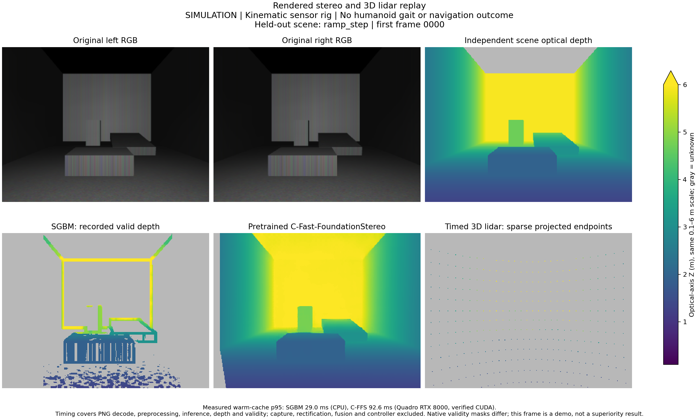
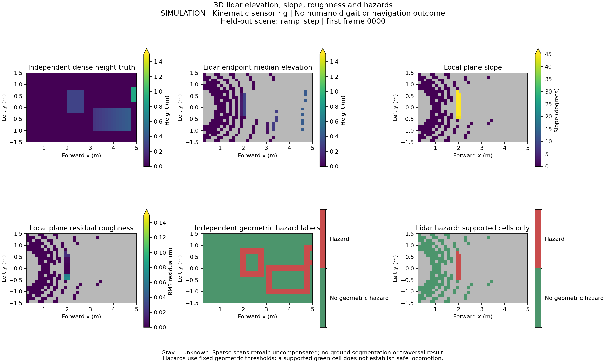

# Completed sensor research pilot evidence

**Full pilot `21714203`: PASS, completed October 8, 2026, 20:32:47 PDT.**
Fresh same-source GPU smoke `21714137` passed first. This is a short simulated
kinematic sensor study with 72 stereo pairs, 73,695 timed 3D ray returns and
960 ideal IMU samples across three scene groups. One group is held out.

[Verified measurements and limits](../../docs/SENSOR_PILOT_RESULTS_2026-10-08.md) ·
[Implementation and follow-up tasks](../../docs/SENSOR_CAMPAIGN_2026-10-08.md) ·
[Job requirements and resume evidence](../../docs/SENSOR_RESUME_EVIDENCE_2026-10-08.md)

| Route | Completed pilot evidence | Remaining objective |
|---|---|---|
| Stereo depth | Actual SGBM/C-Fast-FoundationStereo inference, common/native depth metrics, obstacle pixel recall, coverage, 200 warm timing samples each, verified CUDA kernels | Longer independent scenes, physical capture and robot latency qualification |
| Sensor fusion | Five arms × nine shared retention/extrinsic conditions × 72 frames × two stereo frontends; confidence gate does not meet the proposed advancement target | Calibration-aware gating, estimated-motion deskew, temporal faults, independent confirmation |
| Estimated pose | Six validated ORB-SLAM3 stereo / FAST-LIO2 LiDAR–IMU input exports, trajectory scoring code and pose-packet interface | Native estimator runtimes, actual trajectories, closed-loop integration and outcomes |
| 3D terrain | Elevation/slope/roughness/unknown maps with independent height/hazard labels; sparse coverage reported | Controller-qualified terrain and paired traversal trials |

All four **full** research objectives remain OPEN. There are zero estimated
trajectories, zero estimated-pose navigation episodes and no traversal or
physical-sensor results. Export readiness is not estimator success.

## Measured demos

The first preassigned held-out frame is shown with a common depth color scale;
unknown support is gray. These figures use actual saved predictions and raw
scans, with file digests verified before plotting. They are not robot motion demos.





[SVG depth figure](demo/stereo-lidar-demo.svg) ·
[SVG terrain figure](demo/terrain-demo.svg) ·
[Figure provenance](demo/demo_result.json)

## Retained run artifacts

- [Frozen v2 protocol](v2/protocol.json), [827-file input inventory](v2/manifest.json),
  [freeze receipt](v2/intake.json), and [825-file publication source verification](v2/publication-source-match.json).
- [Independent raw-data audit](v2/pilot-review.json), including all held-out fusion
  aggregates, terrain coverage, raw warm timing samples and estimator readiness.
- [Full pilot outputs](v2/sensors-pilot-20261008-21714203/outputs.tar.gz):
  40,912,110 bytes, SHA256
  `4a9aa5c41048be9a52e61648c03a1364d1b8d2ce657b0d137fec69b0a820f345`.
  This complete archive includes original RGB, calibration, raw timed scans/IMU,
  independently labeled truth, per-frame predictions, metrics, exports and logs.
- [Completion and file checksums](v2/sensors-pilot-20261008-21714203/completion.json),
  [launch provenance](v2/sensors-pilot-20261008-21714203/launch.json),
  [stage outcomes](v2/sensors-pilot-20261008-21714203/campaign_result.json),
  [scheduler receipt](v2/scheduler-receipt.txt).
- [Fresh successful smoke](v2/sensors-smoke-20261008-21714137/),
  [independent GPU smoke verification](v2/smoke-independent-verification.json).
- [Original failed smoke and cancelled dependent pilot](v1/). v1 failed CUDA
  library discovery before model inference. [v2 change receipt](v2/v1-to-v2-change.json)
  records the isolated library-loading correction; protocol bytes are identical.
- [125-test validation](v2/validation.json), [targeted JUnit receipt](v2/targeted-tests.xml),
  [seven demo checks](v2/demo-tests.xml). These CPU checks supplement actual GPU
  execution and independent metric reconstruction.

The inherited H3/H4 launcher completion receipt uses a generic training-campaign
scope string. The sensor-specific `campaign_result.json` and independent report
define this pilot's execution and scientific scope; no H3/H4 training verdict is
produced by these jobs.

## Inspect or reproduce the figures

From a publication checkout with the pinned CPU dependencies installed:

```bash
sha256sum results/sensor-campaign-20261008/v2/sensors-pilot-20261008-21714203/outputs.tar.gz
mkdir /tmp/sensor-pilot-inspect
tar -xzf results/sensor-campaign-20261008/v2/sensors-pilot-20261008-21714203/outputs.tar.gz \
  -C /tmp/sensor-pilot-inspect
python scripts/bench/sensor_demo.py \
  --pilot-output /tmp/sensor-pilot-inspect --out /tmp/sensor-pilot-new-demo
```

Use new output directories. Verify the archive digest above before extraction.
The demo verifies replay and prediction digests and measured p95 samples; it
refuses missing evidence. It is a post-run observer, separate from frozen v2
inference/evaluation code.

## Reconstruct measured inputs or rerun

The pinned pretrained model and GPU runtime wheel are external downloads,
not vendored into Git. Exact URLs, byte counts and SHA256 values are in
[model-download.json](v1/model-download.json) and
[runtime-download.json](v1/runtime-download.json). Both versions use the same
inputs. The external read-only SIF and Python/NVIDIA runtime also remain required
for an exact environment replay; their paths and SIF digest are recorded in
the protocol/intake. A clean clone alone does not reproduce that runtime.

The v2 inventory has 825 `source/` entries plus two `inputs/` entries. Initialize
the recursively pinned submodules, copy only the inventory-listed source files
from this publication checkout into an isolated `source/` directory, and place
the two checksum-verified downloads at their inventory names under `inputs/`.
Compare **every size and SHA256** to `v2/manifest.json`; the published
source-match receipt confirms all 825 source entries match the measured bytes.
Keep the canonical protocol unchanged. This reconstructs input contents, not
the original compressed launch-pack bytes or external runtime. Post-run docs,
tests and demo tooling were not part of the frozen inference pack.

To repeat a GPU campaign, adapt a copy of the protocol's account/runtime paths
and use the [bounded launcher](../../scripts/bench/h34_campaign.py) and
[stage runner](../../scripts/bench/sensor_campaign.py). A changed protocol or
runtime produces a **new** frozen version and requires a fresh same-source
GPU smoke before the pilot. See the launcher's `--help` and the
[stage commands](../../docs/SENSOR_CAMPAIGN_2026-10-08.md#replay-commands).
Do not overwrite these original results or reuse their scientific status.
